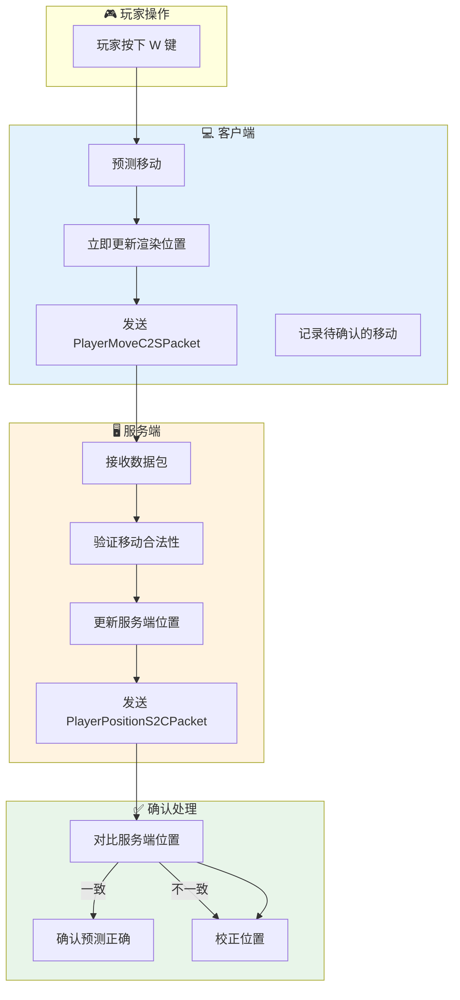
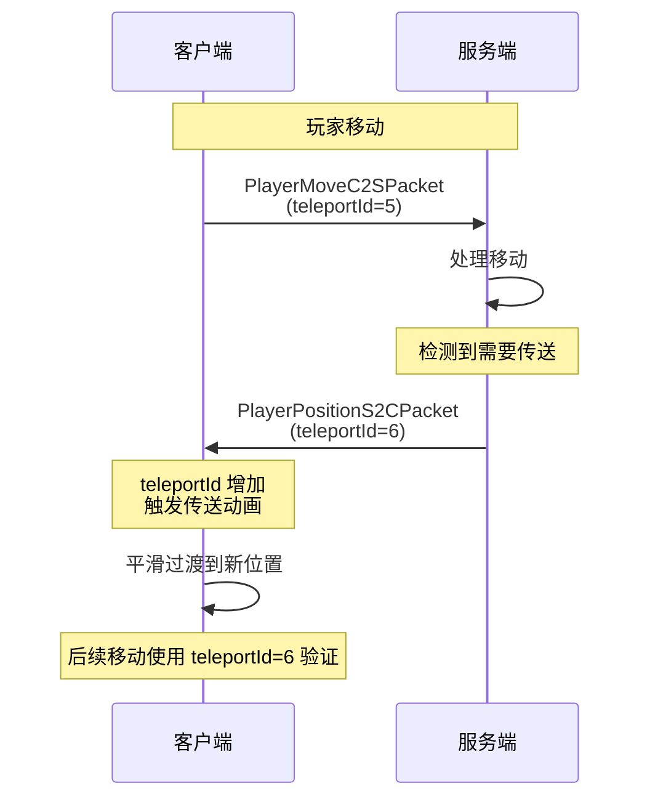
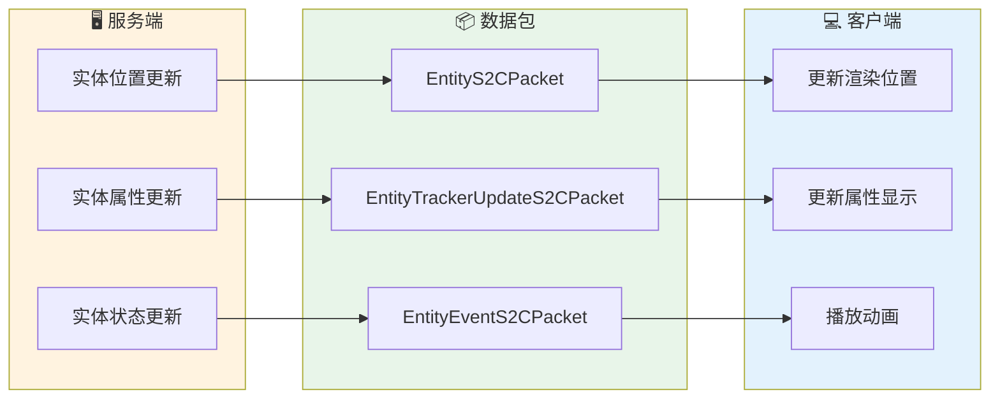
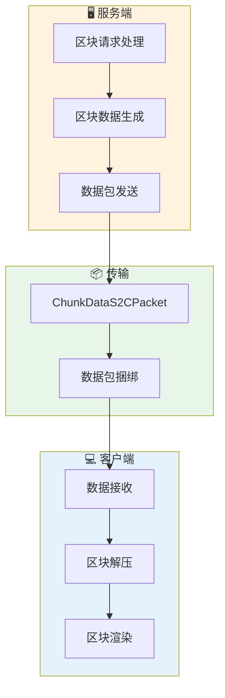

# 第 38 章：同步机制（Sync Mechanism）

## 章节目标

- 理解服务端与客户端的同步原理
- 掌握客户端预测与服务器校正机制
- 了解实体同步的各种策略
- 理解世界状态同步的关键技术

## 前置知识

- 完成《数据包系统》和《协议状态机》
- 理解 Packet 的 C2S/S2C 方向
- 了解游戏刻 (Tick) 的基本概念

## 目录

- [为什么需要同步](#为什么需要同步)
- [权威服务器模型](#权威服务器模型)
- [客户端预测机制](#客户端预测机制)
- [服务器校正机制](#服务器校正机制)
- [实体同步策略](#实体同步策略)
- [世界同步技术](#世界同步技术)
- [同步优化技术](#同步优化技术)
- [实战：分析同步问题](#实战分析同步问题)
- [课后自查](#课后自查)

---

## 为什么需要同步

想象一下你和朋友在现实中玩捉迷藏：

```
┌─────────────────────────────────────────────────────────────┐
│  现实世界的"同步"                                           │
├─────────────────────────────────────────────────────────────┤
│                                                             │
│  你看到朋友藏在了树后面                                      │
│  → 你知道他的真实位置                                        │
│  → 你的"客户端"是准确的                                      │
│                                                             │
└─────────────────────────────────────────────────────────────┘

┌─────────────────────────────────────────────────────────────┐
│  网络游戏的"同步"                                           │
├─────────────────────────────────────────────────────────────┤
│                                                             │
│  你看到服务器告诉你另一个玩家的位置                            │
│  → 你不知道他是否还在那里                                     │
│  → 服务器才是"真相"                                          │
│  → 你的客户端只是"猜测"                                       │
│                                                             │
└─────────────────────────────────────────────────────────────┘
```

**核心问题**：

> **网络延迟 = 你的操作到达服务器的时间 + 服务器响应到达你的时间**
> 
> 在 Minecraft 中，这个延迟可能从 20ms（本地）到 500ms+（远程服务器）不等。

---

## 权威服务器模型

Minecraft 采用**权威服务器模型 (Authoritative Server Model)**：

```
┌─────────────────────────────────────────────────────────────┐
│                权威服务器模型示意图                            │
├─────────────────────────────────────────────────────────────┤
│                                                             │
│                      ┌─────────────────┐                   │
│                      │    服务端 (权威)   │                   │
│                      │                   │                   │
│                      │  • 实体位置        │                   │
│                      │  • 物品栏内容      │                   │
│                      │  • 方块状态        │                   │
│                      │  • 游戏规则        │                   │
│                      │  • 生物血量        │                   │
│                      │  • 事件判定        │                   │
│                      └────────┬─────────┘                   │
│                               │                              │
│              ┌────────────────┼────────────────┐           │
│              │                │                │           │
│              ↓                ↓                ↓           │
│        ┌──────────┐    ┌──────────┐    ┌──────────┐        │
│        │ 客户端A  │    │ 客户端B  │    │ 客户端C  │        │
│        │ (玩家1)  │    │ (玩家2)  │    │ (玩家3)  │        │
│        └──────────┘    └──────────┘    └──────────┘        │
│                                                             │
│  规则：客户端显示服务端告诉它的内容                            │
│        服务端决定游戏"真相"                                    │
│                                                             │
└─────────────────────────────────────────────────────────────┘
```

### 权威服务器的优势

| 优势 | 说明 |
|------|------|
| 防作弊 | 客户端不能直接修改游戏状态 |
| 一致性 | 所有玩家看到相同的游戏世界 |
| 可预测性 | 相同的输入总是产生相同的结果 |

### 权威服务器的代价

| 代价 | 影响 |
|------|------|
| 网络延迟 | 操作需要等待服务器确认 |
| 服务器负载 | 所有逻辑都在服务端计算 |
| 同步开销 | 需要频繁发送状态更新 |

---

## 客户端预测机制

为了减少延迟感，Minecraft 使用**客户端预测 (Client-side Prediction)**：

### 预测流程图



### 预测失败时的处理

```java
// 服务端校正数据包
public class PlayerPositionS2CPacket {
    private final double x;
    private final double y;
    private final double z;
    private final float yaw;
    private final float pitch;
    private final int teleportId;  // 传送ID，用于检测跳跃
    private final boolean dismountVehicle;
}

// 客户端处理校正
public class ClientPlayNetworkHandler {
    
    public void onPlayerPosition(PlayerPositionS2CPacket packet) {
        // 获取客户端当前预测的位置
        Vec3d predictedPos = this.player.getPos();
        
        // 获取服务端确认的位置
        Vec3d serverPos = new Vec3d(packet.getX(), packet.getY(), packet.getZ());
        
        // 计算偏差
        double delta = predictedPos.distanceTo(serverPos);
        
        if (delta > 0.01) {  // 偏差超过阈值
            if (teleportId == lastTeleportId + 1) {
                // 这是服务端校正，需要平滑过渡
                this.player.setPositionAndRenderInterpolate(
                    predictedPos, serverPos, 0.1f
                );
            } else {
                // 可能是延迟校正，直接设置
                this.player.setPosition(serverPos);
            }
        }
        
        lastTeleportId = teleportId;
    }
}
```

### 预测的类型

| 预测类型 | 说明 | 示例 |
|---------|------|------|
| 移动预测 | 客户端预测移动 | 玩家移动、驾驶 |
| 交互预测 | 预测交互结果 | 放置方块、使用物品 |
| 视觉预测 | 预测视觉效果 | 粒子、动画 |
| 物理预测 | 预测物理结果 | 爆炸、碰撞 |

---

## 服务器校正机制

服务端不仅接受客户端的所有操作，还会进行**校正 (Correction)**：

### 校正触发条件

```java
// 位置校正的触发条件
public class ServerPlayNetworkHandler {
    
    private Vec3d lastSentPos;  // 上次发送的位置
    
    public void onPlayerMove(PlayerMoveC2SPacket packet) {
        PlayerEntity player = this.player;
        Vec3d currentPos = player.getPos();
        
        // 验证1: 检查位置是否在合法范围内
        if (!isInValidRange(packet.getX(), currentPos.x, 100)) {
            // 位置偏差太大，需要校正
            sendPositionCorrection(currentPos);
            return;
        }
        
        // 验证2: 检查移动速度是否合法
        double speed = calculateSpeed(lastSentPos, packet.getPos());
        if (speed > MAX_PLAYER_SPEED) {
            // 速度异常，可能是作弊
            kickPlayer("Illegal movement");
            return;
        }
        
        // 验证3: 检查是否穿墙
        if (hasPassedThroughBlocks(lastSentPos, packet.getPos())) {
            // 穿墙检测
            sendPositionCorrection(currentPos);
            return;
        }
        
        // 所有验证通过，更新位置
        lastSentPos = packet.getPos();
    }
}
```

### 传送校正机制



### 校正类型

| 类型 | 触发条件 | 处理方式 |
|------|---------|---------|
| 位置校正 | 预测错误 | 平滑过渡或瞬移 |
| 速度校正 | 超速移动 | 重置速度 |
| 权限校正 | 无权限操作 | 拒绝操作 |
| 状态校正 | 状态不一致 | 强制同步状态 |

---

## 实体同步策略

实体同步是 Minecraft 最复杂的同步任务之一。

### 实体同步原理



### 实体位置同步优化

```java
// 实体数据包使用增量更新
public static class EntityS2CPacket {
    
    // Delta 变体：只发送位置变化量
    public static class Delta extends EntityS2CPacket {
        private final short dx;  // 相对位移 X (-128 ~ 127)
        private final short dy;  // 相对位移 Y
        private final short dz;  // 相对位移 Z
        
        // 只有当实体移动超过一定距离时才发送完整位置
        // 否则发送增量更新，大幅节省带宽
    }
}

// 实体追踪器更新
public class EntityTrackerUpdateS2CPacket {
    private final int entityId;
    private final BitSet changedAttributes;  // 位掩码标记哪些属性改变
    private final PacketByteBuf data;
    
    // 只发送改变的属性，不发送完整状态
}
```

### 玩家与其他实体的区别

| 特性 | 玩家实体 | 其他实体 |
|------|---------|---------|
| 移动数据包 | 高频 (每 tick) | 低频 |
| 预测机制 | 有 | 无 |
| 校正机制 | 有 | 简单位置同步 |
| 优先级 | 最高 | 根据距离和类型 |
| 带宽占用 | ~40% | ~60% |

---

## 世界同步技术

### 区块同步



### 区块加载算法

```java
// 区块加载优先级
public class ChunkLoadingManager {
    
    public List<ChunkPos> getChunksToLoad(Vec3d playerPos) {
        int playerChunkX = ChunkPos.toChunk(playerPos.x);
        int playerChunkZ = ChunkPos.toChunk(playerPos.z);
        
        List<ChunkPos> result = new ArrayList<>();
        
        // 优先级1: 玩家所在区块
        result.add(new ChunkPos(playerChunkX, playerChunkZ));
        
        // 优先级2: 可见区块 (LOD)
        for (int radius = 1; radius <= renderDistance; radius++) {
            for (int dx = -radius; dx <= radius; dx++) {
                for (int dz = -radius; dz <= radius; dz++) {
                    if (Math.abs(dx) == radius || Math.abs(dz) == radius) {
                        ChunkPos pos = new ChunkPos(playerChunkX + dx, playerChunkZ + dz);
                        if (isInViewDistance(pos)) {
                            result.add(pos);
                        }
                    }
                }
            }
        }
        
        return result;
    }
}
```

### 方块变化同步

```java
// 方块更新数据包
public class BlockUpdateS2CPacket {
    private final int blockPos;
    private final BlockState state;
    
    // 用于同步单个方块的变化
    // 比重新发送整个区块更高效
}

// 多方块更新数据包
public class BlockChangeS2CPacket {
    private final List<BlockUpdateS2CPacket> changes;
    
    // 批量同步多个方块变化
    // 减少数据包数量
}
```

---

## 同步优化技术

### 1. 数据包捆绑

```java
// 1.21+ 支持数据包捆绑
public class BundlePacket {
    
    // 将多个小数据包合并为一个传输
    // 减少协议开销
    
    // 效果:
    // - 原来: 10个数据包 = 10个包头
    // - 捆绑后: 1个数据包 = 1个包头
    // - 节省: 9个包头的带宽
}
```

### 2. 距离相关更新

```
┌─────────────────────────────────────────────────────────────┐
│  距离相关更新频率                                           │
├─────────────────────────────────────────────────────────────┤
│                                                             │
│  玩家位置                                                   │
│     │                                                       │
│     ├─ 0-16 格: 每 tick 更新 (20次/秒)                     │
│     │                                                       │
│     ├─ 16-64 格: 每 2 tick 更新 (10次/秒)                  │
│     │                                                       │
│     ├─ 64-128 格: 每 4 tick 更新 (5次/秒)                  │
│     │                                                       │
│     └─ 128+ 格: 每 20 tick 更新 (1次/秒)                   │
│                                                             │
│  距离越远，更新频率越低，节省带宽                            │
│                                                             │
└─────────────────────────────────────────────────────────────┘
```

### 3. 批次发送

```java
// 区块数据批次发送
public class ChunkBatch {
    
    // 不是每加载一个区块就发送一次
    // 而是收集一批区块后一起发送
    
    // 这样可以:
    // - 减少网络往返次数
    // - 更好地利用带宽
    // - 减少客户端渲染卡顿
}
```

---

## 实战：分析同步问题

### 问题1：玩家位置抖动

**症状**：玩家在移动时位置不断抖动

**可能原因**：
- 预测错误频繁发生
- 网络延迟波动大
- 服务器校正过于激进

**排查方法**：
1. 开启调试信息：`/debug start`
2. 等待问题复现
3. 查看 `debug/performance` 中的网络统计
4. 检查 `packets_sent` vs `packets_received` 的比率

### 问题2：操作延迟明显

**症状**：点击方块后很久才有反应

**可能原因**：
- 网络延迟过高
- 服务器负载过大
- 客户端帧率不足

**排查方法**：
1. 打开调试屏幕（F3）
2. 观察 "Network" 一栏的延迟数值
3. 对比不同时段的表现

### 问题3：方块放置不同步

**症状**：放置的方块瞬间消失或位置不对

**可能原因**：
- 客户端预测失败
- 服务器验证失败
- 网络丢包

**排查方法**：
1. 使用 `F3 + D` 清空聊天
2. 尝试放置方块
3. 查看是否有错误信息

---

## 关键术语表

| 术语 | 英文 | 解释 |
|------|------|------|
| 权威服务器 | Authoritative Server | 唯一决定游戏真相的服务器 |
| 客户端预测 | Client-side Prediction | 客户端提前执行操作 |
| 服务器校正 | Server Correction | 服务端纠正客户端状态 |
| 增量更新 | Delta Update | 只发送变化的部分 |
| 区块批次 | Chunk Batch | 一批区块数据一起发送 |

---

## 课后自查

- [ ] 解释为什么 Minecraft 采用权威服务器模型
- [ ] 客户端预测的作用是什么？有什么风险？
- [ ] 当预测失败时，服务端会发送什么数据包？
- [ ] 什么是 teleportId？它有什么作用？
- [ ] Minecraft 如何优化实体同步的带宽占用？

---

## 下章预告

Part-7 将带你学习 **命令系统 (Command System)**，了解如何通过 Brigadier 框架为 Minecraft 添加自定义命令。

---

## 参考资料

- `D:\Minecraft-Learning\assets\mc\1.21\net\minecraft\network\ClientConnection.java`
- `D:\Minecraft-Learning\assets\mc\1.21\net\minecraft\network\packet\PlayPackets.java`
- [Minecraft Wiki: Server-configurable functionality](https://minecraft.wiki/w/Server-configurable_functionality)
