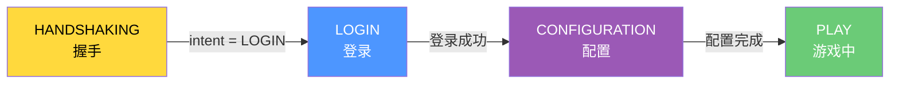
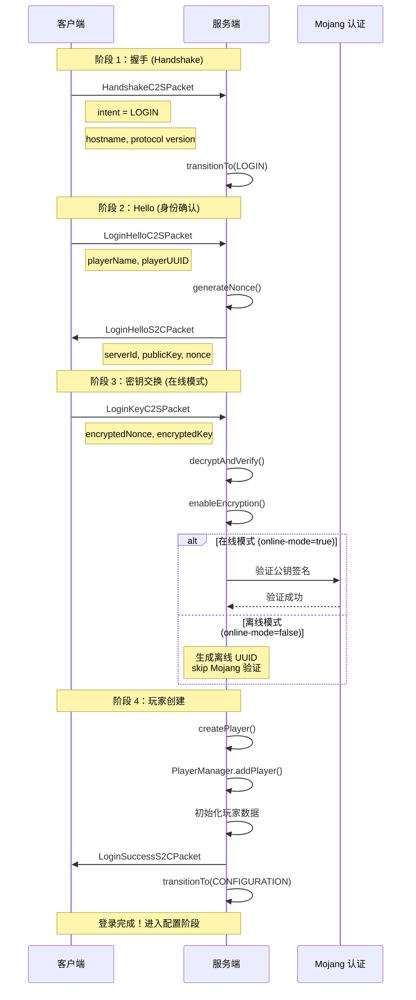
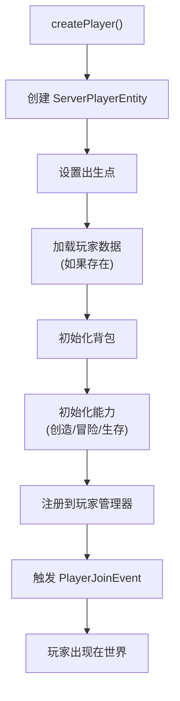
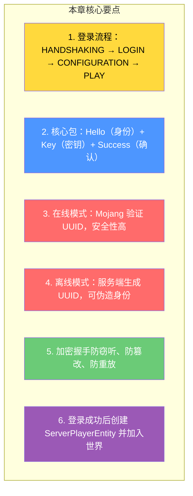

# 第 39 章：登录认证系统（Login Flow）

> **理解这章，你就明白了玩家是如何「进入」服务器的——从按下「加入服务器」到出现在游戏世界中的完整流程！**

> ⚠️ **注意**：以下源码示例来源于 CFR 反编译代码，变量名和方法名可能与原始源码有所差异。部分代码经过简化以便于理解。

---

## 目标

学完本章后，你将理解：

1. **登录流程的完整阶段**：从 HANDSHAKING 到 PLAY 的状态机转换
2. **在线模式 vs 离线模式** 的区别
3. **加密握手** 的基本原理
4. **玩家数据创建** 的过程
5. **为什么需要登录认证**

---

## 前置知识

- 了解网络协议的基本概念（第 34～37 章）
- 知道什么是数据包（Packet）
- 了解 Minecraft 的客户端-服务端架构

---

## 核心概念：登录流程总览

### 比喻：入住酒店

```
入住酒店的流程            Minecraft 登录流程
─────────────────          ──────────────────────
1. 到达前台              1. 连接服务器 (TCP)
2. 出示身份证            2. 发送握手包 (Handshake)
3. 验证身份              3. 发送 Hello (玩家名)
4. 办理入住手续          4. 加密密钥交换
5. 拿到房卡              5. 验证成功 → 创建玩家
6. 进入房间              6. 进入游戏世界
```

### 登录状态机



---

## 图解：完整登录时序



---

## 登录数据包详解

### 核心数据包类型

| 数据包 | 方向 | 说明 |
|--------|------|------|
| `LoginHelloC2SPacket` | 客户端→服务端 | 发送玩家名和 UUID |
| `LoginHelloS2CPacket` | 服务端→客户端 | 发送公钥和随机数 |
| `LoginKeyC2SPacket` | 客户端→服务端 | 发送加密的密钥 |
| `LoginSuccessS2CPacket` | 服务端→客户端 | 登录成功确认 |
| `LoginDisconnectS2CPacket` | 服务端→客户端 | 登录失败断开 |

### Handshake 数据包

```java
// HandshakeC2SPacket - 客户端发送的第一个数据包
public record HandshakeC2SPacket(
    int protocolVersion,  // 协议版本（如 767）
    String hostname,     // 服务器地址
    int port,            // 服务器端口
    ConnectionIntent intent  // 连接意图：STATUS / LOGIN / PLAY
) {
    public void write(PacketByteBuf buf) {
        buf.writeVarInt(this.protocolVersion);
        buf.writeString(this.hostname);
        buf.writeShort(this.port);
        buf.writeVarInt(this.intent.getId());
    }
}
```

### Hello 数据包

```java
// LoginHelloC2SPacket - 发送玩家身份
public record LoginHelloC2SPacket(
    GameProfile profile  // 包含玩家名和 UUID
) {
    public void write(PacketByteBuf buf) {
        buf.writeString(this.profile.getName());
        buf.writeUuid(this.profile.getId());
    }
}

// LoginHelloS2CPacket - 服务端响应
public record LoginHelloS2CPacket(
    byte[] publicKey,    // RSA 公钥
    byte[] nonce         // 随机数，防止重放攻击
) {
}
```

---

## 在线模式 vs 离线模式

### 对比表

| 特性 | 在线模式 (online-mode=true) | 离线模式 (online-mode=false) |
|------|---------------------------|--------------------------|
| UUID 生成 | Mojang 提供（正版 UUID） | 服务端本地生成（离线 UUID） |
| 加密 | 使用 Mojang 公钥加密 | 可选或不加密 |
| 安全性 | 高（防伪造） | 低（任何人都可以伪造名字） |
| Mod 支持 | 需要服务端开启离线模式 | 兼容性更好 |
| 皮肤 | 从 Mojang 服务器获取 | 使用默认皮肤 |

### 离线 UUID 的生成

```java
// 服务端本地生成离线 UUID
if (!onlineMode) {
    // 使用玩家名的 MD5 哈希生成 UUID
    UUID offlineUuid = UUID.nameUUIDFromBytes(
        ("OfflinePlayer:" + playerName).getBytes(StandardCharsets.UTF_8)
    );

    // 创建一个不包含 Mojang 公钥的 GameProfile
    GameProfile profile = new GameProfile(offlineUuid, playerName);
}
```

### 为什么要加密？

```
加密握手的目的：

1. 防窃听
   ❌ 未加密：任何人可以看到玩家密码
   ✅ 加密后：只有 Mojang 服务器能看到

2. 防篡改
   ❌ 未加密：数据包可以被修改
   ✅ 加密后：任何篡改都会被检测到

3. 防重放
   ❌ 未加密：同一个包可以重复发送
   ✅ 加密后：每次使用不同的随机数
```

---

## 玩家创建流程

### 代码流程

```java
// ServerLoginNetworkHandler.java - 登录处理器
public void onSuccess(GameProfile profile) {
    // 1. 创建 ServerPlayerEntity
    ServerPlayerEntity player = this.server.getPlayerManager().createPlayer(
        this.server.getWorld(ServerWorld.OVERWORLD),  // 默认世界
        profile,
        this.playerInfo  // 玩家信息（皮肤、 cape 等）
    );

    // 2. 发送登录成功包
    this.send(new LoginSuccessS2CPacket(profile));

    // 3. 切换到 PLAYING 状态
    this.transitionTo(LoginState.PLAYING);

    // 4. 将玩家加入世界
    this.server.getPlayerManager().onPlayerJoin(player);
}
```

### 玩家数据初始化



---

## 登录失败处理

### 常见错误及原因

| 错误消息 | 原因 | 解决方法 |
|---------|------|--------|
| `Connection timed out` | 网络问题 | 检查网络连接 |
| `Outdated client!` | 客户端版本太旧 | 更新游戏 |
| `Outdated server!` | 服务端版本太旧 | 更新服务端 |
| `Invalid session` | 在线模式验证失败 | 检查正版账号 |
| `Server closed` | 服务端正在关闭 | 等待服务端重启 |
| `Connection refused` | 端口被拒绝 | 检查防火墙 |

### 踢出数据包

```java
// LoginDisconnectS2CPacket - 登录失败通知
public record LoginDisconnectS2CPacket(
    Text reason  // 断开原因（显示给玩家）
) {
    // 例如：new LoginDisconnectS2CPacket(Text.literal("Invalid username!"))
}
```

---

## 实战：调试登录流程

### F3 + 网络信息

在多人游戏屏幕上：

```
┌────────────────────────────────────────┐
│ 连接到：mc.example.com                  │
│ 在线模式：是                           │
│ 加密：是                              │
│ 延迟：120ms                           │
└────────────────────────────────────────┘
```

### 服务端日志

```
[Server thread/INFO]: Starting Minecraft Server on *:25565
[Server thread/INFO]: Generating keypair...
[Server thread/INFO]: Properties: online-mode=true

// 玩家连接时
[Server thread/INFO]: PlayerName[/192.168.1.1:12345] connected.
[Server thread/INFO]: PlayerName has logged in.

// 玩家断开时
[Server thread/INFO]: PlayerName lost connection.
```

---

## 小结



---

## 练习

### 练习 1：状态排序

按正确顺序排列以下状态转换：

- A. CONFIGURATION
- B. PLAY
- C. HANDSHAKING
- D. LOGIN

正确顺序：___ → ___ → ___ → ___

### 练习 2：在线/离线判断

以下场景应该使用哪种模式？

- 正版玩家连接 → ?
- 离线测试 Mod → ?
- 需要皮肤支持 → ?
- 局域网联机 → ?

### 练习 3：追踪源码

在源码中找到 `ServerLoginNetworkHandler.java`，阅读 `onHello()` 和 `onKey()` 方法，理解登录验证的完整流程。

---

## 相关链接

| 文件 | 路径 | 作用 |
|------|------|------|
| `ServerLoginNetworkHandler.java` | `net/minecraft/server/network/ServerLoginNetworkHandler.java` | 登录处理器 |
| `LoginStates.java` | `net/minecraft/network/state/LoginStates.java` | 登录状态定义 |
| `GameProfile.java` | `com.mojang/authlib/GameProfile.java` | 玩家档案 |

---

> 💡 **提示**：理解登录系统对于服务器安全和 Mod 开发都非常重要。很多 Mod 相关的登录问题（如皮肤不显示）都与登录流程有关。

---

*文档版本：Minecraft 1.21, Protocol 767, World Version 3953*
*最后更新：2026-03-25*
