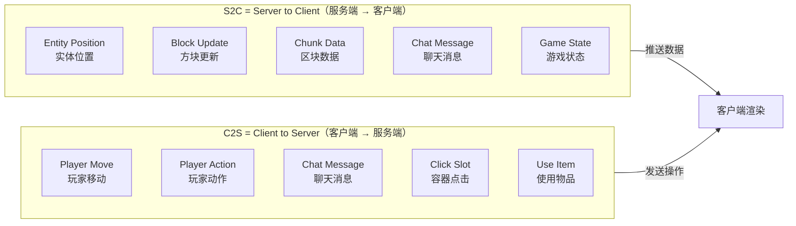
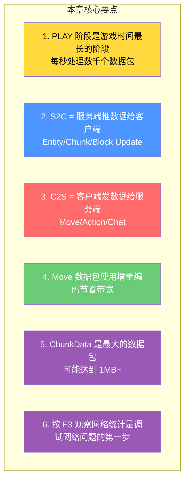

# 第 40 章：Play 阶段数据包入门（Play Phase Packets）

> **理解这章，你就明白了多人游戏中服务端到底给客户端「推」了什么数据——从玩家移动到方块更新，从实体位置到聊天消息！**

---

## 目标

学完本章后，你将理解：

1. **Play 阶段概述**：为什么这是最重要的网络阶段
2. **S2C 数据包**：服务端推送给客户端的数据
3. **C2S 数据包**：客户端发送给服务端的数据
4. **常用数据包类型**：移动、方块更新、实体同步、聊天
5. **数据包频率**：哪些数据高频发送，哪些低频

---

## 前置知识

- 了解网络协议状态机（第 36 章）
- 了解 Packet 接口的基本概念
- 知道 Login 和 Configuration 阶段的作用

---

## 核心概念：Play 阶段是游戏的核心

### 生命周期占比

```
Minecraft 连接生命周期：

[HANDSHAKING] → [LOGIN] → [CONFIGURATION] → [PLAY] ←── 游戏时间最长的阶段
    ~100ms              ~500ms         ~1s            ~无限

在 PLAY 阶段：
- 玩家移动 → 每秒发送 ~20 次位置包
- 实体位置 → 每秒发送 ~1000+ 个实体更新包
- 方块变化 → 按需发送
- 聊天消息 → 按需发送

总计：每秒可能发送/接收数千个数据包！
```

### S2C vs C2S 方向



---

## S2C 数据包：服务端推送给客户端

### 按频率分类

| 频率 | 数据包类型 | 说明 |
|------|-----------|------|
| **极高频** | `EntityPositionS2CPacket` | 实体移动，每帧多次 |
| **高频** | `ChunkDataS2CPacket` | 区块加载/更新 |
| **中频** | `BlockUpdateS2CPacket` | 单个方块变化 |
| **低频** | `ChatMessageS2CPacket` | 聊天消息 |
| **极低频** | `PlayerSpawnS2CPacket` | 玩家加入/重生 |

### 核心 S2C 数据包

```java
// 1. GameJoinS2CPacket - 进入游戏初始化
public record GameJoinS2CPacket(
    int entityId,              // 玩家自己的实体 ID
    boolean hardcore,            // 是否极限模式
    GameMode gameMode,          // 游戏模式
    GameMode previousGameMode,  // 上一个游戏模式
    RegistryEntryList<World> dimensions,  // 可用维度列表
    RegistryEntry<World> registryKey,     // 当前维度
    ...
) {
}

// 2. ChunkDataS2CPacket - 区块数据（最大的包）
public record ChunkDataS2CPacket(
    ChunkPos chunkPos,          // 区块坐标
    int chunkData,              // 压缩的区块数据
    ChunkSection[] sections,     // 区块截面数组
    NbtCompound blockEntities,   // 方块实体数据
    ...
) {
    // 一个区块数据包可能达到 1MB+
}

// 3. EntityPositionS2CPacket - 实体位置更新（最频繁）
public record EntityPositionS2CPacket(
    int entityId,               // 实体 ID
    Vec3d delta,               // 位置变化（增量编码）
    byte yaw,                  // 偏航角
    byte pitch,                 // 俯仰角
    EntityStatusFlags flags      // 状态标志
) {
}

// 4. BlockUpdateS2CPacket - 单个方块更新
public record BlockUpdateS2CPacket(
    Sequence Id,                // 序列号（按序更新）
    BlockPos pos,               // 方块坐标
    BlockState state            // 新的方块状态
) {
}
```

---

## C2S 数据包：客户端发送给服务端

### 核心 C2S 数据包

```java
// 1. PlayerMoveC2SPacket - 玩家移动
public sealed class PlayerMoveC2SPacket
        permits PlayerMoveC2SPacket.PositionAndOnGround,
                PlayerMoveC2SPacket.FullAndOnGround,
                PlayerMoveC2SPacket.LookAndOnGround,
                PlayerMoveC2SPacket.OnGroundOnly {

    // 完整位置
    public record PositionAndOnGround(
        double x, double y, double z, boolean onGround
    ) implements PlayerMoveC2SPacket {}

    // 只有位置
    public record FullAndOnGround(
        double x, double y, double z, float yaw, float pitch, boolean onGround
    ) implements PlayerMoveC2SPacket {}

    // 只有视角
    public record LookAndOnGround(
        float yaw, float pitch, boolean onGround
    ) implements PlayerMoveC2SPacket {}

    // 仅在地面状态
    public record OnGroundOnly(boolean onGround)
            implements PlayerMoveC2SPacket {}
}

// 2. PlayerActionC2SPacket - 玩家动作
public record PlayerActionC2SPacket(
    Sequence Id,                // 序列号
    BlockPos pos,               // 方块坐标
    Direction face,             // 交互的面
    PlayerActionC2SPacket.Action action  // 动作类型
) {
    // Action: START_DESTROY_BLOCK, ABORT_DESTROY_BLOCK,
    //      FINISH_DESTROY_BLOCK, DROP_ALL_ITEMS, DROP_ITEM,
    //      RELEASE_USING_ITEM
}

// 3. ChatMessageC2SPacket - 聊天消息
public record ChatMessageC2SPacket(
    String content,              // 消息内容
    long timestamp,             // 时间戳
    long salt,                  // 盐
    byte[] signature,            // 消息签名 (1.19+)
    boolean unsignedContent,     // 是否有未签名内容
    MessageType type,           // 消息类型
    NbtCompound signature2      // 额外签名
) {
}
```

---

## 数据包大小与优化

### 数据包大小估算

| 数据包类型 | 大小范围 | 压缩后 |
|-----------|---------|--------|
| `PlayerMoveC2SPacket` | ~30-50 字节 | ~20-30 字节 |
| `ChunkDataS2CPacket` | 200KB - 1MB+ | 50KB - 500KB |
| `EntityPositionS2CPacket` | ~30 字节 | ~15 字节 |
| `BlockUpdateS2CPacket` | ~20 字节 | ~10 字节 |

### 为什么 Move 数据包使用增量编码？

```
完整坐标 vs 增量坐标：

完整坐标：
  x: 125.54321 → double 8字节
  y: 64.00000  → double 8字节
  z: -342.21345 → double 8字节
  总计：24 字节

增量坐标（假设移动了 0.1 格）：
  dx: 0.1 → float 4字节（用 VarInt 更少）
  dy: 0.0 → float 4字节
  dz: -0.1 → float 4字节
  总计：12 字节（节省 50%！）

优化技巧：
- 位置变化小 → 用增量编码
- 位置变化大 → 用完整坐标（如传送后）
```

---

## 实战：观察网络数据包

### 使用 debug 工具

```
方式 1：服务端日志
# 在服务端配置中添加
log-packets=true

方式 2：客户端 Mod（Fabric/ViaFabric）
- 安装 Sodium + 调试 Mod
- 查看实时数据包统计

方式 3：Wireshark + Minecraft 协议解析
- 过滤器：minecraft.packet_type
```

### 观察 F3 + 网络信息

```
按下 F3 后观察网络选项卡：

┌────────────────────────────────────────┐
│ 上行: 2.3 kB/s                      │
│ 下行: 45.2 kB/s                     │
│ 延迟: 32ms                          │
└────────────────────────────────────────┘

正常值：
- 单人游戏：下行 100-500 KB/s
- 小型服务器：下行 200-800 KB/s
- 大型服务器：下行 1-5 MB/s
```

---

## 小结



---

## 练习

### 练习 1：数据包方向

以下数据包是 S2C 还是 C2S？

- 玩家按下 W 键移动 → ?
- 服务端广播「Steve 加入了游戏」→ ?
- 玩家右键点击方块 → ?
- 服务端更新方块状态 → ?
- 玩家发送聊天消息 → ?

### 练习 2：频率排序

按频率从高到低排序：

- A. GameJoin（进入游戏）
- B. EntityPosition（实体移动）
- C. ChunkData（区块加载）
- D. BlockUpdate（方块更新）

### 练习 3：带宽计算

如果玩家每秒移动 20 次，每次移动包 30 字节，1 分钟的上行带宽是多少？

---

## 相关链接

| 文件 | 路径 | 作用 |
|------|------|------|
| `PlayPackets.java` | `net/minecraft/network/packet/PlayPackets.java` | 所有 Play 包定义 |
| `ClientPlayPacketListener.java` | `net/minecraft/network/listener/ClientPlayPacketListener.java` | S2C 包处理器 |
| `ServerPlayPacketListener.java` | `net/minecraft/network/listener/ServerPlayPacketListener.java` | C2S 包处理器 |

---

*文档版本：Minecraft 1.21, Protocol 767, World Version 3953*
*最后更新：2026-03-25*
