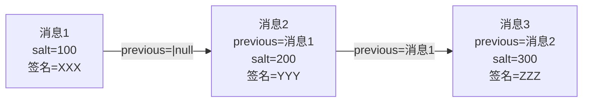
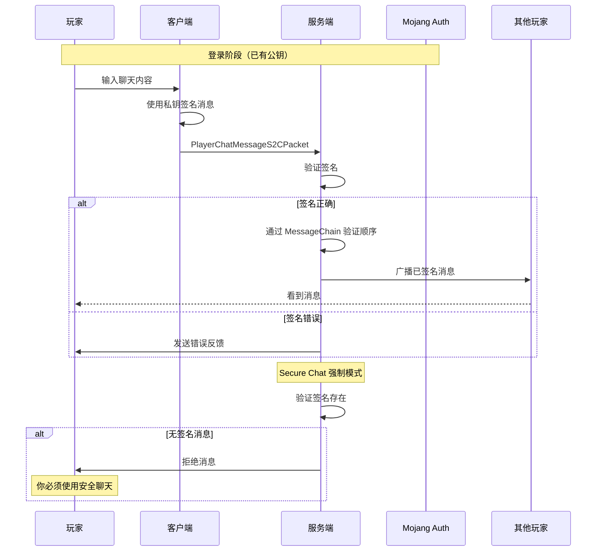
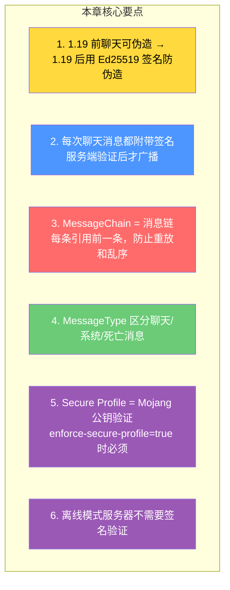

# 第 41 章：聊天系统与签名（Chat System）

> **理解这章，你就明白了聊天消息是怎么从你的键盘到达别人屏幕的——以及为什么 1.19 之后聊天变得「安全」了！**

---

## 目标

学完本章后，你将理解：

1. **聊天系统的整体架构**：消息从发送端到接收端的完整流程
2. **聊天签名机制**：1.19 引入的防伪造系统
3. **MessageChain**：消息链如何保证顺序
4. **聊天类型**：聊天、死信息、命令输出的区分
5. **Secure Chat 强制**：为什么某些服务器要求安全聊天

---

## 前置知识

- 了解网络协议的基本概念（第 34～37 章）
- 知道数据包（Packet）的基本概念
- 了解加密签名的基本概念（非必须）

---

## 核心概念：聊天系统的三层架构

### 消息流向总览

```
玩家输入「你好」 → 服务端处理 → 广播到所有玩家

┌──────────────────────────────────────────────────────────┐
│ 聊天系统三层架构                                          │
├──────────────────────────────────────────────────────────┤
│                                                          │
│ 1. 消息来源层                                            │
│    - 玩家聊天 (Player Chat)                              │
│    - 系统消息 (System)                                   │
│    - 命令输出 (Command)                                  │
│    - 进度通知 (Advancement)                              │
│    - 死亡信息 (Death Message)                            │
│                                                          │
│ 2. 签名验证层 (1.19+)                                   │
│    - MessageVerifier（验证签名）                          │
│    - MessageChain（消息链）                               │
│    - PlayerPublicKey（玩家公钥）                          │
│                                                          │
│ 3. 消息分发层                                            │
│    - MessageType（消息类型）                               │
│    - ChatHud（客户端显示）                               │
│    - MessageDecorator（装饰器）                          │
│                                                          │
└──────────────────────────────────────────────────────────┘
```

---

## 为什么需要聊天签名？

### 1.19 之前的安全漏洞

```
在 1.19 之前，任何连接到服务器的人都可以伪造聊天消息：

攻击场景：
1. 攻击者连接到服务器（可以是任何 Mod）
2. 发送数据包：PacketChatMessage{content: "我是管理员！"}
3. 服务端广播给所有玩家
4. 其他玩家看到：「[攻击者] → 我是管理员！」

影响：
- 冒充管理员骗取物品
- 社会工程攻击
- 破坏服务器社区信任
```

### 1.19+ 的解决方案

```
签名机制使用 Ed25519 公钥密码学：

1. 玩家登录时，Mojang 颁发一个短期公钥
2. 每次发送消息时，用私钥签名
3. 服务端验证签名：
   - 签名正确 → 消息确实来自该玩家 → 广播
   - 签名错误 → 消息被篡改 → 拒绝

结果：即使攻击者知道消息内容，也无法伪造发送者身份！
```

---

## 聊天签名数据结构

### Message 签名组成

```java
// net/minecraft/network/message/SignedMessage.java
public record SignedMessage(
    MessageBody body,                    // 消息内容（原文）
    MessageHeader header,                  // 消息头（包含签名）
    Optional<MessageSignatureData> signature  // 签名数据
) {
    // ...
}

// MessageBody - 消息体
public record MessageBody(
    String content,          // 消息文本内容
    long timestamp,         // 时间戳（纳秒）
    long salt,              // 盐（防重放）
    byte[] signature        // 签名
) {
}

// MessageHeader - 消息头
public record MessageHeader(
    Optional<DecorableText> unsignedContent,  // 未签名内容（可选）
    MessageLink previous,                    // 前一条消息链接
    int acknowledgeCount                    // 已确认数量
) {
}
```

### 消息链（MessageChain）



消息链的作用：

```
1. 防止消息重放攻击
   - 每条消息有唯一的 salt
   - 相同消息 + 不同 salt = 不同签名

2. 保证消息顺序
   - 每条消息引用前一条消息
   - 服务端验证消息顺序是否正确

3. 检测消息丢失
   - acknowledgeCount 记录已确认消息数
   - 丢失消息时显示警告
```

---

## 聊天消息类型

### MessageType 枚举

```java
public enum MessageType {

    // 聊天消息（玩家聊天）
    CHAT(MessageType.Parameters.CHAT),

    // 团队消息（仅同一团队可见）
    TEAM_MSG(MessageType.Parameters.TEAM_MSG),

    // 隐藏消息（不显示，但执行命令）
    HIDDEN(MessageType.Parameters.HIDDEN),

    // 系统消息（命令输出等）
    SYSTEM(MessageType.Parameters.SYSTEM),

    // 游戏信息（死亡、成就等）
    GAME_INFO(MessageType.Parameters.GAME_INFO)
}
```

### 不同消息类型的显示

| 消息类型 | 来源 | 显示位置 | 签名要求 |
|---------|------|---------|---------|
| CHAT | 玩家聊天 | 主聊天栏 | ✅ 必须 |
| TEAM_MSG | 团队聊天 | 主聊天栏 | ✅ 必须 |
| SYSTEM | 命令输出 | 主聊天栏 | ❌ 无签名 |
| GAME_INFO | 死亡/成就 | 临时提示 | ❌ 无签名 |

---

## 聊天流程时序图



---

## Secure Chat 强制

### 服务端配置

```
# server.properties
enforce-secure-profile=true

# 或者
# 在线玩家必须使用正版账号 + 安全聊天
```

### 客户端行为

```
正常模式（online-mode=false 服务器）：
- 客户端生成离线签名
- 签名不被服务端验证
- 玩家可正常聊天

强制模式（enforce-secure-profile=true）：
- 客户端必须有 Mojang 公钥
- 无公钥的客户端无法发送消息
- 界面显示「你必须使用安全聊天」
```

---

## 实战：观察聊天数据包

### 使用 Wireshark 或日志观察

服务端日志中开启网络调试：

```
# 在 launch 选项中添加
-Dlog4j.configurationFile=debug-log4j.xml

# 观察日志
[Netty Pipeline #0] IN 0x08 : PlayerChatMessage...
[Netty Pipeline #0] OUT 0x0b : ClientboundChatMessage...
```

### 数据包内容观察

```java
// 客户端发送的数据包（简化）
PlayerChatMessage {
    body: {
        content: "你好，世界！",
        timestamp: 1699999999999999,
        salt: 1234567890,
        signature: [48, 90, 45, ...]  // 64字节 Ed25519 签名
    },
    header: {
        previous: Optional.empty(),
        acknowledgeCount: 10
    },
    type: CHAT,
    unsignedContent: Optional.empty()
}
```

---

## 小结



---

## 练习

### 练习 1：签名验证

描述当玩家发送「/tp Steve Alex」命令时，服务端如何验证和处理。

### 练习 2：安全级别

以下场景中，聊天消息是否会被签名？

- 正版玩家连接到正版服务器 → ?
- 离线玩家连接到 offline-mode 服务器 → ?
- 正版玩家连接到 enforce-secure-profile=true 服务器 → ?

### 练习 3：消息链

如果玩家连续发送 3 条消息，消息链的结构是什么样的？

---

## 相关链接

| 文件 | 路径 | 作用 |
|------|------|------|
| `SignedMessage.java` | `net/minecraft/network/message/SignedMessage.java` | 已签名消息 |
| `MessageChain.java` | `net/minecraft/network/message/MessageChain.java` | 消息链 |
| `ChatHud.java` | `net/minecraft/client/gui/hud/ChatHud.java` | 聊天显示 |

---

*文档版本：Minecraft 1.21, Protocol 767, World Version 3953*
*最后更新：2026-03-25*
