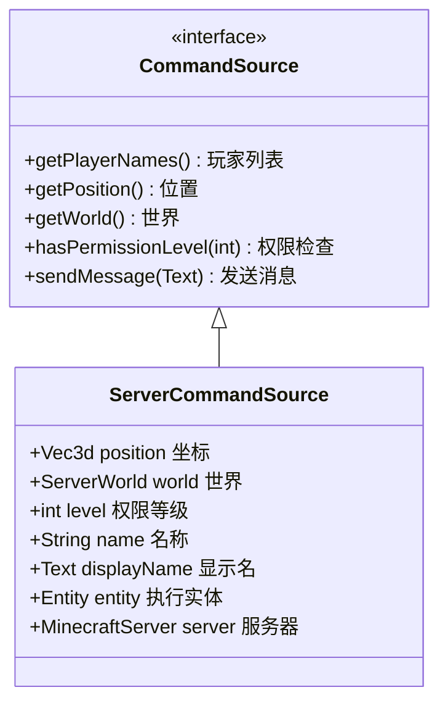
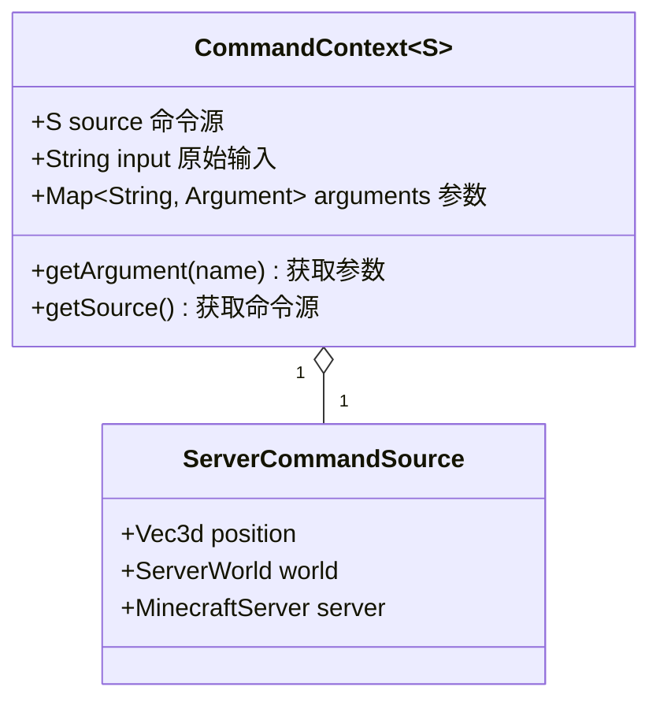
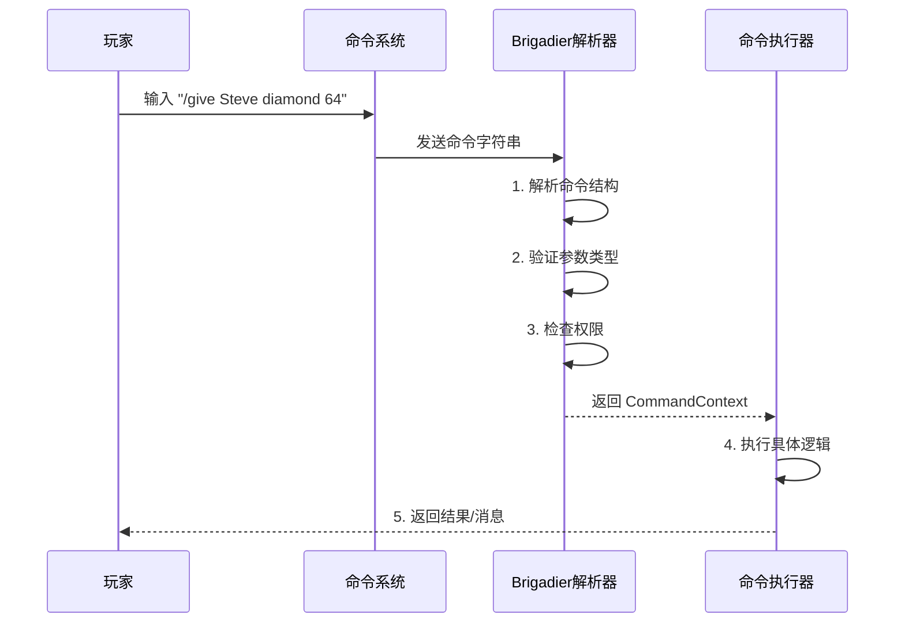

# 第37章 命令系统入门 —— 理解 Minecraft 的指令世界

## 目标

- 理解命令（Command）是什么
- 掌握命令源（CommandSource）的概念
- 了解命令上下文（CommandContext）
- 明白命令从输入到执行的完整流程

## 前置知识

- 完成 [第32章 事件系统](../Part-5-Event/32-event-system.md) 或有 Java 基础
- 了解 Minecraft 游戏基本概念（玩家、服务器）
- 了解 Minecraft 有命令系统（`/tp`、`/give` 等）

## 核心概念

### 什么是命令？

**命令（Command）** 是玩家或系统向游戏发送的指令。

想象你去餐厅点菜：
- **你** = 命令发送者（谁下的命令）
- **服务员** = 命令系统（接收和处理命令）
- **菜单** = 已知命令列表
- **厨师** = 命令执行者（真正做事的人）

在 Minecraft 中，当你输入 `/give @p diamond 64` 时：
```
/give @p diamond 64
│    │    │      │
│    │    │      └─ 数量：64个
│    │    └─ 物品：钻石
│    └─ 目标：最近的玩家
└─ 命令名：give（给物品）
```

### 命令源（CommandSource）

**命令源** 是"谁下的命令"，它包含了执行命令所需的所有信息。



### 命令上下文（CommandContext）

**命令上下文** 就像是你点菜后服务员给你的"小票"——包含了这次命令的所有信息。



### 命令解析流程

当你输入一个命令，Minecraft 内部是这样处理的：



## 图解

### 命令系统架构图

```
┌─────────────────────────────────────────────────────────────────┐
│                         玩家输入                                 │
│                    /give @p diamond 64                           │
└─────────────────────────┬───────────────────────────────────────┘
                          │
                          ▼
┌─────────────────────────────────────────────────────────────────┐
│                     CommandDispatcher                            │
│                      (命令调度器)                                │
│  ┌───────────────────────────────────────────────────────────┐  │
│  │                    命令树 (Command Tree)                   │  │
│  │                                                            │  │
│  │                        give                                │  │
│  │                       /    \                               │  │
│  │                  targets   item                            │  │
│  │                    │        |                              │  │
│  │                  @p       count                            │  │
│  │                            /                               │  │
│  │                          64                                │  │
│  └───────────────────────────────────────────────────────────┘  │
└─────────────────────────┬───────────────────────────────────────┘
                          │
                          ▼
┌─────────────────────────────────────────────────────────────────┐
│                   CommandContext                                 │
│                   (命令上下文)                                    │
│  ┌────────────────────────────────────────────────────────────┐  │
│  │  source: ServerCommandSource (谁执行的?)                    │  │
│  │  arguments: {                                             │  │
│  │    targets: EntitySelector(@p)                           │  │
│  │    item: ItemStack(diamond)                              │  │
│  │    count: 64                                              │  │
│  │  }                                                        │  │
│  └────────────────────────────────────────────────────────────┘  │
└─────────────────────────┬───────────────────────────────────────┘
                          │
                          ▼
┌─────────────────────────────────────────────────────────────────┐
│                   命令执行 (Execute)                             │
│  1. 获取目标玩家 (Steve)                                          │
│  2. 创建64个钻石                                                 │
│  3. 添加到玩家背包                                                │
│  4. 发送成功消息                                                  │
└─────────────────────────────────────────────────────────────────┘
```

### 生活中的比喻：餐厅点餐系统

```
┌──────────────────────────────────────────────────────────────────┐
│                        餐厅类比                                   │
├──────────────────────────────────────────────────────────────────┤
│                                                                  │
│   Minecraft命令          →      餐厅系统                          │
│   ─────────────────────────────────────────────────────────────  │
│   命令输入               →      点菜单                           │
│   /give Steve diamond    →      "我要一份牛排"                    │
│                                                                  │
│   CommandDispatcher       →      服务员                           │
│   (命令调度器)            →      (接收并处理点餐)                  │
│                                                                  │
│   CommandContext          →      点餐小票                         │
│   (命令上下文)            →      (记录：桌号、菜品、数量)          │
│                                                                  │
│   ServerCommandSource     →      顾客信息                         │
│   (命令源)                →      (谁点的、口味要求、VIP等级)        │
│                                                                  │
│   命令执行逻辑            →      厨师做菜                          │
│   /give 的 execute()     →      煎牛排、加调料                   │
│                                                                  │
│   反馈消息                →      上菜+问"还需要什么吗？"            │
│   "已给予 64 个钻石"       →      "您的牛排好了，请慢用"            │
│                                                                  │
└──────────────────────────────────────────────────────────────────┘
```

## 核心代码

### ServerCommandSource 的核心字段

```java
// ServerCommandSource.java - 服务端命令源
public class ServerCommandSource implements CommandSource {
    
    // 命令输出目标（发送消息用）
    private final CommandOutput output;
    
    // 位置（命令执行的地方）
    private final Vec3d position;
    
    // 世界（命令在哪个世界执行）
    private final ServerWorld world;
    
    // 权限等级（0=普通玩家, 4=管理员）
    private final int level;
    
    // 执行者的名字和显示名
    private final String name;
    private final Text displayName;
    
    // 服务器引用
    private final MinecraftServer server;
    
    // 如果是玩家/实体执行的，保存这个实体
    private final Entity entity;
    
    // 视角旋转
    private final Vec2f rotation;
}
```

### 命令调度的核心代码

```java
// CommandManager.java - 命令管理器
public class CommandManager {
    private final CommandDispatcher<ServerCommandSource> dispatcher = new CommandDispatcher();
    
    // 执行命令（带 / 前缀）
    public void executeWithPrefix(ServerCommandSource source, String command) {
        command = command.startsWith("/") ? command.substring(1) : command;
        this.execute(this.dispatcher.parse(command, source), command);
    }
    
    // 执行命令
    public void execute(ParseResults<ServerCommandSource> parseResults, String command) {
        ServerCommandSource source = parseResults.getContext().getSource();
        // 解析命令
        ContextChain<ServerCommandSource> contextChain = 
            CommandManager.checkCommand(parseResults, command, source);
        
        if (contextChain != null) {
            // 执行命令
            CommandExecutionContext.enqueueCommand(context, command, contextChain, source, ...);
        }
    }
}
```

### 从上下文获取数据

```java
// 从 CommandContext 中提取数据
public class CommandExample {
    
    public static int execute(ServerCommandSource source, CommandContext<?> context) {
        // 获取命令源
        ServerCommandSource src = context.getSource();
        
        // 获取玩家（如果存在）
        if (src.getEntity() instanceof ServerPlayerEntity player) {
            player.sendMessage(Text.literal("你执行了命令！"));
        }
        
        // 获取坐标
        Vec3d pos = src.getPosition();
        
        // 获取世界
        ServerWorld world = src.getWorld();
        
        // 发送反馈
        source.sendFeedback(() -> Text.literal("命令执行成功！"), broadcastToOps);
        
        return 1; // 返回成功
    }
}
```

## 实战演示

### 场景：理解命令执行的完整流程

```java
public class CommandFlowDemo {
    
    /**
     * 模拟玩家输入 "/teleport Steve 100 64 200" 的完整流程
     */
    public static void demonstrateCommandFlow() {
        
        // 1. 玩家输入命令字符串
        String commandInput = "/teleport Steve 100 64 200";
        
        // 2. 假设这是命令源（执行命令的玩家）
        ServerCommandSource source = new ServerCommandSource(
            output,           // 输出目标
            new Vec3d(0, 64, 0),  // 当前坐标
            new Vec2f(0, 0),   // 视角
            world,             // 当前世界
            4,                 // 权限等级4（管理员）
            "Steve",           // 名字
            Text.literal("Steve"), // 显示名
            server,            // 服务器
            entity             // 玩家实体
        );
        
        // 3. CommandDispatcher 解析命令
        // 分解：teleport → Steve → 100 → 64 → 200
        // 验证：Steve 是有效的玩家名
        // 验证：100, 64, 200 是有效的坐标
        
        // 4. 创建 CommandContext
        // context.getArgument("targets") → "Steve"
        // context.getArgument("pos") → Vec3d(100, 64, 200)
        
        // 5. 执行传送逻辑
        // player.teleport(world, 100, 64, 200, 0, 0);
        
        // 6. 发送成功消息
        // source.sendMessage("已传送 Steve 到 (100, 64, 200)");
    }
}
```

## 小结

1. **命令（Command）** 是玩家向游戏发送的指令，如 `/give`、`/tp`、`/time`

2. **命令源（CommandSource）** 代表"谁下的命令"，包含：
   - 执行者的位置、所在世界
   - 权限等级
   - 服务器引用
   - 可以发送消息给执行者

3. **命令上下文（CommandContext）** 包含一次命令执行的所有信息：
   - 命令源
   - 解析后的参数

4. **命令解析流程**：
   ```
   玩家输入 → 字符串解析 → 参数验证 → 权限检查 → 执行 → 反馈
   ```

5. **Brigadier 是命令解析库**，它将命令字符串解析成结构化的 CommandContext

## 练习

### 练习 1：追踪命令源信息

```java
// 在命令执行时，输出以下信息：
// - 执行者的名字
// - 执行者的坐标
// - 所在世界的名称
// - 权限等级

public class DebugCommand {
    public static int execute(CommandContext<ServerCommandSource> context) {
        ServerCommandSource source = context.getSource();
        
        // TODO: 补全代码，输出上述信息
        System.out.println("执行者：" + source.getName());
        
        return 1;
    }
}
```

### 练习 2：检查权限等级

```java
// 创建一个检查权限的命令
// 如果玩家权限 >= 2，显示"你有权使用此命令"
// 否则显示"你没有权限"

public class PermissionCheckCommand {
    public static int execute(CommandContext<ServerCommandSource> context) {
        ServerCommandSource source = context.getSource();
        int level = /* 获取权限等级 */;
        
        // TODO: 实现权限检查逻辑
        
        return 1;
    }
}
```

## 相关链接

- **上一章**：[第36章 同步机制](../Part-6-Network/36-sync-mechanism.md)
- **下一章**：[第38章 Brigadier 基础](./38-brigadier-basics.md)
- **相关源码**：
  - `net/minecraft/command/CommandSource.java` - 命令源接口
  - `net/minecraft/server/command/ServerCommandSource.java` - 服务端命令源实现
  - `net/minecraft/server/command/CommandManager.java` - 命令管理器
- **扩展阅读**：
  - [Brigadier 官方文档](https://github.com/Mojang/brigadier)
  - [Minecraft Wiki - Commands](https://minecraft.fandom.com/wiki/Commands)

### 源码文件位置

| 文件 | 源码路径 | 说明 |
|------|----------|------|
| CommandDispatcher.java | `com/mojang/brigadier/CommandDispatcher.java` | 命令调度器 |
| CommandSource.java | `net/minecraft/command/CommandSource.java` | 命令源接口 |
| CommandContext.java | `com/mojang/brigadier/context/CommandContext.java` | 命令上下文 |

> **注意**：本文中的部分源码示例基于 CFR 反编译结果，实际源码可能略有差异。

---

**关键词**：命令系统、CommandSource、CommandContext、CommandDispatcher、Brigadier
