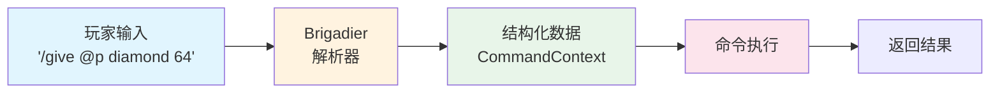
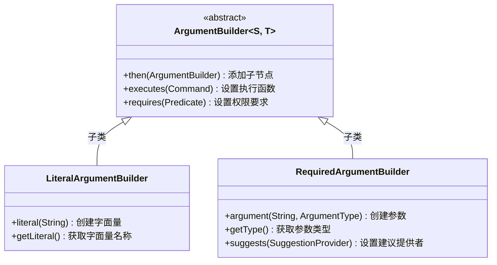
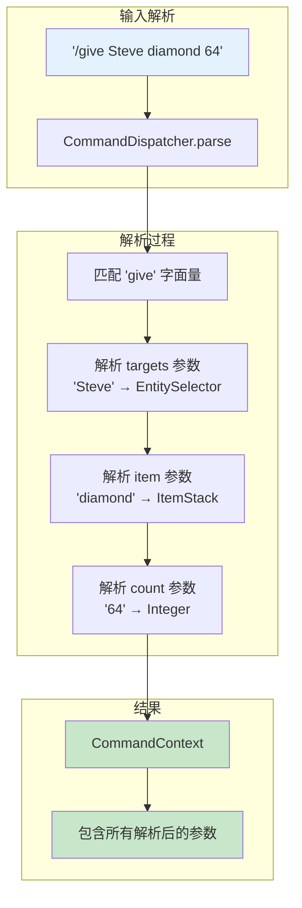
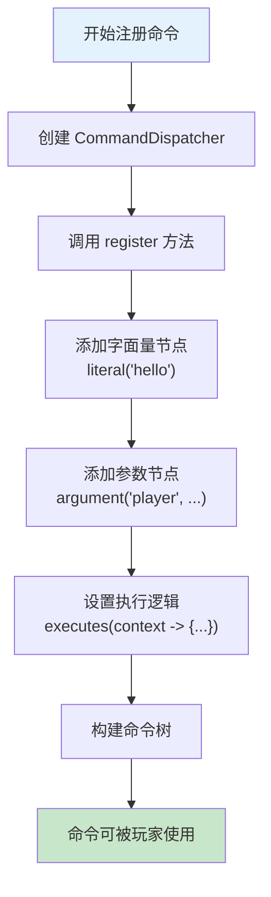

# 第38章 Brigadier 基础

## 目标

- 理解 Brigadier 是什么
- 掌握 ArgumentBuilder 的使用方法
- 了解内置参数类型
- 学会注册命令的基本方法

## 前置知识

- 完成 [第37章 命令系统入门](./37-command-intro.md)
- Java 面向对象编程（Builder 模式）
- 了解 Minecraft 命令格式（如 `/give <player> <item> [count]`）

## 核心概念

### Brigadier 是什么？

**Brigadier** 是 Mojang 用 Java 编写的命令行解析库，专门用于 Minecraft。

想象你要教一个机器人理解"给我倒杯水"：
- 你可以说"倒水"、"拿杯水来"、"我渴了"——人类能理解，但机器人需要精确的格式
- Brigadier 就是那个把"给我倒杯水"翻译成机器人能理解的结构化数据的翻译官



### Brigadier 的核心组件

```
┌─────────────────────────────────────────────────────────────┐
│                    Brigadier 核心组件                         │
├─────────────────────────────────────────────────────────────┤
│                                                             │
│  ┌─────────────────┐                                         │
│  │ CommandDispatcher │  ← 命令调度器，管理所有命令            │
│  │  (命令调度器)    │                                         │
│  └────────┬────────┘                                         │
│           │                                                  │
│           ▼                                                  │
│  ┌─────────────────┐                                         │
│  │  CommandNode    │  ← 命令树上的节点（可以是字面量或参数）  │
│  │   (命令节点)    │                                         │
│  └────────┬────────┘                                         │
│           │                                                  │
│     ┌─────┴─────┐                                            │
│     ▼           ▼                                            │
│  ┌──────┐   ┌─────────────┐                                 │
│  │Literal│   │RequiredArg │  ← Literal: "give"              │
│  │Node   │   │Node        │    RequiredArg: <player> <item>  │
│  └──────┘   └─────────────┘                                 │
│                                                             │
└─────────────────────────────────────────────────────────────┘
```

### ArgumentBuilder 家族



## 图解

### 参数解析流程图



### 命令树结构示例

```
命令：/give <targets> <item> [count]

命令树结构：

                    Root（根节点）
                       │
                       │
                     "give"  ← LiteralCommandNode
                       │
                       ▼
              RequiredArgumentBuilder
                 <targets: player>
                       │
                       ▼
              RequiredArgumentBuilder
                 <item: item>
                       │
                       ▼
              Optional count: 64
              
命令注册代码：
    
    dispatcher.register(
        literal("give")
            .then(argument("targets", EntityArgumentType.player())
                .then(argument("item", ItemStackArgumentType.itemStack())
                    .then(argument("count", IntegerArgumentType.integer(1))
                        .executes(context -> execute(...))
                    )
                )
            )
    );
```

### 内置参数类型一览

```
┌─────────────────────────────────────────────────────────────────┐
│                      Minecraft 内置参数类型                        │
├─────────────────────────────────────────────────────────────────┤
│                                                                 │
│  📝 字符串/文本                                                  │
│  ├── StringArgumentType     - 普通字符串                         │
│  └── MessageArgumentType    - 聊天消息                          │
│                                                                 │
│  🎯 实体/玩家                                                   │
│  ├── EntityArgumentType     - @p, @a, @e, 玩家名, UUID           │
│  └── PlayerArgumentType    - 只能选玩家                          │
│                                                                 │
│  📍 坐标/位置                                                   │
│  ├── Vec3ArgumentType      - 3D坐标 (x y z)                     │
│  ├── Vec2ArgumentType      - 2D坐标 (x z)                       │
│  └── BlockPosArgumentType  - 方块坐标                           │
│                                                                 │
│  🔢 数值                                                        │
│  ├── IntegerArgumentType   - 整数                               │
│  ├── LongArgumentType      - 长整数                             │
│  └── DoubleArgumentType    - 浮点数                             │
│                                                                 │
│  🎨 资源/注册表                                                  │
│  ├── IdentifierArgumentType - 命名空间:路径 (minecraft:stone)    │
│  ├── ItemStackArgumentType  - 物品（含NBT）                      │
│  └── BlockStateArgumentType - 方块状态                          │
│                                                                 │
└─────────────────────────────────────────────────────────────────┘
```

## 核心代码

### 简单的命令注册

```java
// MeCommand.java - 最简单的命令示例
public class MeCommand {
    public static void register(CommandDispatcher<ServerCommandSource> dispatcher) {
        // register 方法是所有命令的入口
        dispatcher.register(
            // 1. 创建字面量 "me"
            CommandManager.literal("me")
                // 2. 添加参数：action（消息类型）
                .then(
                    CommandManager.argument("action", MessageArgumentType.message())
                        // 3. 设置执行逻辑
                        .executes(context -> {
                            // 获取命令源
                            ServerCommandSource source = context.getSource();
                            
                            // 获取参数
                            MessageArgumentType.getSignedMessage(context, "action", message -> {
                                // 广播消息
                                source.getServer().getPlayerManager()
                                    .broadcast(message, source, MessageType.params(...));
                            });
                            
                            return 1; // 返回值代表成功
                        })
                )
        );
    }
}
```

### Give 命令（带多个参数）

```java
// GiveCommand.java - 复杂命令示例
public class GiveCommand {
    
    public static void register(CommandDispatcher<ServerCommandSource> dispatcher, 
                                 CommandRegistryAccess access) {
        
        dispatcher.register(
            // 1. 创建 "give" 字面量
            CommandManager.literal("give")
                // 2. 设置权限要求（等级2）
                .requires(source -> source.hasPermissionLevel(2))
                // 3. 添加目标玩家参数
                .then(
                    CommandManager.argument("targets", EntityArgumentType.players())
                        // 4. 在玩家参数下添加物品参数
                        .then(
                            CommandManager.argument("item", ItemStackArgumentType.itemStack(access))
                                // 5. 默认数量为1
                                .executes(context -> execute(source, item, targets, 1))
                                // 6. 添加可选的数量参数
                                .then(
                                    CommandManager.argument("count", IntegerArgumentType.integer(1))
                                        .executes(context -> execute(source, item, targets, 
                                            IntegerArgumentType.getInteger(context, "count")))
                                )
                        )
                )
        );
    }
}
```

### Execute 命令（子命令很多）

```java
// ExecuteCommand.java - execute 命令注册
public class ExecuteCommand {
    public static void register(CommandDispatcher<ServerCommandSource> dispatcher, 
                                 CommandRegistryAccess access) {
        
        // 注册主命令
        dispatcher.register(
            CommandManager.literal("execute")
                .requires(source -> source.hasPermissionLevel(2))
                
                // 子命令：run（执行另一个命令）
                .then(CommandManager.literal("run")
                    .redirect(dispatcher.getRoot()))
                
                // 子命令：if（条件执行）
                .then(ExecuteCommand.addConditionArguments(..., "if", true, ...))
                
                // 子命令：unless（条件执行）
                .then(ExecuteCommand.addConditionArguments(..., "unless", false, ...))
                
                // 子命令：as（以某实体身份执行）
                .then(CommandManager.argument("targets", EntityArgumentType.entities())
                    .fork(literalCommandNode, context -> {
                        // 为每个目标创建新的命令源
                        List<ServerCommandSource> list = Lists.newArrayList();
                        for (Entity entity : EntityArgumentType.getOptionalEntities(context, "targets")) {
                            list.add(context.getSource().withEntity(entity));
                        }
                        return list;
                    }))
                
                // 子命令：at（在某实体位置执行）
                .then(CommandManager.argument("targets", EntityArgumentType.entities())
                    .fork(literalCommandNode, context -> {
                        // 改变位置和世界
                        List<ServerCommandSource> list = Lists.newArrayList();
                        for (Entity entity : EntityArgumentType.getOptionalEntities(context, "targets")) {
                            list.add(context.getSource()
                                .withWorld((ServerWorld) entity.getWorld())
                                .withPosition(entity.getPos()));
                        }
                        return list;
                    }))
                
                // ... 还有更多子命令
        );
    }
}
```

### 创建自定义参数类型

```java
// 自定义布尔参数（true/false）
public class CustomCommand {
    
    public static void register(CommandDispatcher<ServerCommandSource> dispatcher) {
        
        dispatcher.register(
            CommandManager.literal("mycommand")
                .then(
                    CommandManager.argument("toggle", BoolArgumentType.bool())
                        .executes(context -> {
                            boolean value = BoolArgumentType.getBool(context, "toggle");
                            // 使用这个布尔值
                            return 1;
                        })
                )
        );
    }
}
```

## 实战演示

### 场景：创建一个完整的 /hello 命令

```java
public class HelloCommand {
    
    public static void register(CommandDispatcher<ServerCommandSource> dispatcher) {
        
        dispatcher.register(
            CommandManager.literal("hello")
                // hello - 基础版本
                .executes(context -> {
                    ServerCommandSource source = context.getSource();
                    source.sendFeedback(() -> 
                        Text.literal("你好, " + source.getName() + "!"), false);
                    return 1;
                })
                // hello <player> - 带玩家参数
                .then(
                    CommandManager.argument("player", EntityArgumentType.player())
                        .executes(context -> {
                            ServerCommandSource source = context.getSource();
                            ServerPlayerEntity target = EntityArgumentType.getPlayer(context, "player");
                            
                            source.sendFeedback(() -> 
                                Text.literal("你好 " + target.getName() + "！"), false);
                            
                            target.sendMessage(Text.literal(
                                source.getName() + " 向你打了个招呼！"));
                            
                            return 1;
                        })
                )
        );
    }
}
```

### 命令注册流程图



### /hello 命令树结构

```
Root
  └── "hello"
        ├── 无参数分支 → 显示 "你好, [名字]!"
        │
        └── <player: player>
              └── 显示 "你好 [目标]！" 并发送消息
```

## 小结

1. **Brigadier** 是 Minecraft 使用的命令解析库，将字符串命令转换为结构化数据

2. **LiteralArgumentBuilder** 用于创建字面量节点（如 `give`、`tp`、`time`）

3. **RequiredArgumentBuilder** 用于创建参数节点（如 `<player>`、`<count>`）

4. **命令树** 是命令的层次结构，描述了命令的完整语法

5. **参数类型** 决定了玩家可以输入什么类型的值

6. **权限检查** 使用 `.requires()` 方法设置权限等级要求

## 练习

### 练习 1：创建一个问候命令

```java
// 创建一个 /greet <player> 命令
// 效果：对指定玩家发送 "Hello!" 消息
// 权限：需要等级 1

public class GreetCommand {
    public static void register(CommandDispatcher<ServerCommandSource> dispatcher) {
        // TODO: 实现这个命令
    }
}
```

### 练习 2：创建一个带数字参数的命令

```java
// 创建一个 /heal <player> [amount] 命令
// amount 默认为 4（两颗心）
// 效果：恢复玩家指定数量的生命值

public class HealCommand {
    public static void register(CommandDispatcher<ServerCommandSource> dispatcher) {
        // TODO: 实现这个命令
    }
}
```

### 练习 3：理解命令树

```
绘制以下命令的命令树结构：

/spawn <entity> [x] [y] [z] [nbt]

思考：
1. 哪些参数是必须的？
2. 哪些参数是可选的？
3. 参数的顺序是什么？
```

## 相关链接

- **上一章**：[第37章 命令系统入门](./37-command-intro.md)
- **下一章**：[第39章 自定义命令](./39-custom-command.md)
- **相关源码**：
  - `net/minecraft/server/command/GiveCommand.java` - give 命令实现
  - `net/minecraft/server/command/MeCommand.java` - me 命令实现
  - `net/minecraft/server/command/ExecuteCommand.java` - execute 命令实现
  - `net/minecraft/server/command/CommandManager.java` - 命令管理器
- **扩展阅读**：
  - [Brigadier GitHub 仓库](https://github.com/Mojang/brigadier)
  - [Minecraft 命令 Wiki](https://minecraft.fandom.com/wiki/Commands)

### 源码文件位置

| 文件 | 源码路径 | 说明 |
|------|----------|------|
| ArgumentBuilder.java | `com/mojang/brigadier/builder/ArgumentBuilder.java` | 参数构建器基类 |
| LiteralArgumentBuilder.java | `com/mojang/brigadier/builder/LiteralArgumentBuilder.java` | 字面量参数构建器 |
| RequiredArgumentBuilder.java | `com/mojang/brigadier/builder/RequiredArgumentBuilder.java` | 必需参数构建器 |

> **注意**：本文中的部分源码示例基于 CFR 反编译结果，实际源码可能略有差异。

---

**关键词**：Brigadier、ArgumentBuilder、LiteralArgumentBuilder、RequiredArgumentBuilder、参数类型
