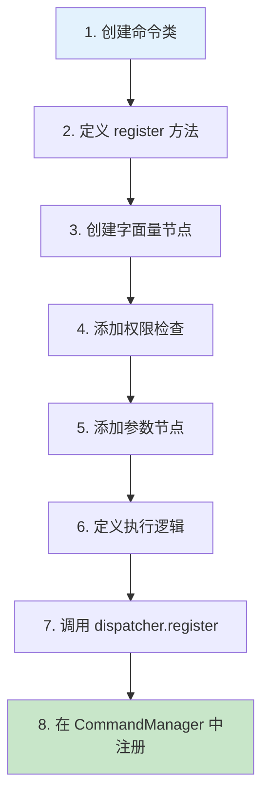
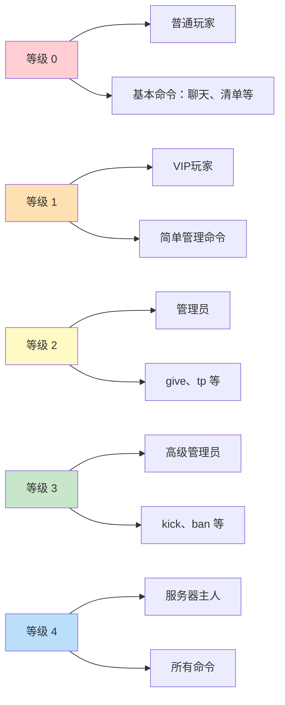
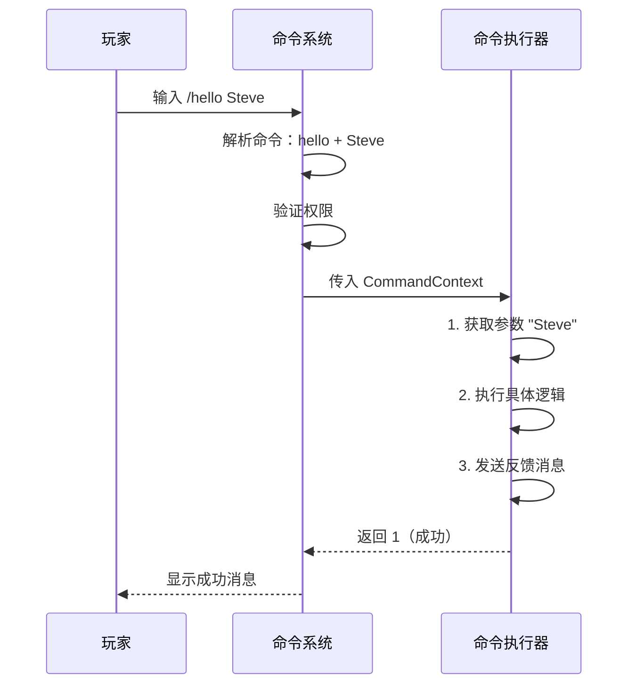
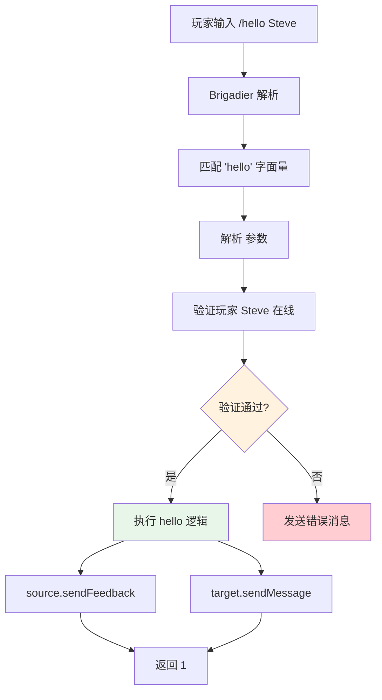

# 第39章 自定义命令

## 目标

- 学会创建自定义命令
- 掌握命令的基本结构
- 了解参数定义方法
- 理解权限检查机制
- 实战：创建一个完整的 /hello 命令

## 前置知识

- 完成 [第38章 Brigadier 基础](./38-brigadier-basics.md)
- Java 基础语法
- 理解 ServerCommandSource

## 核心概念

### 命令的基本结构

```
┌─────────────────────────────────────────────────────────────────┐
│                     Minecraft 命令结构                            │
├─────────────────────────────────────────────────────────────────┤
│                                                                 │
│   public class XxxCommand {                                      │
│       public static void register(CommandDispatcher<...> dispatcher) {│
│           dispatcher.register(                                   │
│               CommandManager.literal("命令名")                    │
│                   .requires(source -> ...)    ← 权限检查         │
│                   .then(argument(...))        ← 添加参数        │
│                   .executes(context -> {...})  ← 执行逻辑       │
│           );                                                    │
│       }                                                         │
│   }                                                             │
│                                                                 │
└─────────────────────────────────────────────────────────────────┘
```

### 命令注册流程



### 权限等级系统



## 图解

### 命令执行流程图



### 命令参数类型选择

```
┌─────────────────────────────────────────────────────────────────┐
│                      选择正确的参数类型                            │
├─────────────────────────────────────────────────────────────────┤
│                                                                 │
│  🎯 玩家选择                                                    │
│  ┌────────────────────────────────────────────────────────────┐ │
│  │ EntityArgumentType.player()   → /tp <player>             │ │
│  │   只允许选择单个玩家，不能是实体                             │ │
│  │                                                            │ │
│  │ EntityArgumentType.players()  → /msg <player1> <player2>  │ │
│  │   允许多个玩家                                             │ │
│  │                                                            │ │
│  │ EntityArgumentType.entities()  → /kill <entity>            │ │
│  │   允许选择任何实体（玩家、生物等）                           │ │
│  └────────────────────────────────────────────────────────────┘ │
│                                                                 │
│  🔢 数值                                                        │
│  ┌────────────────────────────────────────────────────────────┐ │
│  │ IntegerArgumentType.integer(min, max)                      │ │
│  │   → /give <player> <item> [count: 1-64]                   │ │
│  │                                                            │ │
│  │ DoubleArgumentType.doubleArg()                             │ │
│  │   → /spreadplayers <spread>                                │ │
│  └────────────────────────────────────────────────────────────┘ │
│                                                                 │
│  📝 文本                                                        │
│  ┌────────────────────────────────────────────────────────────┐ │
│  │ StringArgumentType.word()    → 单词（无空格）              │ │
│  │ StringArgumentType.string()  → 带引号的字符串              │ │
│  │ MessageArgumentType.message() → 聊天消息                   │ │
│  └────────────────────────────────────────────────────────────┘ │
│                                                                 │
└─────────────────────────────────────────────────────────────────┘
```

## 核心代码

### 基础命令：无参数

```java
public class HelloCommand {
    public static void register(CommandDispatcher<ServerCommandSource> dispatcher) {
        dispatcher.register(
            CommandManager.literal("hello")
                .executes(context -> {
                    // 获取命令源（执行命令的人）
                    ServerCommandSource source = context.getSource();
                    
                    // 发送消息给执行者
                    source.sendFeedback(() -> 
                        Text.literal("你好, " + source.getName() + "!"), false);
                    
                    return 1; // 返回 1 表示成功
                })
        );
    }
}
```

### 带玩家参数的命令

```java
public class GreetCommand {
    public static void register(CommandDispatcher<ServerCommandSource> dispatcher) {
        dispatcher.register(
            CommandManager.literal("greet")
                // 设置权限等级为 1
                .requires(source -> source.hasPermissionLevel(1))
                // 添加玩家参数
                .then(
                    CommandManager.argument("target", EntityArgumentType.player())
                        .executes(context -> {
                            ServerCommandSource source = context.getSource();
                            
                            // 从上下文获取玩家参数
                            ServerPlayerEntity target = EntityArgumentType.getPlayer(context, "target");
                            
                            // 发送消息
                            source.sendFeedback(() -> 
                                Text.literal("正在问候 " + target.getName()), false);
                            
                            target.sendMessage(Text.literal("有人向你问好！"));
                            
                            return 1;
                        })
                )
        );
    }
}
```

### 带可选参数的命令

```java
public class HealCommand {
    public static void register(CommandDispatcher<ServerCommandSource> dispatcher) {
        dispatcher.register(
            CommandManager.literal("heal")
                .requires(source -> source.hasPermissionLevel(2))
                .then(
                    CommandManager.argument("target", EntityArgumentType.player())
                        // 默认数量版本（无 [amount] 参数）
                        .executes(context -> executeHeal(context, 4)) // 默认恢复 4 点
                        // 带数量版本
                        .then(
                            CommandManager.argument("amount", IntegerArgumentType.integer(1, 100))
                                .executes(context -> {
                                    int amount = IntegerArgumentType.getInteger(context, "amount");
                                    return executeHeal(context, amount);
                                })
                        )
                )
        );
    }
    
    private static int executeHeal(CommandContext<ServerCommandSource> context, int amount) {
        ServerCommandSource source = context.getSource();
        ServerPlayerEntity player = EntityArgumentType.getPlayer(context, "target");
        
        // 恢复生命值
        player.heal(amount);
        
        source.sendFeedback(() -> 
            Text.literal("已恢复 " + player.getName() + " 的 " + amount + " 点生命值"), true);
        
        return amount;
    }
}
```

### 带坐标参数的命令

```java
public class TeleportCommand {
    public static void register(CommandDispatcher<ServerCommandSource> dispatcher) {
        dispatcher.register(
            CommandManager.literal("warp")
                .requires(source -> source.hasPermissionLevel(2))
                .then(
                    CommandManager.argument("location", Vec3ArgumentType.vec3())
                        .executes(context -> {
                            ServerCommandSource source = context.getSource();
                            Vec3d location = Vec3ArgumentType.getVec3(context, "location");
                            
                            // 获取玩家
                            ServerPlayerEntity player = source.getPlayerOrThrow();
                            
                            // 传送
                            player.teleport(
                                source.getWorld(),
                                location.x, location.y, location.z,
                                player.getYaw(), player.getPitch()
                            );
                            
                            source.sendFeedback(() -> 
                                Text.literal("已传送到 " + 
                                    (int)location.x + ", " + 
                                    (int)location.y + ", " + 
                                    (int)location.z), true);
                            
                            return 1;
                        })
                )
        );
    }
}
```

## 实战演示

### 完整的 /hello 命令实现

这是我们要创建的命令：
- `/hello` - 向执行者打招呼
- `/hello <player>` - 向指定玩家打招呼

```java
/**
 * HelloCommand.java
 * 
 * 完整的 /hello 命令实现
 * 
 * 功能：
 * - /hello - 向执行者打招呼
 * - /hello <player> - 向指定玩家打招呼
 */
public class HelloCommand {
    
    /**
     * 注册命令到调度器
     * 这是所有命令的入口点
     */
    public static void register(CommandDispatcher<ServerCommandSource> dispatcher) {
        
        // 第一部分：基础 /hello 命令（无参数）
        dispatcher.register(
            CommandManager.literal("hello")
                .executes(context -> {
                    // 获取命令源
                    ServerCommandSource source = context.getSource();
                    
                    // 获取执行者的名字
                    String playerName = source.getName();
                    
                    // 尝试获取玩家实体
                    String message;
                    if (source.getEntity() != null) {
                        // 如果是玩家执行的，显示友好的消息
                        message = "你好, " + playerName + "! 欢迎回来~";
                    } else {
                        // 如果是控制台执行的，显示简化的消息
                        message = "你好! (来自控制台)";
                    }
                    
                    // 发送反馈消息
                    // 第二个参数 true 表示向管理员广播这条消息
                    source.sendFeedback(() -> Text.literal(message), false);
                    
                    // 返回值 1 表示命令执行成功
                    return 1;
                })
        );
        
        // 第二部分：/hello <player> 命令
        dispatcher.register(
            CommandManager.literal("hello")
                .then(
                    CommandManager.argument("target", EntityArgumentType.player())
                        .executes(context -> {
                            ServerCommandSource source = context.getSource();
                            
                            // 获取参数：目标玩家
                            ServerPlayerEntity target = EntityArgumentType.getPlayer(context, "target");
                            
                            // 获取执行者名字
                            String senderName = source.getName();
                            
                            // 向执行者发送消息
                            source.sendFeedback(() -> 
                                Text.literal("已向 " + target.getName() + " 打招呼！"), false);
                            
                            // 向目标玩家发送私信
                            target.sendMessage(Text.literal(
                                senderName + " 向你打了个招呼！👋"));
                            
                            return 1;
                        })
                )
        );
    }
}
```

### 命令执行流程图



### 在 CommandManager 中注册命令

```java
// CommandManager.java
public class CommandManager {
    
    public CommandManager(RegistrationEnvironment environment, 
                         CommandRegistryAccess commandRegistryAccess) {
        
        // ... 其他命令注册 ...
        
        // 注册我们的 hello 命令
        HelloCommand.register(this.dispatcher);
        
        // ... 其他命令注册 ...
    }
}
```

### 发送消息的方法

```java
public class MessageExamples {
    public static void messageExamples(ServerCommandSource source) {
        
        // 1. 发送普通消息（绿色）
        source.sendFeedback(() -> Text.literal("操作成功！"), false);
        
        // 2. 发送带样式的消息
        source.sendFeedback(() -> 
            Text.literal("欢迎回来！")
                .styled(style -> style.withColor(0x55FF55)), false);
        
        // 3. 发送错误消息（红色）
        source.sendError(Text.literal("出错了！"));
        
        // 4. 向玩家发送私信
        source.getPlayerOrThrow().sendMessage(Text.literal("这是一条私信"));
        
        // 5. 广播消息（所有玩家都能看到）
        source.getServer().getPlayerManager().broadcast(
            Text.literal("公告：服务器将在5分钟后重启"),
            MessageType.SYSTEM,
            ServerMessageSource.withDefaultSender(source)
        );
    }
}
```

## 小结

1. **命令的基本结构**：
   - `literal("命令名")` - 定义命令名称
   - `.requires()` - 设置权限检查
   - `.then()` - 添加子命令或参数
   - `.executes()` - 设置执行逻辑

2. **参数获取方法**：
   - `EntityArgumentType.getPlayer(context, "name")` - 获取玩家
   - `IntegerArgumentType.getInteger(context, "name")` - 获取整数
   - `Vec3ArgumentType.getVec3(context, "name")` - 获取坐标

3. **权限等级**：
   - 0 = 普通玩家
   - 2 = 管理员（大多数命令）
   - 4 = 完全权限

4. **消息发送**：
   - `source.sendFeedback()` - 发送成功消息
   - `source.sendError()` - 发送错误消息
   - `player.sendMessage()` - 向玩家发送私信

5. **返回值**：
   - 返回 1 表示成功
   - 返回 0 表示失败

## 练习

### 练习 1：创建 /fly 命令

```java
// 创建一个 /fly <player> 命令
// 效果：切换目标玩家的飞行状态
// 提示：使用 player.setAllowFlying(true/false)

public class FlyCommand {
    public static void register(CommandDispatcher<ServerCommandSource> dispatcher) {
        // TODO: 实现这个命令
    }
}
```

### 练习 2：创建 /spawn 命令

```java
// 创建一个 /spawn <entity> [x] [y] [z] 命令
// 效果：在指定位置生成实体
// 如果不提供坐标，在玩家当前位置生成
// 提示：使用 EntityType.spawn()

public class SpawnCommand {
    public static void register(CommandDispatcher<ServerCommandSource> dispatcher,
                                 CommandRegistryAccess access) {
        // TODO: 实现这个命令
    }
}
```

### 练习 3：创建一个计数器命令

```java
// 创建一个 /counter 命令
// 功能：
// - /counter - 显示当前计数
// - /counter reset - 重置计数
// - /counter add <数量> - 增加计数
// 提示：使用 Scoreboard 来存储计数

public class CounterCommand {
    public static void register(CommandDispatcher<ServerCommandSource> dispatcher,
                                 CommandRegistryAccess access) {
        // TODO: 实现这个命令
    }
}
```

## 相关链接

- **上一章**：[第38章 Brigadier 基础](./38-brigadier-basics.md)
- **下一章**：[第40章 命令进阶](./40-command-advanced.md)
- **相关源码**：
  - `net/minecraft/server/command/MeCommand.java` - 简单命令示例
  - `net/minecraft/server/command/GiveCommand.java` - 复杂命令示例
  - `net/minecraft/server/command/CommandManager.java` - 命令管理器
- **扩展阅读**：
  - [Minecraft 命令 Wiki](https://minecraft.fandom.com/wiki/Commands)
  - [Brigadier 文档](https://github.com/Mojang/brigadier)

### 源码文件位置

| 文件 | 源码路径 | 说明 |
|------|----------|------|
| CommandManager.java | `net/minecraft/server/command/CommandManager.java` | 命令管理器 |
| ServerCommandSource.java | `net/minecraft/server/command/ServerCommandSource.java` | 服务端命令源 |

> **注意**：本文中的部分源码示例基于 CFR 反编译结果，实际源码可能略有差异。

---

**关键词**：自定义命令、参数定义、权限检查、消息发送、CommandDispatcher
