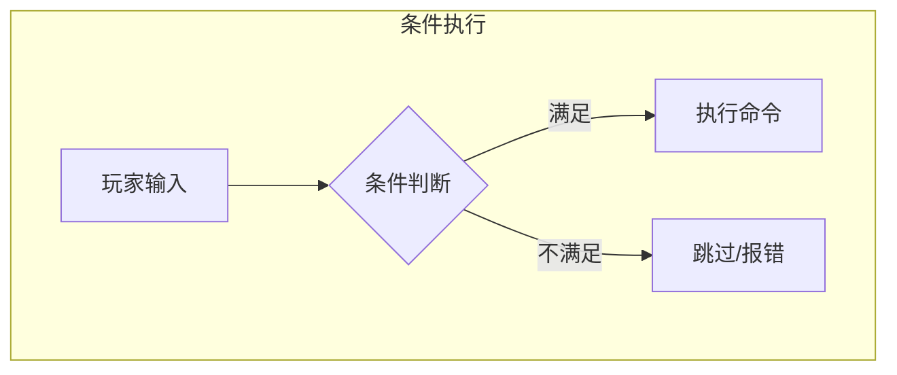
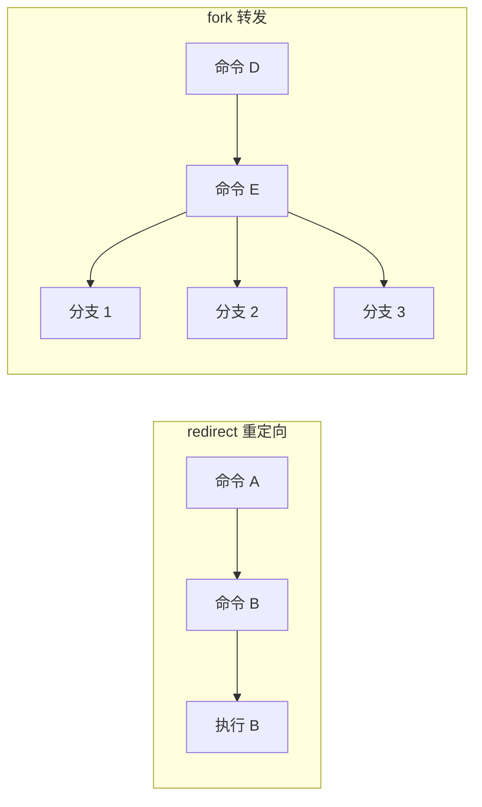
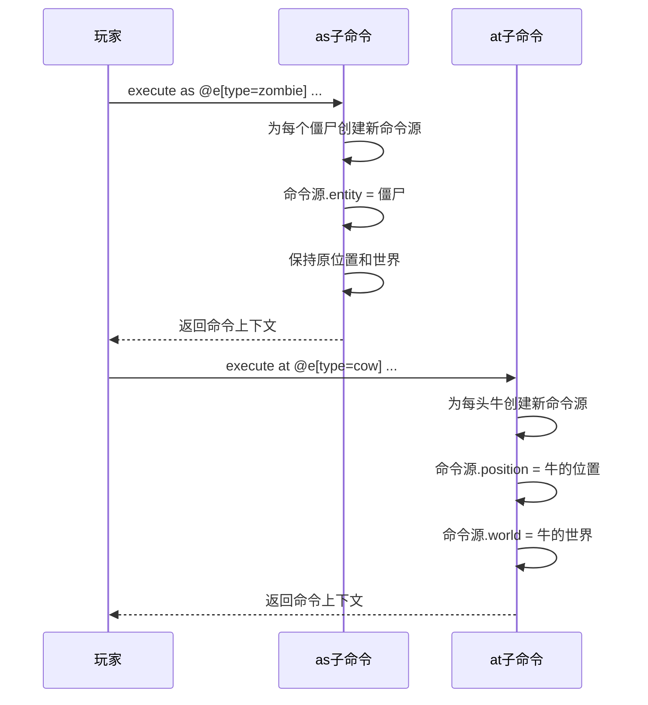

# 第40章 命令进阶 —— 条件执行、子命令与重定向

## 目标

- 理解条件执行（if/unless）
- 掌握子命令的创建方法
- 了解重定向（redirect）和转发（fork）
- 学会使用 execute 命令

## 前置知识

- 完成 [第39章 自定义命令](./39-custom-command.md)
- 理解 Brigadier 的命令树概念

## 核心概念

### 条件执行

想象你在做饭：
- "如果有鸡蛋，就做炒蛋"
- "如果没有盐，就别做菜"

这就是条件执行——根据条件决定是否执行命令。



### 子命令

子命令就像是菜单的分类：

```
主菜单
├── 文件
│   ├── 打开
│   ├── 保存
│   └── 关闭
└── 编辑
    ├── 复制
    ├── 粘贴
    └── 撤销
```

Minecraft 命令也有类似的结构：

```
/time
├── /time set <value>
├── /time add <value>
└── /time query
    ├── /time query day
    └── /time query gametime
```

### 重定向 vs 转发



## 图解

### Execute 命令架构图

```
┌─────────────────────────────────────────────────────────────────┐
│                       execute 命令结构                            │
├─────────────────────────────────────────────────────────────────┤
│                                                                 │
│   execute                                                        │
│   ├── run <command>            ← 执行另一个命令                   │
│   ├── if <condition>           ← 条件执行                        │
│   │   ├── block <pos> <block>  ← 检查方块                        │
│   │   ├── entity <selector>    ← 检查实体                        │
│   │   ├── score <holder> <obj>  ← 检查分数                       │
│   │   └── ...                                                  │
│   ├── unless <condition>        ← 条件不满足时执行                 │
│   ├── as <targets>             ← 以目标身份执行                   │
│   ├── at <targets>             ← 在目标位置执行                   │
│   ├── positioned <pos>         ← 在指定位置执行                   │
│   ├── rotated <rotation>       ← 以指定视角执行                   │
│   ├── anchored <anchor>        ← 以指定锚点执行                   │
│   ├── facing <target>          ← 面向目标执行                     │
│   ├── in <dimension>           ← 在指定世界执行                   │
│   ├── store <type> <target>    ← 存储结果                        │
│   └── align <axes>             ← 对齐坐标执行                     │
│                                                                 │
└─────────────────────────────────────────────────────────────────┘
```

### as 和 at 子命令



## 核心代码

### 创建条件命令

```java
public class ConditionalCommand {
    public static void register(CommandDispatcher<ServerCommandSource> dispatcher) {
        
        // 自定义条件命令示例
        dispatcher.register(
            CommandManager.literal("check")
                // 检查玩家是否在线
                .then(
                    CommandManager.literal("if")
                        .then(
                            CommandManager.argument("player", EntityArgumentType.player())
                                .executes(context -> {
                                    ServerPlayerEntity target = 
                                        EntityArgumentType.getPlayer(context, "player");
                                    
                                    context.getSource().sendFeedback(() -> 
                                        Text.literal(target.getName() + " 在线！"), false);
                                    
                                    return 1;
                                })
                        )
                )
                // 检查玩家是否不在线
                .then(
                    CommandManager.literal("unless")
                        .then(
                            CommandManager.argument("player", EntityArgumentType.player())
                                .executes(context -> {
                                    // unless 的逻辑与 if 相反
                                    // 这里简化处理，实际应该检查玩家不在线
                                    context.getSource().sendFeedback(() -> 
                                        Text.literal("玩家不在线！"), false);
                                    return 0;
                                })
                        )
                )
        );
    }
}
```

### 使用 fork 创建分支

```java
public class ForkCommand {
    public static void register(CommandDispatcher<ServerCommandSource> dispatcher) {
        
        LiteralCommandNode<ServerCommandSource> root = 
            CommandManager.literal("multigive")
                .requires(source -> source.hasPermissionLevel(2))
                .build();
        
        dispatcher.register(
            CommandManager.literal("multigive")
                .then(
                    CommandManager.argument("targets", EntityArgumentType.players())
                        .fork(root, context -> {
                            // 为每个玩家创建一个分支
                            List<ServerCommandSource> sources = new ArrayList<>();
                            Collection<ServerPlayerEntity> players = 
                                EntityArgumentType.getPlayers(context, "targets");
                            
                            for (ServerPlayerEntity player : players) {
                                sources.add(context.getSource().withEntity(player));
                            }
                            
                            return sources;
                        })
                        .then(
                            CommandManager.argument("item", ItemStackArgumentType.itemStack())
                                .executes(context -> {
                                    // 每个分支都会执行这段代码
                                    ServerCommandSource source = context.getSource();
                                    ServerPlayerEntity player = source.getPlayer();
                                    
                                    ItemStack item = ItemStackArgumentType.getItemStackArgument(
                                        context, "item").createStack(1, false);
                                    player.getInventory().insertStack(item);
                                    
                                    return 1;
                                })
                        )
                )
        );
    }
}
```

### 重定向命令

```java
public class RedirectCommand {
    public static void register(CommandDispatcher<ServerCommandSource> dispatcher) {
        
        // 创建别名：/killall 重定向到 /kill @e
        dispatcher.register(
            CommandManager.literal("killall")
                .redirect(dispatcher.getRoot().getChild("kill")
                    .getChild("@e"))
        );
        
        // 创建 /spawn 重定向到 /summon
        dispatcher.register(
            CommandManager.literal("spawn")
                .redirect(dispatcher.getRoot().getChild("summon"))
        );
    }
}
```

## 实战演示

### 场景：创建类似 /execute 的命令系统

```java
public class MyExecuteCommand {
    
    // 存储子命令
    private static void registerSubCommands(CommandDispatcher<ServerCommandSource> dispatcher,
                                            LiteralCommandNode<ServerCommandSource> root) {
        
        // as 子命令
        dispatcher.register(
            CommandManager.literal("myexecute")
                .then(
                    CommandManager.literal("as")
                        .then(
                            CommandManager.argument("targets", EntityArgumentType.entities())
                                .fork(root, context -> {
                                    List<ServerCommandSource> sources = new ArrayList<>();
                                    for (Entity entity : EntityArgumentType.getOptionalEntities(context, "targets")) {
                                        sources.add(context.getSource().withEntity(entity));
                                    }
                                    return sources;
                                })
                                // 在 as 后面继续添加子命令
                                .then(
                                    CommandManager.literal("run")
                                        .then(
                                            CommandManager.argument("command", StringArgumentType.greedyString())
                                                .executes(context -> {
                                                    // 执行命令
                                                    return 1;
                                                })
                                        )
                                )
                        )
                )
        );
        
        // at 子命令
        dispatcher.register(
            CommandManager.literal("myexecute")
                .then(
                    CommandManager.literal("at")
                        .then(
                            CommandManager.argument("targets", EntityArgumentType.entities())
                                .fork(root, context -> {
                                    List<ServerCommandSource> sources = new ArrayList<>();
                                    for (Entity entity : EntityArgumentType.getOptionalEntities(context, "targets")) {
                                        sources.add(context.getSource()
                                            .withPosition(entity.getPos())
                                            .withWorld((ServerWorld) entity.getWorld()));
                                    }
                                    return sources;
                                })
                                // ...
                        )
                )
        );
    }
}
```

### 多层嵌套命令示例

```java
public class AdminCommand {
    public static void register(CommandDispatcher<ServerCommandSource> dispatcher) {
        
        // /admin
        // ├── /admin player <name>
        // │   ├── /admin player <name> kick
        // │   ├── /admin player <name> ban
        // │   └── /admin player <name> teleport
        // └── /admin server
        //     ├── /admin server stop
        //     └── /admin server restart
        
        dispatcher.register(
            CommandManager.literal("admin")
                .requires(source -> source.hasPermissionLevel(4))
                
                // player 子命令
                .then(
                    CommandManager.literal("player")
                        .then(
                            CommandManager.argument("name", EntityArgumentType.player())
                                .then(
                                    CommandManager.literal("kick")
                                        .executes(context -> {
                                            ServerPlayerEntity player = 
                                                EntityArgumentType.getPlayer(context, "name");
                                            player.networkHandler.disconnect(
                                                Text.literal("被管理员踢出"));
                                            return 1;
                                        })
                                )
                                .then(
                                    CommandManager.literal("ban")
                                        .executes(context -> {
                                            // ban 逻辑
                                            return 1;
                                        })
                                )
                                .then(
                                    CommandManager.literal("teleport")
                                        .then(
                                            CommandManager.argument("pos", Vec3ArgumentType.vec3())
                                                .executes(context -> {
                                                    // teleport 逻辑
                                                    return 1;
                                                })
                                        )
                                )
                        )
                )
                
                // server 子命令
                .then(
                    CommandManager.literal("server")
                        .then(
                            CommandManager.literal("stop")
                                .executes(context -> {
                                    context.getSource().getServer().stop(false);
                                    return 1;
                                })
                        )
                        .then(
                            CommandManager.literal("restart")
                                .executes(context -> {
                                    // restart 逻辑
                                    return 1;
                                })
                        )
                )
        );
    }
}
```

## 小结

1. **条件执行** 允许根据条件（if/unless）决定是否执行命令

2. **子命令** 通过 `.then()` 方法添加，形成树状结构

3. **重定向（redirect）** 将命令别名指向另一个命令

4. **转发（fork）** 为每个目标创建独立的执行分支

5. **execute 命令** 是条件执行的典型应用

## 练习

### 练习 1：创建 /home 命令组

```
/home
├── /home set - 设置家
├── /home - 回家
└── /home <player> - 查看某玩家的家
```

### 练习 2：创建 /warp 命令组

```
/warp
├── /warp add <name> - 添加传送点
├── /warp list - 列出所有传送点
├── /warp <name> - 传送到指定点
└── /warp del <name> - 删除传送点
```

### 练习 3：理解 execute 原理

思考 `/execute as @e[type=cow] at @s run tp @s 0 100 0` 的执行流程，画出流程图。

## 相关链接

- **上一章**：[第39章 自定义命令](./39-custom-command.md)
- **相关源码**：
  - `net/minecraft/server/command/ExecuteCommand.java` - execute 命令实现
  - `net/minecraft/server/command/CommandManager.java` - 命令管理器

### 源码文件位置

| 文件 | 源码路径 | 说明 |
|------|----------|------|
| ExecuteCommand.java | `net/minecraft/server/command/ExecuteCommand.java` | 执行命令实现 |
| ArgumentCommandNode.java | `com/mojang/brigadier/tree/ArgumentCommandNode.java` | 参数命令节点 |

> **注意**：本文中的部分源码示例基于 CFR 反编译结果，实际源码可能略有差异。

---

**关键词**：条件执行、子命令、重定向、转发、execute、fork、redirect
