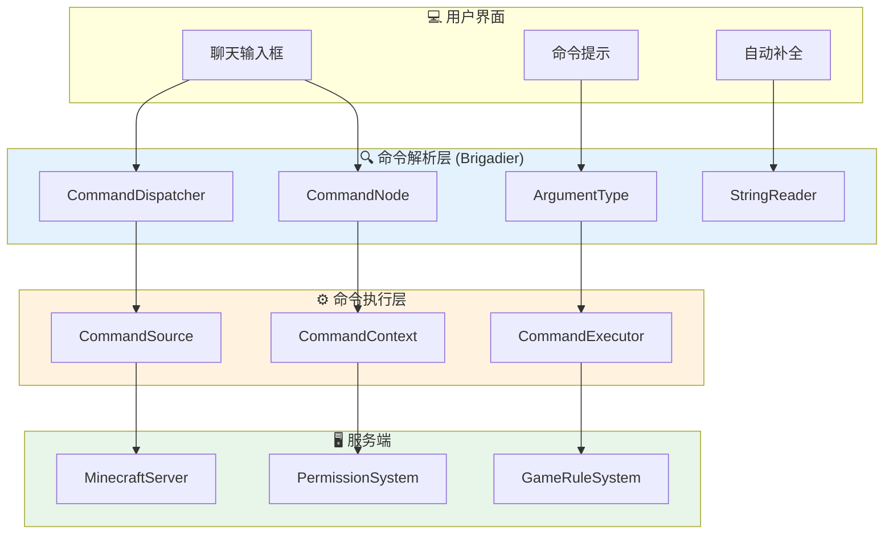

# 第 42 章：命令入门（Command System Introduction）

## 章节目标

- 理解 Minecraft 命令的本质
- 掌握命令系统的基本架构
- 了解 Brigadier 框架的定位
- 认识命令参数的概念

## 前置知识

- 了解 Java 基础语法
- 有过使用 Minecraft 命令的经验
- 理解 Minecraft 的服务端/客户端概念

## 目录

- [命令是什么](#命令是什么)
- [命令 = 给游戏下达指令](#命令--给游戏下达指令)
- [命令系统的架构](#命令系统的架构)
- [Brigadier 框架介绍](#brigadier-框架介绍)
- [命令参数基础](#命令参数基础)
- [常用命令示例](#常用命令示例)
- [实战：使用命令调试](#实战使用命令调试)
- [课后自查](#课后自查)

---

## 命令是什么

当你打开聊天框，输入 `/gamemode creative` 并按下回车时，游戏发生了什么？

```
┌─────────────────────────────────────────────────────────────┐
│                    命令执行流程                               │
├─────────────────────────────────────────────────────────────┤
│                                                             │
│  1️⃣ 你输入命令                                              │
│     ┌─────────────────────────────────────────────────┐    │
│     │ /gamemode creative @p 100 64 -200              │    │
│     └─────────────────────────────────────────────────┘    │
│                         ↓                                    │
│  2️⃣ 客户端解析                                              │
│     ┌─────────────────────────────────────────────────┐    │
│     │ 解析为: Command + Arguments                    │    │
│     │ - "gamemode" = 命令名                          │    │
│     │ - "creative" = 游戏模式参数                    │    │
│     │ - "@p" = 目标玩家参数                          │    │
│     │ - "100 64 -200" = 坐标参数                     │    │
│     └─────────────────────────────────────────────────┘    │
│                         ↓                                    │
│  3️⃣ 发送到服务端 (C2S)                                       │
│     ┌─────────────────────────────────────────────────┐    │
│     │ ChatMessageC2SPacket 或 CommandExecutionC2SPacket │    │
│     └─────────────────────────────────────────────────┘    │
│                         ↓                                    │
│  4️⃣ 服务端执行                                              │
│     ┌─────────────────────────────────────────────────┐    │
│     │ Brigadier 解析 → 验证权限 → 执行逻辑 → 返回结果  │    │
│     └─────────────────────────────────────────────────┘    │
│                         ↓                                    │
│  5️⃣ 发送结果到客户端 (S2C)                                   │
│     ┌─────────────────────────────────────────────────┐    │
│     │ ChatMessageS2CPacket (命令输出)                  │    │
│     └─────────────────────────────────────────────────┘    │
│                         ↓                                    │
│  6️⃣ 你看到结果                                              │
│     ┌─────────────────────────────────────────────────┐    │
│     │ [CHAT] 已将 GameMode 设置为 Creative Mode        │    │
│     └─────────────────────────────────────────────────┘    │
│                                                             │
└─────────────────────────────────────────────────────────────┘
```

---

## 命令 = 给游戏下达指令

**核心类比**：

> **命令 = 写给游戏的信**
> 
> - 你在信纸上写下指令（命令文本）
> - 邮递员把信送到游戏服务器（网络传输）
> - 游戏的"秘书"（Brigadier）阅读并执行指令（命令解析）
> - 秘书告诉你执行结果（命令输出）

### 命令的组成部分

```
┌─────────────────────────────────────────────────────────────┐
│                    /gamemode creative @p 100 64 -200        │
├─────────────────────────────────────────────────────────────┤
│                                                             │
│  /gamemode          creative         @p      100 64 -200   │
│  ─────────          ────────        ───      ───────────   │
│  命令名              子命令           目标       坐标参数     │
│  (Literal)         (Literal)      (Entity)   (Position)   │
│                                                             │
│  组成部分解释:                                                │
│  • "/" 表示这是一条命令 (不是聊天消息)                          │
│  • "gamemode" 是主命令                                        │
│  • "creative" 是 gamemode 的参数 (游戏模式)                   │
│  • "@p" 是目标选择器 (最近的玩家)                              │
│  • "100 64 -200" 是传送坐标                                    │
│                                                             │
└─────────────────────────────────────────────────────────────┘
```

### 命令与聊天的区别

| 方面 | 命令 | 聊天消息 |
|------|------|---------|
| 前缀 | `/` | 无 |
| 执行者 | 游戏服务端 | 仅显示给其他玩家 |
| 权限 | 需要权限节点 | 无需特殊权限 |
| 功能 | 触发游戏逻辑 | 发送文本消息 |
| 结果 | 命令输出 | 对话消息 |

---

## 命令系统的架构

Minecraft 的命令系统由多个组件组成：



### 核心组件

```java
// 命令调度的核心类
public class CommandDispatcher<Source> {
    
    // 根节点，所有命令都注册在这里
    private final CommandNode<Source> root;
    
    // 注册新命令
    public void register(CommandNode<Source> command) {
        this.root.addChild(command);
    }
    
    // 执行命令
    public int execute(CommandContext<Source> context) {
        // 解析并执行命令
    }
    
    // 获取建议
    public CompletableFuture<Suggestions> getCompletionSuggestions(
            CommandContext<Source> context, String input
    ) {
        // 用于自动补全
    }
}
```

---

## Brigadier 框架介绍

**Brigadier** 是 Mojang 专门为 Minecraft 开发的命令解析库，名字来源于中世纪的" Brigadiers"（旅长），体现了它的层级结构特点。

### 核心比喻

> **Brigadier = 翻译官**
> 
> 你用人类的语言（文字命令）写指令，Brigadier 把它们翻译成游戏能理解的语言（代码调用）。

### Brigadier 的设计原则

```
┌─────────────────────────────────────────────────────────────┐
│                   Brigadier 设计原则                         │
├─────────────────────────────────────────────────────────────┤
│                                                             │
│  1️⃣ 类型安全 (Type Safety)                                  │
│     ┌─────────────────────────────────────────────────┐    │
│     │ ❌ 错误: /tp 100 "abc" true                     │    │
│     │ ✅ 正确: /tp 100 64 -200                        │    │
│     │                                                │    │
│     │ 参数类型必须匹配，否则命令解析失败                │    │
│     └─────────────────────────────────────────────────┘    │
│                                                             │
│  2️⃣ 延迟解析 (Lazy Parsing)                                │
│     ┌─────────────────────────────────────────────────┐    │
│     │ /give @p diamond_sword{Enchantments:[{id:sharpness}]} │    │
│     │                                                │    │
│     │ NBT 数据只在需要时才完全解析                      │    │
│     └─────────────────────────────────────────────────┘    │
│                                                             │
│  3️⃣ 建议系统 (Suggestions)                                  │
│     ┌─────────────────────────────────────────────────┐    │
│     │ /give @p ________________                      │    │
│     │      ↑ 光标在这里，显示可用的物品列表              │    │
│     └─────────────────────────────────────────────────┘    │
│                                                             │
│  4️⃣ 重定向 (Redirection)                                   │
│     ┌─────────────────────────────────────────────────┐    │
│     │ 命令节点可以被重定向到其他节点                     │    │
│     │ 用于实现命令别名或上下文切换                       │    │
│     └─────────────────────────────────────────────────┘    │
│                                                             │
└─────────────────────────────────────────────────────────────┘
```

### 命令树结构

```mermaid
flowchart TD
    subgraph 根节点["ROOT"]
        R[ROOT]
    end
    
    subgraph 一级命令["一级命令 (Literal)"]
        G[/give]
        TP[/tp]
        GM[/gamemode]
        S[/setblock]
    end
    
    subgraph give子命令["give 的分支"]
        G1["#lt;player#gt;"]
        G2["#lt;item#gt;"]
        G3["[count]"]
        G4["[components]"]
    end
    
    subgraph tp子命令["tp 的分支"]
        TP1["#lt;target#gt;"]
        TP2["#lt;destination#gt;"]
        TP3["#lt;x#gt; #lt;y#gt; #lt;z#gt;"]
    end
    
    R --> G
    R --> TP
    R --> GM
    R --> S
    
    G --> G1
    G1 --> G2
    G2 --> G3
    G3 --> G4
    
    TP --> TP1
    TP1 --> TP2
    TP2 --> TP3
    
    style 根节点 fill:#f8d7da
    style 一级命令 fill:#d4edda
    style give子命令 fill:#cce5ff
    style tp子命令 fill:#fff3cd
```

---

## 命令参数基础

### 参数类型一览

| 类型 | 示例 | 说明 |
|------|------|------|
| 字符串 | `"hello"` | 任意文本 |
| 整数 | `100` | 整数数字 |
| 浮点数 | `3.14` | 小数数字 |
| 布尔 | `true`/`false` | 真/假 |
| 实体 | `@p`, `@a`, `Steve` | 玩家或实体 |
| 坐标 | `~10 ~-5 ^1` | 位置信息 |
| 物品 | `diamond_sword` | 物品 ID |
| 维度 | `minecraft:overworld` | 世界维度 |
| 游戏模式 | `creative` | 游戏模式 |

### EntitySelector 实体选择器

```java
// 实体选择器语法
public class EntitySelectors {
    
    // 选择器类型
    @p      // 最近的玩家 (Player)
    @a      // 所有玩家 (All)
    @r      // 随机玩家 (Random)
    @s      // 命令执行者 (Self)
    @e      // 所有实体 (Entity)
    @n      // 最近的实体 (Nearest)
    
    // 带参数的选择器
    @e[type=cow,distance=..10]    // 10格内的所有牛
    @a[limit=5,sort=nearest]      // 最近5名玩家
    @p[name=Steve]                 // 名为Steve的玩家
    @e[nbt={Health:10.0}]         // 10血的实体
}
```

### 坐标参数

```java
// 坐标的表示方式
public class CoordinateExamples {
    
    // 绝对坐标
    100 64 -200        // 世界中的固定位置
    
    // 相对坐标 (~)
    ~10 ~0 ~-5         // 相对于执行者位置 +10, +0, -5
    ~ ~10 ~            // 执行者位置上方10格
    
    // 局部坐标 (^)
    ^1 ^0.5 ^-3        // 相对于执行者朝向
    // ^ = 左右, ^0.5 = 上下0.5, ^-3 = 前后-3
    
    // 混合坐标
    100 ~10 ~-200      // X是绝对，Y是相对，Z是绝对
}
```

---

## 常用命令示例

### 1. /tp 传送命令

```
/tp <targets> <destination>
/tp <targets> <x> <y> <z>
```

```
┌─────────────────────────────────────────────────────────────┐
│  示例                                                       │
├─────────────────────────────────────────────────────────────┤
│  /tp @p 0 64 0              // 传送最近的玩家到原点          │
│  /tp @a 100 64 -200         // 传送所有玩家到指定位置        │
│  /tp Steve Alex              // 传送Steve到Alex位置         │
│  /tp @s ~10 ~~ ~-10          // 传送自己到右侧10格，前方10格 │
└─────────────────────────────────────────────────────────────┘
```

### 2. /give 给予命令

```
/give <targets> <item> [count]
```

```
┌─────────────────────────────────────────────────────────────┐
│  示例                                                       │
├─────────────────────────────────────────────────────────────┤
│  /give @p diamond 64               // 给最近的玩家64颗钻石   │
│  /give @a iron_sword 1            // 给所有人一把铁剑        │
│  /give @p stick{Enchantments:[{id:knockback,lvl:10}]}      │
│  // 给最近的玩家附魔击退10的木棍                            │
└─────────────────────────────────────────────────────────────┘
```

### 3. /execute 执行命令

```
/execute <subcommand...>
```

```
┌─────────────────────────────────────────────────────────────┐
│  示例                                                       │
├─────────────────────────────────────────────────────────────┤
│  /execute as @a at @s run summon minecraft:lightning_bolt   │
│  // 让每个玩家在自身位置召唤闪电                              │
│                                                             │
│  /execute if entity @a[distance=..5] run tellraw @p         │
│  {"text":"有人在附近！"}                                     │
│  // 如果5格内有玩家，告诉命令执行者                           │
│                                                             │
│  /execute in minecraft:the_nether positioned 0 64 0 run    │
│  /setblock ~ ~ ~ minecraft:diamond_block                    │
│  // 在下界坐标(0,64,0)放置钻石块                            │
└─────────────────────────────────────────────────────────────┘
```

---

## 实战：使用命令调试

### 开启调试模式

```
┌─────────────────────────────────────────────────────────────┐
│  调试命令使用                                                │
├─────────────────────────────────────────────────────────────┤
│                                                             │
│  1. 启动性能分析                                            │
│     /debug start                                            │
│     // 开始记录                                              │
│                                                             │
│     [等待一段时间]                                            │
│                                                             │
│     /debug stop                                             │
│     // 停止记录并生成报告                                     │
│                                                             │
│  2. 查看生成的报告                                          │
│     /debug/report                                           │
│     // 在聊天框显示报告位置                                   │
│                                                             │
│  3. 报告文件位置                                            │
│     .minecraft/debug/                                       │
│     └── profile-results-YYYY-MM-DD_HH.MM.SS.txt             │
│                                                             │
└─────────────────────────────────────────────────────────────┘
```

### 常用调试命令

| 命令 | 用途 |
|------|------|
| `/debug start` | 开始性能分析 |
| `/debug stop` | 停止性能分析 |
| `/debug report` | 生成性能报告 |
| `/reload` | 重载数据包 |
| `/particle` | 生成粒子效果 |
| `/playsound` | 播放声音 |
| `/clear` | 清空物品栏 |
| `/effect` | 给予状态效果 |

---

## 关键术语表

| 术语 | 英文 | 解释 |
|------|------|------|
| 命令 | Command | 玩家给游戏的指令 |
| Brigadier | Brigadier | Mojang 的命令解析框架 |
| 参数 | Argument | 命令的输入参数 |
| 选择器 | Selector | 选择实体的语法 (@p, @a, @e) |
| 字面量 | Literal | 命令中的固定文本 |
| 解析器 | Parser | 解析参数值的代码 |

---

## 课后自查

- [ ] 命令和聊天消息的本质区别是什么？
- [ ] Brigadier 在命令系统中扮演什么角色？
- [ ] `@p` 和 `@a` 选择器有什么区别？
- [ ] 绝对坐标、相对坐标、局部坐标如何区分？
- [ ] 使用 `/debug` 命令分析一下你的游戏性能

---

## 下章预告

下一章我们将深入学习 **Brigadier 基础**，了解如何阅读和分析命令源码。

---

## 参考资料

- [Brigadier (GitHub)](https://github.com/Mojang/brigadier)
- `D:\Minecraft-Learning\assets\mc\1.21\net\minecraft\command\CommandDispatcher.java`
- `D:\Minecraft-Learning\assets\mc\1.21\net\minecraft\command\argument\EntityArgumentType.java`
- [Minecraft Wiki: Commands](https://minecraft.wiki/w/Commands)
