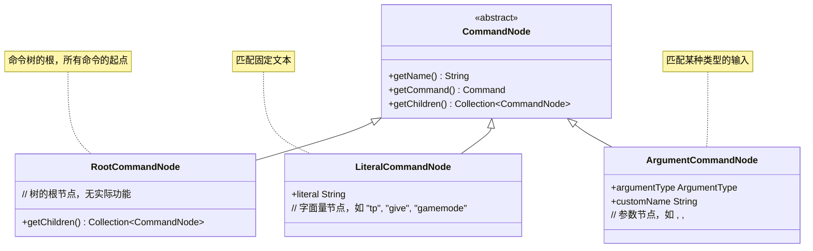
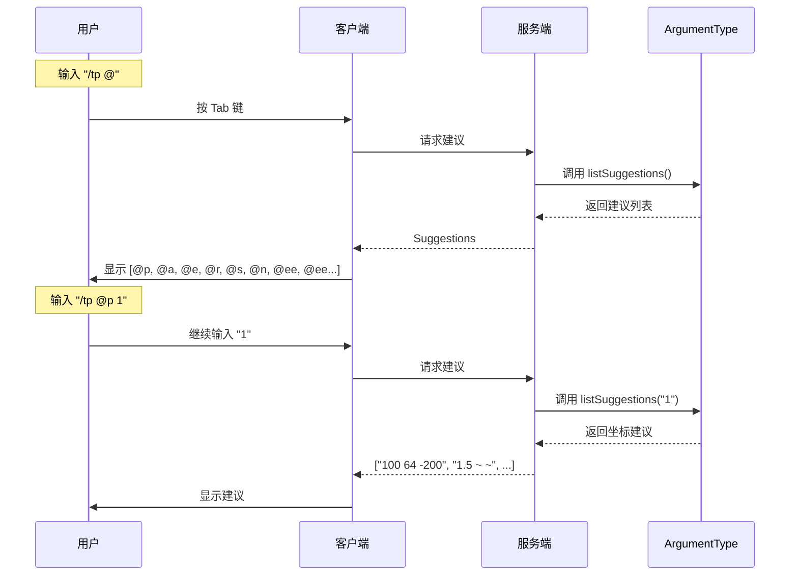

# 第 43 章：Brigadier基础（Brigadier Basics）

## 章节目标

- 深入理解 Brigadier 的核心概念
- 掌握命令节点的类型和层次
- 学会阅读命令注册代码
- 理解参数解析的原理

## 前置知识

- 完成《命令入门》章节
- 了解 Java 泛型基础
- 理解命令的基本结构

## 目录

- [Brigadier 核心概念](#brigadier-核心概念)
- [命令节点类型](#命令节点类型)
- [命令树结构](#命令树结构)
- [参数类型详解](#参数类型详解)
- [建议系统](#建议系统)
- [源码解析：命令注册](#源码解析命令注册)
- [源码解析：参数解析](#源码解析参数解析)
- [实战：分析 /tp 命令](#实战分析-tp-命令)
- [课后自查](#课后自查)

---

## Brigadier 核心概念

Brigadier 是 Minecraft 命令系统的核心，它将人类可读的命令文本转换为可执行的游戏逻辑。

### 核心类比

> **Brigadier = 编译器前端**
> 
> 就像编译器把高级语言翻译成机器码，Brigadier 把命令文本翻译成函数调用。

```
┌─────────────────────────────────────────────────────────────┐
│                   Brigadier 工作流程                         │
├─────────────────────────────────────────────────────────────┤
│                                                             │
│  输入文本                                                    │
│  ┌─────────────────────────────────────────────────────┐   │
│  │ /tp @p 100 64 -200                                  │   │
│  └─────────────────────────────────────────────────────┘   │
│                         ↓                                    │
│  词法分析 (Tokenize)                                        │
│  ┌─────────────────────────────────────────────────────┐   │
│  │ LITERAL("tp")                                       │   │
│  │ ENTITY_SELECTOR("@p")                               │   │
│  │ INTEGER(100)                                        │   │
│  │ INTEGER(64)                                          │   │
│  │ INTEGER(-200)                                        │   │
│  └─────────────────────────────────────────────────────┘   │
│                         ↓                                    │
│  语法分析 (Parse)                                           │
│  ┌─────────────────────────────────────────────────────┐   │
│  │ CommandNode tree:                                   │   │
│  │ ROOT → "tp" → <targets> → <x> → <y> → <z>         │   │
│  └─────────────────────────────────────────────────────┘   │
│                         ↓                                    │
│  执行 (Execute)                                             │
│  ┌─────────────────────────────────────────────────────┐   │
│  │ dispatcher.execute(context)                         │   │
│  │ → 找到节点 → 验证参数 → 调用回调 → 返回结果          │   │
│  └─────────────────────────────────────────────────────┘   │
│                                                             │
└─────────────────────────────────────────────────────────────┘
```

### 核心接口

```java
// Brigadier 的核心接口定义
public interface ArgumentType<T> {
    
    // 解析参数值
    T parse(StringReader reader) throws CommandSyntaxException;
    
    // 获取自动补全建议
    <S> CompletableFuture<Suggestions> listSuggestions(
        CommandContext<S> context,
        SuggestionsBuilder builder
    );
    
    // 示例值（用于提示）
    Collection<String> getExamples();
}

// 命令节点
public class CommandNode<S> {
    private final CommandNode<S> child;        // 子节点
    private final Map<String, CommandNode<S>> children;  // 字面量子节点
    private final ArgumentType<?> argument;    // 参数类型
    private final Command<S> command;          // 执行的命令
    private final String name;                  // 节点名称
}
```

---

## 命令节点类型

Brigadier 使用树形结构组织命令，不同类型的节点承担不同角色：



### 节点类型详解

#### 1. RootCommandNode

```
┌─────────────────────────────────────────────────────────────┐
│                    ROOT 节点                                 │
├─────────────────────────────────────────────────────────────┤
│                                                             │
│  ROOT                                                      │
│  ├── /tp                                                   │
│  ├── /give                                                 │
│  ├── /gamemode                                            │
│  └── /setblock                                            │
│                                                             │
│  • 命令树的入口点                                           │
│  • 不匹配任何文本                                           │
│  • 只有字面量子节点                                         │
│                                                             │
└─────────────────────────────────────────────────────────────┘
```

#### 2. LiteralCommandNode

```java
// 字面量节点 - 匹配固定文本
LiteralArgumentBuilder.<ServerCommandSource>literal("tp")
    .then(...)
    .executes(context -> {
        // 当 "tp" 被匹配时执行这里
        return 1;
    });
```

```
┌─────────────────────────────────────────────────────────────┐
│                    字面量节点示例                            │
├─────────────────────────────────────────────────────────────┤
│                                                             │
│  "tp" ── "Steve" ── "100" ── "64" ── "-200"               │
│  │                                                        │
│  │  字面量节点                                              │
│  │                                                        │
│  └─ "Alex" ── "0" ── "128" ── "0"                        │
│       字面量节点                                            │
│                                                             │
│  /tp Steve 100 64 -200   ✓                                │
│  /tp Alex 0 128 0        ✓                                │
│  /teleport Steve 100 64 -200  ✗ (不是 "tp")               │
│                                                             │
└─────────────────────────────────────────────────────────────┘
```

#### 3. ArgumentCommandNode

```java
// 参数节点 - 匹配特定类型的值
Argument.<ServerCommandSource>argument("player", EntityArgumentType.player())
    .then(
        Argument.<ServerCommandSource>argument("x", NumberArgumentType.integer())
    )
```

```
┌─────────────────────────────────────────────────────────────┐
│                    参数节点示例                              │
├─────────────────────────────────────────────────────────────┤
│                                                             │
│  give                                                      │
│  └── <player: Entity>                                      │
│      └── <item: ItemStack>                                 │
│          └── [count: int]                                  │
│                                                             │
│  /give @p diamond                  ✓                      │
│  /give Steve diamond_sword         ✓                      │
│  /give @a iron_block 64             ✓                      │
│                                                             │
│  <player> 会验证输入是否为有效玩家/选择器                    │
│  <item> 会验证输入是否为有效物品                            │
│                                                             │
└─────────────────────────────────────────────────────────────┘
```

---

## 命令树结构

### /tp 命令的完整结构

```mermaid
flowchart TD
    subgraph ROOT["ROOT"]
        R[ROOT]
    end
    
    subgraph literal["字面量: tp"]
        TP[Literal: "tp"]
    end
    
    subgraph target["参数: targets"]
        T1[Argument: targets<br/>EntityArgumentType]
    end
    
    subgraph dest_or_pos["分支节点"]
        subgraph destination["参数: destination"]
            D1[Argument: destination<br/>EntityAnchorArgumentType]
        end
        
        subgraph position["参数: x, y, z"]
            X[Argument: x<br/>NumberArgumentType]
            Y[Argument: y<br/>NumberArgumentType]
            Z[Argument: z<br/>NumberArgumentType]
        end
    end
    
    subgraph rotation["可选参数"]
        YAW[Argument: yaw<br/>AngleArgumentType]
        PITCH[Argument: pitch<br/>AngleArgumentType]
    end
    
    subgraph check["可选参数"]
        CHK[Argument: check<br/>BoolArgumentType]
    end
    
    R --> TP
    TP --> T1
    T1 --> D1
    T1 --> X
    X --> Y
    Y --> Z
    Z --> YAW
    YAW --> PITCH
    PITCH --> CHK
    
    style ROOT fill:#f8d7da
    style literal fill:#d4edda
    style target fill:#cce5ff
    style dest_or_pos fill:#fff3cd
    style rotation fill:#e2e3e5
    style check fill:#e2e3e5
```

### 命令注册代码

```java
// /tp 命令的简化注册代码
public class TeleportCommand {
    
    public static void register(CommandDispatcher<ServerCommandSource> dispatcher) {
        
        // 主命令: /tp <targets>
        dispatcher.register(
            LiteralArgumentBuilder.literal("tp")
                // 添加 targets 参数（玩家/实体选择器）
                .then(
                    Argument.<ServerCommandSource>argument(
                        "targets", 
                        EntityArgumentType.entities()  // 多个目标
                    )
                    // 两种用法分支
                    .then(
                        // 用法1: /tp <targets> <destination>
                        Argument.<ServerCommandSource>argument(
                            "destination", 
                            EntityAnchorArgumentType.entityAnchor()
                        )
                        .executes(context -> executeTeleportAnchor(context))
                    )
                    .then(
                        // 用法2: /tp <targets> <x> <y> <z>
                        Argument.<ServerCommandSource>argument("x", NumberArgumentType.floatArg())
                        .then(
                            Argument.<ServerCommandSource>argument("y", NumberArgumentType.floatArg())
                            .then(
                                Argument.<ServerCommandSource>argument("z", NumberArgumentType.floatArg())
                                .executes(context -> executeTeleportPos(context))
                            )
                        )
                    )
                )
        );
    }
}
```

---

## 参数类型详解

### 核心参数类型

```java
// D:\Minecraft-Learning\assets\mc\1.21\net\minecraft\command\argument\
// Minecraft 内置的所有参数类型

public class ArgumentTypes {
    
    // 基础类型
    BoolArgumentType         // true / false
    FloatArgumentType        // 浮点数
    DoubleArgumentType       // 双精度浮点数
    IntegerArgumentType      // 整数
    LongArgumentType         // 长整数
    
    // 字符串
    StringArgumentType       // 字符串
    
    // 实体
    EntityArgumentType       // 实体选择器 (@p, @a, @e, @r, @s, @n)
    
    // 位置
    Vec3ArgumentType         // 3D 坐标
    Vec2ArgumentType         // 2D 坐标
    BlockPosArgumentType     // 方块坐标 (整数)
    
    // 游戏对象
    BlockStateArgumentType   // 方块状态
    ItemStackArgumentType    // 物品堆
    GameModeArgumentType     // 游戏模式
    DimensionArgumentType    // 维度
    
    // 高级类型
    NbtCompoundArgumentType  // NBT 数据
    ParticleArgumentType     // 粒子效果
    ScoreHolderArgumentType  // 记分板持有者
    MessageArgumentType      // 聊天消息
}
```

### EntityArgumentType 详解

```java
// D:\Minecraft-Learning\assets\mc\1.21\net\minecraft\command\argument\EntityArgumentType.java
public class EntityArgumentType implements ArgumentType<EntitySelector> {
    
    final boolean singleTarget;   // 是否只选择一个实体
    final boolean playersOnly;     // 是否只选择玩家
    
    // 工厂方法
    public static EntityArgumentType entity() {
        // 单个实体
        return new EntityArgumentType(true, false);
    }
    
    public static EntityArgumentType entities() {
        // 多个实体
        return new EntityArgumentType(false, false);
    }
    
    public static EntityArgumentType player() {
        // 单个玩家
        return new EntityArgumentType(true, true);
    }
    
    public static EntityArgumentType players() {
        // 多个玩家
        return new EntityArgumentType(false, true);
    }
    
    // 解析选择器
    @Override
    public EntitySelector parse(StringReader reader) throws CommandSyntaxException {
        // 调用 EntitySelectorReader 解析
        return new EntitySelectorReader(reader, this.singleTarget, this.playersOnly)
            .read();
    }
}
```

### Vec3ArgumentType 坐标解析

```java
// D:\Minecraft-Learning\assets\mc\1.21\net\minecraft\command\argument\Vec3ArgumentType.java
public class Vec3ArgumentType implements ArgumentType<PosArgument> {
    
    private final boolean centerIntegers;
    
    public static Vec3ArgumentType vec3() {
        return new Vec3ArgumentType(true);
    }
    
    @Override
    public PosArgument parse(StringReader reader) throws CommandSyntaxException {
        // 检测坐标类型
        if (reader.canRead() && reader.peek() == '^') {
            // 局部坐标 ^ ^ ^
            return LookingPosArgument.parse(reader);
        } else {
            // 绝对/相对坐标
            return DefaultPosArgument.parse(reader, this.centerIntegers);
        }
    }
}

// 坐标解析结果
public interface PosArgument {
    Vec3d toAbsolutePos(ServerCommandSource source);
    boolean isXRelative();
    boolean isYRelative();
    boolean isZRelative();
}
```

---

## 建议系统

Brigadier 提供强大的自动补全建议系统：



### 建议提供者

```java
// D:\Minecraft-Learning\assets\mc\1.21\net\minecraft\command\suggestion\SuggestionProviders.java
public class SuggestionProviders {
    
    // 向服务器请求建议
    public static final SuggestionProvider<CommandSource> ASK_SERVER = 
        register("ask_server", (context, builder) -> 
            ((CommandSource)context.getSource()).getCompletions(context)
        );
    
    // 建议所有配方 ID
    public static final SuggestionProvider<ServerCommandSource> ALL_RECIPES = 
        register("all_recipes", (context, builder) -> 
            CommandSource.suggestIdentifiers(
                ((ServerCommandSource)context.getSource()).getRecipeIds(), 
                builder
            )
        );
    
    // 建议可召唤实体
    public static final SuggestionProvider<ServerCommandSource> SUMMONABLE_ENTITIES = 
        register("summonable_entities", (context, builder) -> 
            CommandSource.suggestFromIdentifier(
                Registries.ENTITY_TYPE.stream()
                    .filter(EntityType::isSummonable),
                builder,
                EntityType::getId
            )
        );
}
```

---

## 源码解析：命令注册

### Minecraft 命令注册入口

```java
// D:\Minecraft-Learning\assets\mc\1.21\net\minecraft\server\MinecraftServer.java
// 命令注册在服务端启动时进行

public class MinecraftServer {
    
    private static int registerCommands() {
        // 创建命令调度器
        CommandDispatcher<ServerCommandSource> dispatcher = 
            new CommandDispatcher<>(new CommandSource());
        
        // 注册所有原版命令
        dispatcher.register(LiteralArgumentBuilder.literal("tp")
            .then(...));
        
        dispatcher.register(LiteralArgumentBuilder.literal("give")
            .then(...));
        
        dispatcher.register(LiteralArgumentBuilder.literal("gamemode")
            .then(...));
        
        // ...
        
        return dispatcher.getCommandCount();
    }
}
```

### 命令构建器模式

```java
// Brigadier 使用建造者模式注册命令
LiteralArgumentBuilder.<ServerCommandSource>literal("give")
    // 设置命令描述（用于帮助信息）
    .requires(source -> source.hasPermissionLevel(2))
    // 添加子节点
    .then(
        Argument.<ServerCommandSource>argument("targets", EntityArgumentType.players())
            .then(
                Argument.<ServerCommandSource>argument(
                    "item", 
                    ItemStackArgumentType.itemStack(CommandRegistryAccess.create())
                )
                .executes(context -> executeGive(context))
            )
    )
    // 设置默认执行（无参数时）
    .executes(context -> executeGiveUsage(context));
```

---

## 源码解析：参数解析

### StringReader 字符流

```java
// D:\Minecraft-Learning\assets\mc\1.21\net\minecraft\command\StringReader.java
// 命令解析的核心工具
public class StringReader implements Cursor {
    
    private final String string;    // 原始字符串
    private int cursor;            // 当前光标位置
    
    // 读取单个字符
    public char read() {
        return this.string.charAt(this.cursor++);
    }
    
    // 查看当前字符但不移动
    public char peek() {
        return this.string.charAt(this.cursor);
    }
    
    // 跳过空白字符
    public void skipWhitespace() {
        while (this.canRead() && Character.isWhitespace(this.peek())) {
            this.read();
        }
    }
    
    // 读取到字符串末尾
    public String getRemaining() {
        return this.string.substring(this.cursor);
    }
    
    // 读取未引用的字符串
    public String readUnquotedString() {
        StringBuilder builder = new StringBuilder();
        while (this.canRead() && isValidQuoteTargetCharacter(this.peek())) {
            builder.append(this.read());
        }
        return builder.toString();
    }
}
```

### 解析流程示例

```java
// 解析 EntitySelector 的简化流程
public class EntitySelectorReader {
    
    public EntitySelector read() throws CommandSyntaxException {
        // 检查是否以 @ 开头
        if (this.reader.peek() == '@') {
            // 解析选择器
            this.readAtVariable();
            
            // 解析可选参数 [...]
            if (this.reader.canRead() && this.reader.peek() == '[') {
                this.readArguments();
            }
        } else {
            // 解析玩家名或 UUID
            this.readByName();
        }
        
        return this.createSelector();
    }
    
    private void readAtVariable() throws CommandSyntaxException {
        this.reader.read();  // 消费 @
        
        char type = this.reader.read();
        switch (type) {
            case 'p' -> {
                // 最近玩家
                this.limit = 1;
                this.includesNonPlayers = false;
                this.sorter = NEAREST;
            }
            case 'a' -> {
                // 所有玩家
                this.limit = Integer.MAX_VALUE;
                this.includesNonPlayers = false;
            }
            case 'e' -> {
                // 所有实体
                this.limit = Integer.MAX_VALUE;
                this.includesNonPlayers = true;
            }
            // ...
        }
    }
}
```

---

## 实战：分析 /tp 命令

### 查看 /tp 命令源码

```
源码路径: D:\Minecraft-Learning\assets\mc\1.21\net\minecraft\server\command\TeleportCommand.java
```

### 命令结构分析

```
/tp 命令的完整语法树:

tp <targets>
├── tp <targets> <victim>
├── tp <targets> <destination>
├── tp <targets> <x> <y> <z> [yRot] [xRot]
└── tp <targets> <x> <y> <z> <yRot> <xRot>
```

### 关键代码片段

```java
// /tp 命令的注册
public static void register(CommandDispatcher<ServerCommandSource> dispatcher) {
    
    // 主命令分支
    dispatcher.register(
        LiteralArgumentBuilder.<ServerCommandSource>literal("tp")
            .then(
                // /tp <targets>
                Argument.<ServerCommandSource>argument(
                    "targets", 
                    EntityArgumentType.entities()
                )
                // 位置参数
                .then(
                    Argument.<ServerCommandSource>argument(
                        "location", 
                        Vec3ArgumentType.vec3()
                    )
                    .executes(context -> executeTP(context))
                )
                // 实体目标
                .then(
                    Argument.<ServerCommandSource>argument(
                        "destination", 
                        EntityAnchorArgumentType.entityAnchor()
                    )
                    .executes(context -> executeTP(context))
                )
            )
            // /tp 别名
            .then(
                LiteralArgumentBuilder.literal("teleport")
                    .redirect(dispatcher.getRoot())
            )
    );
}
```

---

## 关键术语表

| 术语 | 英文 | 解释 |
|------|------|------|
| 命令节点 | CommandNode | 命令树的基本单元 |
| 字面量 | Literal | 固定文本的节点 |
| 参数 | Argument | 匹配动态值的节点 |
| 解析器 | Parser | 将文本转换为值的代码 |
| 建议 | Suggestion | 自动补全的候选项 |
| 上下文 | Context | 命令执行时的环境信息 |

---

## 课后自查

- [ ] 解释 RootCommandNode、LiteralCommandNode、ArgumentCommandNode 的区别
- [ ] Brigadier 如何处理坐标参数中的 `~` 和 `^`？
- [ ] 命令建议系统是如何工作的？
- [ ] 找出 `/give` 命令的参数树结构
- [ ] 理解 `CommandContext` 在命令执行中的作用

---

## 下章预告

下一章我们将学习 **自定义命令实战**，动手创建一个完整的自定义命令。

---

## 参考资料

- [Brigadier GitHub](https://github.com/Mojang/brigadier)
- `D:\Minecraft-Learning\assets\mc\1.21\net\minecraft\command\argument\EntityArgumentType.java`
- `D:\Minecraft-Learning\assets\mc\1.21\net\minecraft\command\argument\Vec3ArgumentType.java`
- `D:\Minecraft-Learning\assets\mc\1.21\net\minecraft\command\CommandDispatcher.java`
