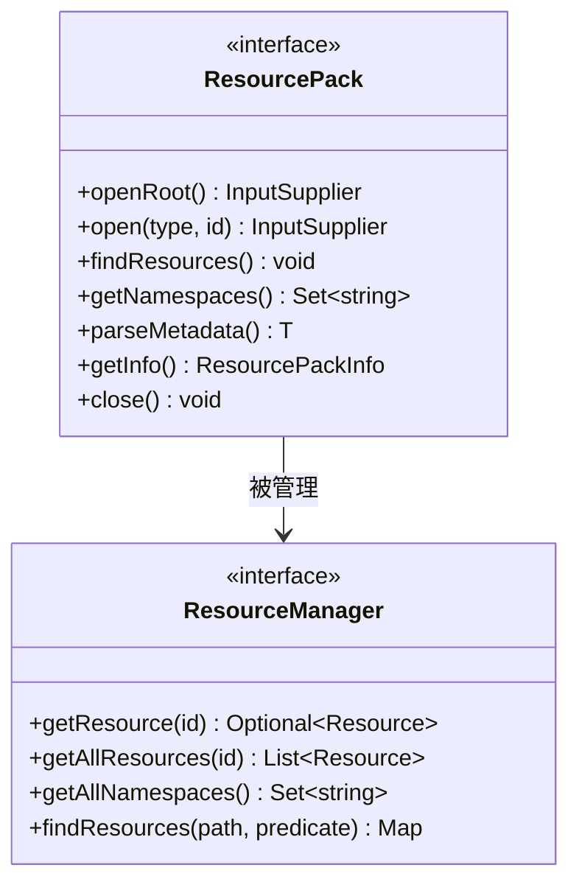
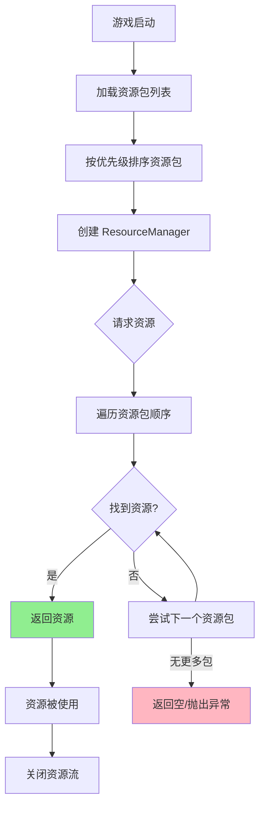
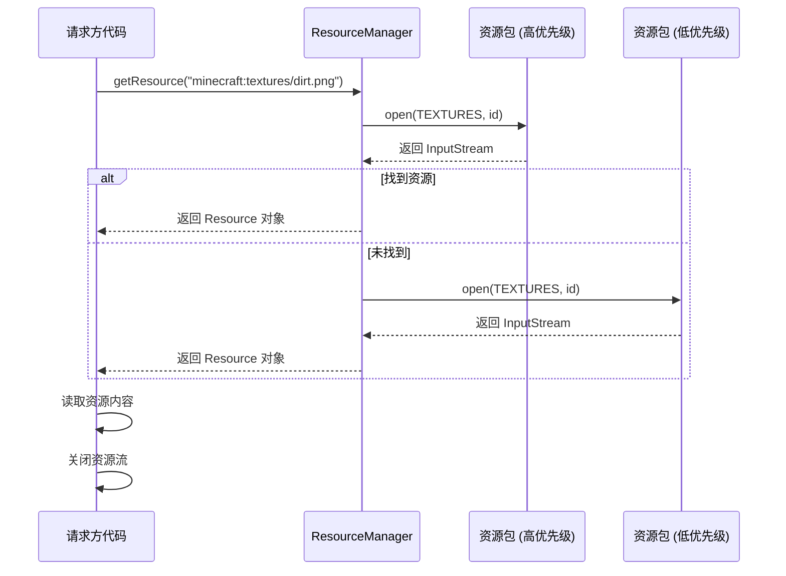

# 40 - 资源包：游戏的外观与音效

## 目标

学完本章节后，你将理解：
- 什么是资源包（Resource Pack）
- 资源定位符（Identifier）是什么
- Pack 接口的核心方法
- 资源加载的完整流程

## 前置知识

- 已完成 [第32章 事件系统](../Part-5-Event/32-event-system.md)（建议）
- 了解 Java 接口和实现类的概念
- 知道 Minecraft 中的"命名空间：路径"格式

## 核心概念（用生活比喻）

### 什么是资源包？

想象你在玩 Minecraft 时，游戏里的一切"外在表现"都来自**资源包**。

| 资源类型 | 例子 | 生活比喻 |
|---------|------|----------|
| **材质贴图** | 草方块的绿色纹理 | 积木的表面图案 |
| **音效** | 打开箱子的"咔嗒"声 | 门把手转动的声音 |
| **模型** | 物品的 3D 显示 | 商品的展示架 |
| **语言文件** | "diamond" = "钻石" | 商品标签翻译 |
| **字体** | 特殊文字样式 | 不同的字体风格 |

**资源包 = 游戏的"皮肤包"**，它让你可以换一套衣服，但不改游戏的核心逻辑。

### 资源定位符（Identifier）

在 Minecraft 中，**Identifier** 是用来定位任何资源的"地址"。

```
格式：命名空间:路径
例子：minecraft:stone
     ↑命名空间  ↑路径
```

**生活比喻**：想象 Identifier 就像快递单号
- `minecraft:stone` = "中国北京仓库 - 第 A-123 号石头"
- `fabric:iron_ingot` = "顺丰仓库 - 第 B-456 号铁锭"

**代码示例**：

```java
// 创建资源定位符
Identifier stoneId = Identifier.ofVanilla("stone");           // minecraft:stone
Identifier myId = Identifier.of("mymod", "magic_sword");     // mymod:magic_sword

// 使用资源定位符
String fullPath = stoneId.toString();  // "minecraft:stone"
String namespace = stoneId.getNamespace();  // "minecraft"
String path = stoneId.getPath();           // "stone"
```

### Pack 接口：资源的"箱子"

`ResourcePack` 接口就像是游戏的**资源仓库管理员**。



**核心方法解读**：

| 方法 | 作用 | 比喻 |
|------|------|------|
| `openRoot()` | 打开资源包根目录 | 打开仓库大门 |
| `open(type, id)` | 读取特定资源文件 | 拿取特定货架上的物品 |
| `findResources()` | 扫描符合条件的所有资源 | 盘点仓库中的某类商品 |
| `getNamespaces()` | 获取此包支持的命名空间 | 列出仓库覆盖的品牌 |

## 图解（Mermaid）

### 资源加载流程图



### 资源定位符解析流程



## 核心代码解析

### ResourceManager 接口

`ResourceManager` 是资源的"总调度中心"：

```java
20:21:net/minecraft/resource/ResourceManager.java
public interface ResourceManager extends ResourceFactory {
    
    // 获取所有命名空间
    public Set<String> getAllNamespaces();
    
    // 获取单个资源（高优先级包优先）
    public List<Resource> getAllResources(Identifier id);
    
    // 查找符合路径条件的资源
    public Map<Identifier, Resource> findResources(
        String startingPath,           // 起始路径，如 "textures"
        Predicate<Identifier> filter   // 过滤条件
    );
    
    // 流式遍历所有资源包
    public Stream<ResourcePack> streamResourcePacks();
}
```

### Pack 接口核心方法

```java
27:36:net/minecraft/resource/ResourcePack.java
public interface ResourcePack extends AutoCloseable {
    
    // 打开根目录
    @Nullable
    public InputSupplier<InputStream> openRoot(String ... path);
    
    // 打开指定类型的资源
    @Nullable
    public InputSupplier<InputStream> open(ResourceType type, Identifier id);
    
    // 查找资源
    public void findResources(
        ResourceType type,     // 资源类型 (CLIENT_RESOURCES / DATA)
        String namespace,      // 命名空间
        String path,           // 路径前缀
        ResultConsumer consumer // 回调
    );
    
    // 获取支持的命名空间
    public Set<String> getNamespaces(ResourceType type);
    
    // 获取包信息
    public ResourcePackInfo getInfo();
}
```

### 资源类型

Minecraft 有两种主要的资源类型：

```java
// 位于 ResourceType 枚举
public enum ResourceType {
    CLIENT_RESOURCES,  // 客户端资源：材质、音效、模型等
    SERVER_DATA       // 服务端数据：战利品表、配方、进度等
}
```

**为什么分开？**
- 客户端需要材质和音效（否则看不见、听不见）
- 服务端需要游戏数据（否则无法计算掉落物）

## 实战演示

### 加载材质文件

假设你的材质放在 `assets/mymod/textures/item/magic_sword.png`：

```java
public class MyModClient implements ClientLifecycleEntryPoint {
    
    @Override
    public void onInitializeClient() {
        // 创建材质 ID
        Identifier textureId = Identifier.of("mymod", "item/magic_sword");
        
        // 在 ResourceManager 中查找
        MinecraftClient client = MinecraftClient.getInstance();
        ResourceManager manager = client.getResourceManager();
        
        // 获取资源
        Resource resource = manager.getResource(textureId)
            .orElseThrow(() -> new RuntimeException("找不到材质!"));
        
        // 读取材质
        try (InputStream is = resource.getInputStream()) {
            // 处理材质数据...
        }
    }
}
```

### 遍历纹理资源

```java
// 找出所有方块纹理
Map<Identifier, Resource> blockTextures = manager.findResources(
    "textures/block",                    // 从 textures/block 开始
    id -> id.getPath().endsWith(".png")  // 只找 .png 文件
);

blockTextures.forEach((id, resource) -> {
    System.out.println("找到纹理: " + id);
});
```

## 小结

| 概念 | 说明 | 代码对应 |
|------|------|----------|
| **Identifier** | 资源的唯一地址 | `Identifier.of("minecraft", "stone")` |
| **ResourcePack** | 单个资源包 | `implements ResourcePack` |
| **ResourceManager** | 资源总调度 | `getResource()`, `findResources()` |
| **ResourceType** | 资源分类 | CLIENT_RESOURCES / SERVER_DATA |

**核心理解**：
1. 资源包是资源的"容器"，按优先级排列
2. ResourceManager 协调所有资源包，提供统一的访问接口
3. Identifier 是资源的"门牌号"，保证唯一性

## 练习

1. ** Identifier 创建练习**
   ```java
   // 以下哪些是正确的 Identifier？
   Identifier.of("minecraft:diamond")      // ?
   Identifier.of("my_mod", "iron_sword")   // ?
   Identifier.of("MyMod:GoldApple")        // ?
   ```

2. **资源加载思考**
   - 如果两个资源包有同名的资源，会使用哪个？
   - 如果一个 mod 的资源包被禁用，游戏中会显示什么？

3. **扩展挑战**
   创建你自己的资源包结构，添加一个自定义音效，并在代码中加载它。

## 相关链接

- [Minecraft Wiki - Resource Pack](https://minecraft.fandom.com/wiki/Resource_Pack)
- [Fabric Wiki - Resources](https://fabricmc.net/wiki/documentation:fabric_resources)
- 相关源码：
  - `net.minecraft.resource.ResourceManager`
  - `net.minecraft.resource.ResourcePack`
  - `net.minecraft.util.Identifier`

### 源码文件位置

| 文件 | 源码路径 | 说明 |
|------|----------|------|
| ResourcePack.java | `net/minecraft/resource/ResourcePack.java` | 资源包接口 |
| ResourceManager.java | `net/minecraft/resource/ResourceManager.java` | 资源管理器接口 |
| Pack.java | `net/minecraft/resource/Pack.java` | 资源包元信息接口 |

---

## 下一步

学完资源包基础后，下一章节我们将学习**数据包（Datapack）**，它是定义游戏数据（配方、战利品、进度等）的核心系统。

> [第41章 - 数据包：游戏数据定义](./41-datapack-intro.md)

---

> **注意**：本文中的部分源码示例基于 CFR 反编译结果，实际源码可能略有差异。

---

**关键词**：资源包、ResourcePack、ResourceManager、Identifier、资源定位符
