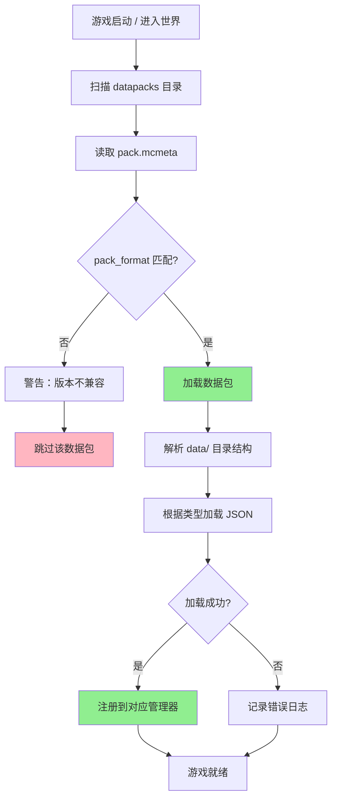
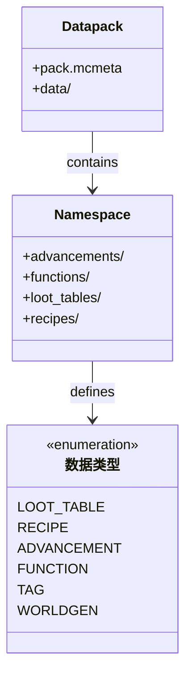
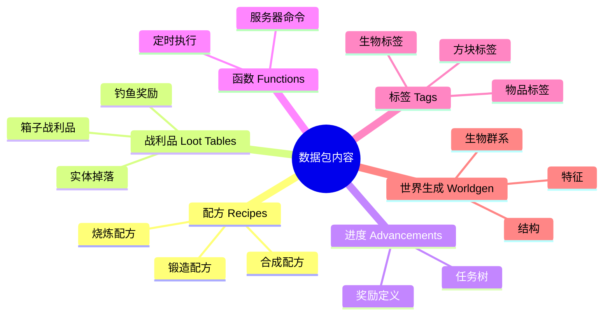

# 41 - 数据包：游戏数据定义

## 目标

学完本章节后，你将理解：
- 什么是数据包（Datapack）
- 数据包的目录结构
- namespace 和 path 的作用
- 数据包能定义哪些内容

## 前置知识

- 已完成 [第39章 命令进阶](../Part-7-Command/40-command-advanced.md)（建议）
- 了解 JSON 文件基本格式
- 知道 Identifier 的命名空间概念

## 核心概念（用生活比喻）

### 什么是数据包？

想象 Minecraft 世界是一家中餐厅。

| Minecraft 组件 | 餐厅比喻 |
|---------------|---------|
| **资源包** | 餐厅的装修和餐具（外观） |
| **数据包** | 餐厅的菜谱和配方（内容） |

数据包告诉游戏：
- "这道菜怎么做？" → 配方（Recipe）
- "打完 Boss 给什么奖励？" → 战利品表（Loot Table）
- "完成什么任务获得什么徽章？" → 进度（Advancement）
- "村民怎么交易？" → 交易表（Trade Table）

### 数据包 vs 资源包

| 特性 | 数据包 (Datapack) | 资源包 (Resource Pack) |
|------|-------------------|----------------------|
| **存放位置** | `world/datapacks/` 或 jar 内 | `.minecraft/resourcepacks/` |
| **主要内容** | JSON 游戏数据 | 材质、音效、模型 |
| **作用对象** | 服务端（游戏逻辑） | 客户端（视觉效果） |
| **修改范围** | 配方、战利品、进度等 | 贴图、音效、字体等 |
| **加载时机** | 进入世界时加载 | 可随时切换 |

**简单理解**：
- 资源包 = 换皮肤（看得见的改变）
- 数据包 = 换规则（玩法的改变）

## 数据包结构

### 完整目录结构

```
my_datapack.zip/
├── pack.mcmeta          # 数据包描述文件
└── data/
    ├── namespace1/      # 命名空间1（你的 mod id）
    │   ├── advancements/
    │   │   └── my_advancement.json
    │   ├── functions/
    │   │   ├── tick.mcfunction
    │   │   └── hello.mcfunction
    │   ├── loot_tables/
    │   │   └── blocks/
    │   │       └── my_custom_block.json
    │   ├── recipes/
    │   │   └── my_recipe.json
    │   ├── structure/
    │   │   └── my_structure.nbt
    │   ├── trim_pattern/
    │   │   └── my_pattern.json
    │   └── worldgen/
    │       ├── biome/
    │       ├── configured_carver/
    │       └── ...
    │
    └── namespace2/      # 可以有多个命名空间
        └── ...
```

### pack.mcmeta 文件

每个数据包必须有 `pack.mcmeta`：

```json
{
    "pack": {
        "pack_format": 34,
        "description": "我的第一个数据包"
    }
}
```

**pack_format 对照表**：

| Minecraft 版本 | pack_format |
|---------------|-------------|
| 1.20.4 - 1.21 | 34 |
| 1.20 - 1.20.3 | 26 |
| 1.19 - 1.19.4 | 24 |
| 1.18 - 1.18.2 | 15 |

### namespace 和 path 的作用

```
data/minecraft/loot_tables/blocks/dirt.json
    ↑命名空间  ↑文件名（path）
```

**命名空间规则**：
- `minecraft` - 保留给原版使用
- 自定义 mod 应使用自己的 mod id

**路径规则**：
- 使用小写字母、数字、下划线
- 可以用 `/` 分隔层级
- 路径会转换成 Identifier

## 图解（Mermaid）

### 数据包加载流程



### 数据包内容关系图



### 常见数据类型文件位置



## 数据包能定义的内容

### 1. 配方（Recipes）

定义如何合成物品：

```json
{
    "type": "minecraft:crafting_shaped",
    "pattern": [
        "###",
        " # ",
        " # "
    ],
    "key": {
        "#": {
            "item": "minecraft:stick"
        }
    },
    "result": {
        "item": "minecraft:wooden_sword",
        "count": 1
    }
}
```

### 2. 战利品表（Loot Tables）

定义击杀生物或打开箱子获得什么：

```json
{
    "pools": [
        {
            "rolls": 1,
            "entries": [
                {
                    "type": "minecraft:item",
                    "name": "minecraft:diamond",
                    "weight": 1
                }
            ]
        }
    ]
}
```

### 3. 进度（Advancements）

定义任务和奖励：

```json
{
    "display": {
        "icon": "minecraft:diamond",
        "title": "挖到钻石！",
        "description": "获得你的第一颗钻石"
    },
    "criteria": {
        "got_diamond": {
            "trigger": "minecraft:inventory_changed",
            "conditions": {
                "items": [{"items": ["minecraft:diamond"]}]
            }
        }
    }
}
```

### 4. 函数（Functions）

执行一系列命令：

```mcfunction
# hello.mcfunction
say 你好，世界！
give @s minecraft:diamond 1
```

### 5. 标签（Tags）

将多个物品/方块归为一组：

```json
{
    "values": [
        "minecraft:oak_log",
        "minecraft:spruce_log",
        "minecraft:birch_log"
    ]
}
```

## 实战演示

### 创建一个简单的数据包

**步骤 1：创建目录结构**

```
d:/
└── MyFirstDatapack/
    └── data/
        └── mymod/                    # 命名空间 = mod id
            ├── advancements/
            │   └── first_creation.json
            ├── loot_tables/
            │   └── blocks/
            │       └── my_block.json
            └── recipes/
                └── my_recipe.json
    └── pack.mcmeta
```

**注意**：目录名是 `advancements`（复数），不是 `advancement`。

**步骤 2：编写 pack.mcmeta**

```json
{
    "pack": {
        "pack_format": 34,
        "description": "我的第一个数据包 - 添加自定义内容"
    }
}
```

**步骤 3：创建配方文件**

`data/mymod/recipe/my_recipe.json`:
```json
{
    "type": "minecraft:crafting_shaped",
    "category": "misc",
    "group": "magic_items",
    "pattern": [
        " D ",
        "BDB",
        " O "
    ],
    "key": {
        "D": {"item": "minecraft:diamond"},
        "B": {"item": "minecraft:blaze_powder"},
        "O": {"item": "minecraft:obsidian"}
    },
    "result": {
        "item": "minecraft:nether_star",
        "count": 1
    }
}
```

**步骤 4：测试数据包**

1. 将文件夹复制到 `.minecraft/saves/你的世界/datapacks/`
2. 进入游戏，输入 `/reload` 重载数据包
3. 使用 `/give @s minecraft:crafting_table` 打开合成界面

## 小结

| 概念 | 说明 |
|------|------|
| **数据包** | 定义游戏逻辑数据的 JSON 文件集合 |
| **namespace** | 区分不同来源数据的命名空间 |
| **path** | 具体数据文件的路径 |
| **pack.mcmeta** | 数据包元信息（版本、描述） |
| **pack_format** | 版本标识，1.21 使用 34 |

**数据包的优势**：
1. 玩家可以在不使用 mod 的情况下自定义游戏
2. 可以覆盖原版数据（作弊/模组兼容）
3. 格式统一，易于分享

## 练习

1. **创建练习**
   创建一个数据包，添加一个"钻石苹果"配方：
   - 材料：8 个钻石围绕 1 个苹果
   - 参考原版附魔金苹果格式

2. **思考题**
   - 如果数据包和 mod 都定义了同一个配方，会优先使用哪个？
   - 数据包能否添加全新的方块/物品？

3. **扩展挑战**
   创建一个自定义进度，当玩家合成钻石苹果时触发，并给予经验奖励。

## 相关链接

- [Minecraft Wiki - Datapack](https://minecraft.fandom.com/wiki/Datapack)
- [Minecraft Wiki - pack.mcmeta](https://minecraft.fandom.com/wiki/Pack.mcmeta)
- [Bedrock Wiki - Behavior Pack](https://wiki.bedrock.dev/concepts/behavior-packs.html)
- 相关源码：
  - `net.minecraft.server.DataPackResources`
  - `net.minecraft.data.server`

### 源码文件位置

| 文件 | 源码路径 | 说明 |
|------|----------|------|
| DataPackContent.java | `net/minecraft/server/DataPackContent.java` | 数据包内容存储 |
| DataPackResources.java | `net/minecraft/server/DataPackResources.java` | 数据包资源管理 |

---

## 下一步

数据包中的核心数据之一是**战利品表（Loot Table）**，下一章节我们将深入学习它如何定义掉落物。

> [第42章 - 战利品表：掉落物定义](./42-loot-table.md)

---

> **注意**：本文中的部分源码示例基于 CFR 反编译结果，实际源码可能略有差异。

---

**关键词**：数据包、Datapack、namespace、path、pack.mcmeta、pack_format
