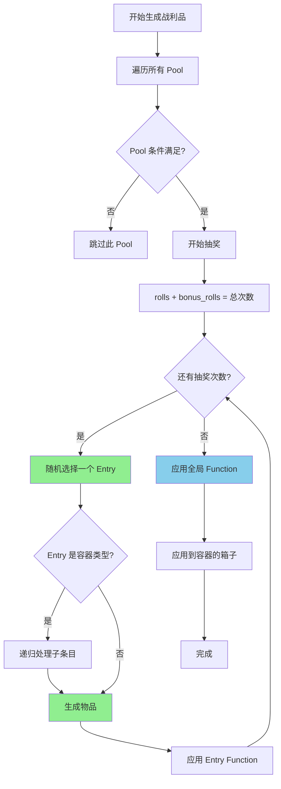
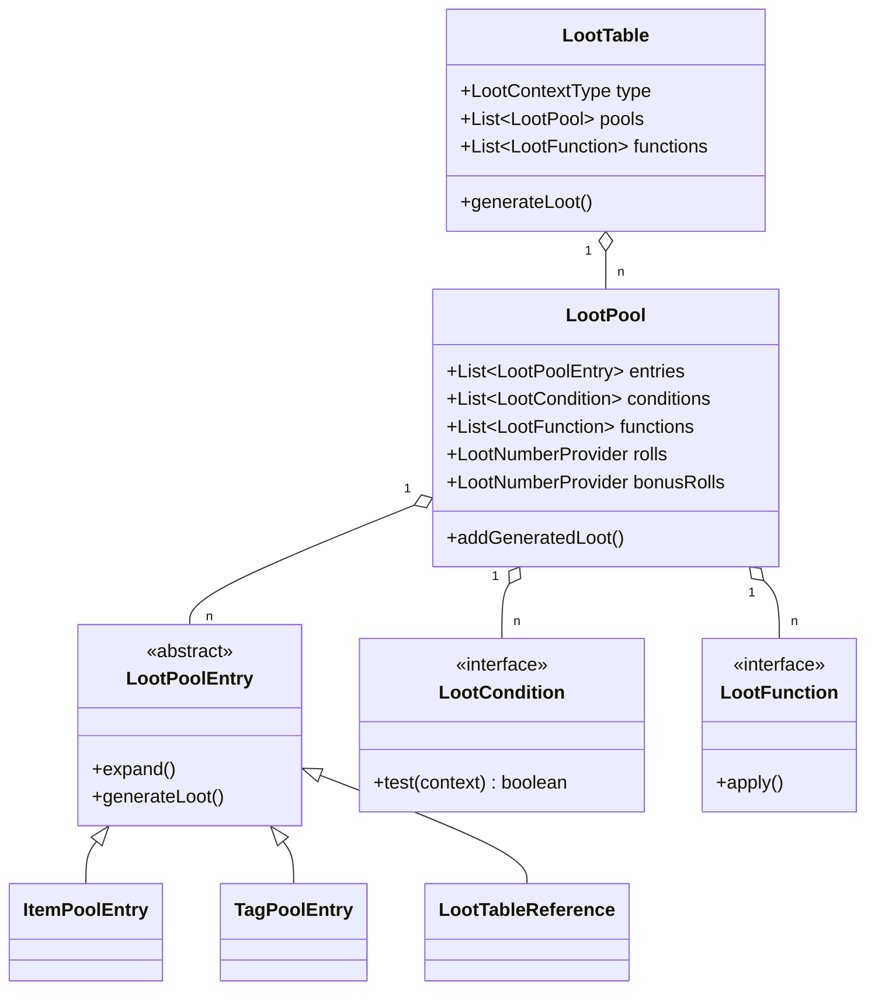
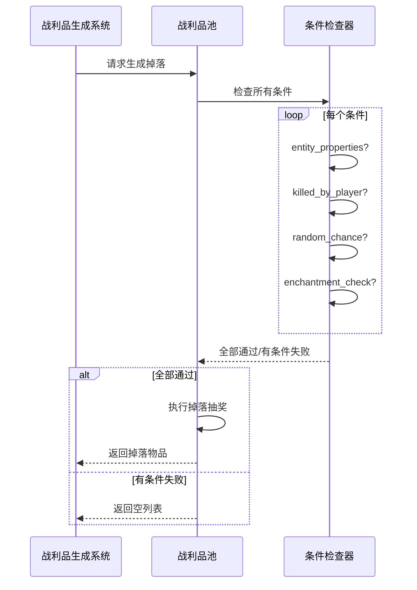

# 42 - 战利品表：掉落物定义

## 目标

学完本章节后，你将理解：
- 什么是战利品表（Loot Table）
- Pool（池）、Entry（条目）、Condition（条件）、Function（函数）的概念
- 如何创建自定义掉落表
- 常见的条件和函数

## 前置知识

- 已完成 [第41章 数据包](./41-datapack-intro.md) 章节
- 了解 JSON 基本格式
- 知道数据包的目录结构

## 核心概念（用生活比喻）

### 什么是战利品表？

想象你击败了一只怪物，怪物会从背包里掉落物品。

**战利品表 = 怪物的"掉落规则表"**

```
┌─────────────────────────────────────────┐
│  怪物掉落系统                              │
│                                         │
│  怪物死亡 → 查看战利品表 → 决定给什么      │
│                                         │
│  表里写着：                               │
│  ┌─────────────────────────────────┐    │
│  │ Pool（池）                        │    │
│  │   ├── rolls: 投掷次数（抽几次）     │    │
│  │   ├── Entry（条目）               │    │
│  │   │   ├── 物品A 权重10           │    │
│  │   │   ├── 物品B 权重5            │    │
│  │   │   └── 物品C 权重1            │    │
│  │   └── Condition（条件）           │    │
│  │       └── 只有满足条件才掉落       │    │
│  └─────────────────────────────────┘    │
│                                         │
│  Function（函数）                         │
│    └── 对结果进行二次处理                 │
│                                         │
└─────────────────────────────────────────┘
```

### 核心概念对应表

| 概念 | Minecraft 术语 | 生活比喻 |
|------|---------------|----------|
| 抽奖次数 | `rolls` | 摸奖的次数 |
| 奖品 | `entries` | 奖品池 |
| 概率权重 | `weight` | 中奖率 |
| 限制条件 | `conditions` | "满18岁才能参加" |
| 附加处理 | `functions` | "送礼物时加个蝴蝶结" |
| 额外抽奖 | `bonus_rolls` | "买一送一" |

## 战利品表结构

### JSON 基本格式

```json
{
    "type": "minecraft:generic",          // 可选：指定上下文类型
    "random_sequence": "minecraft:...",   // 可选：随机数序列
    "pools": [                            // 池列表（至少一个）
        {
            "rolls": 3,                   // 基础抽取次数
            "bonus_rolls": 1,             // 额外抽取次数（幸运属性加成）
            "entries": [...],             // 奖品条目
            "conditions": [...],          // 池生效条件
            "functions": [...]            // 池内物品处理函数
        }
    ],
    "functions": [...]                     // 全局处理函数
}
```

### Pool（池）

每个池是一次独立的抽奖过程：

```json
{
    "pools": [
        {
            "rolls": 1,                    // 抽1次
            "entries": [
                {
                    "type": "item",        // 物品类型
                    "name": "minecraft:diamond",
                    "weight": 1
                }
            ]
        }
    ]
}
```

### Entry（条目）

条目定义了可以掉落的物品或容器：

```json
{
    "type": "minecraft:item",             // 条目类型
    "name": "minecraft:diamond",          // 物品ID
    "weight": 1,                          // 权重（越高越容易抽到）
    "quality": 0,                         // 质量（影响幸运效果）
    "functions": [...],                   // 条目专属函数
    "children": [...]                      // 子条目（用于容器类型）
}
```

**常见条目类型**：

| 类型 | 说明 | 用途 |
|------|------|------|
| `item` | 物品 | 最常用的物品掉落 |
| `tag` | 标签 | 掉落符合标签的所有物品之一 |
| `loot_table` | 引用其他战利品表 | 引用或组合多个掉落表 |
| `group` | 分组 | 组合多个子条目 |
| `empty` | 空 | 什么都不掉落 |

## 图解（Mermaid）

### 战利品生成流程



### 战利品表继承关系



### 条件判断流程



## 常用条件（Conditions）

### 1. entity_properties - 实体属性

```json
{
    "condition": "minecraft:entity_properties",
    "entity": "this",
    "properties": {
        "on_fire": true
    }
}
```
**用途**：只有实体着火时才掉落（如燃烧的骷髅掉落骨头）

### 2. killed_by_player - 被玩家击杀

```json
{
    "condition": "minecraft:killed_by_player"
}
```
**用途**：只有被玩家击杀才掉落

### 3. entity_scores - 实体记分板

```json
{
    "condition": "minecraft:entity_scores",
    "entity": "this",
    "scores": {
        "kills": {"min": 10}
    }
}
```
**用途**：只有击杀数达到一定值才掉落

### 4. random_chance - 随机概率

```json
{
    "condition": "minecraft:random_chance",
    "chance": 0.1
}
```
**用途**：10% 概率掉落

### 5. enchantment_check - 附魔检查

```json
{
    "condition": "minecraft:enchantment_check",
    "enchantment": "minecraft:looting",
    "levels": {"min": 1}
}
```
**用途**：需要有抢夺附魔才掉落额外物品

### 6. reference - 引用其他条件

```json
{
    "condition": "minecraft:reference",
    "name": "minecraft:all_of"
}
```
**用途**：引用预定义的条件组合

## 常用函数（Functions）

### 1. set_count - 设置数量

```json
{
    "function": "minecraft:set_count",
    "count": {"type": "minecraft:uniform", "min": 1, "max": 3}
}
```
**用途**：掉落 1-3 个物品

### 2. enchant_randomly - 随机附魔

```json
{
    "function": "minecraft:enchant_randomly"
}
```
**用途**：给物品随机附魔

### 3. looting_enchant - 抢夺附魔

```json
{
    "function": "minecraft:looting_enchant",
    "count": 1
}
```
**用途**：每级抢夺附魔增加 1 个

### 4. set_nbt - 设置 NBT

```json
{
    "function": "minecraft:set_nbt",
    "tag": "{display:{Name:'{\"text\":\"我的物品\"}'}}"
}
```
**用途**：设置自定义名称

### 5. set_attributes - 设置属性

```json
{
    "function": "minecraft:set_attributes",
    "modifiers": [
        {
            "attribute": "minecraft:generic.attack_damage",
            "name": "bonus",
            "amount": 1,
            "operation": "addition"
        }
    ]
}
```
**用途**：掉落具有额外属性的物品

## 实战演示

### 示例 1：自定义僵尸掉落

创建 `data/mymod/loot_tables/entities/my_zombie.json`：

```json
{
    "pools": [
        {
            "rolls": 1,
            "bonus_rolls": 0,
            "entries": [
                {
                    "type": "minecraft:item",
                    "name": "minecraft:rotten_flesh",
                    "weight": 1,
                    "functions": [
                        {
                            "function": "minecraft:set_count",
                            "count": {
                                "type": "minecraft:uniform",
                                "min": 0,
                                "max": 2
                            }
                        }
                    ]
                }
            ],
            "conditions": [
                {
                    "condition": "minecraft:killed_by_player"
                }
            ]
        },
        {
            "rolls": 1,
            "entries": [
                {
                    "type": "minecraft:item",
                    "name": "mymod:zombie_heart",
                    "weight": 5,
                    "conditions": [
                        {
                            "condition": "minecraft:random_chance",
                            "chance": 0.025
                        },
                        {
                            "condition": "minecraft:killed_by_player"
                        }
                    ]
                }
            ]
        }
    ]
}
```

### 示例 2：使用 tag 掉落

```json
{
    "pools": [
        {
            "rolls": 1,
            "entries": [
                {
                    "type": "minecraft:tag",
                    "name": "minecraft:logs",
                    "expand": true,
                    "weight": 1
                }
            ]
        }
    ]
}
```

### 示例 3：引用其他掉落表

```json
{
    "pools": [
        {
            "rolls": 1,
            "entries": [
                {
                    "type": "minecraft:loot_table",
                    "name": "minecraft:gameplay/hero_of_the_village/gift"
                }
            ]
        }
    ]
}
```

## 源代码解析

### LootTable 类核心结构

```java
42:61:net/minecraft/loot/LootTable.java
public class LootTable {
    // 上下文类型（决定能使用什么条件/函数）
    private final LootContextType type;
    
    // 随机序列 ID
    private final Optional<Identifier> randomSequenceId;
    
    // 所有的池
    private final List<LootPool> pools;
    
    // 全局函数
    private final List<LootFunction> functions;
    
    // 生成战利品
    public void generateLoot(LootContextParameterSet parameters, 
                            Consumer<ItemStack> lootConsumer) {
        // ...
    }
}
```

### LootPool 类核心结构

```java
37:54:net/minecraft/loot/LootPool.java
public class LootPool {
    // 奖品条目
    public final List<LootPoolEntry> entries;
    
    // 生效条件
    public final List<LootCondition> conditions;
    
    // 处理函数
    public final List<LootFunction> functions;
    
    // 抽取次数
    public final LootNumberProvider rolls;
    
    // 额外抽取次数（受幸运影响）
    public final LootNumberProvider bonusRolls;
}
```

### 内置战利品表注册

```java
14:45:net/minecraft/loot/LootTables.java
public class LootTables {
    // 实体掉落
    public static final RegistryKey<LootTable> WHITE_SHEEP_ENTITY = 
        register("entities/sheep/white");
    
    // 箱子战利品
    public static final RegistryKey<LootTable> SIMPLE_DUNGEON_CHEST = 
        register("chests/simple_dungeon");
    
    // 钓鱼奖励
    public static final RegistryKey<LootTable> FISHING_TREASURE_GAMEPLAY = 
        register("gameplay/fishing/treasure");
    
    // 村民礼物
    public static final RegistryKey<LootTable> HERO_OF_THE_VILLAGE_ARMORER_GIFT_GAMEPLAY = 
        register("gameplay/hero_of_the_village/armorer_gift");
}
```

## 小结

| 概念 | 说明 | JSON 字段 |
|------|------|----------|
| **Pool（池）** | 一次独立的掉落抽奖 | `pools[]` |
| **Entry（条目）** | 可掉落的物品或容器 | `entries[]` |
| **Condition（条件）** | 掉落需要满足的限制 | `conditions[]` |
| **Function（函数）** | 对物品的二次处理 | `functions[]` |
| **rolls** | 基础抽取次数 | `rolls` |
| **bonus_rolls** | 幸运加成次数 | `bonus_rolls` |
| **weight** | 物品权重 | `weight` |

**常见用途**：
1. 实体掉落（zombie, cow, skeleton...）
2. 箱子战利品（dungeon chest, temple chest...）
3. 钓鱼奖励（junk, treasure, fish）
4. 村民交易礼物
5. 考古挖掘奖励

## 练习

1. **基础练习**
   创建一个战利品表，模拟打开一个"神秘箱子"，里面有：
   - 50% 概率获得铁锭 x5
   - 30% 概率获得金锭 x3
   - 20% 概率获得钻石 x1

2. **条件练习**
   修改上面的箱子，让玩家只有在拥有"钥匙"物品时才能获得钻石。

3. **函数练习**
   创建一个掉落表，让掉落的物品自动带上"锋利 I"附魔。

4. **思考题**
   - 如何实现"抢夺附魔增加掉落数量"？
   - 多个 Pool 的掉落是累积的还是互斥的？

## 相关链接

- [Minecraft Wiki - Loot table](https://minecraft.fandom.com/wiki/Loot_table)
- [Minecraft Wiki - Loot table conditions](https://minecraft.fandom.com/wiki/Loot_table#Conditions)
- [Minecraft Wiki - Loot table functions](https://minecraft.fandom.com/wiki/Loot_table#Functions)
- 相关源码：
  - `net.minecraft.loot.LootTable`
  - `net.minecraft.loot.LootPool`
  - `net.minecraft.loot.LootTables`

### 源码文件位置

| 文件 | 源码路径 | 说明 |
|------|----------|------|
| LootTable.java | `net/minecraft/loot/LootTable.java` | 战利品表类 |
| LootPool.java | `net/minecraft/loot/LootPool.java` | 战利品池类 |
| LootTables.java | `net/minecraft/loot/LootTables.java` | 战利品表注册 |

---

## 下一步

学习完战利品表后，下一个重要系统是**进度系统（Advancement）**，它用于定义成就和任务。

> [第43章 - 进度系统：成就与任务](./43-advancement.md)

---

> **注意**：本文中的部分源码示例基于 CFR 反编译结果，实际源码可能略有差异。

---

**关键词**：战利品表、LootTable、LootPool、LootCondition、LootFunction、掉落物
