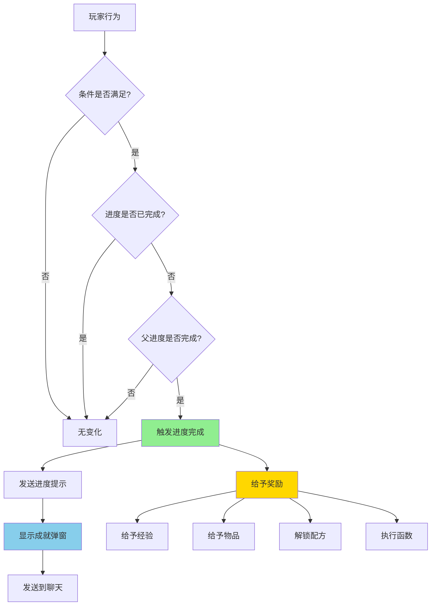
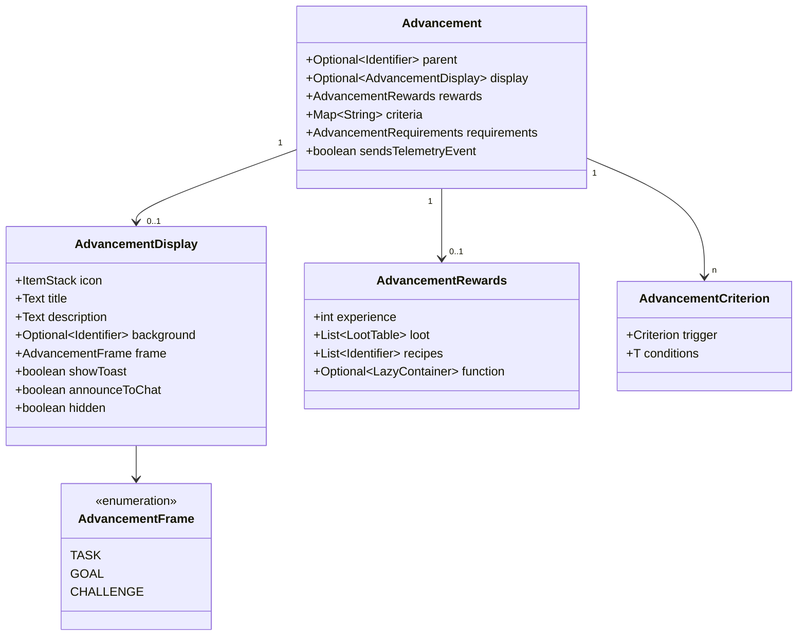
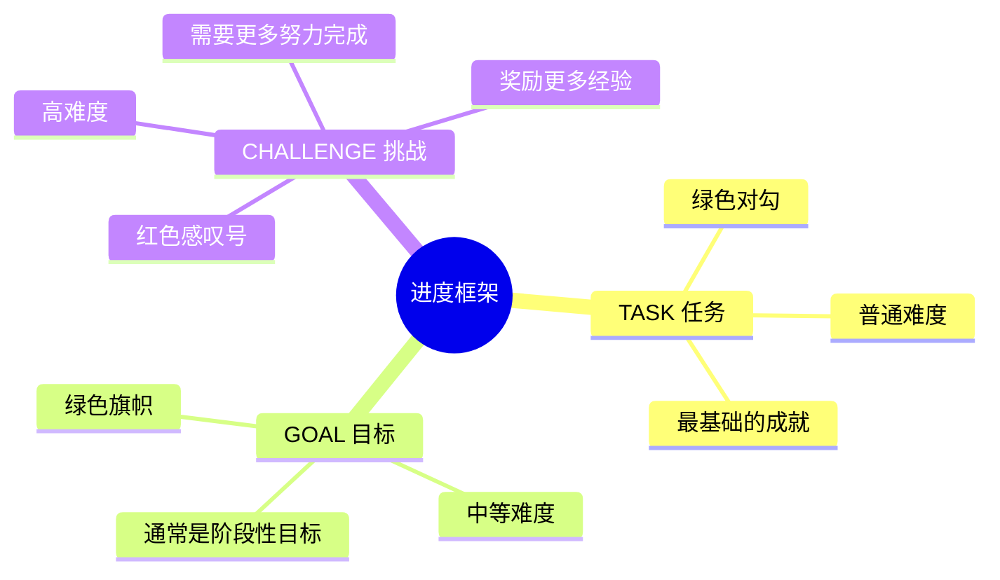

# 43 - 进度系统：成就与任务

## 目标

学完本章节后，你将理解：
- 什么是进度（Advancement）
- 进度系统的结构（父进度、条件、奖励）
- 如何创建自定义进度
- Advancement 相关类的核心方法

## 前置知识

- 已完成 [第41章 数据包](./41-datapack-intro.md) 章节
- 了解 JSON 基本格式
- 理解 Identifier 的概念

## 核心概念（用生活比喻）

### 什么是进度系统？

想象你在玩一款 RPG 游戏：

```
┌─────────────────────────────────────────┐
│  成就系统 = 游戏的任务清单                 │
│                                         │
│  ┌─────────────────────────────────┐   │
│  │ 📋 成就列表                       │   │
│  │                                 │   │
│  │ 🌟 主线任务                       │   │
│  │   ├── [已完成] 获得第一把剑       │   │
│  │   ├── [进行中] 击败末影龙         │   │
│  │   │     ↑ 前提: 收集黑曜石 x10   │   │
│  │   └── [未解锁] 探索下界要塞       │   │
│  │                                 │   │
│  │ 🏆 支线成就                       │   │
│  │   ├── [已完成] 驯服一只狼        │   │
│  │   └── [进行中] 钓鱼100次         │   │
│  └─────────────────────────────────┘   │
│                                         │
│  进度 = 完成任务后获得的东西               │
│  ├── 📜 成就提示（弹窗/聊天消息）          │
│  ├── 🎁 奖励（物品/经验/配方）            │
│  └── 🔓 解锁（解锁新配方/打开新区域）      │
└─────────────────────────────────────────┘
```

**Minecraft 进度 = 原版"成就系统"**：
- 当玩家完成某个条件时触发
- 显示在进度菜单中
- 可以给予奖励

### 进度树结构

```
                    [根进度]
                        │
                        ├── [取得钻石！]
                        │       │
                        │       ├── [钻石装备]
                        │       │       │
                        │       │       ├── [钻石剑]
                        │       │       └── [钻石镐]
                        │       │
                        │       └── [钻石工具]
                        │               │
                        │               └── [无法挖掘...]
                        │
                        ├── [畜牧业]
                        │       │
                        │       ├── [羊羊得意]
                        │       └── [狼心狗肺]
                        │
                        └── [探索]
                                │
                                ├── [下界]
                                └── [末地]
```

**每个进度可以有**：
1. **父进度**（前置任务）
2. **图标和标题**（显示在 UI）
3. **触发条件**（如何完成）
4. **奖励**（完成后获得什么）

## 进度 JSON 结构

### 完整格式

```json
{
    "display": {
        "icon": "minecraft:diamond",
        "title": "取得钻石！",
        "description": "获得你的第一颗钻石",
        "frame": "task",
        "background": "minecraft:textures/gui/advancements/backgrounds/stone.png",
        "show_toast": true,
        "announce_to_chat": true,
        "hidden": false
    },
    "parent": "minecraft:story/mine_stone",
    "criteria": {
        "diamond": {
            "trigger": "minecraft:inventory_changed",
            "conditions": {
                "items": [
                    {"items": ["minecraft:diamond"]}
                ]
            }
        }
    },
    "requirements": [["diamond"]],
    "rewards": {
        "experience": 100,
        "loot": ["minecraft:gameplay/happy_hero_of_the_village"],
        "recipes": ["minecraft:diamond_pickaxe"],
        "function": "mymod:grant_reward"
    },
    "sends_telemetry_event": true
}
```

### 核心字段说明

| 字段 | 说明 | 是否必需 |
|------|------|----------|
| `display` | 显示信息（图标、标题、描述） | 否（无显示 = 隐藏进度） |
| `parent` | 父进度 ID | 否（根进度） |
| `criteria` | 触发条件 | **是** |
| `requirements` | 条件组合方式 | 否（默认 AND） |
| `rewards` | 完成后奖励 | 否 |

## 图解（Mermaid）

### 进度触发流程



### 进度数据模型



### 框架类型对比



## 常用触发器（Trigger）

触发器定义了什么行为会检查进度。

### 1. inventory_changed - 物品变化

```json
{
    "trigger": "minecraft:inventory_changed",
    "conditions": {
        "items": [
            {"items": ["minecraft:diamond"], "count": {"min": 10}}
        ]
    }
}
```
**用途**：获得物品、持有物品、携带物品

### 2. player_killed_entity - 击杀实体

```json
{
    "trigger": "minecraft:player_killed_entity",
    "conditions": {
        "entity": {
            "type": "minecraft:creeper"
        }
    }
}
```
**用途**：击杀特定生物

### 3. enter_block - 进入方块

```json
{
    "trigger": "minecraft:enter_block",
    "conditions": {
        "block": "minecraft:diamond_block"
    }
}
```
**用途**：站在特定方块上

### 4. effects_changed - 药水效果变化

```json
{
    "trigger": "minecraft:effects_changed",
    "conditions": {
        "effects": {
            "minecraft:speed": {"amplifier": {"min": 2}}
        }
    }
}
```
**用途**：获得药水效果

### 5. recipe_unlocked - 配方解锁

```json
{
    "trigger": "minecraft:recipe_unlocked",
    "conditions": {
        "recipe": "minecraft:diamond_pickaxe"
    }
}
```
**用途**：学会某个配方

### 6. killed_by_crossbow - 用弩击杀

```json
{
    "trigger": "minecraft:killed_by_crossbow",
    "conditions": {
        "victims": [
            {"type": "minecraft:skeleton", "unique_entity": true}
        ]
    }
}
```
**用途**：用弩击杀特定生物

### 7. location - 位置检查

```json
{
    "trigger": "minecraft:location",
    "conditions": {
        "location": {
            "biome": "minecraft:desert"
        }
    }
}
```
**用途**：进入特定生物群系

## 奖励详解

### rewards 字段

```json
{
    "rewards": {
        "experience": 100,                 // 给予的经验值
        "loot": ["minecraft:..."],        // 战利品表
        "recipes": ["minecraft:..."],     // 解锁配方
        "function": "namespace:function"  // 执行的函数
    }
}
```

**代码解析**：

```java
29:58:net/minecraft/advancement/AdvancementRewards.java
public record AdvancementRewards(
    int experience,                           // 经验值
    List<RegistryKey<LootTable>> loot,        // 战利品表列表
    List<Identifier> recipes,                 // 配方列表
    Optional<LazyContainer> function          // 函数容器
) {
    
    // 应用奖励到玩家
    public void apply(ServerPlayerEntity player) {
        // 给予经验
        player.addExperience(this.experience);
        
        // 生成战利品
        for (RegistryKey<LootTable> lootTable : this.loot) {
            // ... 生成并给予物品
        }
        
        // 解锁配方
        player.unlockRecipes(this.recipes);
        
        // 执行函数
        this.function.ifPresent(...);
    }
}
```

## 实战演示

### 示例 1：制作附魔金苹果

创建 `data/mymod/advancement/have_enchanted_golden_apple.json`：

```json
{
    "display": {
        "icon": {
            "item": "minecraft:enchanted_golden_apple",
            "nbt": "{Damage:0}"
        },
        "title": {
            "translate": "成就.获得附魔金苹果"
        },
        "description": {
            "translate": "成就.获得附魔金苹果.desc",
            "with": [{"text": "附魔金苹果"}]
        },
        "frame": "goal",
        "show_toast": true,
        "announce_to_chat": true,
        "hidden": false
    },
    "parent": "mymod:have_golden_apple",
    "criteria": {
        "have_apple": {
            "trigger": "minecraft:inventory_changed",
            "conditions": {
                "items": [
                    {
                        "items": ["minecraft:enchanted_golden_apple"]
                    }
                ]
            }
        }
    },
    "requirements": [["have_apple"]]
}
```

### 示例 2：自定义进度树

```
data/mymod/advancement/
├── root.json                    # 根进度（显示在进度界面背景）
├── have_stick.json             # 获得木棍
│       └── parent: root
├── have_diamond.json           # 获得钻石
│       └── parent: root
├── have_nether_star.json       # 获得下界之星
│       └── parent: have_diamond
└── ultimate_weapon.json        # 终极武器
        └── parent: have_nether_star
```

`data/mymod/advancement/root.json`：

```json
{
    "display": {
        "icon": "minecraft:nether_star",
        "title": "模组进度",
        "description": "开始你的冒险",
        "background": "minecraft:textures/gui/advancements/backgrounds/adventure.png",
        "show_toast": false,
        "announce_to_chat": false,
        "hidden": false
    },
    "criteria": {
        "tick": {
            "trigger": "minecraft:tick"
        }
    }
}
```

### 示例 3：带奖励的进度

```json
{
    "display": {
        "icon": "minecraft:emerald",
        "title": "成为村民英雄",
        "description": "帮助村民击退袭击",
        "frame": "challenge"
    },
    "parent": "minecraft:adventure/hero_of_the_village",
    "criteria": {
        "hero": {
            "trigger": "minecraft:hero_of_the_village"
        }
    },
    "rewards": {
        "experience": 500,
        "loot": ["mymod:gameplay/villager_hero_gift"],
        "recipes": ["mymod:magic_diamond_armor"],
        "function": "mymod:celebrate_hero"
    }
}
```

## 源代码解析

### Advancement 类核心结构

```java
39:44:net/minecraft/advancement/Advancement.java
public record Advancement(
    Optional<Identifier> parent,                    // 父进度
    Optional<AdvancementDisplay> display,           // 显示信息
    AdvancementRewards rewards,                      // 奖励
    Map<String, AdvancementCriterion<?>> criteria,  // 条件列表
    AdvancementRequirements requirements,            // 条件要求
    boolean sendsTelemetryEvent                      // 是否发送遥测
) {
    // 检查是否是根进度
    public boolean isRoot() {
        return this.parent.isEmpty();
    }
}
```

### AdvancementEntry 记录

```java
13:15:net/minecraft/advancement/AdvancementEntry.java
public record AdvancementEntry(
    Identifier id,      // 进度的完整 ID
    Advancement value   // 进度数据
) {}
```

### 触发器注册

```java
// Criteria 类中定义了所有触发器
// 位于 net.minecraft.advancement.criterion.Criteria
public static final Criteria INVENTORY_CHANGED = 
    new Criteria("inventory_changed");
    
public static final Criteria PLAYER_KILLED_ENTITY = 
    new Criteria("player_killed_entity");
    
public static final Criteria RECIPE_UNLOCKED = 
    new Criteria("recipe_unlocked");
```

## 小结

| 组件 | 说明 | 关键字段 |
|------|------|----------|
| **Advancement** | 进度主体 | criteria, parent, rewards |
| **AdvancementDisplay** | 显示信息 | icon, title, frame |
| **AdvancementRewards** | 奖励 | experience, loot, recipes |
| **Criterion** | 单个条件 | trigger, conditions |
| **Trigger** | 触发器 | inventory_changed, location... |

**框架类型**：
- `task` - 普通任务（绿色对勾）
- `goal` - 目标（绿色旗帜）
- `challenge` - 挑战（红色感叹号）

## 练习

1. **基础练习**
   创建一个进度，当玩家背包中有 64 个钻石时触发，显示"钻石大亨"成就。

2. **进度树练习**
   创建以下进度树：
   - 根进度：开始冒险
   - 子进度 1：获得铁锭
   - 子进度 2：获得金锭（需要先完成"获得铁锭"）

3. **奖励练习**
   创建一个进度，完成后给予 100 经验、1 个附魔金苹果、解锁一个自定义配方。

4. **思考题**
   - 如何让一个进度有多个完成条件（OR 逻辑）？
   - 隐藏进度的用途是什么？

## 相关链接

- [Minecraft Wiki - Advancement](https://minecraft.fandom.com/wiki/Advancement)
- [Minecraft Wiki - Advancement trigger](https://minecraft.fandom.com/wiki/Advancement_trigger)
- [Minecraft Wiki - Advancement reward](https://minecraft.fandom.com/wiki/Advancement#Rewards)
- 相关源码：
  - `net.minecraft.advancement.Advancement`
  - `net.minecraft.advancement.AdvancementEntry`
  - `net.minecraft.advancement.AdvancementDisplay`
  - `net.minecraft.advancement.AdvancementRewards`

### 源码文件位置

| 文件 | 源码路径 | 说明 |
|------|----------|------|
| Advancement.java | `net/minecraft/advancement/Advancement.java` | 进度类 |
| AdvancementRewards.java | `net/minecraft/advancement/AdvancementRewards.java` | 进度奖励 |
| Criterion.java | `net/minecraft/advancement/criterion/Criterion.java` | 进度条件触发器 |

---

## 下一步

学习完进度系统后，下一个重要系统是**配方系统（Recipe）**，它定义了游戏中物品的合成规则。

> [第44章 - 配方系统：物品合成](./44-recipe-system.md)

---

> **注意**：本文中的部分源码示例基于 CFR 反编译结果，实际源码可能略有差异。

---

**关键词**：进度系统、Advancement、AdvancementDisplay、AdvancementRewards、Criterion、Trigger
