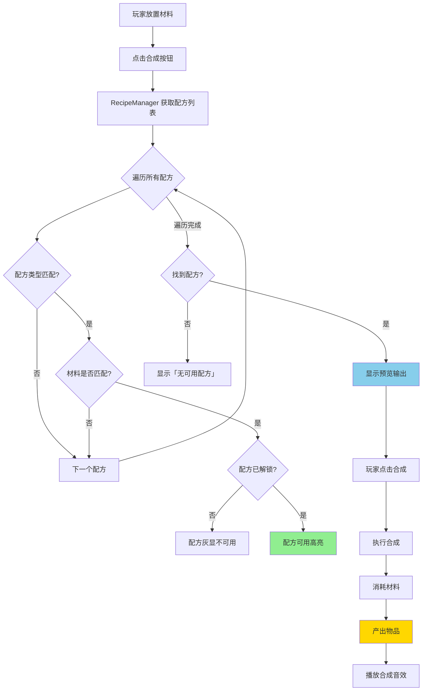
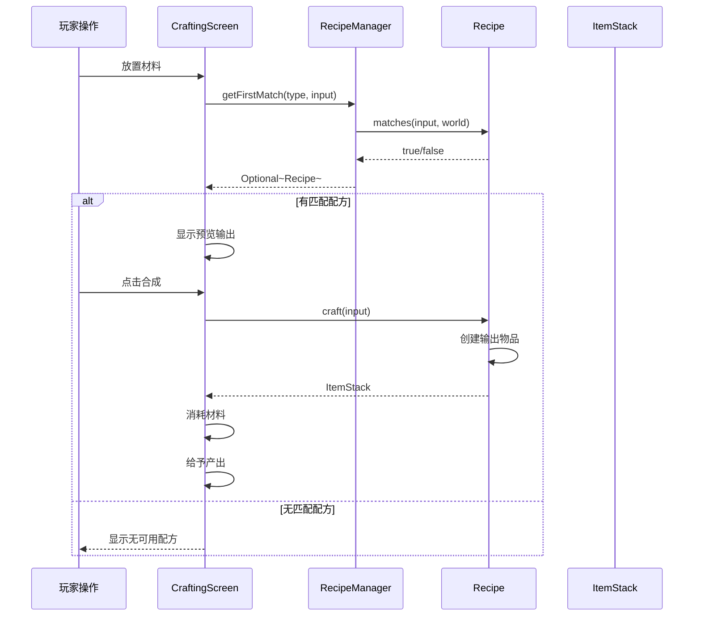
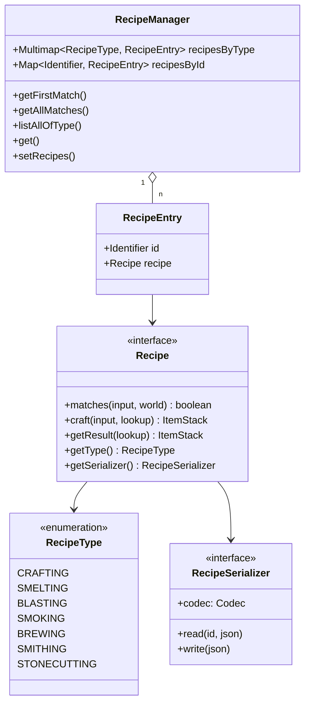
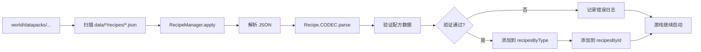

# 44 - 配方系统：物品合成

## 目标

学完本章节后，你将理解：
- 什么是配方系统（Recipe）
- 配方类型（合成、烧炼、酿造、锻造等）
- 配方匹配流程
- 如何创建自定义配方

## 前置知识

- 已完成 [第41章 数据包](./41-datapack-intro.md) 章节
- 了解 JSON 基本格式
- 理解 Identifier 的概念
- 了解 Ingredient（物品过滤器）的概念

## 核心概念（用生活比喻）

### 什么是配方系统？

想象你在一间工厂里工作：

```
┌─────────────────────────────────────────┐
│  配方系统 = 工厂的生产说明书               │
│                                         │
│  ┌─────────────────────────────────┐   │
│  │ 📋 配方本                          │   │
│  │                                 │   │
│  │ 配方1: 制作面包                   │   │
│  │   材料: 小麦 x3                   │   │
│  │   → 产出: 面包 x1               │   │
│  │                                 │   │
│  │ 配方2: 熔炼铁锭                   │   │
│  │   材料: 铁矿石 x1 + 燃料          │   │
│  │   → 产出: 铁锭 x1               │   │
│  │                                 │   │
│  │ 配方3: 酿造药水                   │   │
│  │   材料: 水瓶 + 地狱疣 + 药水原料  │   │
│  │   → 产出: 药水 x1               │   │
│  └─────────────────────────────────┘   │
│                                         │
│  当玩家把材料放到工作台                  │
│       ↓                                │
│  系统查找配方本                          │
│       ↓                                │
│  找到匹配配方 → 执行生产                 │
│  未找到配方 → 无法合成                   │
└─────────────────────────────────────────┘
```

### 配方 vs 战利品表

| 特性 | 配方 (Recipe) | 战利品表 (Loot Table) |
|------|-------------|----------------------|
| **触发方式** | 玩家主动操作 | 系统自动决定 |
| **用途** | 合成物品 | 定义掉落物 |
| **输入** | 玩家放入的材料 | 击杀的生物/打开的箱子 |
| **输出** | 固定的合成产物 | 随机掉落 |

**简单理解**：
- 配方 = 玩家"主动"做东西
- 战利品表 = 系统"被动"给东西

## 配方类型一览

```
┌─────────────────────────────────────────────────────────┐
│                     配方类型树                            │
│                                                         │
│  Recipe                                                 │
│     │                                                   │
│     ├── CraftingRecipe（合成配方）                        │
│     │     ├── ShapedRecipe（有形状合成）                  │
│     │     │     ├── 3x3 网格排列                        │
│     │     │     └── 材料位置很重要                       │
│     │     ├── ShapelessRecipe（无形状合成）              │
│     │     │     ├── 3x3 网格随意放置                    │
│     │     │     └── 只要材料种类和数量对就行              │
│     │     └── SmithingRecipe（锻造配方）                  │
│     │           ├── 基础物品 + 添加物品                   │
│     │           └── 用于装备升级、修剪等                   │
│     │                                                   │
│     ├── CookingRecipe（烹饪配方）                         │
│     │     ├── SmeltingRecipe（熔炉烧制）                  │
│     │     ├── SmokingRecipe（烟熏炉）                    │
│     │     └── BlastingRecipe（高炉）                     │
│     │                                                   │
│     ├── BrewingRecipe（酿造配方）                        │
│     │     └── 药水酿造                                   │
│     │                                                   │
│     └── StonecuttingRecipe（切石配方）                   │
│           └── 1个输入 → 1个输出                          │
│                                                         │
└─────────────────────────────────────────────────────────┘
```

## 图解（Mermaid）

### 配方匹配流程



### 配方数据流



### RecipeManager 核心方法



## 有形状合成（Shaped Recipe）

### JSON 格式

```json
{
    "type": "minecraft:crafting_shaped",
    "category": "misc",
    "group": "wooden_tools",
    "pattern": [
        "###",
        " # ",
        " # "
    ],
    "key": {
        "#": {
            "item": "minecraft:stick"
        }
    },
    "result": {
        "item": "minecraft:wooden_sword",
        "count": 1
    }
}
```

### pattern 规则

```
pattern 中的字符：
- "###" = 第一行放 3 个该材料
- " # " = 第二行中间放 1 个该材料
- " X " = 空格 = 空位

key 定义每个字符对应的材料：
- "#" 可以是物品、标签或空

技巧：
- pattern 最小可以到 1x1
- 可以使用空行/空列
- 允许镜像翻转（默认开启）
```

### 示例：钻石镐

```json
{
    "type": "minecraft:crafting_shaped",
    "pattern": [
        "XXX",
        " # ",
        " # "
    ],
    "key": {
        "X": {
            "item": "minecraft:diamond"
        },
        "#": {
            "item": "minecraft:stick"
        }
    },
    "result": {
        "item": "minecraft:diamond_pickaxe"
    }
}
```

```
合成预览：
[D] [D] [D]     D D D
[ ] [S] [ ]  =  — —
[ ] [S] [ ]     — —

D = 钻石, S = 木棍
```

## 无形状合成（Shapeless Recipe）

### JSON 格式

```json
{
    "type": "minecraft:crafting_shapeless",
    "category": "misc",
    "group": "dyes",
    "ingredients": [
        {"item": "minecraft:white_dye"},
        {"item": "minecraft:blue_dye"}
    ],
    "result": {
        "item": "minecraft:light_blue_dye",
        "count": 2
    }
}
```

### 与有形状的区别

| 特性 | 有形状 | 无形状 |
|------|--------|--------|
| **放置方式** | 必须按 pattern 排列 | 任意位置 |
| **镜像** | 可以水平镜像 | 不适用 |
| **最小尺寸** | 可以压缩空格 | 最多 9 个材料 |
| **适用场景** | 工具、器械 | 染料、药水材料 |

## 烹饪配方（Cooking Recipe）

### 三种烹饪方式

| 方式 | 机器 | 烧制时间 | 经验值 |
|------|------|---------|--------|
| **Smelting** | 熔炉 | 10 秒 | 0.1 |
| **Smoking** | 烟熏炉 | 5 秒 | 0.35 |
| **Blasting** | 高炉 | 5 秒 | 0.1 |

### JSON 格式

```json
{
    "type": "minecraft:smelting",
    "category": "food",
    "group": "fish",
    "ingredient": {
        "item": "minecraft:cod"
    },
    "result": "minecraft:cooked_cod",
    "experience": 0.35,
    "cookingtime": 200
}
```

### 烹饪时间

| 字段 | 默认值 | 说明 |
|------|--------|------|
| `cookingtime` | 200 (10秒) | 烧制所需刻数 |
| 1 刻 = 0.05 秒 | | |

## 锻造配方（Smithing Recipe）

### 1.21 锻造系统

```json
{
    "type": "minecraft:smithing_transform",
    "base": {
        "item": "minecraft:netherite_helmet",
        "禁用了": false
    },
    "template": {
        "item": "minecraft:netherite_upgrade_smithing_template"
    },
    "addition": {
        "item": "minecraft:netherite_ingot"
    },
    "result": {
        "item": "minecraft:netherite_helmet"
    }
}
```

**三个输入**：
- `base` - 基础物品（要被升级的装备）
- `template` - 模板（消耗品）
- `addition` - 添加物品（升级材料）

## 切石配方（Stonecutting）

### JSON 格式

```json
{
    "type": "minecraft:stonecutting",
    "ingredient": {
        "item": "minecraft:cobblestone"
    },
    "result": "minecraft:stone",
    "count": 1
}
```

**特点**：一个输入对应一个输出，简单明了。

## 源代码解析

### Recipe 接口

```java
36:50:net/minecraft/recipe/Recipe.java
public interface Recipe<T extends RecipeInput> {
    
    // 检查材料是否匹配
    boolean matches(T input, World world);
    
    // 制作物品
    ItemStack craft(T input, RegistryWrapper.WrapperLookup lookup);
    
    // 是否适合指定网格大小
    boolean fits(int width, int height);
    
    // 获取输出
    ItemStack getResult(RegistryWrapper.WrapperLookup lookup);
    
    // 获取配方类型
    RecipeType<?> getType();
    
    // 获取序列化器
    RecipeSerializer<?> getSerializer();
}
```

### RecipeManager 核心方法

```java
46:84:net/minecraft/recipe/RecipeManager.java
public class RecipeManager extends JsonDataLoader {
    
    // 按类型存储配方
    private Multimap<RecipeType<?>, RecipeEntry<?>> recipesByType;
    
    // 按 ID 存储配方
    private Map<Identifier, RecipeEntry<?>> recipesById;
    
    // 加载配方
    @Override
    protected void apply(Map<Identifier, JsonElement> map, ...) {
        for (Map.Entry<Identifier, JsonElement> entry : map.entrySet()) {
            // 解析 JSON
            Recipe recipe = Recipe.CODEC.parse(...).getOrThrow();
            // 存储到索引
            builder.put(recipe.getType(), recipeEntry);
            builder2.put(identifier, recipeEntry);
        }
    }
    
    // 查找匹配配方
    public <I extends RecipeInput, T extends Recipe<I>> 
        Optional<RecipeEntry<T>> getFirstMatch(
            RecipeType<T> type, I input, World world) {
        
        return getAllOfType(type).stream()
            .filter(recipe -> recipe.value().matches(input, world))
            .findFirst();
    }
}
```

### 配方加载流程



## 实战演示

### 示例 1：自定义合成配方

创建 `data/mymod/recipe/magic_diamond_sword.json`：

```json
{
    "type": "minecraft:crafting_shaped",
    "category": "equipment",
    "group": "magic_swords",
    "pattern": [
        " X ",
        " X ",
        " # "
    ],
    "key": {
        "X": {
            "item": "minecraft:diamond"
        },
        "#": {
            "item": "minecraft:stick"
        }
    },
    "result": {
        "item": "mymod:magic_diamond_sword",
        "count": 1,
        "components": {
            "minecraft:enchantments": {
                "minecraft:sharpness": 5
            }
        }
    }
}
```

### 示例 2：使用标签的材料

```json
{
    "type": "minecraft:crafting_shaped",
    "pattern": [
        "###",
        "###",
        "###"
    ],
    "key": {
        "#": {
            "tag": "minecraft:planks"
        }
    },
    "result": {
        "item": "minecraft:chest",
        "count": 1
    }
}
```

**用途**：可以用任意木板合成箱子

### 示例 3：带分组的多配方

```json
{
    "type": "minecraft:crafting_shapeless",
    "group": "wooden_buttons",
    "ingredients": [
        {"tag": "minecraft:planks"}
    ],
    "result": {
        "item": "minecraft:oak_button",
        "count": 1
    }
}
```

**效果**：所有木板都能做对应木种的按钮

### 示例 4：自定义烹饪配方

```json
{
    "type": "minecraft:smoking",
    "category": "food",
    "group": "cooked_meat",
    "ingredient": {
        "item": "mymod:raw_beast_meat"
    },
    "result": "mymod:cooked_beast_meat",
    "experience": 0.35,
    "cookingtime": 100
}
```

## 小结

| 配方类型 | JSON type | 特点 |
|----------|-----------|------|
| **有形状合成** | `crafting_shaped` | 按 pattern 排列 |
| **无形状合成** | `crafting_shapeless` | 任意位置 |
| **熔炉烧制** | `smelting` | 10 秒 |
| **烟熏炉** | `smoking` | 5 秒 |
| **高炉** | `blasting` | 5 秒 |
| **锻造** | `smithing_transform` | 三元素升级 |
| **切石** | `stonecutting` | 一对一 |

**核心概念**：
- `group` - 配方分组（用于 UI 折叠显示）
- `category` - 合成台分类
- `ingredients` - 材料列表
- `result` - 产出物品

## 练习

1. **基础练习**
   创建一个配方：3 个绿宝石 + 1 个钻石 = 1 个绿宝石块

2. **形状练习**
   创建一个"T"形的工具手柄配方，使用 4 根木棍。

3. **烹饪练习**
   创建一个自定义食物的烟熏炉配方，烧制时间设为 3 秒。

4. **思考题**
   - 如何让同一个配方有多个输出？
   - 配方的 `group` 字段有什么实际作用？

## 相关链接

- [Minecraft Wiki - Recipe](https://minecraft.fandom.com/wiki/Recipe)
- [Minecraft Wiki - Smithing](https://minecraft.fandom.com/wiki/Smithing)
- [Minecraft Wiki - Smoking](https://minecraft.fandom.com/wiki/Smoking)
- 相关源码：
  - `net.minecraft.recipe.Recipe`
  - `net.minecraft.recipe.RecipeManager`
  - `net.minecraft.recipe.ShapedRecipe`
  - `net.minecraft.recipe.ShapelessRecipe`

### 源码文件位置

| 文件 | 源码路径 | 说明 |
|------|----------|------|
| Recipe.java | `net/minecraft/recipe/Recipe.java` | 配方接口 |
| RecipeManager.java | `net/minecraft/recipe/RecipeManager.java` | 配方管理器 |
| RecipeType.java | `net/minecraft/recipe/RecipeType.java` | 配方类型枚举 |

---

## 下一步

恭喜你完成了 Part-8 资源系统的学习！下一部分我们将学习 **Part-9 客户端渲染**，了解 Minecraft 如何绘制游戏画面。

> [返回 Part-8 目录](./README.md)

---

> **注意**：本文中的部分源码示例基于 CFR 反编译结果，实际源码可能略有差异。

---

**关键词**：配方系统、Recipe、RecipeManager、ShapedRecipe、ShapelessRecipe、CookingRecipe
