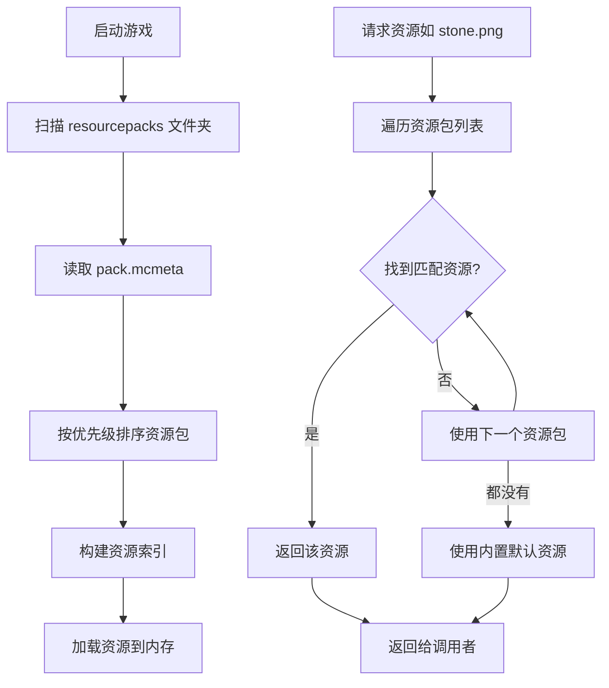

# 第 46 章：资源包系统（Resource Pack）

## 章节目标

- 理解资源包的概念与作用
- 掌握资源包的文件结构
- 学会创建简单的资源包
- 了解资源加载机制

## 前置知识

- Minecraft 基础操作
- 了解 JSON 格式
- 熟悉文件目录操作

## 核心概念

### 什么是资源包？

**资源包（Resource Pack）** 是 Minecraft 用于自定义游戏外观的机制。你可以把它想象成**游戏的"外观包装"**——就像给一个普通的礼物盒换上一个漂亮的包装纸和丝带。

资源包可以替换的内容包括：
- 🖼️ 纹理（方块、物品、生物的皮肤）
- 🔤 字体
- 🎵 音效
- 📝 语言的翻译文本
- ✨ 粒子效果
- 🎬 动画

### 关键术语解释

| 术语 | 解释 |
|------|------|
| **Namespace** | 命名空间，类似文件柜的标签，用于区分不同模组/来源的资源 |
| **Resource Location** | 资源定位符，格式为 `namespace:path`，如 `minecraft:block/stone` |
| **Override** | 覆盖，用你的资源替换原版的资源 |
| **Pack.mcmeta** | 资源包的元数据文件，告诉游戏这是一个资源包 |

## 资源包文件结构

```
📁 my-resource-pack/
├── 📄 pack.mcmeta          # 资源包元数据（必须）
├── 📄 pack.png             # 资源包图标（可选）
│
├── 📁 assets/
│   ├── 📁 minecraft/      # 覆盖原版资源
│   │   ├── 📁 textures/
│   │   │   ├── 📁 block/
│   │   │   │   └── stone.png
│   │   │   └── 📁 item/
│   │   │       └── diamond_sword.png
│   │   ├── 📁 models/
│   │   │   └── item/
│   │   │       └── diamond_sword.json
│   │   ├── 📁 lang/
│   │   │   └── zh_cn.json
│   │   └── 📁 sounds/
│   │       └── mob/
│   │           └── zombie/
│   │               └── idle.ogg
│   │
│   └── 📁 mymod/          # 自定义模组资源
│       ├── 📁 textures/
│       └── 📁 lang/
```

## pack.mcmeta 文件格式

```json
{
    "pack": {
        "pack_format": 34,
        "description": "我的第一个资源包"
    }
}
```

### Pack Format 版本对照

| Minecraft 版本 | Pack Format |
|----------------|-------------|
| 1.20.4 - 1.21 | 34 |
| 1.20 - 1.20.3 | 26 |
| 1.19 - 1.19.4 | 24 |
| 1.18 - 1.18.2 | 22 |
| 1.17 - 1.17.1 | 20 |
| 1.16 - 1.16.5 | 16 |

## 资源加载流程



## 实战演示：创建钻石剑纹理替换包

### 步骤 1：创建资源包基础结构

```
📁 diamond-replacement/
├── 📄 pack.mcmeta
├── 📄 pack.png
└── 📁 assets/
    └── 📁 minecraft/
        └── 📁 textures/
            └── 📁 item/
                └── diamond_sword.png
```

### 步骤 2：编写 pack.mcmeta

```json
{
    "pack": {
        "pack_format": 34,
        "description": "替换钻石剑纹理为彩虹剑"
    }
}
```

### 步骤 3：准备纹理图片

创建一个 16x16 或 32x32 的 PNG 图片作为新的钻石剑纹理。

### 步骤 4：测试资源包

1. 将资源包文件夹压缩为 `.zip` 格式（或直接使用文件夹）
2. 将其放入 `.minecraft/resourcepacks` 目录
3. 启动游戏 → 设置 → 资源包
4. 将你的资源包移动到右侧"可用"列表
5. 点击"完成"应用

## 高级用法：替换方块模型

### 创建自定义方块模型

```json
{
    "parent": "minecraft:block/cube_all",
    "textures": {
        "all": "minecraft:block/diamond_block"
    }
}
```

将此文件保存为 `assets/minecraft/models/block/rainbow_wool.json`，然后创建一个带有此模型的方块。

### 模型继承机制

```
parent 继承链：
custom_block.json
    └── base/wooden_block.json
            └── block/block  (基础方块)
```

子模型会继承父模型的属性，子类可以覆盖特定属性。

## 资源优先级与叠加

Minecraft 支持**多个资源包叠加**，高优先级资源包会覆盖低优先级的同名资源。

```
优先级顺序（从高到低）：
┌─────────────────────────────────────┐
│  资源包 #N（最顶部）                  │  ← 最高优先级
├─────────────────────────────────────┤
│  资源包 #N-1                        │
├─────────────────────────────────────┤
│  ...                                │
├─────────────────────────────────────┤
│  资源包 #2                          │
├─────────────────────────────────────┤
│  资源包 #1                          │
├─────────────────────────────────────┤
│  Minecraft 内置资源（最低优先级）     │  ← 默认资源
└─────────────────────────────────────┘
```

## 常见问题排查

### 资源不生效？

1. ✅ 检查 `pack.mcmeta` 格式是否正确
2. ✅ 确认 `pack_format` 与游戏版本匹配
3. ✅ 验证文件路径是否正确（区分大小写！）
4. ✅ 资源包是否放在正确位置

### 报错 "Invalid pack.mcmeta"？

```json
// 常见错误：缺少引号、逗号、括号不匹配
{
    "pack": {
        "pack_format": 34   // 缺少结尾的 } 和 ]
        "description": "xxx"
    }
}
```

### 纹理显示为紫黑色？

表示资源路径正确但图片损坏或格式不支持，使用标准 PNG 格式重试。

## 课后自查

- [ ] 能够创建包含 `pack.mcmeta` 的资源包
- [ ] 理解 Namespace 和 Resource Location 的概念
- [ ] 掌握资源包加载的优先级机制
- [ ] 能够替换一个简单的物品纹理
- [ ] 理解模型继承的 `parent` 机制
- [ ] 知道如何排查资源包不生效的问题

## 下一步

掌握了资源包的基础后，你可以继续学习：
- **数据包（Datapack）**：自定义游戏逻辑
- **物品模型系统**：创建复杂物品模型
- **动画系统**：为纹理添加动画效果

---

*资源包是 Minecraft 最强大的自定义工具之一，它让玩家能够在不修改游戏代码的情况下，完全改变游戏的外观！*
