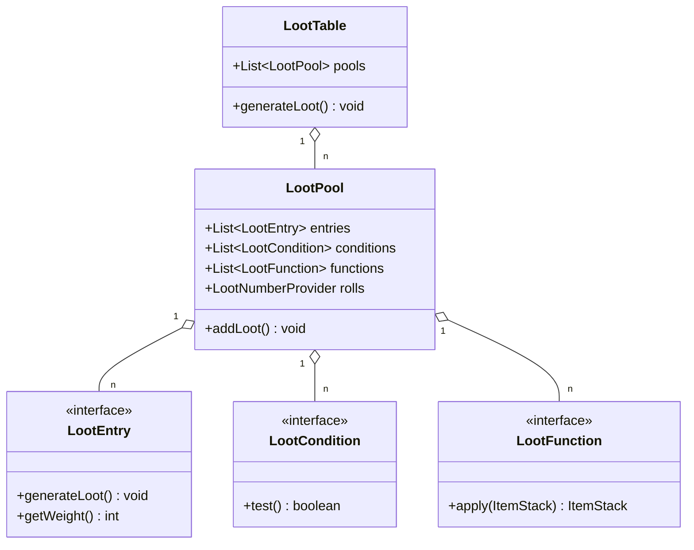
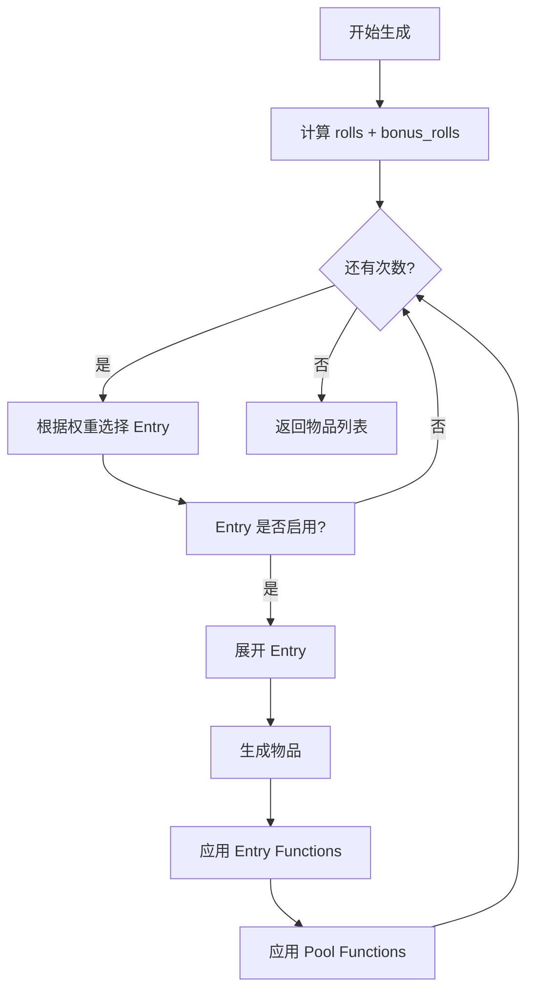

# 第 48 章：战利品表（Loot Table）

## 章节目标

- 理解战利品表的核心概念
- 掌握 LootTable、LootPool、LootEntry 的关系
- 学会编写 JSON 战利品表
- 了解源码中的实现逻辑

## 前置知识

- 数据包基础
- JSON 格式
- Minecraft 物品系统基础

## 核心概念

### 什么是战利品表？

**战利品表（Loot Table）** 是 Minecraft 定义物品掉落的核心机制。你可以把它想象成**游戏中的"抽奖转盘"**——每当你挖掘方块、击杀生物、打开箱子时，游戏就会转动这个转盘来决定你获得什么奖励。

### 关键比喻：抽奖转盘

```
┌────────────────────────────────────────┐
│           战利品表 = 抽奖转盘            │
├────────────────────────────────────────┤
│                                        │
│    ┌──────────────────────────┐        │
│    │        方块掉落           │        │
│    │   ┌──────────────────┐   │        │
│    │   │   LootTable      │   │        │
│    │   │  ┌────────────┐  │   │        │
│    │   │  │ LootPool   │  │   │        │
│    │   │  │ ┌────────┐ │  │   │        │
│    │   │  │ │ Entry  │ │  │   │        │
│    │   │  │ └────────┘ │  │   │        │
│    │   │  │ ┌────────┐ │  │   │        │
│    │   │  │ │ Entry  │ │  │   │        │
│    │   │  │ └────────┘ │  │   │        │
│    │   │  └────────────┘  │   │        │
│    │   └──────────────────┘   │        │
│    └──────────────────────────┘        │
│                                        │
└────────────────────────────────────────┘
```

## 架构总览



## JSON 格式详解

### 完整战利品表示例

```json
{
    "type": "minecraft:generic",
    "pools": [
        {
            "rolls": 1,
            "bonus_rolls": 0,
            "entries": [
                {
                    "type": "minecraft:item",
                    "name": "minecraft:diamond",
                    "weight": 1,
                    "functions": [
                        {
                            "function": "minecraft:set_count",
                            "count": {
                                "type": "minecraft:uniform",
                                "min": 1,
                                "max": 3
                            }
                        }
                    ]
                }
            ],
            "conditions": [
                {
                    "condition": "minecraft:killed_by_player"
                }
            ],
            "functions": [
                {
                    "function": "minecraft:enchant_randomly",
                    "enchantments": ["minecraft:fortune"]
                }
            ]
        }
    ]
}
```

## LootPool 详解

### rolls - 抽取次数

```json
{
    "rolls": 3,
    "bonus_rolls": {
        "type": "minecraft:uniform",
        "min": 0,
        "max": 2
    }
}
```

- `rolls`: 基础抽取次数（固定值）
- `bonus_rolls`: 额外抽取次数（可使用分布）

### 数值提供者类型

| 类型 | 描述 | 示例 |
|------|------|------|
| `uniform` | 均匀分布 | `{"min": 1, "max": 5}` |
| `binomial` | 二项分布 | `{"n": 10, "p": 0.5}` |
| `constant` | 常量 | `{"value": 3}` |

## LootEntry 条目类型

### 1. 物品条目 (item)

```json
{
    "type": "minecraft:item",
    "name": "minecraft:emerald",
    "weight": 10,
    "quality": 0,
    "functions": [
        {
            "function": "minecraft:set_count",
            "count": {
                "type": "minecraft:uniform",
                "min": 1,
                "max": 3
            }
        }
    ]
}
```

### 2. 标签条目 (tag)

```json
{
    "type": "minecraft:tag",
    "name": "minecraft:flowers",
    "weight": 5,
    "expand": true
}
```

### 3. 引用其他表 (loot_table)

```json
{
    "type": "minecraft:loot_table",
    "name": "minecraft:gameplay/common_treasure"
}
```

### 4. 替代条目 (alternatives)

```json
{
    "type": "minecraft:alternatives",
    "children": [
        {
            "type": "minecraft:item",
            "name": "minecraft:diamond",
            "conditions": [
                {
                    "condition": "minecraft:random_chance",
                    "chance": 0.1
                }
            ]
        },
        {
            "type": "minecraft:item",
            "name": "minecraft:iron_ingot",
            "weight": 1
        }
    ]
}
```

### 5. 分组条目 (group)

```json
{
    "type": "minecraft:group",
    "children": [
        {"type": "minecraft:item", "name": "minecraft:red_flower"},
        {"type": "minecraft:item", "name": "minecraft:yellow_flower"}
    ]
}
```

## LootCondition 条件详解

### 常用条件

| 条件 ID | 描述 | 参数 |
|---------|------|------|
| `minecraft:killed_by_player` | 被玩家击杀 | 无 |
| `minecraft:survives_explosion` | 爆炸后存活 | 无 |
| `minecraft:random_chance` | 随机概率 | `chance` (0-1) |
| `minecraft:entity_properties` | 实体属性 | `entity` |
| `minecraft:block_state_property` | 方块状态 | `block`, `state` |
| `minecraft:match_tool` | 工具匹配 | `predicate` |
| `minecraft:table_bonus` | 附魔加成 | `enchantment`, `chances` |

### 条件组合

```json
{
    "condition": "minecraft:all_of",
    "terms": [
        {"condition": "minecraft:killed_by_player"},
        {
            "condition": "minecraft:entity_properties",
            "entity": "this",
            "properties": {
                "on_fire": true
            }
        }
    ]
}
```

```json
{
    "condition": "minecraft:any_of",
    "terms": [
        {"condition": "minecraft:random_chance", "chance": 0.5},
        {"condition": "minecraft:random_chance", "chance": 0.5}
    ]
}
```

```json
{
    "condition": "minecraft:inverted",
    "term": {
        "condition": "minecraft:killed_by_player"
    }
}
```

## LootFunction 函数详解

### 常用函数

| 函数 ID | 描述 | 参数 |
|---------|------|------|
| `minecraft:set_count` | 设置数量 | `count` |
| `minecraft:set_nbt` | 设置 NBT | `tag` |
| `minecraft:enchant_randomly` | 随机附魔 | `enchantments` |
| `minecraft:enchant_with_levels` | 按等级附魔 | `treasure`, `levels` |
| `minecraft:furnace_smelt` | 熔炉烧制 | 无 |
| `minecraft:looting_enchant` | 抢夺加成 | `count`, `limit` |
| `minecraft:copy_nbt` | 复制 NBT | `source`, `ops` |
| `minecraft:set_damage` | 设置耐久 | `damage` |
| `minecraft:set_stew_effect` | 设置炖菜效果 | `effects` |

### 函数链式应用

```json
{
    "type": "minecraft:item",
    "name": "minecraft:diamond_sword",
    "functions": [
        {
            "function": "minecraft:set_count",
            "count": 1
        },
        {
            "function": "minecraft:enchant_with_levels",
            "treasure": true,
            "levels": {
                "type": "minecraft:uniform",
                "min": 20,
                "max": 39
            }
        },
        {
            "function": "minecraft:set_nbt",
            "tag": "{display:{Name:'{\"text\":\"传说之剑\",\"color\":\"gold\",\"italic\":false}'}}"
        }
    ]
}
```

## 实战演示：创建自定义掉落

### 示例 1：自定义僵尸掉落

```json
{
    "pools": [
        {
            "rolls": 1,
            "entries": [
                {
                    "type": "minecraft:item",
                    "name": "minecraft:rotten_flesh",
                    "weight": 1,
                    "functions": [
                        {
                            "function": "minecraft:set_count",
                            "count": {
                                "type": "minecraft:uniform",
                                "min": 0,
                                "max": 2
                            }
                        },
                        {
                            "function": "minecraft:looting_enchant_bonus",
                            "count": {
                                "type": "minecraft:uniform",
                                "min": 0,
                                "max": 1
                            }
                        }
                    ]
                }
            ],
            "conditions": [
                {"condition": "minecraft:killed_by_player"}
            ]
        },
        {
            "rolls": 1,
            "entries": [
                {
                    "type": "minecraft:item",
                    "name": "minecraft:gold_ingot",
                    "weight": 1,
                    "conditions": [
                        {
                            "condition": "minecraft:random_chance",
                            "chance": 0.025
                        }
                    ]
                }
            ]
        }
    ]
}
```

### 示例 2：自定义箱子战利品

```json
{
    "pools": [
        {
            "rolls": {
                "type": "minecraft:uniform",
                "min": 2,
                "max": 4
            },
            "entries": [
                {
                    "type": "minecraft:item",
                    "name": "minecraft:iron_ingot",
                    "weight": 20,
                    "functions": [
                        {
                            "function": "minecraft:set_count",
                            "count": {
                                "type": "minecraft:binomial",
                                "n": 3,
                                "p": 0.5
                            }
                        }
                    ]
                },
                {
                    "type": "minecraft:item",
                    "name": "minecraft:gold_ingot",
                    "weight": 10,
                    "functions": [
                        {
                            "function": "minecraft:set_count",
                            "count": {
                                "type": "minecraft:uniform",
                                "min": 1,
                                "max": 3
                            }
                        }
                    ]
                },
                {
                    "type": "minecraft:item",
                    "name": "minecraft:diamond",
                    "weight": 2,
                    "functions": [
                        {
                            "function": "minecraft:set_count",
                            "count": {
                                "type": "minecraft:uniform",
                                "min": 1,
                                "max": 2
                            }
                        }
                    ]
                }
            ]
        }
    ]
}
```

## 源码中的实现

### LootTable.generateLoot()

```java
public void generateLoot(LootContextParameterSet parameters,
                        Consumer<ItemStack> lootConsumer) {
    // 创建上下文
    LootContext context = new LootContext.Builder(parameters)
        .withRandom(this.randomSequenceId)
        .build(this.type);

    // 为每个池生成战利品
    for (LootPool pool : this.pools) {
        if (pool.checkCondition(context)) {
            pool.addLoot(lootConsumer, context);
        }
    }

    // 应用全局函数
    for (LootFunction function : this.functions) {
        // 对所有已生成的物品应用函数
    }
}
```

### LootPool.addLoot() 流程



## 内置战利品表路径

| 类型 | 路径 |
|------|------|
| 方块掉落 | `minecraft:blocks/<block_id>` |
| 实体掉落 | `minecraft:entities/<entity_id>` |
| 钓鱼 | `minecraft:gameplay/fishing` |
| 钓鱼垃圾 | `minecraft:gameplay/fishing/junk` |
| 钓鱼宝藏 | `minecraft:gameplay/fishing/treasure` |
| 村民交易 | `minecraft:gameplay/village_trade` |
| 战利品表引用 | `minecraft:empty` |

## 课后自查

- [ ] 理解 LootTable、LootPool、LootEntry 的层级关系
- [ ] 掌握 rolls 和 bonus_rolls 的区别
- [ ] 能够编写基本的掉落表
- [ ] 理解条件系统的 AND/OR/NOT 逻辑
- [ ] 掌握常用函数的使用方法
- [ ] 能够创建带复杂条件的掉落表
- [ ] 理解源码中 generateLoot 的执行流程

## 下一步

- **进度系统**：学习与战利品表配合的成就机制
- **数据包高级**：学习如何创建完整的数据包
- **模组开发**：使用 Fabric/Forge API 修改战利品

---

*战利品表是 Minecraft 最强大的数据驱动系统之一，通过 JSON 配置，你可以创造出任何你想要的掉落逻辑！*
