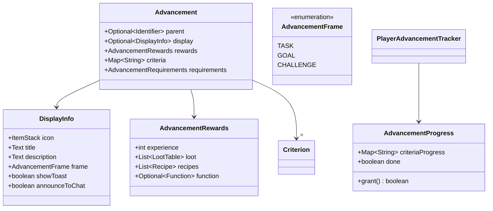
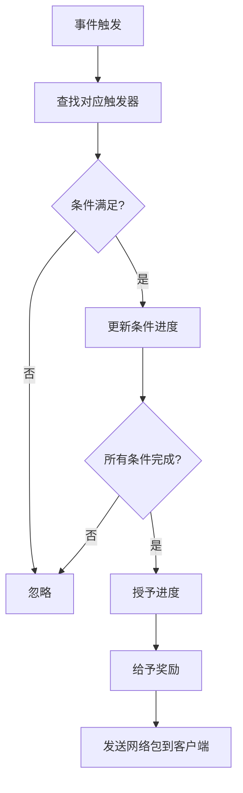

# 第 49 章：进度系统（Advancement）

## 章节目标

- 理解进度/成就系统的核心概念
- 掌握进度条的架构设计
- 学会创建自定义进度
- 了解触发器与条件机制

## 前置知识

- 数据包基础
- JSON 格式
- 战利品表基础

## 核心概念

### 什么是进度系统？

**进度系统（Advancement System）** 是 Minecraft 的成就/任务系统。你可以把它想象成**游戏中的"任务清单"**——列出了所有你可以完成的挑战目标，每完成一个就能获得奖励和成就感。

### 进度树结构

```
                         [根进度：冒险开始]
                                │
        ┌───────────────────────┼───────────────────────┐
        ▼                       ▼                       ▼
    [开采木头]              [获得物品]              [离开家乡]
        │                       │                       │
        ▼                       ▼                       ▼
    [橡木木板]              [起名]                 [下界之旅]
        │                       │                       │
        ▼                       ▼                       ▼
    [木棍]                  [社交]                 [重返家园]
        │                       │                       │
        ▼                       ▼                       ▼
    [木镐]                  [驯化动物]              [末影珍珠]
        │                       │                       │
        ▼                       ▼                       ▼
    [石镐]                  [骑兵]                 [末地传送门]
        │                                            │
        ▼                                            ▼
    [铁镐]                                       [末影龙]
        │                                            │
        ▼                                            ▼
    [钻石！]                                    [重返下界]
```

## 架构总览



## JSON 格式详解

### 完整进度示例

```json
{
    "display": {
        "icon": {
            "item": "minecraft:diamond",
            "nbt": "{Enchantments:[{id:\"minecraft:protection\",lvl:1}]}"
        },
        "title": "钻石猎人",
        "description": "获得你的第一颗钻石",
        "frame": "task",
        "background": "minecraft:textures/gui/advancements/backgrounds/stone.png",
        "show_toast": true,
        "announce_to_chat": true,
        "hidden": false,
        "coordinate_display": "shift"
    },
    "parent": "minecraft:story/mine_stone",
    "criteria": {
        "get_diamond": {
            "trigger": "minecraft:inventory_changed",
            "conditions": {
                "items": [
                    {
                        "items": ["minecraft:diamond"]
                    }
                ]
            }
        }
    },
    "requirements": [["get_diamond"]],
    "rewards": {
        "experience": 100,
        "loot": ["minecraft:gameplay/happy_hero_of_the_village"],
        "recipes": ["minecraft:diamond_pickaxe"],
        "function": "mymod:diamond_unlocked"
    }
}
```

## DisplayInfo 显示信息

### 图标设置

```json
"icon": {
    "item": "minecraft:diamond_sword"
}
```

```json
"icon": {
    "item": "minecraft:enchanted_book",
    "nbt": "{StoredEnchantments:[{id:\"minecraft:sharpness\",lvl:5}]}"
}
```

### 框架类型

| 框架 | 名称 | 颜色 | 用途 |
|------|------|------|------|
| `task` | 任务 | 绿色 ✓ | 普通成就 |
| `goal` | 目标 | 绿色 ⚑ | 中级目标 |
| `challenge` | 挑战 | 红色 ⚠ | 高难度挑战 |

### 背景设置

```json
"background": "minecraft:textures/gui/advancements/backgrounds/stone.png"
```

仅用于根进度，定义进度界面背景。

### 显示行为

```json
"show_toast": true,        // 完成后弹出提示
"announce_to_chat": true,  // 在聊天栏公告
"hidden": false            // 是否在界面隐藏（直到解锁父进度）
```

## Criteria 触发器详解

### 常用触发器

| 触发器 | 描述 | 条件 |
|--------|------|------|
| `inventory_changed` | 背包变化 | `items` |
| `player_killed_entity` | 击杀实体 | `entity` |
| `entity_killed_player` | 被实体击杀 | `entity` |
| `enter_block` | 进入方块 | `block`, `state` |
| `exit_block` | 离开方块 | `block`, `state` |
| `recipe_unlocked` | 配方解锁 | `recipe` |
| `tick` | 每刻检查 | `location`, `biome` |
| `location` | 位置检查 | `biome`, `dimension`, `position` |
| `effects_changed` | 效果变化 | `effects` |
| `bred_animals` | 动物繁殖 | `parent`, `partner`, `child` |
| `nether_travel` | 下界旅行 | `player`, `start_position`, `entering` |
| `tame_animal` | 驯服动物 | `entity` |
| `fishing_tick` | 钓鱼中 | `rod`, `entity`, `water` |
| `consume_item` | 消耗物品 | `item` |
| `placed_block` | 放置方块 | `block`, `state`, `location` |
| `shot_crossbow` | 射弩 | `item`, `projectile` |
| `ride_entity_in_lava` | 骑实体熔岩 | `vehicle` |

### 触发器条件详解

#### inventory_changed

```json
"criteria": {
    "get_diamond": {
        "trigger": "minecraft:inventory_changed",
        "conditions": {
            "items": [
                {
                    "items": ["minecraft:diamond"],
                    "count": {"min": 10},
                    "nbt": "{Enchantments:[{lvl:1s}]}"
                }
            ]
        }
    }
}
```

#### player_killed_entity

```json
"criteria": {
    "kill_zombie": {
        "trigger": "minecraft:player_killed_entity",
        "conditions": {
            "entity": {
                "type": "minecraft:zombie",
                "nbt": "{IsBaby:1b}"
            }
        }
    }
}
```

#### location

```json
"criteria": {
    "in_desert": {
        "trigger": "minecraft:location",
        "conditions": {
            "biome": "minecraft:desert",
            "dimension": "minecraft:overworld"
        }
    }
}
```

#### effects_changed

```json
"criteria": {
    "has_speed": {
        "trigger": "minecraft:effects_changed",
        "conditions": {
            "effects": {
                "minecraft:speed": {
                    "amplifier": {"min": 1}
                }
            }
        }
    }
}
```

## Requirements 条件组合

### 默认 AND 逻辑

```json
"criteria": {
    "diamond": {"trigger": "minecraft:inventory_changed", ...},
    "pickaxe": {"trigger": "minecraft:inventory_changed", ...}
},
"requirements": [["diamond"], ["pickaxe"]]
// 必须同时满足 diamond 和 pickaxe
```

### OR 逻辑

```json
"criteria": {
    "diamond": {"trigger": "minecraft:inventory_changed", ...},
    "emerald": {"trigger": "minecraft:inventory_changed", ...}
},
"requirements": [["diamond", "emerald"]]
// 满足 diamond 或 emerald 任意一个即可
```

### 复杂组合

```json
"criteria": {
    "gold_tool": {"trigger": "minecraft:inventory_changed", ...},
    "iron_tool": {"trigger": "minecraft:inventory_changed", ...},
    "diamond_tool": {"trigger": "minecraft:inventory_changed", ...}
},
"requirements": [["gold_tool", "iron_tool"], ["diamond_tool"]]
// (gold_tool OR iron_tool) AND diamond_tool
```

## Rewards 奖励详解

```json
"rewards": {
    "experience": 100,
    "loot": ["minecraft:gameplay/happy_hero_of_the_village"],
    "recipes": ["minecraft:diamond_pickaxe", "minecraft:diamond_sword"],
    "function": "mymod:rewards/diamond_achievement"
}
```

| 奖励 | 说明 |
|------|------|
| `experience` | 给予的经验值数量 |
| `loot` | 战利品表数组，生成额外物品 |
| `recipes` | 解锁的配方数组 |
| `function` | 触发数据包函数 |

## 实战演示：创建自定义进度

### 示例 1：铁傀儡猎人

```json
{
    "display": {
        "icon": {
            "item": "minecraft:iron_ingot"
        },
        "title": "铁傀儡猎人",
        "description": "击杀一个铁傀儡",
        "frame": "challenge",
        "show_toast": true,
        "announce_to_chat": true,
        "hidden": false
    },
    "parent": "minecraft:end/kill_agent",
    "criteria": {
        "defeat_iron_golem": {
            "trigger": "minecraft:player_killed_entity",
            "conditions": {
                "entity": {
                    "type": "minecraft:iron_golem"
                }
            }
        }
    },
    "requirements": [["defeat_iron_golem"]],
    "rewards": {
        "experience": 500,
        "loot": ["minecraft:gameplay/hero_of_the_village"],
        "recipes": ["minecraft:iron_ingot_from_iron_block"]
    }
}
```

### 示例 2：收集所有花朵

```json
{
    "display": {
        "icon": {
            "item": "minecraft:red_flower"
        },
        "title": "植物学家",
        "description": "收集每一种花",
        "frame": "goal",
        "show_toast": true,
        "announce_to_chat": true,
        "hidden": false
    },
    "parent": "minecraft:husbandry/plant_seed",
    "criteria": {
        "allium": {
            "trigger": "minecraft:inventory_changed",
            "conditions": {
                "items": [{"items": ["minecraft:red_flower"]}]
            }
        },
        "azure_bluet": {
            "trigger": "minecraft:inventory_changed",
            "conditions": {
                "items": [{"items": ["minecraft:azure_bluet"]}]
            }
        },
        "cornflower": {
            "trigger": "minecraft:inventory_changed",
            "conditions": {
                "items": [{"items": ["minecraft:cornflower"]}]
            }
        },
        "lily_of_the_valley": {
            "trigger": "minecraft:inventory_changed",
            "conditions": {
                "items": [{"items": ["minecraft:lily_of_the_valley"]}]
            }
        },
        "oxeye_daisy": {
            "trigger": "minecraft:inventory_changed",
            "conditions": {
                "items": [{"items": ["minecraft:oxeye_daisy"]}]
            }
        },
        "tulip_orange": {
            "trigger": "minecraft:inventory_changed",
            "conditions": {
                "items": [{"items": ["minecraft:orange_tulip"]}]
            }
        },
        "tulip_pink": {
            "trigger": "minecraft:inventory_changed",
            "conditions": {
                "items": [{"items": ["minecraft:pink_tulip"]}]
            }
        },
        "tulip_red": {
            "trigger": "minecraft:inventory_changed",
            "conditions": {
                "items": [{"items": ["minecraft:red_tulip"]}]
            }
        },
        "tulip_white": {
            "trigger": "minecraft:inventory_changed",
            "conditions": {
                "items": [{"items": ["minecraft:white_tulip"]}]
            }
        },
        "wither_rose": {
            "trigger": "minecraft:inventory_changed",
            "conditions": {
                "items": [{"items": ["minecraft:wither_rose"]}]
            }
        },
        "sunflower": {
            "trigger": "minecraft:inventory_changed",
            "conditions": {
                "items": [{"items": ["minecraft:sunflower"]}]
            }
        },
        "lilac": {
            "trigger": "minecraft:inventory_changed",
            "conditions": {
                "items": [{"items": ["minecraft:lilac"]}]
            }
        },
        "rose_bush": {
            "trigger": "minecraft:inventory_changed",
            "conditions": {
                "items": [{"items": ["minecraft:rose_bush"]}]
            }
        },
        "peony": {
            "trigger": "minecraft:inventory_changed",
            "conditions": {
                "items": [{"items": ["minecraft:peony"]}]
            }
        }
    },
    "requirements": [
        ["allium", "azure_bluet", "cornflower", "lily_of_the_valley", 
         "oxeye_daisy", "tulip_orange", "tulip_pink", "tulip_red", 
         "tulip_white", "wither_rose"],
        ["sunflower", "lilac", "rose_bush", "peony"]
    ]
}
```

## 源码中的触发检查

### PlayerAdvancementTracker.grant()

```java
public void grant(AdvancementEntry advancement) {
    // 获取或创建进度
    AdvancementProgress progress = this.getProgress(advancement);
    
    // 尝试授予进度
    if (progress.grant()) {  // 检查是否满足所有条件
        // 发送奖励
        advancement.getValue().rewards().apply(this.player);
        
        // 通知监听器
        thisListeners.forEach(listener ->
            listener.onAdvancementGranted(this.player, advancement));
        
        // 标记刷新
        this.refreshed.add(advancement.getId());
    }
}
```

### 触发器匹配流程



## 进度保存

进度数据保存在世界目录：

```
📁 world/
├── 📁 playerdata/
│   └── <uuid>.dat         # 玩家数据
├── 📁 stats/
│   └── <uuid>.json        # 统计
└── 📁 advancements/
    └── <uuid>.json         # 进度数据
```

## 课后自查

- [ ] 理解进度树的结构和 parent 关系
- [ ] 掌握 display 中各个字段的作用
- [ ] 能够创建基本的进度 JSON
- [ ] 理解触发器与条件的区别
- [ ] 掌握 requirements 的 AND/OR 逻辑
- [ ] 能够设置适当的奖励
- [ ] 理解进度解锁的流程

## 下一步

- **配方系统**：学习数据包中的配方定义
- **数据包发布**：学习如何完整打包数据包
- **模组开发**：使用 API 创建自定义触发器

---

*进度系统是 Minecraft 引导玩家探索世界的利器，精心设计的进度可以显著提升游戏体验！*
