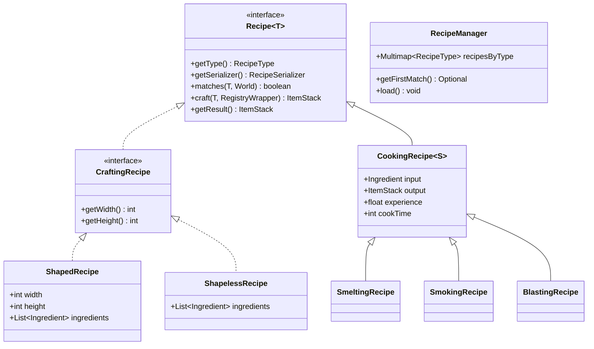
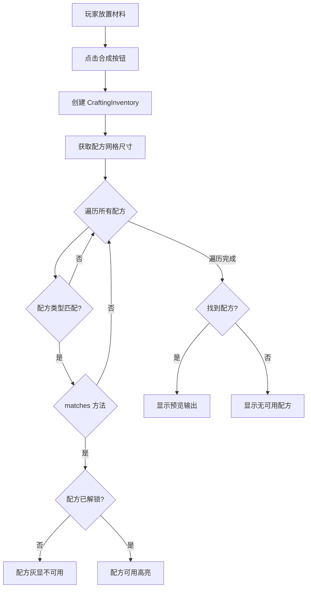

# 第 50 章：配方系统（Recipe System）

## 章节目标

- 理解配方系统的架构设计
- 掌握各种配方类型的 JSON 格式
- 学会创建自定义配方
- 了解源码中的匹配逻辑

## 前置知识

- 数据包基础
- JSON 格式
- Minecraft 物品系统基础

## 核心概念

### 什么是配方系统？

**配方系统（Recipe System）** 是 Minecraft 物品加工的核心机制。你可以把它想象成**餐厅的"食谱"**——告诉玩家如何用原料制作成品。

### 配方类型一览

```
┌─────────────────────────────────────────────────────────┐
│                    配方类型总览                           │
├─────────────────────────────────────────────────────────┤
│                                                         │
│   ┌─────────────┐  ┌─────────────┐  ┌─────────────┐   │
│   │ 有形状合成   │  │ 无形状合成   │  │ 熔炉烧制    │   │
│   │ Shaped      │  │ Shapeless   │  │ Smelting    │   │
│   └─────────────┘  └─────────────┘  └─────────────┘   │
│                                                         │
│   ┌─────────────┐  ┌─────────────┐  ┌─────────────┐   │
│   │ 烟熏炉      │  │ 高炉        │  │ 锻造        │   │
│   │ Smoking     │  │ Blasting    │  │ Smithing    │   │
│   └─────────────┘  └─────────────┘  └─────────────┘   │
│                                                         │
│   ┌─────────────┐  ┌─────────────┐  ┌─────────────┐   │
│   │ 切石        │  │ 酿造        │  │ 营火烹饪    │   │
│   │ Stonecutting│  │ Brewing     │  │ Campfire    │   │
│   └─────────────┘  └─────────────┘  └─────────────┘   │
│                                                         │
└─────────────────────────────────────────────────────────┘
```

## 架构总览



## 有形状合成 (Shaped)

### JSON 格式

```json
{
    "type": "minecraft:crafting_shaped",
    "group": "planks",
    "category": "building_blocks",
    "pattern": [
        "#",
        "#"
    ],
    "key": {
        "#": {
            "item": "minecraft:oak_log"
        }
    },
    "result": {
        "item": "minecraft:oak_planks",
        "count": 4
    },
    "show_notification": true
}
```

### Pattern 规则

```
1. 最多 3 行，每行最多 3 个字符
2. 空位用空格表示（可以省略行尾空格）
3. key 中定义的符号对应 pattern 中的字符
4. 支持镜像：可以水平翻转匹配
```

### 示例：木棍

```
Pattern:          匹配:
"#"               X
"#"        或     X
                  X

Key:
"#" = "stick"
```

### 示例：面包

```
Pattern:
"###"

Key:
"#" = "wheat"

Result: bread x1
```

### 多行示例：工作台

```
Pattern:
"##"
"##"

Key:
"#" = "oak_planks"

Result: crafting_table x1
```

## 无形状合成 (Shapeless)

### JSON 格式

```json
{
    "type": "minecraft:crafting_shapeless",
    "group": "dyes",
    "category": "misc",
    "ingredients": [
        {"item": "minecraft:white_dye"},
        {"item": "minecraft:blue_dye"}
    ],
    "result": {
        "item": "minecraft:light_blue_dye",
        "count": 2
    }
}
```

### 特点

- 任意位置放置材料
- 材料数量精确匹配（顺序无关）
- 常用于染色、药水等

## 烹饪配方 (Cooking)

### 熔炉烧制 (Smelting)

```json
{
    "type": "minecraft:smelting",
    "group": "food",
    "category": "food",
    "ingredient": {
        "item": "minecraft:potato"
    },
    "result": "minecraft:baked_potato",
    "experience": 0.35,
    "cookingtime": 200
}
```

### 烟熏炉 (Smoking)

```json
{
    "type": "minecraft:smoking",
    "group": "food",
    "category": "food",
    "ingredient": {
        "item": "minecraft:cod"
    },
    "result": "minecraft:cooked_cod",
    "experience": 0.35,
    "cookingtime": 100
}
```

### 高炉 (Blasting)

```json
{
    "type": "minecraft:blasting",
    "group": "blocks",
    "category": "building_blocks",
    "ingredient": {
        "tag": "minecraft:iron_ores"
    },
    "result": "minecraft:iron_ingot",
    "experience": 0.7,
    "cookingtime": 100
}
```

### 营火烹饪 (Campfire)

```json
{
    "type": "minecraft:campfire_cooking",
    "group": "food",
    "category": "food",
    "ingredient": {
        "item": "minecraft:beef"
    },
    "result": "minecraft:cooked_beef",
    "experience": 0.35,
    "cookingtime": 600
}
```

### 烹饪时间对照

| 类型 | 时间 (ticks) | 秒数 |
|------|-------------|------|
| 熔炉 | 200 | 10秒 |
| 烟熏炉 | 100 | 5秒 |
| 高炉 | 100 | 5秒 |
| 营火 | 600 | 30秒 |

## 锻造配方 (Smithing)

### 锻造升级 (Transform)

```json
{
    "type": "minecraft:smithing_transform",
    "template": {
        "item": "minecraft:netherite_upgrade_smithing_template"
    },
    "base": {
        "item": "minecraft:diamond_sword"
    },
    "addition": {
        "item": "minecraft:netherite_ingot"
    },
    "result": {
        "item": "minecraft:netherite_sword"
    }
}
```

### 锻造修剪 (Trim)

```json
{
    "type": "minecraft:smithing_trim",
    "template": {
        "item": "minecraft:diamond_smithing_trim"
    },
    "base": {
        "item": "minecraft:netherite_chestplate"
    },
    "addition": {
        "item": "minecraft:diamond"
    }
}
```

## 切石配方 (Stonecutting)

```json
{
    "type": "minecraft:stonecutting",
    "group": "wooden_blocks",
    "ingredient": {
        "item": "minecraft:oak_log"
    },
    "result": "minecraft:oak_planks",
    "count": 4
}
```

### 一原料多产物

```json
{
    "type": "minecraft:stonecutting",
    "ingredient": {
        "item": "minecraft:cobblestone"
    },
    "result": "minecraft:stone"
}
```

```json
{
    "type": "minecraft:stonecutting",
    "ingredient": {
        "item": "minecraft:cobblestone"
    },
    "result": "minecraft:cobblestone_stairs"
}
```

可以创建多个配方文件，共享同一个原料。

## 标签作为材料

```json
{
    "type": "minecraft:crafting_shaped",
    "pattern": [
        "###",
        "###",
        "###"
    ],
    "key": {
        "#": {
            "tag": "minecraft:planks"
        }
    },
    "result": {
        "item": "minecraft:chest"
    }
}
```

支持的标签：
- `minecraft:planks`
- `minecraft:logs`
- `minecraft:wool`
- `minecraft:stone_crafting_materials`
- `minecraft:iron_ores`
- `minecraft:gold_ores`
- `minecraft:diamond_ores`
- `minecraft:coals`
- 等等...

## 配方分类 (Category)

| 分类 | 说明 |
|------|------|
| `building_blocks` | 建筑方块 |
| `decorations` | 装饰物品 |
| `misc` | 杂项 |
| `food` | 食物 |
| `tools` | 工具 |
| `combat` | 战斗 |
| `brewing` | 酿造 |

## 配方组 (Group)

```json
{
    "type": "minecraft:crafting_shaped",
    "group": "planks",
    ...
}
```

拥有相同 `group` 的配方在游戏中会被分组显示。

## 实战演示：创建自定义配方

### 示例 1：超级钻石剑

```json
{
    "type": "minecraft:smithing_transform",
    "template": {
        "item": "minecraft:netherite_upgrade_smithing_template"
    },
    "base": {
        "item": "minecraft:diamond_sword"
    },
    "addition": {
        "item": "minecraft:diamond",
        "count": 8
    },
    "result": {
        "item": "minecraft:diamond_sword",
        "nbt": "{display:{Name:'{\"text\":\"超级钻石剑\",\"color\":\"aqua\",\"italic\":false}',Lore:['{\"text\":\"钻石打造的究极之剑\"}']},Enchantments:[{id:\"minecraft:sharpness\",lvl:10},{id:\"minecraft:unbreaking\",lvl:5}]}"
    }
}
```

### 示例 2：经验瓶配方

```json
{
    "type": "minecraft:crafting_shaped",
    "group": "experience_bottles",
    "pattern": [
        " # ",
        " X ",
        " L "
    ],
    "key": {
        "#": {"item": "minecraft:blaze_powder"},
        "X": {"item": "minecraft:glass_bottle"},
        "L": {"tag": "minecraft:arrows"}
    },
    "result": {
        "item": "minecraft:experience_bottle",
        "count": 1
    }
}
```

### 示例 3：高级皮革护甲

```json
{
    "type": "minecraft:crafting_shapeless",
    "group": "leather_armor_dye",
    "ingredients": [
        {"item": "minecraft:leather_helmet"},
        {"item": "minecraft:lapis_lazuli"}
    ],
    "result": {
        "item": "minecraft:leather_helmet",
        "nbt": "{display:{color:255}}"
    }
}
```

## 配方匹配流程



## 源码中的匹配逻辑

### ShapedRecipe.matches()

```java
public boolean matches(CraftingInventory inventory, World world) {
    // 从左上角开始尝试所有可能的位置
    for (int y = 0; y <= inventory.getHeight() - this.height; y++) {
        for (int x = 0; x <= inventory.getWidth() - this.width; x++) {
            // 检查当前偏移是否匹配
            if (this.matchesPattern(inventory, x, y)) {
                return true;
            }
        }
    }
    return false;
}

private boolean matchesPattern(CraftingInventory inventory, int offsetX, int offsetY) {
    for (int y = 0; y < this.height; y++) {
        for (int x = 0; x < this.width; x++) {
            int slot = (y + offsetY) * inventory.getWidth() + (x + offsetX);
            ItemStack inputStack = inventory.getStack(slot);
            Ingredient ingredient = this.ingredients.get(y * this.width + x);

            // 检查空格
            if (ingredient.isEmpty()) {
                if (!inputStack.isEmpty()) {
                    return false;
                }
            } else {
                if (!ingredient.test(inputStack)) {
                    return false;
                }
            }
        }
    }
    return true;
}
```

## 配方书系统

玩家解锁的配方会显示在配方书中：


### 配方解锁触发

```json
{
    "type": "minecraft:crafting_shapeless",
    ...
    "result": {
        "item": "minecraft:enchanted_book"
    }
}
```

当制作出结果时，配方自动解锁。

## 课后自查

- [ ] 理解有形状和无形状配方的区别
- [ ] 掌握烹饪配方的各种类型和时间
- [ ] 能够创建锻造升级配方
- [ ] 理解切石配方的特点
- [ ] 能够使用标签作为材料
- [ ] 理解配方的匹配逻辑
- [ ] 掌握配方组的作用

## 下一步

- **数据包综合实践**：创建完整的数据包
- **模组开发**：使用 API 创建自定义配方类型
- **红石自动化**：学习自动合成系统

---

*配方系统是 Minecraft 生存模式的核心，掌握它你可以创造全新的游戏内容！*
