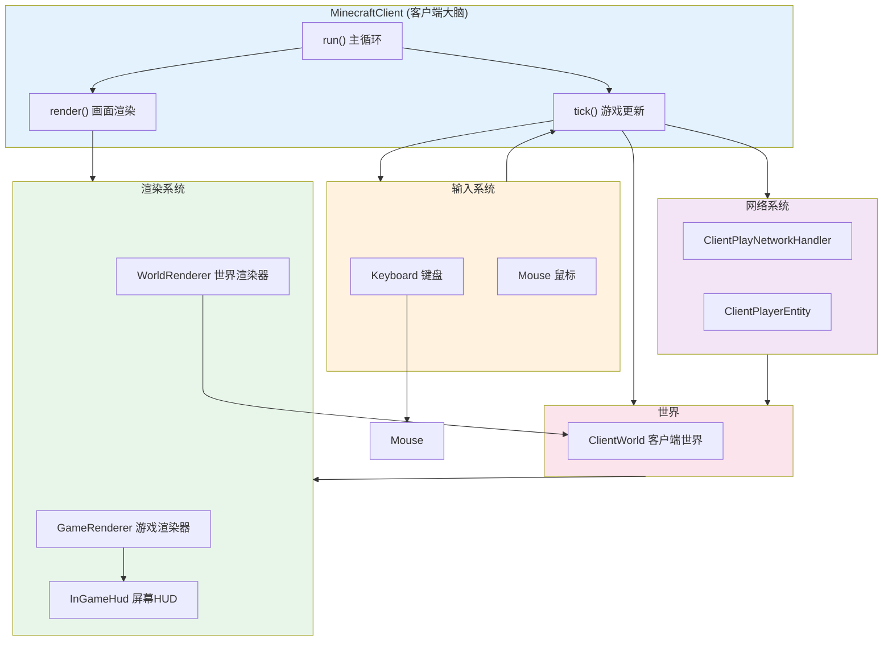
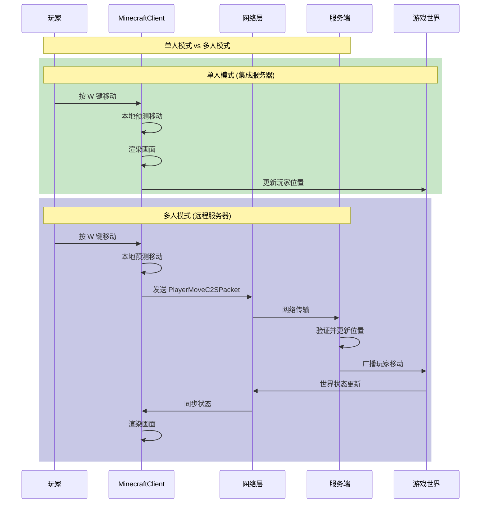

# 第45章 Minecraft 客户端核心

## 目标

- 理解 `MinecraftClient` 是什么
- 了解客户端的游戏主循环
- 掌握客户端的线程模型
- 区分客户端和服务端的不同职责

## 前置知识

- 了解 Java 基础（线程、对象）
- 知道什么是游戏循环（Game Loop）
- 了解 Part-6 网络部分的基本概念

## 核心概念

### 什么是 MinecraftClient？

想象一下你家门口的**快递柜**：

```
┌─────────────────────────────────────────────────────┐
│                    MinecraftClient                    │
│                                                      │
│   它是客户端的"大脑"，负责：                            │
│   - 显示画面给玩家看                                   │
│   - 接收玩家的键盘鼠标操作                              │
│   - 播放声音效果                                       │
│   - 管理网络连接（和服务器通信）                         │
└─────────────────────────────────────────────────────┘
```

`MinecraftClient` 是 Minecraft 客户端的主类，就像厨房里的**总厨师长**：

- **服务端（MinecraftServer）**：负责"做菜"（游戏逻辑、生成世界）
- **客户端（MinecraftClient）**：负责"摆盘"（把游戏画面展示给玩家）

### 客户端 vs 服务端

| 职责 | 客户端 (Client) | 服务端 (Server) |
|------|----------------|-----------------|
| **显示画面** | ✅ 必须！ | ❌ 不需要 |
| **处理输入** | ✅ 必须！ | ❌ 不需要 |
| **生成世界** | ❌ 不负责 | ✅ 必须 |
| **物理模拟** | 预测性模拟 | 权威模拟 |
| **多人通信** | 发送操作，接收结果 | 接收操作，广播结果 |

### 游戏主循环

就像动画片的制作原理——每秒播放多张图片，让你感觉画面在"动"。

```
Minecraft 的主循环 = 无限循环 + 两大任务

┌──────────────────────────────────────────────────────────┐
│                    游戏主循环 (run方法)                    │
│                                                          │
│   while (游戏在运行) {                                    │
│       ┌─────────────────────────────────┐                │
│       │ 1. 处理输入                     │                │
│       │    - 键盘有没有按？               │                │
│       │    - 鼠标有没有动？               │                │
│       └─────────────────────────────────┘                │
│                    ↓                                      │
│       ┌─────────────────────────────────┐                │
│       │ 2. 更新游戏逻辑（Tick）           │                │
│       │    - 移动玩家                    │                │
│       │    - 更新实体                    │                │
│       └─────────────────────────────────┘                │
│                    ↓                                      │
│       ┌─────────────────────────────────┐                │
│       │ 3. 渲染画面（Render）            │                │
│       │    - 画天空                      │                │
│       │    - 画方块                      │                │
│       │    - 画玩家                      │                │
│       │    - 画HUD                       │                │
│       └─────────────────────────────────┘                │
│   }                                                      │
└──────────────────────────────────────────────────────────┘
```

### 线程模型

Minecraft 客户端像一个**餐厅厨房**，有多个厨师同时工作：

```
┌─────────────────────────────────────────────────────────────────┐
│                      客户端线程模型                                │
│                                                                  │
│  ┌──────────────────┐                                             │
│  │   主线程          │  ← 运行游戏主循环 (run方法)                    │
│  │   (Client Thread) │  ← 处理输入、更新逻辑、渲染                    │
│  └────────┬─────────┘                                             │
│           │                                                        │
│           ├──────────────────┬──────────────────┐                  │
│           ↓                  ↓                  ↓                  │
│  ┌─────────────┐    ┌─────────────┐    ┌─────────────┐           │
│  │  渲染线程    │    │  资源加载线程 │    │  网络线程    │           │
│  │  (Render)   │    │  (Resource) │    │  (Network) │           │
│  └─────────────┘    └─────────────┘    └─────────────┘           │
│       ↑                  ↑                  ↑                       │
│       │                  │                  │                       │
│  画到屏幕上        加载材质/模型        接收/发送数据包               │
└─────────────────────────────────────────────────────────────────┘
```

## 图解（Mermaid）

### MinecraftClient 组件关系图



### 客户端与服务器通信流程



## 核心代码

### MinecraftClient 的关键组件

```java
// 源码位置: MinecraftClient.java

public class MinecraftClient {
    // ====== 输入设备 ======
    public final Mouse mouse;           // 鼠标
    public final Keyboard keyboard;     // 键盘

    // ====== 渲染系统 ======
    public final GameRenderer gameRenderer;   // 游戏渲染器
    public final WorldRenderer worldRenderer; // 世界渲染器
    public final InGameHud inGameHud;        // 屏幕HUD

    // ====== 世界与玩家 ======
    @Nullable public ClientWorld world;      // 客户端世界
    @Nullable public ClientPlayerEntity player; // 玩家实体

    // ====== 网络 ======
    @Nullable public ClientPlayNetworkHandler networkHandler;
    @Nullable public IntegratedServer server; // 集成服务器(单人)
}
```

### 游戏主循环核心代码

```java
// 源码位置: MinecraftClient.java - run()方法

public void run() {
    // 主循环
    while (this.running) {
        try {
            // 开始性能分析
            profiler.startTick();
            
            // 渲染一帧
            this.render(!bl);  // bl = 是否是崩溃后恢复
            
            profiler.endTick();
        } catch (OutOfMemoryError e) {
            // 内存不足处理
            this.cleanUpAfterCrash();
            this.setScreen(new OutOfMemoryScreen());
        }
    }
}
```

### Tick（游戏更新）

```java
// 源码位置: MinecraftClient.java - tick()方法

public void tick(boolean paused) {
    if (!paused) {
        // 更新输入（键盘、鼠标状态）
        this.mouse.tick();
        this.keyboard.tick();
        
        // 更新玩家输入
        if (this.player != null) {
            this.player.input.tick(this.world.isRainingAt(this.player.getBlockPos()));
        }
        
        // 更新网络
        if (this.networkHandler != null) {
            this.networkHandler.tick();
        }
        
        // 更新HUD
        this.inGameHud.tick(paused);
    }
}
```

## 实战演示

### 场景：玩家按下跳跃键

1. **玩家操作**：按空格键跳跃
2. **输入检测**：
   ```java
   // KeyboardInput.tick() 检测按键
   this.jumping = this.settings.jumpKey.isPressed();
   ```
3. **本地预测**：
   - 客户端先在本地模拟跳跃动作
   - 让玩家感觉操作是"即时响应"的
4. **发送数据包**：
   ```java
   // 发送跳跃数据包给服务器
   PlayerActionC2SPacket packet = new PlayerActionC2SPacket(...);
   connection.send(packet);
   ```
5. **服务器验证**：
   - 服务器验证跳跃是否合法
   - 广播给其他玩家
6. **状态同步**：
   - 客户端接收服务器确认
   - 如果预测错误，进行"回滚"

## 小结

1. **MinecraftClient** = 客户端的主控制类，掌管渲染、输入、网络
2. **游戏主循环** = 处理输入 → 更新逻辑 → 渲染画面（无限循环）
3. **客户端线程模型** = 主线程 + 渲染线程 + 网络线程 + 资源加载线程
4. **客户端预测** = 在收到服务器确认前，本地模拟操作以减少延迟感
5. **客户端 ≠ 服务端** = 客户端负责显示，服务端负责逻辑

## 练习

1. 在源码中找到 `MinecraftClient.java`，阅读 `run()` 方法
2. 找出 `tick()` 方法，了解每个 tick 都做什么
3. 思考：为什么客户端需要"预测"玩家移动？

## 相关链接

- 下一章：[第46章 渲染系统](./46-render-system.md) - 深入了解渲染
- Part-6 网络：[网络基础](../Part-6-Network/33-network-intro.md)
- 服务端对比：[MinecraftServer 核心](../Part-6-Network/33-network-intro.md)

---

### 源码文件位置

| 文件 | 源码路径 | 说明 |
|------|----------|------|
| MinecraftClient.java | `net/minecraft/client/MinecraftClient.java` | 客户端主类，管理渲染、输入、网络 |
| TickRecorder.java | `net/minecraft/util/TickRecorder.java` | Tick 录制器 |
| Window.java | `net/minecraft/client/Window.java` | 窗口管理类 |

---

**关键词**：MinecraftClient、Game Loop、Tick、Thread、Render、Input、Client Prediction
