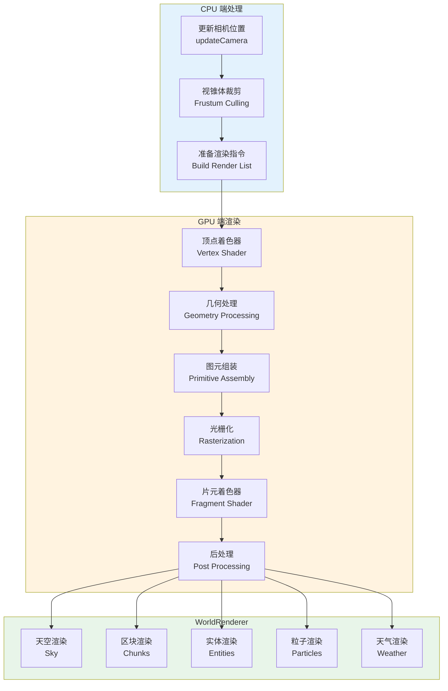
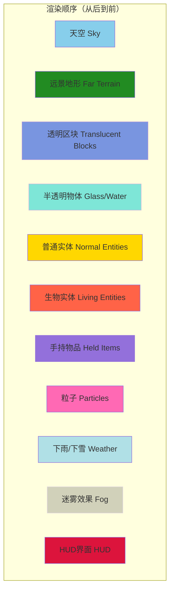

# 第46章 渲染系统

## 目标

- 理解什么是渲染系统
- 了解 GameRenderer 和 WorldRenderer 的区别
- 掌握渲染管线的基本流程
- 认识着色器（Shader）的概念

## 前置知识

- 了解 Minecraft 客户端的基本结构（第45章）
- 知道什么是"画图"和"3D游戏"
- 了解材质/贴图的基本概念

## 核心概念

### 什么是渲染？

想象你是一个**画家**在画画：

```
┌─────────────────────────────────────────────────────┐
│                    渲染 = "画画"                      │
│                                                      │
│   画家画画过程:                                        │
│   1. 准备好画布和颜料                                 │
│   2. 画背景（天空、白云）                              │
│   3. 画远处的山                                       │
│   4. 画近处的树木                                     │
│   5. 画房子和人物                                     │
│   6. 画前景的草和花朵                                 │
│   7. 签名、装裱                                      │
│                                                      │
│   Minecraft 渲染过程（类似）:                           │
│   1. 清理画布（屏幕）                                  │
│   2. 画天空和太阳                                     │
│   3. 画远处地形                                       │
│   4. 画近处方块                                       │
│   5. 画实体（玩家、生物）                              │
│   6. 画粒子和特效                                     │
│   7. 画HUD（血条、背包等）                            │
└─────────────────────────────────────────────────────┘
```

### GameRenderer vs WorldRenderer

| 组件 | GameRenderer | WorldRenderer |
|------|--------------|---------------|
| **负责** | 游戏渲染总控 | 世界渲染（方块、地形） |
| **位置** | `render/GameRenderer.java` | `render/WorldRenderer.java` |
| **职责** | 管理相机、绘制HUD、绘制手持物品 | 绘制地形、方块、实体 |
| **比喻** | 画展的总策展人 | 负责画风景的画家 |

```
┌─────────────────────────────────────────────────────────────┐
│                      渲染系统架构                            │
│                                                              │
│  ┌─────────────────────────────────────────────────────┐    │
│  │                   GameRenderer                       │    │
│  │  (总导演)                                            │    │
│  │                                                      │    │
│  │  ┌─────────────┐  ┌─────────────┐  ┌────────────┐ │    │
│  │  │  相机管理    │  │  着色器管理  │  │  特效处理   │ │    │
│  │  │  Camera     │  │  Shader     │  │  Post-FX   │ │    │
│  │  └─────────────┘  └─────────────┘  └────────────┘ │    │
│  │                                                      │    │
│  │  ┌─────────────┐  ┌─────────────┐                   │    │
│  │  │  绘制HUD    │  │  绘制手持物品 │                   │    │
│  │  │  InGameHud  │  │  HeldItem   │                   │    │
│  │  └─────────────┘  └─────────────┘                   │    │
│  │           ↓                                          │    │
│  └───────────┼──────────────────────────────────────────┘    │
│              ↓                                                 │
│  ┌───────────────────────────────────────────────────────┐    │
│  │                    WorldRenderer                       │    │
│  │  (风景画家)                                           │    │
│  │                                                        │    │
│  │  ┌─────────────┐  ┌─────────────┐  ┌─────────────┐   │    │
│  │  │  天空渲染   │  │  Chunk渲染  │  │  实体渲染   │   │    │
│  │  │  Sky        │  │  方块地形   │  │  Entities   │   │    │
│  │  └─────────────┘  └─────────────┘  └─────────────┘   │    │
│  │                                                      │    │
│  │  ┌─────────────┐  ┌─────────────┐  ┌─────────────┐   │    │
│  │  │  粒子渲染   │  │  天气渲染   │  │  区块缓冲   │   │    │
│  │  │  Particles  │  │  Weather   │  │  Chunks    │   │    │
│  │  └─────────────┘  └─────────────┘  └─────────────┘   │    │
│  └───────────────────────────────────────────────────────┘    │
└─────────────────────────────────────────────────────────────┘
```

### 渲染管线（Rendering Pipeline）

渲染就像**工厂流水线**，每一帧都要走完所有步骤：

```
┌──────────────────────────────────────────────────────────────────┐
│                      渲染管线流程                                  │
│                                                                   │
│  1. 【CPU准备阶段】                                                │
│  ┌──────────┐    ┌──────────┐    ┌──────────┐                    │
│  │ 相机更新 │ → │ 视锥裁剪  │ → │ 排序绘制 │                     │
│  │ Camera   │    │ Frustum  │    │ Sorting  │                     │
│  └──────────┘    └──────────┘    └──────────┘                    │
│                          ↓                                        │
│  2. 【GPU绘制阶段】                                                │
│  ┌──────────┐    ┌──────────┐    ┌──────────┐                    │
│  │ 顶点处理 │ → │ 图元组装 │ → │  光栅化  │                    │
│  │ Vertex   │    │ Primitive│    │ Rasterize│                    │
│  └──────────┘    └──────────┘    └──────────┘                    │
│                          ↓                                        │
│  3. 【像素着色】                                                   │
│  ┌──────────┐    ┌──────────┐    ┌──────────┐                    │
│  │ 纹理采样 │ → │ 光照计算 │ → │ 颜色输出 │                    │
│  │ Texture  │    │ Lighting │    │ Output   │                    │
│  └──────────┘    └──────────┘    └──────────┘                    │
│                                                                   │
│  4. 【后处理】                                                     │
│  ┌──────────┐    ┌──────────┐    ┌──────────┐                    │
│  │ 模糊效果 │ → │ 色彩调整 │ → │ 输出屏幕 │                    │
│  │  Blur   │    │  Color   │    │  Screen  │                    │
│  └──────────┘    └──────────┘    └──────────┘                    │
└──────────────────────────────────────────────────────────────────┘
```

### 着色器（Shader）

着色器就像给画作上色的"调色师"：

```
┌─────────────────────────────────────────────────────┐
│                  着色器类型                           │
│                                                      │
│  【顶点着色器 Vertex Shader】                          │
│  - 处理每个顶点的位置                                   │
│  - 类似于：决定每个颜料点画在哪里                        │
│  ┌─────────────────────────────────────┐             │
│  │  input: 顶点坐标                     │             │
│  │  output: 变换后的位置                 │             │
│  └─────────────────────────────────────┘             │
│                                                      │
│  【片元着色器 Fragment Shader】                        │
│  - 计算每个像素的颜色                                   │
│  - 类似于：决定每个位置涂什么颜色                        │
│  ┌─────────────────────────────────────┐             │
│  │  input: 纹理坐标、光照等              │             │
│  │  output: 最终颜色                     │             │
│  └─────────────────────────────────────┘             │
│                                                      │
│  【例子：苦力怕为什么是绿色的？】                        │
│  - 片元着色器里写着：                                   │
│  - if (是苦力怕) return 绿色;                          │
│  - else if (是羊) return 白色;                         │
└─────────────────────────────────────────────────────┘
```

## 图解（Mermaid）

### 渲染管线详细流程



### Minecraft 渲染层级



## 核心代码

### GameRenderer 渲染入口

```java
// 源码位置: GameRenderer.java

public class GameRenderer {
    public final MinecraftClient client;
    private final Camera camera;
    
    public void render(float tickDelta) {
        // 1. 准备渲染
        this.client.getProfiler().push("game_renderer");
        
        // 2. 更新相机
        this.updateCamera(tickDelta);
        
        // 3. 渲染世界
        this.client.getWorldRenderer().render(tickDelta);
        
        // 4. 渲染手持物品
        if (this.renderHand) {
            this.renderHand(tickDelta);
        }
        
        // 5. 渲染HUD
        this.client.getInGameHud().render(tickDelta);
        
        // 6. 后处理效果（模糊、泛光等）
        this.renderPostEffect();
    }
}
```

### WorldRenderer 世界渲染

```java
// 源码位置: WorldRenderer.java

public class WorldRenderer {
    // 渲染天空
    private void renderSky(float tickDelta) { ... }
    
    // 渲染地形区块
    private void renderChunks(...) { ... }
    
    // 渲染实体
    public void renderEntities(...) { ... }
    
    // 渲染天气
    private void renderWeather(...) { ... }
}
```

### 着色器程序

```java
// 源码位置: GameRenderer.java

public class GameRenderer {
    // 预加载的着色器程序
    @Nullable private static ShaderProgram positionProgram;
    @Nullable private static ShaderProgram positionColorProgram;
    @Nullable private static ShaderProgram positionTexProgram;
    @Nullable private static ShaderProgram positionTexColorProgram;
    @Nullable private static ShaderProgram renderTypeSolidProgram;
    @Nullable private static ShaderProgram renderTypeCutoutProgram;
    @Nullable private static ShaderProgram renderTypeTranslucentProgram;
    // ... 更多着色器
    
    public void preloadPrograms(ResourceFactory factory) {
        // 加载所有着色器
        this.programs.put("position", 
            new ShaderProgram(factory, "position"));
        this.programs.put("rendertype_solid", 
            new ShaderProgram(factory, "rendertype_solid"));
        // ...
    }
}
```

## 实战演示

### 场景：渲染一帧画面

1. **玩家转动视角**
   ```java
   // Mouse.updateMouse() 计算鼠标移动
   this.client.player.changeLookDirection(i, j);
   ```

2. **更新相机**
   ```java
   // GameRenderer.updateCamera()
   camera.update(this.client.world, this.client.getEntity(),
                 this.client.options.getPerspective().isFirstPerson(),
                 false, tickDelta);
   ```

3. **设置视锥体**
   ```java
   // 创建视锥体用于裁剪
   Frustum frustum = new Frustum(
       camera.getRotation().toMatrix4f(),
       camera.getProjection()
   );
   ```

4. **渲染世界**
   ```java
   // WorldRenderer.render()
   this.setupCullFrustum();
   this.getWorld().iterateEntities();
   this.renderChunks(tickDelta);
   ```

5. **渲染HUD**
   ```java
   // InGameHud.render()
   this.renderHotbar();
   this.renderHealthBar();
   this.renderStatusEffects();
   ```

## 小结

1. **渲染** = 把游戏世界"画"到屏幕上
2. **GameRenderer** = 渲染系统的总指挥，管理相机、整体流程
3. **WorldRenderer** = 负责画风景、方块、实体
4. **渲染管线** = CPU准备 → GPU绘制 → 后处理
5. **着色器** = GPU上运行的小程序，决定如何给像素上色

## 练习

1. 在源码中找到 `GameRenderer.java`，阅读 `render()` 方法
2. 找出 `WorldRenderer.java` 中渲染天气的代码
3. 查看 `shaders/` 目录，了解 Minecraft 使用的 GLSL 着色器

## 相关链接

- 下一章：[第47章 GUI系统](./47-gui-system.md) - 了解界面渲染
- Part-9：[Minecraft客户端核心](./45-minecraft-client.md)
- 着色器语言：GLSL 教程

---

### 源码文件位置

| 文件 | 源码路径 | 说明 |
|------|----------|------|
| WorldRenderer.java | `net/minecraft/client/render/WorldRenderer.java` | 世界渲染器，负责绘制地形、方块、实体 |
| GameRenderer.java | `net/minecraft/client/render/GameRenderer.java` | 游戏渲染器总控，管理相机和整体流程 |
| Shader.java | `net/minecraft/client/gl/Shader.java` | 着色器基类 |

---

**关键词**：Render、GameRenderer、WorldRenderer、Shader、Pipeline、Frustum
