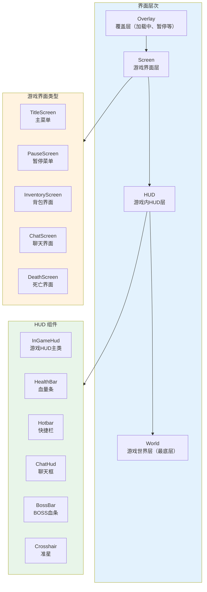
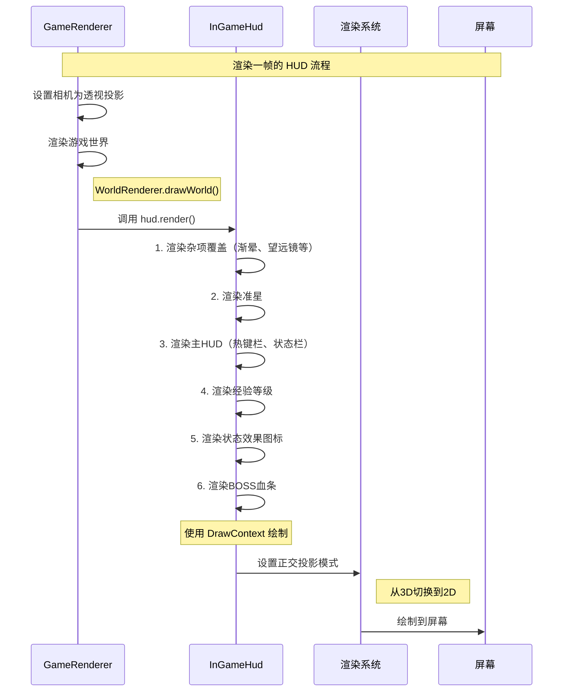
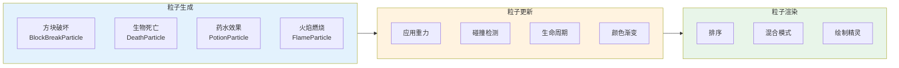

# 第47章 GUI系统

## 目标

- 理解什么是 GUI 系统
- 了解 Screen 基类的设计
- 掌握 HUD 的渲染原理
- 认识粒子效果系统

## 前置知识

- 了解 Minecraft 客户端基本结构（第45章）
- 知道什么是"界面"、"按钮"、"血条"
- 了解渲染系统基础（第46章）

## 核心概念

### 什么是 GUI？

GUI = **图形用户界面**（Graphical User Interface）

想象你家的**电视遥控器**：

```
┌─────────────────────────────────────────────────────┐
│                   GUI = 遥控器                        │
│                                                      │
│   电视（游戏）本身：                                   │
│   - 能播放画面、有声音                                 │
│   - 但没有遥控器，你很难控制它                          │
│                                                      │
│   遥控器（GUI）提供：                                  │
│   - 开关按钮（开始游戏、退出游戏）                      │
│   - 音量调节（设置菜单）                               │
│   - 频道切换（切换游戏模式）                            │
│   - 显示当前频道（显示当前信息）                        │
│                                                      │
│   Minecraft GUI = 游戏世界的"遥控器"                    │
└─────────────────────────────────────────────────────┘
```

### GUI 的组成

| 组件 | 作用 | 示例 |
|------|------|------|
| **Screen** | 界面容器，承载所有元素 | 背包界面、设置菜单 |
| **Button** | 可点击的按钮 | 确认按钮、选项切换 |
| **TextField** | 文本输入框 | 聊天输入、命名框 |
| **Slider** | 滑动条 | 音量调节、音乐大小 |
| **HUD** | 游戏中的小部件 | 血条、饥饿值、小地图 |
| **Tooltip** | 悬浮提示 | 物品说明、按钮提示 |

### Screen 基类

所有界面都继承自 `Screen` 类，就像所有手机都基于同一个操作系统：

```
┌─────────────────────────────────────────────────────────────┐
│                       Screen 基类                            │
│  (所有界面的"老祖宗")                                        │
│                                                              │
│  ┌─────────────────────────────────────────────────────────┐ │
│  │                   Screen                               │ │
│  │  - 管理界面上的所有元素（按钮、文本框等）                  │ │
│  │  - 处理键盘和鼠标输入                                    │ │
│  │  - 负责渲染界面背景                                     │ │
│  └─────────────────────────────────────────────────────────┘ │
│                          ↓                                    │
│    ┌─────────────┬─────────────┬─────────────┐                 │
│    ↓             ↓             ↓             ↓                 │
│ ┌──────┐   ┌──────────┐  ┌────────┐   ┌────────┐            │
│ │Title │   │Inventory │  │Chat    │   │Pause   │            │
│ │Screen│   │Screen    │  │Screen  │   │Menu    │            │
│ │主菜单│   │背包界面   │  │聊天界面 │   │暂停菜单 │            │
│ └──────┘   └──────────┘  └────────┘   └────────┘            │
└─────────────────────────────────────────────────────────────┘
```

### HUD 是什么？

HUD = **抬头显示**（Head-Up Display）

就像战斗机的**仪表盘**：

```
┌─────────────────────────────────────────────────────┐
│           HUD = 战斗机的仪表盘                         │
│                                                      │
│   战斗机飞行员需要：                                   │
│   - 同时看到外界和仪表数据                              │
│   - 速度、高度、燃料、目标位置...                        │
│   - 不能因为看仪表而撞山！                              │
│                                                      │
│   游戏玩家需要：                                       │
│   - 同时看到游戏世界和状态信息                           │
│   - 血量、饥饿值、背包、坐标...                          │
│   - 不能因为看血条而被僵尸咬！                          │
│                                                      │
│   解决方案：HUD 叠加在游戏世界上方                       │
└─────────────────────────────────────────────────────┘
```

### Minecraft HUD 组成

| HUD元素 | 位置 | 作用 |
|---------|------|------|
| **准星** | 屏幕中央 | 瞄准指示 |
| **血量心** | 左下角 | 显示生命值 |
| **饥饿值** | 左下角（心下方） | 显示饱食度 |
| **护甲值** | 心左边 | 显示护甲 |
| **经验条** | 屏幕下方中间 | 显示等级和经验 |
| **热键栏** | 屏幕下方 | 显示快捷栏物品 |
| **聊天框** | 左下角 | 显示和输入聊天 |
| **生命条** | 骑乘生物时 | 显示生物血量 |
| **BOSS血条** | 屏幕上方 | 显示BOSS血量 |
| **物品提示** | 鼠标附近 | 显示物品信息 |

### 粒子效果

粒子 = **小颗粒**，用于表现各种视觉效果：

```
┌─────────────────────────────────────────────────────┐
│                 Minecraft 粒子效果                    │
│                                                      │
│  【破坏方块】                                         │
│  💥 方块碎裂 → 飞散的小方块颗粒                        │
│                                                      │
│  【水的流动】                                         │
│  💧 水滴下落 → 溅起的水花                             │
│                                                      │
│  【火焰燃烧】                                         │
│  🔥 火焰闪烁 → 上升的火苗                             │
│                                                      │
│  【爆炸】                                             │
│  💣 爆炸 → 烟雾、火焰、碎石混合                        │
│                                                      │
│  【下雪】                                             │
│  ❄️ 雪花飘落 → 白色小圆点缓缓下落                       │
│                                                      │
│  【脚印】                                            │
│  👣 行走 → 雪地上的脚印（不是真正的粒子）                │
└─────────────────────────────────────────────────────┘
```

## 图解（Mermaid）

### 屏幕层级架构



### HUD 渲染流程



### 粒子系统流程



## 核心代码

### Screen 基类结构

```java
// 源码位置: gui/screen/Screen.java

public abstract class Screen extends AbstractParentElement implements Drawable {
    
    // 界面标题
    protected final Text title;
    
    // 界面尺寸
    public int width;
    public int height;
    
    // 所有可绘制元素
    private final List<Drawable> drawables = Lists.newArrayList();
    
    // Minecraft 客户端引用
    @Nullable protected MinecraftClient client;
    
    // 渲染方法
    @Override
    public void render(DrawContext context, int mouseX, int mouseY, float delta) {
        // 1. 绘制背景
        this.renderBackground(context, mouseX, mouseY, delta);
        
        // 2. 绘制所有子元素
        for (Drawable drawable : this.drawables) {
            drawable.render(context, mouseX, mouseY, delta);
        }
    }
    
    // 键盘事件
    @Override
    public boolean keyPressed(int keyCode, int scanCode, int modifiers) { ... }
    
    // 鼠标点击事件
    @Override
    public boolean mouseClicked(double mouseX, double mouseY, int button) { ... }
}
```

### HUD 渲染主类

```java
// 源码位置: gui/hud/InGameHud.java

public class InGameHud {
    private final MinecraftClient client;
    private final ChatHud chatHud;
    private final BossBarHud bossBarHud;
    private final PlayerListHud playerListHud;
    private final LayeredDrawer layeredDrawer = new LayeredDrawer();
    
    // HUD 分层渲染
    public void render(DrawContext context, RenderTickCounter tickCounter) {
        RenderSystem.enableDepthTest();
        this.layeredDrawer.render(context, tickCounter);
        RenderSystem.disableDepthTest();
    }
    
    // 渲染热键栏
    private void renderHotbar(DrawContext context, ...) {
        // 绘制热键栏背景
        context.drawGuiTexture(HOTBAR_TEXTURE, x, y, 182, 22);
        
        // 绘制每个物品栏
        for (int i = 0; i < 9; i++) {
            this.renderHotbarItem(context, x, y, ...);
        }
    }
    
    // 渲染血量条
    private void renderHealthBar(DrawContext context, ...) {
        // 绘制心形图标
        for (int i = 0; i < hearts; i++) {
            this.drawHeart(context, type, x, y, ...);
        }
    }
}
```

### 粒子管理器

```java
// 源码位置: particle/ParticleManager.java

public class ParticleManager implements ResourceReloader {
    private final ClientWorld world;
    private final Object2ObjectMap<ParticleEffect, ParticleManager.ParticleTextureData> ...
    
    // 生成粒子
    public void emitParticles(World world, BlockPos pos, ParticleEffect parameters, ...) {
        // 创建新粒子并添加到世界
    }
    
    // 常用粒子发射方法
    public void addDustParticles(BlockPos pos, int count) {
        for (int i = 0; i < count; i++) {
            this.emitParticles(world, pos, ParticleTypes.DRAGON_BREATH, ...);
        }
    }
}

// 使用例子
this.client.particleManager.addBlockBreakParticles(pos, state);
```

## 实战演示

### 场景：打开背包界面

1. **玩家按 E 键**
   ```java
   // KeyboardInput 或 KeyBinding
   if (this.client.options.inventoryKey.wasPressed()) {
       this.client.player.openHandledScreen();
   }
   ```

2. **创建背包界面**
   ```java
   // ClientPlayerEntity
   @Nullable
   public ScreenHandler openHandledScreen() {
       NamedScreenHandlerFactory factory = this.getCurrentScreenHandler();
       if (factory != null) {
           this.client.setScreen(new InventoryScreen(this));
           return factory.createMenu(this);
       }
       return null;
   }
   ```

3. **Screen 初始化**
   ```java
   // InventoryScreen
   protected void init() {
       // 创建物品槽
       this.addRenderableWidget(new PlayerInventoryPanel(...));
       
       // 创建标签页按钮（创造模式）
       this.addRenderableWidget(new TabButton(...));
   }
   ```

4. **渲染背包**
   ```java
   // InventoryScreen.render()
   super.render(context, mouseX, mouseY, delta);
   
   // 绘制物品（已由子组件完成）
   // 绘制物品Tooltip
   if (hoveredSlot != null && hoveredSlot.hasStack()) {
       context.drawTooltip(this.getTextRenderer(), 
           hoveredSlot.getStack().getName(), mouseX, mouseY);
   }
   ```

## 小结

1. **GUI** = 游戏界面，让玩家和游戏交互
2. **Screen** = 所有界面的基类，管理元素和输入
3. **HUD** = 叠加在游戏画面上的状态显示
4. **粒子** = 小型视觉效果，用于丰富画面
5. **层级** = 屏幕层级（游戏内HUD → 游戏界面 → 覆盖层）

## 练习

1. 在源码中找到 `Screen.java`，了解界面的生命周期方法
2. 查看 `InGameHud.java`，找出渲染准星和热键栏的代码
3. 在游戏中触发不同事件（如破坏方块），观察产生的粒子

## 相关链接

- 下一章：[第48章 输入处理](./48-input-handling.md) - 键盘鼠标控制
- Part-9：[渲染系统](./46-render-system.md)
- Part-9：[Minecraft客户端核心](./45-minecraft-client.md)

---

### 源码文件位置

| 文件 | 源码路径 | 说明 |
|------|----------|------|
| Screen.java | `net/minecraft/client/gui/screen/Screen.java` | 界面基类 |
| HandledScreen.java | `net/minecraft/client/gui/screen/HandledScreen.java` | 带物品槽的界面基类 |
| InGameHud.java | `net/minecraft/client/gui/hud/InGameHud.java` | 游戏内 HUD 渲染器 |
| DrawContext.java | `net/minecraft/client/gui/DrawContext.java` | 2D 绘制上下文 |

---

**关键词**：GUI、Screen、HUD、Particle、Tooltip、Inventory、Render
