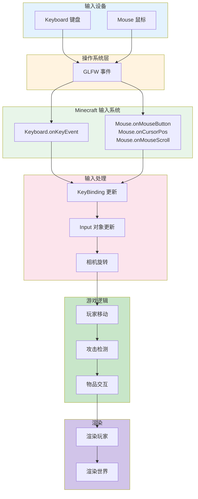
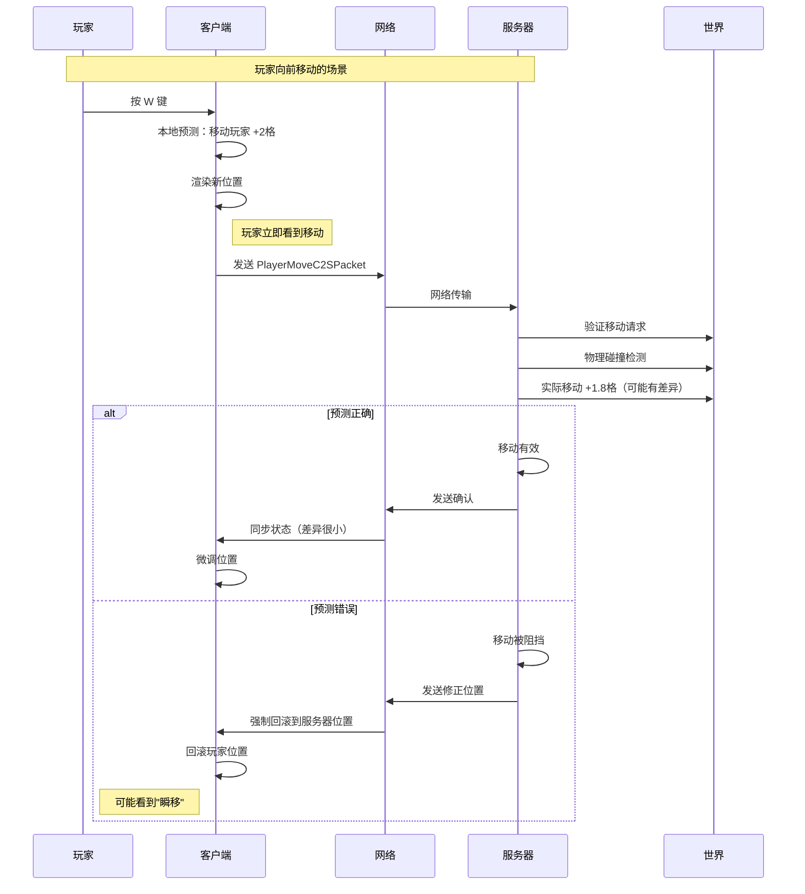

# 第48章 输入处理

## 目标

- 理解什么是输入处理
- 了解 Keyboard 和 Mouse 类的工作原理
- 掌握快捷键绑定（KeyBinding）系统
- 了解客户端预测的概念

## 前置知识

- 了解 Minecraft 客户端基本结构（第45章）
- 知道什么是键盘、鼠标事件
- 了解 GUI 系统基础（第47章）

## 核心概念

### 什么是输入处理？

想象你是一家餐厅的**服务员**：

```
┌─────────────────────────────────────────────────────┐
│               输入处理 = 服务员的工作                  │
│                                                      │
│   顾客（玩家）发出需求：                               │
│   - "我要一份牛排" → 顾客按 E 打开菜单                 │
│   - "我要喝水" → 顾客按 F 喝手中的水                    │
│   - "我要离开" → 顾客按 Esc 退出                       │
│                                                      │
│   服务员（输入系统）需要：                              │
│   1. 听懂顾客的需求（监听按键/鼠标）                    │
│   2. 记住顾客点了什么（记录按键状态）                   │
│   3. 把需求传给厨房（通知游戏逻辑）                     │
│   4. 给顾客反馈（显示界面变化）                        │
└─────────────────────────────────────────────────────┘
```

### 输入设备

| 设备 | Minecraft中的用途 |
|------|-------------------|
| **键盘** | 移动（WASD）、跳跃（空格）、交互（E）、聊天（T）等 |
| **鼠标** | 移动视角、点击按钮、左键攻击、右键使用 |
| **滚轮** | 切换快捷栏物品 |
| **手柄** | 移动、视角、快捷键（支持手柄） |

### Keyboard 类

`Keyboard.java` 负责监听键盘事件：

```
┌─────────────────────────────────────────────────────┐
│              Keyboard 输入处理流程                    │
│                                                      │
│  1. 【初始化】                                       │
│     keyboard.setup(windowHandle)                     │
│     ↓                                                │
│     向窗口注册键盘回调                                │
│                                                      │
│  2. 【事件触发】                                      │
│     用户按下键盘 → GLFW 发送事件                       │
│     ↓                                                │
│                                                      │
│  3. 【事件处理】                                      │
│     onKeyEvent(keyCode, scanCode, action, mods)      │
│     ↓                                                │
│                                                      │
│  4. 【分发处理】                                      │
│     ┌────────────┬────────────┐                       │
│     ↓            ↓            ↓                       │
│  聊天界面?   游戏菜单？   游戏内？                      │
│  (ChatScreen)  (PauseScreen)  (World)                │
│                                                      │
│  5. 【快捷键检查】                                    │
│     KeyBinding.setKeyPressed(key, true)              │
└─────────────────────────────────────────────────────┘
```

### Mouse 类

`Mouse.java` 负责监听鼠标事件：

```
┌─────────────────────────────────────────────────────┐
│              Mouse 输入处理流程                       │
│                                                      │
│  【鼠标按钮】                                         │
│  ┌─────────┬─────────┬─────────┐                     │
│  │ 左键    │ 中键    │ 右键    │                     │
│  │ 攻击    │ 望远镜  │ 使用    │                     │
│  │ Button=0│ Button=1│ Button=2│                     │
│  └─────────┴─────────┴─────────┘                     │
│                                                      │
│  【鼠标移动】                                         │
│  - cursorDeltaX/Y: 鼠标移动量                         │
│  - 用于旋转视角（第一/第三人称）                       │
│                                                      │
│  【滚轮】                                            │
│  - eventDeltaVerticalWheel: 垂直滚动量                │
│  - 用于切换快捷栏物品                                  │
│                                                      │
│  【特殊处理】                                         │
│  - Mac系统: Ctrl+左键 = 右键                          │
│  - 触屏模式: 模拟鼠标输入                              │
└─────────────────────────────────────────────────────┘
```

### KeyBinding 快捷键绑定

`KeyBinding` 是 Minecraft 的快捷键系统，让玩家可以自定义按键：

```
┌─────────────────────────────────────────────────────┐
│            KeyBinding 快捷键系统                      │
│                                                      │
│  【按键分类】                                         │
│  ┌──────────────────────────────────────────────┐  │
│  │ MOVEMENT_CATEGORY (移动)                       │  │
│  │ - 前进: W                                      │  │
│  │ - 后退: S                                      │  │
│  │ - 左移: A                                      │  │
│  │ - 右移: D                                      │  │
│  │ - 跳跃: 空格                                    │  │
│  │ - 潜行: 左Shift                                  │  │
│  └──────────────────────────────────────────────┘  │
│                                                      │
│  ┌──────────────────────────────────────────────┐  │
│  │ GAMEPLAY_CATEGORY (游戏操作)                   │  │
│  │ - 攻击/破坏: 鼠标左键                           │  │
│  │ - 使用物品: 鼠标右键                            │  │
│  │ - 丢弃物品: Q                                  │  │
│  │ - 物品栏: E                                    │  │
│  └──────────────────────────────────────────────┘  │
│                                                      │
│  【按键状态】                                         │
│  ┌──────────────────────────────────────────────┐  │
│  │ isPressed(): 按键是否正在被按住                 │  │
│  │ wasPressed(): 按键是否刚刚被按下（消费一次）     │  │
│  │ timesPressed: 记录按键被按了多少次              │  │
│  └──────────────────────────────────────────────┘  │
└─────────────────────────────────────────────────────┘
```

### 客户端预测（Client Prediction）

网络延迟就像打电话时的延迟：

```
┌─────────────────────────────────────────────────────┐
│           客户端预测 = 减少"电话延迟"的感觉             │
│                                                      │
│  【没有预测的情况】                                   │
│  玩家按 W → 等待服务器确认 → 角色才移动                │
│           ↓                                          │
│     (延迟200ms = 卡顿明显)                            │
│                                                      │
│  【有预测的情况】                                     │
│  玩家按 W → 客户端立即移动 → 同时发送数据包              │
│           ↓                                          │
│     (感觉是即时响应)                                  │
│           ↓                                          │
│     服务器确认/修正                                    │
│           ↓                                          │
│     如果预测错误，进行"回滚"                            │
└─────────────────────────────────────────────────────┘
```

## 图解（Mermaid）

### 输入处理流程



### 快捷键绑定系统

```mermaid
flowchart LR
    subgraph Registry["快捷键注册"]
        A1["new KeyBinding<br/>('key.forward', KEY_W, CATEGORY)"]
        A2["new KeyBinding<br/>('key.jump', KEY_SPACE, CATEGORY)"]
        A3["new KeyBinding<br/>('key.inventory', KEY_E, CATEGORY)"]
    end

    subgraph State["按键状态管理"]
        B1["KEYS_BY_ID<br/>Map<String, KeyBinding>"]
        B2["KEY_TO_BINDINGS<br/>Map<Key, KeyBinding>"]
        B3["pressed: boolean<br/>timesPressed: int"]
    end

    subgraph Update["每Tick更新"]
        C1["updatePressedStates()"]
        C2["调用 isKeyPressed() 检查"]
        C3["更新 pressed 状态"]
    end

    subgraph Use["使用快捷键"]
        D1["wasPressed()"]
        D2["isPressed()"]
    end

    Registry --> State
    State --> Update
    Update --> Use

    style Registry fill:#e3f2fd
    style State fill:#fff3e0
    style Update fill:#e8f5e9
    style Use fill:#c8e6c9
```



### 客户端预测与服务器同步



## 核心代码

### Keyboard 类

```java
// 源码位置: Keyboard.java

public class Keyboard {
    private final MinecraftClient client;
    
    // 处理键盘按下/释放
    private void onKey(long window, int key, int scanCode, int action, int modifiers) {
        if (action == GLFW.GLFW_PRESS) {
            // 按键按下
            KeyBinding.setKeyPressed(InputUtil.Type.KEYSYM.createFromCode(key), true);
            
            // 处理特殊按键
            if (key == GLFW.GLFW_KEY_ESCAPE) {
                // ESC 键 - 关闭界面或暂停
                this.client.scheduleStop();
            } else if (this.client.currentScreen != null) {
                // 当前有界面，交给界面处理
                this.client.currentScreen.keyPressed(key, scanCode, modifiers);
            }
        } else if (action == GLFW.GLFW_RELEASE) {
            // 按键释放
            KeyBinding.setKeyPressed(InputUtil.Type.KEYSYM.createFromCode(key), false);
        }
    }
}
```

### Mouse 类

```java
// 源码位置: Mouse.java

public class Mouse {
    private double cursorDeltaX;
    private double cursorDeltaY;
    
    // 处理鼠标移动
    private void onCursorPos(long window, double x, double y) {
        this.cursorDeltaX += x - this.x;
        this.cursorDeltaY += y - this.y;
        this.x = x;
        this.y = y;
    }
    
    // 处理鼠标点击
    private void onMouseButton(long window, int button, int action, int mods) {
        if (action == GLFW.GLFW_PRESS) {
            if (this.client.currentScreen != null) {
                // 界面点击
                this.client.currentScreen.mouseClicked(...);
            } else {
                // 游戏内点击
                if (button == 0) {
                    // 左键 - 攻击
                    this.client.leftButtonClicked = true;
                } else if (button == 2) {
                    // 右键 - 使用
                    this.client.rightButtonClicked = true;
                }
            }
        }
    }
    
    // 更新视角（每tick）
    private void updateMouse(double timeDelta) {
        // 鼠标灵敏度设置
        double sensitivity = this.client.options.getMouseSensitivity().getValue();
        double multiplier = sensitivity * sensitivity * sensitivity * 8.0;
        
        // 计算视角变化
        double yawDelta = this.cursorDeltaX * multiplier;
        double pitchDelta = this.cursorDeltaY * multiplier;
        
        // 更新玩家视角
        if (this.client.player != null) {
            this.client.player.changeLookDirection(yawDelta, pitchDelta);
        }
    }
}
```

### KeyBinding 系统

```java
// 源码位置: option/KeyBinding.java

public class KeyBinding implements Comparable<KeyBinding> {
    // 所有按键绑定
    private static final Map<String, KeyBinding> KEYS_BY_ID = Maps.newHashMap();
    // 按键到绑定的映射
    private static final Map<InputUtil.Key, KeyBinding> KEY_TO_BINDINGS = Maps.newHashMap();
    
    // 按键状态
    private InputUtil.Key boundKey;
    private boolean pressed;
    private int timesPressed;  // 按下次数（用于 wasPressed）
    
    // 创建一个新的快捷键
    public KeyBinding(String translationKey, int defaultKey, String category) {
        this.translationKey = translationKey;
        this.boundKey = InputUtil.Type.KEYSYM.createFromCode(defaultKey);
        this.category = category;
        KEYS_BY_ID.put(translationKey, this);
        KEY_TO_BINDINGS.put(this.boundKey, this);
    }
    
    // 按键是否正在被按住
    public boolean isPressed() {
        return this.pressed;
    }
    
    // 按键是否刚刚被按下（消费一次）
    public boolean wasPressed() {
        if (this.timesPressed == 0) {
            return false;
        }
        this.timesPressed--;
        return true;
    }
    
    // 每tick更新按键状态
    public static void updatePressedStates() {
        for (KeyBinding binding : KEYS_BY_ID.values()) {
            // 检查当前按键是否被按下
            binding.setPressed(InputUtil.isKeyPressed(
                MinecraftClient.getInstance().getWindow().getHandle(),
                binding.boundKey.getCode()
            ));
        }
    }
}
```

### 键盘输入

```java
// 源码位置: input/KeyboardInput.java

public class KeyboardInput extends Input {
    private final GameOptions settings;
    
    @Override
    public void tick(boolean slowDown, float slowDownFactor) {
        // 检测按键状态
        this.pressingForward = this.settings.forwardKey.isPressed();
        this.pressingBack = this.settings.backKey.isPressed();
        this.pressingLeft = this.settings.leftKey.isPressed();
        this.pressingRight = this.settings.rightKey.isPressed();
        
        // 计算移动方向
        this.movementForward = KeyboardInput.getMovementMultiplier(
            this.pressingForward, this.pressingBack
        );
        this.movementSideways = KeyboardInput.getMovementMultiplier(
            this.pressingLeft, this.pressingRight
        );
        
        // 跳跃和潜行
        this.jumping = this.settings.jumpKey.isPressed();
        this.sneaking = this.settings.sneakKey.isPressed();
        
        // 减速处理（在水下、岩浆中等）
        if (slowDown) {
            this.movementSideways *= slowDownFactor;
            this.movementForward *= slowDownFactor;
        }
    }
}
```

## 实战演示

### 场景：玩家向前移动

1. **玩家按 W 键**
   ```java
   // GLFW 检测到按键
   // Keyboard.onKey() 被调用
   ```

2. **更新 KeyBinding 状态**
   ```java
   // KeyboardInput.tick()
   this.pressingForward = this.settings.forwardKey.isPressed();
   // 返回 true，因为 W 键被按下了
   ```

3. **计算移动向量**
   ```java
   // ClientPlayerEntity.tick()
   Vec3d input = new Vec3d(
       this.input.sideways,  // A/D 的值
       0,                    // Y 轴（跳跃分开处理）
       this.input.forward    // W/S 的值
   );
   ```

4. **本地预测移动**
   ```java
   // ClientPlayerEntity.move()
   // 先在客户端模拟移动
   Vec3d newPos = this.pos.add(input.multiply(speed));
   ```

5. **发送数据包**
   ```java
   // ClientPlayerEntity.sendMovementPackets()
   // 告诉服务器玩家当前位置
   ```

6. **服务器验证并广播**
   ```java
   // ServerPlayNetworkHandler
   // 验证并同步给其他玩家
   ```

## 小结

1. **输入处理** = 把玩家的按键/鼠标操作转换成游戏动作
2. **Keyboard** = 负责监听键盘事件（按下、释放）
3. **Mouse** = 负责监听鼠标事件（移动、点击、滚轮）
4. **KeyBinding** = 管理可自定义的快捷键，支持查询按键状态
5. **客户端预测** = 在收到服务器确认前本地模拟操作，减少延迟感

## 练习

1. 在源码中找到 `Keyboard.java`，阅读按键处理方法
2. 在源码中找到 `Mouse.java`，了解鼠标移动如何影响视角
3. 查看 `KeyBinding.java`，理解 `isPressed()` 和 `wasPressed()` 的区别
4. 思考：为什么需要区分"按住"和"刚按下"两种状态？

## 相关链接

- Part-9：[GUI系统](./47-gui-system.md) - 界面与输入的交互
- Part-9：[Minecraft客户端核心](./45-minecraft-client.md)
- Part-6 网络：[网络同步](../Part-6-Network/36-sync-mechanism.md) - 了解预测与同步

---

### 源码文件位置

| 文件 | 源码路径 | 说明 |
|------|----------|------|
| ClientPlayerEntity.java | `net/minecraft/client/network/ClientPlayerEntity.java` | 客户端玩家实体，处理输入和预测 |
| Keyboard.java | `net/minecraft/client/keyboard/Keyboard.java` | 键盘输入处理 |
| Mouse.java | `net/minecraft/client/mouse/Mouse.java` | 鼠标输入处理 |
| KeyBinding.java | `net/minecraft/client/option/KeyBinding.java` | 快捷键绑定系统 |

---

**关键词**：Input、Keyboard、Mouse、KeyBinding、GLFW、Client Prediction
