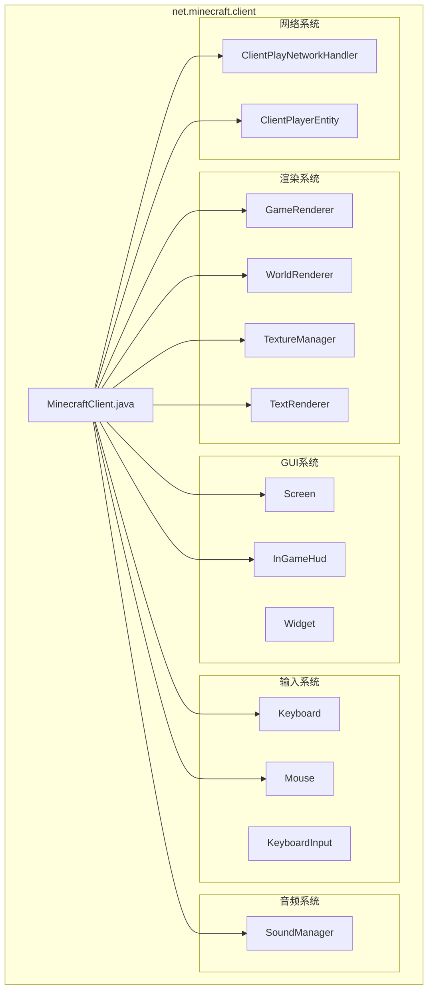
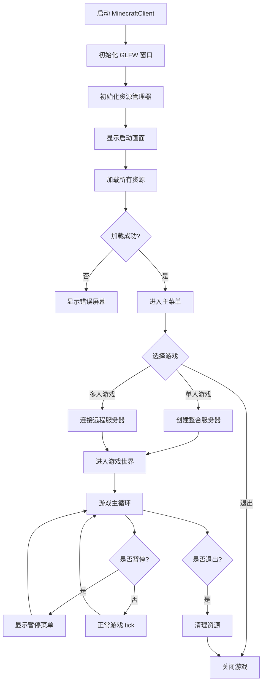

# 第 51 章：MinecraftClient 主类（MinecraftClient）

## 章节目标

- 理解 MinecraftClient 的核心地位和职责
- 掌握客户端初始化的完整流程
- 了解游戏主循环的实现机制
- 学会分析客户端与服务器的交互

## 前置知识

- Java 基础
- 了解 Minecraft 的客户端/服务器架构
- 熟悉线程概念

## 核心概念

### 什么是 MinecraftClient？

**MinecraftClient** 是 Minecraft 客户端的核心主类，运行在玩家的电脑上。你可以把它想象成**游戏客户端的"大脑"**——它协调所有子系统的运作，从渲染到声音，从输入到网络通信。

### MinecraftClient 的关键职责

```
┌─────────────────────────────────────────────────────────────┐
│                    MinecraftClient                             │
├─────────────────────────────────────────────────────────────┤
│                                                             │
│  🎮 游戏主循环 - 每秒运行 20 次游戏刻                        │
│  🖼️ 渲染协调  - 协调 GameRenderer 和 WorldRenderer         │
│  🔊 声音管理  - 通过 SoundManager 播放音效                   │
│  ⌨️ 输入处理  - 处理键盘、鼠标输入                          │
│  🌐 网络通信  - 管理与服务器的连接                          │
│  📦 资源加载  - 加载纹理、模型、音效等资源                   │
│  🖥️ 屏幕管理  - 控制当前显示的 GUI 屏幕                    │
│                                                             │
└─────────────────────────────────────────────────────────────┘
```

## 客户端包结构



## 源码解析

### 类的定义

```java
@Environment(value=EnvType.CLIENT)
public class MinecraftClient
extends ReentrantThreadExecutor<Runnable>
implements WindowEventHandler {
```

关键特点：
- 使用 `@Environment(EnvType.CLIENT)` 注解，**仅在客户端存在**
- 继承 `ReentrantThreadExecutor` 用于任务调度
- 实现 `WindowEventHandler` 处理窗口事件
- **继承 Thread** 但以 `run()` 方法形式运行主循环

### 核心组件初始化

```java
493:673:source/net/minecraft/client/MinecraftClient.java
public MinecraftClient(RunArgs args) {
    super("Client");
    instance = this;  // 单例模式
    
    // 1. 基础配置
    this.runDirectory = args.directories.runDir;
    this.resourcePackDir = args.directories.resourcePackDir.toPath();
    this.networkProxy = args.network.netProxy;
    this.authenticationService = new YggdrasilAuthenticationService(this.networkProxy);
    this.sessionService = this.authenticationService.createMinecraftSessionService();
    this.session = args.network.session;
    
    // 2. 窗口系统
    this.windowProvider = new WindowProvider(this);
    this.window = this.windowProvider.createWindow(windowSettings, ...);
    this.mouse = new Mouse(this);
    this.mouse.setup(this.window.getHandle());
    this.keyboard = new Keyboard(this);
    this.keyboard.setup(this.window.getHandle());
    
    // 3. 资源管理
    this.resourceManager = new ReloadableResourceManagerImpl(ResourceType.CLIENT_RESOURCES);
    this.textureManager = new TextureManager(this.resourceManager);
    this.fontManager = new FontManager(this.textureManager);
    this.textRenderer = this.fontManager.createTextRenderer();
    
    // 4. 渲染系统
    this.bakedModelManager = new BakedModelManager(...);
    this.entityRenderDispatcher = new EntityRenderDispatcher(...);
    this.itemRenderer = new ItemRenderer(...);
    this.particleManager = new ParticleManager(...);
    this.gameRenderer = new GameRenderer(...);
    this.worldRenderer = new WorldRenderer(...);
    
    // 5. HUD和UI
    this.inGameHud = new InGameHud(this);
    
    // 6. 音频系统
    this.soundManager = new SoundManager(this.options);
    
    // 7. 加载资源
    SplashOverlay.init(this);
    this.setScreen(new MessageScreen(Text.translatable("gui.loadingMinecraft")));
    ResourceReload resourceReload = this.resourceManager.reload(...);
    this.setOverlay(new SplashOverlay(this, resourceReload, ...));
}
```

### 游戏主循环

```java
818:855:source/net/minecraft/client/MinecraftClient.java
public void run() {
    this.thread = Thread.currentThread();
    // 高优先级线程（如果 CPU > 4 核）
    if (Runtime.getRuntime().availableProcessors() > 4) {
        this.thread.setPriority(10);
    }
    
    try {
        while (this.running) {  // 主循环
            this.printCrashReport();
            try {
                TickDurationMonitor tickDurationMonitor = TickDurationMonitor.create("Renderer");
                this.profiler.startTick();
                this.recorder.startTick();
                this.render(!bl);  // 核心渲染调用
                this.recorder.endTick();
                this.profiler.endTick();
            } catch (OutOfMemoryError outOfMemoryError) {
                if (bl) throw outOfMemoryError;
                this.cleanUpAfterCrash();
                this.setScreen(new OutOfMemoryScreen());
            }
        }
    } catch (CrashException crashException) {
        this.printCrashReport(crashException.getReport());
    }
}
```

### 渲染方法详解

```java
1130:1234:source/net/minecraft/client/MinecraftClient.java
private void render(boolean tick) {
    this.window.setPhase("Pre render");
    
    // 1. 处理渲染任务队列
    while ((runnable = this.renderTaskQueue.poll()) != null) {
        runnable.run();
    }
    
    // 2. 处理游戏刻（如果需要）
    if (tick) {
        this.profiler.push("tick");
        for (int j = 0; j < Math.min(10, i); ++j) {
            this.tick();
        }
        this.profiler.pop();
    }
    
    // 3. 音频更新
    this.soundManager.updateListenerPosition(this.gameRenderer.getCamera());
    
    // 4. 清除缓冲区
    RenderSystem.clear(GlConst.GL_DEPTH_BUFFER_BIT | GlConst.GL_COLOR_BUFFER_BIT, ...);
    this.framebuffer.beginWrite(true);
    
    // 5. 鼠标输入处理
    this.mouse.tick();
    
    // 6. 游戏渲染
    if (!this.skipGameRender) {
        this.gameRenderer.render(this.renderTickCounter, tick);
    }
    
    // 7. 帧缓冲区绘制到屏幕
    this.framebuffer.endWrite();
    this.framebuffer.draw(this.window.getFramebufferWidth(), this.window.getFramebufferHeight());
    
    // 8. 更新FPS统计
    ++this.fpsCounter;
    this.paused = ...;  // 暂停状态判断
}
```

### 屏幕管理

```java
1029:1065:source/net/minecraft/client/MinecraftClient.java
public void setScreen(@Nullable Screen screen) {
    if (this.currentScreen != null) {
        this.currentScreen.removed();  // 清理旧屏幕
    }
    
    // 空屏幕的特殊处理
    if (screen == null && this.world == null) {
        screen = new TitleScreen();  // 返回主菜单
    } else if (screen == null && this.player.isDead()) {
        if (this.player.showsDeathScreen()) {
            screen = new DeathScreen(null, this.world.getLevelProperties().isHardcore());
        }
    }
    
    this.currentScreen = screen;
    if (this.currentScreen != null) {
        this.currentScreen.onDisplayed();
        screen.init(this, this.window.getScaledWidth(), this.window.getScaledHeight());
    }
}
```

## 关键设计模式

### 1. 单例模式

```java
// MinecraftClient 内部持有静态实例
private static MinecraftClient instance;
public static MinecraftClient getInstance() {
    return instance;
}
```

### 2. 线程模型

```
主线程 (Client Thread)
    │
    ├── 运行游戏主循环
    ├── 处理渲染
    └── 管理窗口事件
    │
    ▼
资源加载线程 (Resource Loading)
    │
    ├── 异步加载资源
    └── 后台处理纹理、模型等
    │
    ▼
网络线程 (Network Thread)
    │
    ├── 处理服务器通信
    └── 处理数据包
```

### 3. 任务调度

继承 `ReentrantThreadExecutor` 用于安全地调度任务：

```java
// 在渲染线程执行任务
client.execute(() -> {
    // 这个任务会在下一帧执行
    player.sendMessage(Text.literal("Hello!"));
});
```

## 客户端生命周期图



## 实战：理解客户端与服务器的关系

### 整合服务器 (Integrated Server)

单人游戏时，MinecraftClient 内部运行一个完整的服务器：

```java
// 单人游戏时创建整合服务器
this.integratedServer = new IntegratedServer(this, this.runDirectory, ...);
this.integratedServer.startServerThread();
```

### 远程服务器连接

多人游戏时，通过网络连接：

```java
// ClientPlayNetworkHandler 处理所有游戏数据包
public class ClientPlayNetworkHandler implements ClientPlayPacketListener {
    private ClientWorld world;  // 客户端世界
    private final ClientPlayerEntity player;  // 本地玩家
    private final GameProfile profile;  // 玩家信息
}
```

## 常见调试技巧

### 1. F3 调试菜单快捷键

| 快捷键 | 功能 |
|--------|------|
| F3 + C | 复制坐标到剪贴板 |
| F3 + D | 清空聊天 |
| F3 + F | 线框渲染模式 |
| F3 + P | 切换自动连接 |
| F3 + T | 重新加载资源包 |
| F3 + Esc | 打开统计菜单 |

### 2. 查看性能分析

```java
// 在开发环境可访问性能分析器
this.profiler.startSection("mySection");
// ... 执行代码 ...
this.profiler.endSection();
```

## 课后自查

- [ ] 理解 MinecraftClient 的核心地位
- [ ] 掌握客户端初始化的完整流程
- [ ] 理解游戏主循环的工作原理
- [ ] 知道渲染方法中各个步骤的作用
- [ ] 理解屏幕切换的机制
- [ ] 了解单例模式的使用
- [ ] 理解整合服务器的概念

## 下一步

- **渲染系统**：深入学习 GameRenderer 和 WorldRenderer
- **GUI 系统**：了解 Screen 和各种界面组件
- **输入处理**：学习键盘和鼠标事件的处理

---

*MinecraftClient 是客户端的心脏，理解它是深入学习 Minecraft 渲染和交互机制的基础！*
