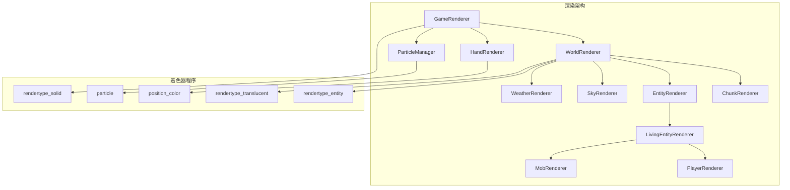
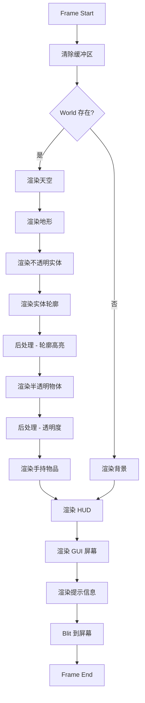

# 第 52 章：渲染系统（Rendering）

## 章节目标

- 理解渲染系统的整体架构
- 掌握 GameRenderer 和 WorldRenderer 的职责
- 了解着色器系统的工作原理
- 学会分析渲染管线

## 前置知识

- 3D 图形学基础概念
- OpenGL 或 DirectX 基础术语
- Minecraft 客户端基础

## 核心概念

### 什么是渲染？

**渲染（Rendering）** 是将游戏数据转换为屏幕图像的过程。你可以把它想象成**显卡画画的过程**——显卡是一个勤劳的画家，它根据游戏引擎的指令，一笔一笔地把方块、生物、粒子等画到屏幕上。

### Minecraft 渲染的关键比喻

```
┌─────────────────────────────────────────────────────────────┐
│                   渲染 = 画家画画                              │
├─────────────────────────────────────────────────────────────┤
│                                                             │
│   游戏数据                                                   │
│   (方块位置、生物坐标、粒子状态)                               │
│        │                                                    │
│        ▼                                                    │
│   渲染指令                                                   │
│   (Draw Call、顶点数据、纹理绑定)                             │
│        │                                                    │
│        ▼                                                    │
│   GPU 渲染                                                   │
│   (顶点着色器 → 几何处理 → 光栅化 → 片元着色器)               │
│        │                                                    │
│        ▼                                                    │
│   屏幕图像                                                   │
│   (最终显示的画面)                                            │
│                                                             │
└─────────────────────────────────────────────────────────────┘
```

## 渲染系统架构



## GameRenderer - 主渲染器

### 核心职责

```java
98:99:source/net/minecraft/client/render/GameRenderer.java
@Environment(value=EnvType.CLIENT)
public class GameRenderer implements AutoCloseable {
```

**GameRenderer** 是渲染系统的总指挥，负责：
- 协调所有渲染组件
- 管理着色器程序
- 处理后处理效果（模糊、凋零等）
- 第一人称手持物品渲染
- 摄像机控制

### 组件初始化

```java
266:274:source/net/minecraft/client/render/GameRenderer.java
public GameRenderer(MinecraftClient client, HeldItemRenderer heldItemRenderer, 
                    ResourceManager resourceManager, BufferBuilderStorage buffers) {
    this.client = client;
    this.resourceManager = resourceManager;
    this.firstPersonRenderer = heldItemRenderer;
    this.mapRenderer = new MapRenderer(client.getTextureManager(), ...);
    this.lightmapTextureManager = new LightmapTextureManager(this, client);
    this.buffers = buffers;
}
```

## 着色器程序系统

### 着色器程序速查表

| 着色器名称 | 文件 | 用途 |
|-----------|------|------|
| `particle` | `particle.glsl` | 粒子渲染 |
| `position_color` | `position_color.glsl` | 位置+颜色顶点 |
| `rendertype_solid` | `rendertype_solid.glsl` | 实体方块渲染 |
| `rendertype_translucent` | `rendertype_translucent.glsl` | 半透明渲染 |
| `rendertype_entity_translucent` | `rendertype_entity_translucent.glsl` | 实体半透明 |
| `rendertype_entity_solid` | `rendertype_entity_solid.glsl` | 实体固体 |
| `rendertype_text` | `rendertype_text.glsl` | 文字渲染 |
| `rendertype_glint` | `rendertype_glint.glsl` | 附魔闪光 |
| `blur` | `blur.glsl` | 背景模糊 |
| `creeper` | `creeper.glsl` | 凋零效果 |

### 着色器加载

```java
442:470:source/net/minecraft/client/render/GameRenderer.java
void loadPrograms(ResourceFactory factory) {
    // 粒子着色器
    list2.add(Pair.of(new ShaderProgram(factory, "particle", ...), program -> {
        particleProgram = program;
    }));
    
    // 位置+颜色着色器
    list2.add(Pair.of(new ShaderProgram(factory, "position_color", ...), program -> {
        positionColorProgram = program;
    }));
    
    // 渲染类型着色器 (方块、实体等)
    list2.add(Pair.of(new ShaderProgram(factory, "rendertype_solid", ...), program -> {
        renderTypeSolidProgram = program;
    }));
    // ... 更多着色器
}
```

### GLSL 着色器文件位置

```
assets/minecraft/shaders/
├── include/                    # 共享代码片段
│   ├── common.glsl           # 通用数学函数
│   ├── noise.glsl            # 噪声函数
│   └── utilities.glsl        # 工具函数
├── program/                   # 着色器程序
│   ├── particle.frag         # 粒子片段着色器
│   ├── particle.vert         # 粒子顶点着色器
│   ├── position_color.frag   # 位置颜色片段
│   ├── position_color.vert   # 位置颜色顶点
│   ├── rendertype_solid.*    # 固体渲染类型
│   ├── rendertype_translucent.*  # 半透明渲染
│   └── ...
└── uniform/                  # Uniform 变量定义
```

## WorldRenderer - 世界渲染器

### 核心职责

```java
167:170:source/net/minecraft/client/render/WorldRenderer.java
@Environment(value=EnvType.CLIENT)
public class WorldRenderer
implements SynchronousResourceReloader, AutoCloseable {
```

**WorldRenderer** 负责渲染整个游戏世界：
- 区块渲染（地形）
- 实体渲染（生物、物品）
- 天空渲染（太阳、月亮、云）
- 天气效果（雨、雪）
- 透明度排序

### 核心组件

```java
187:264:source/net/minecraft/client/render/WorldRenderer.java
private final MinecraftClient client;
private final EntityRenderDispatcher entityRenderDispatcher;
private final BlockEntityRenderDispatcher blockEntityRenderDispatcher;
private final BufferBuilderStorage bufferBuilders;

@Nullable private ClientWorld world;
private final ChunkRenderingDataPreparer chunkRenderingDataPreparer;
private final ObjectArrayList<ChunkBuilder.BuiltChunk> builtChunks;
@Nullable private BuiltChunkStorage chunks;

// 天空缓冲区
@Nullable private VertexBuffer starsBuffer;
@Nullable private VertexBuffer lightSkyBuffer;
@Nullable private VertexBuffer darkSkyBuffer;
@Nullable private VertexBuffer cloudsBuffer;

// 后处理
@Nullable private Framebuffer entityOutlinesFramebuffer;
@Nullable private PostEffectProcessor entityOutlinePostProcessor;
@Nullable private Framebuffer translucentFramebuffer;
@Nullable private PostEffectProcessor transparencyPostProcessor;
```

## 渲染管线流程



## 区块渲染系统

### 多级缓冲区架构

```
┌─────────────────────────────────────────────────────────────┐
│                 区块渲染数据流                               │
├─────────────────────────────────────────────────────────────┤
│                                                             │
│  ChunkProvider                                              │
│       │                                                     │
│       ▼                                                     │
│  ChunkRenderingDataPreparer                                 │
│       │  (准备区块数据)                                      │
│       ▼                                                     │
│  ChunkBuilder                                               │
│       │  (构建几何数据)                                      │
│       ▼                                                     │
│  BuiltChunk                                                 │
│       │  (缓存的区块数据)                                    │
│       ▼                                                     │
│  VertexBuffer                                               │
│       │  (GPU 顶点缓冲区)                                    │
│       ▼                                                     │
│  GPU 渲染                                                   │
│                                                             │
└─────────────────────────────────────────────────────────────┘
```

### 区块排序

对于半透明区块，需要从后往前渲染以正确混合：

```java
257:265:source/net/minecraft/client/render/WorldRenderer.java
private double lastTranslucentSortX;
private double lastTranslucentSortY;
private double lastTranslucentSortZ;
```

## 后处理效果

### GameRenderer 支持的后处理

```java
// 后处理着色器列表
list2.add(Pair.of(new ShaderProgram(factory, "blur", ...), program -> {
    blurProgram = program;
}));
list2.add(Pair.of(new ShaderProgram(factory, "color_convolve", ...), program -> {
    colorConvolveProgram = program;
}));
list2.add(Pair.of(new ShaderProgram(factory, "creeper", ...), program -> {
    creeperProgram = program;
}));
list2.add(Pair.of(new ShaderProgram(factory, "notch", ...), program -> {
    notchProgram = program;
}));
```

### 后处理效果对照

| 后处理效果 | 触发条件 | 视觉效果 |
|-----------|---------|----------|
| `blur` | 村民交易界面 | 背景模糊 |
| `color_convolve` | 桶装药水效果 | 色彩卷积 |
| `creeper` | 凋零效果 | 绿色闪烁 |
| `notch` | 彩色灯笼效果 | 彩色滤镜 |

## 天气渲染

```java
286:398:source/net/minecraft/client/render/WorldRenderer.java
private void renderWeather(LightmapTextureManager manager, float tickDelta, 
                           double cameraX, double cameraY, double cameraZ) {
    float f = this.client.world.getRainGradient(tickDelta);
    if (f <= 0.0f) return;
    
    // 渲染雨雪粒子
    for (int n = k - l; n <= k + l; ++n) {
        for (int o = i - l; o <= i + l; ++o) {
            Biome.Precipitation precipitation = biome.getPrecipitation(mutable);
            if (precipitation == Biome.Precipitation.RAIN) {
                // 渲染雨滴
            } else if (precipitation == Biome.Precipitation.SNOW) {
                // 渲染雪花
            }
        }
    }
}
```

## 渲染优化技术

### 1. 视锥剔除 (Frustum Culling)

只渲染玩家看得见的区块和实体。

### 2. 智能区块剔除 (Smart Chunk Culling)

```java
// F3 + L 切换
this.client.chunkCullingEnabled = !this.client.chunkCullingEnabled;
```

### 3. LOD (Level of Detail)

根据距离选择不同的细节层级。

### 4. 批量渲染 (Batching)

合并多个相同材质的 Draw Call。

### 5. GPU 缓冲区缓存

重复使用的几何数据缓存在 GPU 端。

## 实战：调试渲染

### 线框模式

```java
// F3 + F 切换
this.client.wireFrame = !this.client.wireFrame;
```

### 查看区块信息

```java
// F3 + E 切换
this.client.debugChunkInfo = !this.client.debugChunkInfo;
```

### 截取视锥

```java
// F3 + G
this.client.worldRenderer.captureFrustum();
```

## 课后自查

- [ ] 理解 GameRenderer 和 WorldRenderer 的职责分工
- [ ] 掌握着色器程序的加载机制
- [ ] 理解渲染管线的完整流程
- [ ] 知道后处理效果是如何实现的
- [ ] 了解区块渲染的优化技术
- [ ] 掌握调试渲染的快捷键

## 下一步

- **GUI 系统**：学习 Screen 和界面组件
- **粒子系统**：深入了解粒子渲染
- **模型系统**：学习实体模型加载和渲染

---

*渲染系统是 Minecraft 最复杂的子系统之一，掌握它你就能理解游戏是如何把像素变成3D世界的！*
