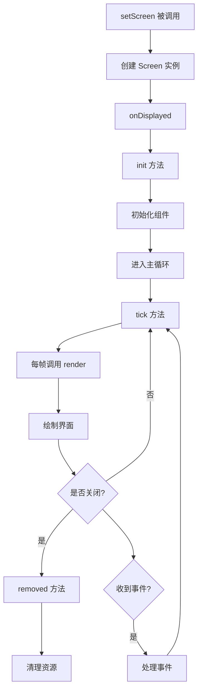

# 第 53 章：GUI 系统（GUI System）

## 章节目标

- 理解 GUI 系统的整体架构
- 掌握 Screen 基类的设计
- 学会创建自定义界面
- 了解 HUD 组件的渲染机制

## 前置知识

- Java 基础
- Minecraft 客户端基础
- 事件驱动编程概念

## 核心概念

### 什么是 GUI 系统？

**GUI（图形用户界面）系统** 负责渲染游戏中的所有菜单和界面。你可以把它想象成**舞台剧的幕布**——不同的屏幕就像不同的幕布场景，告诉玩家当前应该看到什么内容。

### GUI 类型总览

```
┌─────────────────────────────────────────────────────────────┐
│                    Minecraft GUI 类型                          │
├─────────────────────────────────────────────────────────────┤
│                                                             │
│   菜单类                                                     │
│   ├── TitleScreen - 主菜单                                   │
│   ├── PauseScreen - 暂停菜单                                 │
│   ├── GameMenuScreen - 游戏内菜单                            │
│   └── DeathScreen - 死亡界面                                 │
│                                                             │
│   物品类                                                     │
│   ├── InventoryScreen - 物品栏                               │
│   ├── CreativeScreen - 创造模式物品栏                         │
│   └── HopperScreen - 漏斗界面                                │
│                                                             │
│   编辑类                                                     │
│   ├── TextEditScreen - 文本编辑                              │
│   ├── AnvilScreen - 铁砧                                     │
│   └── LoomScreen - 织布机                                    │
│                                                             │
│   信息类                                                     │
│   ├── ChatScreen - 聊天界面                                  │
│   ├── AdvancementsScreen - 进度界面                          │
│   └── StatsScreen - 统计界面                                 │
│                                                             │
└─────────────────────────────────────────────────────────────┘
```

## Screen 基类架构

### 类的定义

```java
62:65:source/net/minecraft/client/gui/screen/Screen.java
@Environment(value=EnvType.CLIENT)
public abstract class Screen
extends AbstractParentElement
implements Drawable {
```

### 核心组件

```java
76:104:source/net/minecraft/client/gui/screen/Screen.java
protected final Text title;              // 界面标题
private final List<Element> children = Lists.newArrayList();    // 子元素
private final List<Selectable> selectables = Lists.newArrayList();  // 可选择元素
protected final List<Drawable> drawables = Lists.newArrayList();    // 可绘制元素
protected TextRenderer textRenderer;    // 文本渲染器

private final ScreenNarrator narrator = new ScreenNarrator();  // 屏幕朗读
private long elementNarrationStartTime = Long.MIN_VALUE;
private long screenNarrationStartTime = Long.MAX_VALUE;
protected final Executor executor = runnable -> this.client.execute(() -> {
    if (this.client.currentScreen == this) {
        runnable.run();
    }
});
```

## Screen 生命周期



### 生命周期方法

```java
330:379:source/net/minecraft/client/gui/screen/Screen.java
// 初始化（只调用一次）
public final void init(MinecraftClient client, int width, int height) {
    this.client = client;
    this.textRenderer = client.textRenderer;
    this.width = width;
    this.height = height;
    if (!this.screenInitialized) {
        this.init();  // 子类实现初始化逻辑
        this.setInitialFocus();
    }
    this.screenInitialized = true;
    this.narrateScreenIfNarrationEnabled(false);
}

// 子类实现初始化逻辑
protected void init() {}

// 每帧更新
public void tick() {}

// 屏幕关闭时调用
public void removed() {}

// 屏幕显示时调用
public void onDisplayed() {}
```

## 渲染流程

```java
118:132:source/net/minecraft/client/gui/screen/Screen.java
public final void renderWithTooltip(DrawContext context, int mouseX, int mouseY, float delta) {
    this.render(context, mouseX, mouseY, delta);
    if (this.tooltip != null) {
        context.drawTooltip(this.textRenderer, this.tooltip.tooltip(), 
                           this.tooltip.positioner(), mouseX, mouseY);
        this.tooltip = null;
    }
}

@Override
public void render(DrawContext context, int mouseX, int mouseY, float delta) {
    this.renderBackground(context, mouseX, mouseY, delta);
    for (Drawable drawable : this.drawables) {
        drawable.render(context, mouseX, mouseY, delta);
    }
}
```

## 创建自定义界面

### 示例：自定义按钮屏幕

```java
public class MyModScreen extends Screen {
    private final Text title = Text.literal("我的模组菜单");
    
    public MyModScreen() {
        super(Text.literal(""));
    }
    
    @Override
    protected void init() {
        // 添加标题
        this.addDrawableChild(new DrawableElement(this.client.textRenderer) {
            @Override
            public void render(DrawContext context, int mouseX, int mouseY, float delta) {
                context.drawText(
                    MyModScreen.this.client.textRenderer,
                    MyModScreen.this.title,
                    MyModScreen.this.width / 2 - 50,
                    20,
                    0xFFFFFF,
                    true
                );
            }
        });
        
        // 添加按钮
        this.addDrawableChild(ButtonWidget.builder(Text.literal("打开设置"), button -> {
            this.client.setScreen(new SettingsScreen(this));
        }).dimensions(this.width / 2 - 100, this.height / 2, 200, 20).build());
        
        // 添加返回按钮
        this.addDrawableChild(ButtonWidget.builder(Text.literal("返回"), button -> {
            this.client.setScreen(null);
        }).dimensions(this.width / 2 - 100, this.height / 2 + 40, 200, 20).build());
    }
    
    @Override
    public void render(DrawContext context, int mouseX, int mouseY, float delta) {
        // 渲染半透明背景
        this.renderBackground(context, mouseX, mouseY, delta);
        super.render(context, mouseX, mouseY, delta);
    }
}
```

## TitleScreen 分析

### 主菜单屏幕

```java
54:56:source/net/minecraft/client/gui/screen/TitleScreen.java
@Environment(value=EnvType.CLIENT)
public class TitleScreen extends Screen {
```

### 全景背景渲染

```java
218:256:source/net/minecraft/client/gui/screen/TitleScreen.java
@Override
public void render(DrawContext context, int mouseX, int mouseY, float delta) {
    if (this.backgroundFadeStart == 0L && this.doBackgroundFade) {
        this.backgroundFadeStart = Util.getMeasuringTimeMs();
    }
    
    // 背景渐变效果
    float f = 1.0f;
    if (this.doBackgroundFade) {
        float g = (float)(Util.getMeasuringTimeMs() - this.backgroundFadeStart) / 2000.0f;
        if (g > 1.0f) {
            this.doBackgroundFade = false;
            this.backgroundAlpha = 1.0f;
        } else {
            g = MathHelper.clamp(g, 0.0f, 1.0f);
            f = MathHelper.clampedMap(g, 0.5f, 1.0f, 0.0f, 1.0f);
            this.backgroundAlpha = MathHelper.clampedMap(g, 0.0f, 0.5f, 0.0f, 1.0f);
        }
    }
    
    this.renderPanoramaBackground(context, delta);
    super.render(context, mouseX, mouseY, delta);
    this.logoDrawer.draw(context, this.width, f);
}
```

## GameMenuScreen 分析

### 游戏内暂停菜单

```java
37:39:source/net/minecraft/client/gui/screen/GameMenuScreen.java
@Environment(value=EnvType.CLIENT)
public class GameMenuScreen extends Screen {
```

### 按钮布局

```java
81:112:source/net/minecraft/client/gui/screen/GameMenuScreen.java
private void initWidgets() {
    GridWidget gridWidget = new GridWidget();
    GridWidget.Adder adder = gridWidget.createAdder(2);
    
    // 返回游戏按钮
    adder.add(ButtonWidget.builder(RETURN_TO_GAME_TEXT, button -> {
        this.client.setScreen(null);
    }).width(204).build(), 2, ...);
    
    // 进度按钮
    adder.add(this.createButton(ADVANCEMENTS_TEXT, () -> new AdvancementsScreen(...)));
    adder.add(this.createButton(STATS_TEXT, () -> new StatsScreen(...)));
    
    // 设置按钮
    adder.add(this.createButton(OPTIONS_TEXT, () -> new OptionsScreen(...)));
    
    // 退出按钮
    this.exitButton = adder.add(ButtonWidget.builder(text, button -> {
        this.client.getAbuseReportContext().tryShowDraftScreen(...);
    }).width(204).build(), 2);
}
```

## InGameHud - 游戏内 HUD

### HUD 组件架构

```java
86:87:source/net/minecraft/client/gui/hud/InGameHud.java
@Environment(value=EnvType.CLIENT)
public class InGameHud {
```

### 核心组件

```java
134:165:source/net/minecraft/client/gui/hud/InGameHud.java
private final MinecraftClient client;
private final ChatHud chatHud;           // 聊天 HUD
private final DebugHud debugHud;          // 调试 HUD
private final SubtitlesHud subtitlesHud; // 字幕 HUD
private final SpectatorHud spectatorHud; // 旁观者 HUD
private final PlayerListHud playerListHud; // 玩家列表 HUD
private final BossBarHud bossBarHud;     // Boss 血条 HUD
private final LayeredDrawer layeredDrawer = new LayeredDrawer();

// HUD 元素
@Nullable private Text title;
@Nullable private Text subtitle;
private int titleFadeInTicks = 10;
private int titleStayTicks = 70;
private int titleFadeOutTicks = 20;
```

### 分层渲染架构

```java
177:183:source/net/minecraft/client/gui/hud/InGameHud.java
LayeredDrawer layeredDrawer = new LayeredDrawer()
    .addLayer(this::renderMiscOverlays)      // 暗角、望远镜等
    .addLayer(this::renderCrosshair)          // 准星
    .addLayer(this::renderMainHud)            // 主 HUD
    .addLayer(this::renderExperienceLevel)     // 经验条
    .addLayer(this::renderStatusEffectOverlay) // 状态效果
    .addLayer((context, tickCounter) -> this.bossBarHud.render(context));

LayeredDrawer layeredDrawer2 = new LayeredDrawer()
    .addLayer(this::renderDemoTimer)
    .addLayer((context, tickCounter) -> this.debugHud.render(context))
    .addLayer(this::renderScoreboardSidebar)
    .addLayer(this::renderOverlayMessage)
    .addLayer(this::renderTitleAndSubtitle)
    .addLayer(this::renderChat)
    .addLayer(this::renderPlayerList)
    .addLayer((context, tickCounter) -> this.subtitlesHud.render(context));
```

## Widget 组件系统

### 常用 Widget

| Widget | 用途 |
|--------|------|
| `ButtonWidget` | 按钮 |
| `TextFieldWidget` | 文本输入框 |
| `SliderWidget` | 滑块 |
| `CheckboxWidget` | 复选框 |
| `EntryListWidget` | 列表 |
| `GridWidget` | 网格布局 |

### ButtonWidget 示例

```java
ButtonWidget.builder(Text.literal("点击我"), button -> {
    // 点击事件处理
    this.client.player.sendMessage(Text.literal("按钮被点击了！"));
})
.dimensions(x, y, width, height)
.build();
```

### 事件处理

```java
// 按钮点击
public void actionPerformed(ButtonWidget button) {
    if (button == this.returnButton) {
        this.client.setScreen(this.parent);
    }
}

// 键盘输入
public void keyPressed(int keyCode, int scanCode, int modifiers) {
    if (keyCode == GLFW.GLFW_KEY_ESCAPE) {
        this.client.setScreen(null);
    }
}

// 鼠标点击
public boolean mouseClicked(double mouseX, double mouseY, int button) {
    // 处理鼠标点击逻辑
    return super.mouseClicked(mouseX, mouseY, button);
}
```

## InventoryScreen 分析

### 物品栏界面

```java
29:32:source/net/minecraft/client/gui/screen/ingame/InventoryScreen.java
@Environment(value=EnvType.CLIENT)
public class InventoryScreen
extends AbstractInventoryScreen<PlayerScreenHandler>
implements RecipeBookProvider {
```

### 特性

- 玩家实体渲染
- 配方书集成
- 物品拖拽

### 渲染玩家实体

```java
93:99:source/net/minecraft/client/gui/screen/ingame/InventoryScreen.java
@Override
protected void drawBackground(DrawContext context, float delta, int mouseX, int mouseY) {
    int i = this.x;
    int j = this.y;
    context.drawTexture(BACKGROUND_TEXTURE, i, j, 0, 0, 
                       this.backgroundWidth, this.backgroundHeight);
    InventoryScreen.drawEntity(context, i + 26, j + 8, i + 75, j + 78, 
                               30, 0.0625f, this.mouseX, this.mouseY, this.client.player);
}
```

## GUI 布局系统

### GridWidget 布局

```java
// 创建 2 列网格
GridWidget gridWidget = new GridWidget();
gridWidget.getMainPositioner().margin(5, 5, 5, 5);
GridWidget.Adder adder = gridWidget.createAdder(2);

// 添加元素
adder.add(firstButton, 1, GridWidget.RemainderLayout.NONE);
adder.add(secondButton, 1, GridWidget.RemainderLayout.NONE);
adder.add(thirdButton, 2, GridWidget.RemainderLayout.FLEX);  // 跨两列

// 初始化
gridWidget.forEachChild(this::addDrawableChild);
```

## 课后自查

- [ ] 理解 Screen 基类的设计理念
- [ ] 掌握 Screen 的生命周期方法
- [ ] 能够创建自定义界面
- [ ] 理解 HUD 分层渲染机制
- [ ] 掌握 Widget 组件的使用方法
- [ ] 了解 GridWidget 布局系统

## 下一步

- **输入处理**：学习键盘和鼠标事件处理
- **粒子系统**：了解粒子渲染
- **模组开发**：使用 Fabric API 创建 GUI

---

*GUI 系统让玩家能够与游戏进行交互，精心设计的界面可以显著提升用户体验！*
