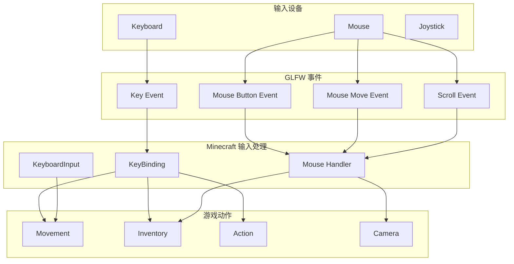
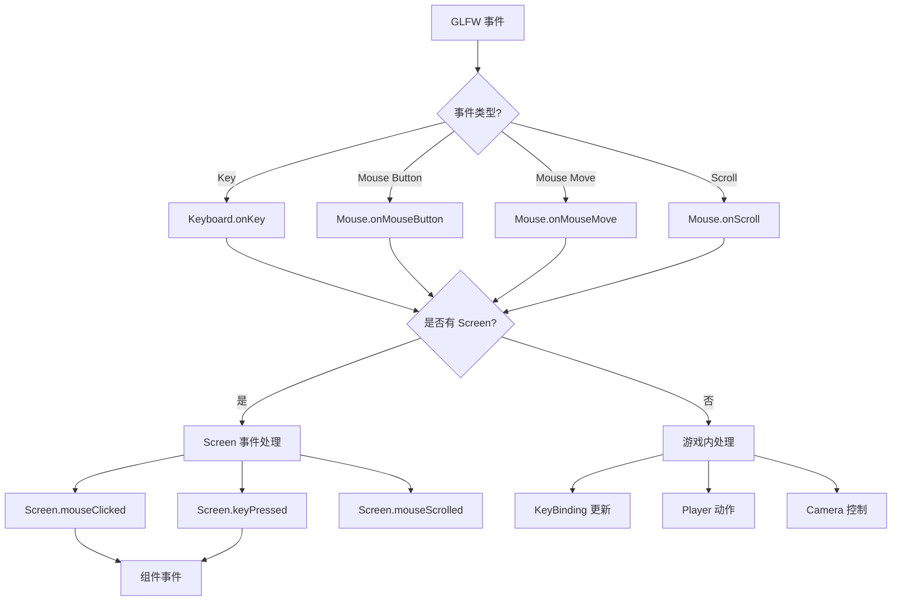

# 第 54 章：输入处理（Input Handling）

## 章节目标

- 理解输入处理系统的架构
- 掌握键盘、鼠标输入的处理流程
- 学会使用 KeyBinding 系统
- 了解 F3 调试菜单的实现

## 前置知识

- Java 基础
- Minecraft 客户端基础
- 回调/事件概念

## 核心概念

### 什么是输入处理？

**输入处理系统** 负责将玩家的键盘、鼠标、手柄操作转换为游戏内的动作。你可以把它想象成**翻译官**——把玩家按下的"English"翻译成游戏能理解的"Minecraft 语言"。

### 输入类型总览

```
┌─────────────────────────────────────────────────────────────┐
│                    Minecraft 输入类型                          │
├─────────────────────────────────────────────────────────────┤
│                                                             │
│   ⌨️ 键盘输入                                               │
│   ├── 字符输入 (a, b, c, 中文字符)                           │
│   ├── 功能键 (F1-F12, Esc, Tab)                              │
│   ├── 组合键 (Ctrl+C, Shift+V)                               │
│   └── 移动键 (WASD)                                          │
│                                                             │
│   🖱️ 鼠标输入                                               │
│   ├── 按钮点击 (左键、中键、右键)                             │
│   ├── 滚轮滚动                                               │
│   └── 光标移动                                               │
│                                                             │
│   🎮 手柄输入 (Controller)                                  │
│   ├── 摇杆 (移动、视角)                                      │
│   ├── 按键 (A, B, X, Y)                                     │
│   └── 扳机 (LT, RT)                                         │
│                                                             │
└─────────────────────────────────────────────────────────────┘
```

## 输入系统架构



## Keyboard 类分析

### 键盘输入处理

```java
58:59:source/net/minecraft/client/Keyboard.java
@Environment(value=EnvType.CLIENT)
public class Keyboard {
```

### Debug 快捷键

```java
72:106:source/net/minecraft/client/Keyboard.java
private boolean processDebugKeys(int key) {
    switch (key) {
        case 69:  // F3+E - 区块信息
            this.client.debugChunkInfo = !this.client.debugChunkInfo;
            return true;
        case 76:  // F3+L - 智能剔除
            this.client.chunkCullingEnabled = !this.client.chunkCullingEnabled;
            return true;
        case 85:  // F3+G - 截取视锥
            this.client.worldRenderer.captureFrustum();
            return true;
        case 87:  // F3+F - 线框模式
            this.client.wireFrame = !this.client.wireFrame;
            return true;
    }
    return false;
}
```

### F3 菜单快捷键

```java
128:256:source/net/minecraft/client/Keyboard.java
private boolean processF3(int key) {
    switch (key) {
        case 65:  // F3+A - 重载区块
            this.client.worldRenderer.reload();
            return true;
        case 66:  // F3+B - 碰撞箱
            this.client.getEntityRenderDispatcher().setRenderHitboxes(!...);
            return true;
        case 67:  // F3+C - 复制坐标
            this.setClipboard(String.format(...));
            return true;
        case 68:  // F3+D - 清空聊天
            this.client.inGameHud.getChatHud().clear(false);
            return true;
        case 73:  // F3+I - 检查方块/实体
            this.copyLookAt(...);
            return true;
        case 76:  // F3+L - 性能分析
            this.client.toggleDebugProfiler(this::debugLog);
            return true;
        case 78:  // F3+N - 旁观者模式
            this.client.player.networkHandler.sendCommand("gamemode spectator");
            return true;
        // ... 更多快捷键
    }
    return false;
}
```

## Mouse 类分析

### 鼠标输入处理

```java
27:28:source/net/minecraft/client/Mouse.java
@Environment(value=EnvType.CLIENT)
public class Mouse {
```

### 鼠标按钮处理

```java
54:126:source/net/minecraft/client/Mouse.java
private void onMouseButton(long window, int button, int action, int mods) {
    // Mac 系统的 Ctrl+点击映射
    if (MinecraftClient.IS_SYSTEM_MAC && button == 0) {
        if (bl && (mods & 2) == 2) {
            button = 1;  // 转换为右键
            ++this.controlLeftClicks;
        }
    }
    
    if (this.client.currentScreen != null) {
        // 屏幕内点击
        if (bl) {
            screen.mouseClicked(d, e, i);
        } else {
            screen.mouseReleased(d, e, i);
        }
    } else if (this.client.currentScreen == null) {
        // 游戏内点击
        if (i == 0) {
            this.leftButtonClicked = bl;
        } else if (i == GLFW.GLFW_MOUSE_BUTTON_MIDDLE) {
            this.middleButtonClicked = bl;
        } else if (i == GLFW.GLFW_MOUSE_BUTTON_RIGHT) {
            this.rightButtonClicked = bl;
        }
        KeyBinding.setKeyPressed(...);
        KeyBinding.onKeyPressed(...);
    }
}
```

### 鼠标灵敏度计算

```java
254:284:source/net/minecraft/client/Mouse.java
private void updateMouse(double timeDelta) {
    // 计算灵敏度
    double sensitivity = this.client.options.getMouseSensitivity().getValue() * 0.6 + 0.2;
    double factor = sensitivity * sensitivity * sensitivity;
    double multiplier = factor * 8.0;
    
    // 平滑相机支持
    if (this.client.options.smoothCameraEnabled) {
        double g = this.cursorXSmoother.smooth(this.cursorDeltaX * multiplier, 
                                               timeDelta * multiplier);
        double h = this.cursorYSmoother.smooth(this.cursorDeltaY * multiplier, 
                                               timeDelta * multiplier);
        i = g;
        j = h;
    }
    
    // Y轴反转
    if (this.client.options.getInvertYMouse().getValue()) {
        k = -1;
    }
    
    this.client.player.changeLookDirection(i, j * k);
}
```

## KeyBinding 系统

### 什么是 KeyBinding？

**KeyBinding** 是 Minecraft 的按键绑定系统，管理所有可自定义的按键。

### KeyBinding 注册

```java
// 在 Options 类中注册
public final Option<...> forwardKey;
public final Option<...> backKey;
public final Option<...> leftKey;
public final Option<...> rightKey;
public final Option<...> jumpKey;
public final Option<...> sneakKey;
public final Option<...> sprintKey;
public final Option<...> attackKey;
public final Option<...> useKey;
```

### KeyBinding 使用

```java
// 检查按键是否按下
if (this.client.options.forwardKey.isPressed()) {
    // 玩家按下了前进键
}

// 在 GameRenderer 中处理
KeyBinding.setKeyPressed(this.client.options.forwardKey.getDefault(), isForwardPressed);
```

## KeyboardInput 分析

### 移动输入处理

```java
11:13:source/net/minecraft/client/input/KeyboardInput.java
@Environment(value=EnvType.CLIENT)
public class KeyboardInput extends Input {
```

### 输入状态更新

```java
27:41:source/net/minecraft/client/input/KeyboardInput.java
@Override
public void tick(boolean slowDown, float slowDownFactor) {
    this.pressingForward = this.settings.forwardKey.isPressed();
    this.pressingBack = this.settings.backKey.isPressed();
    this.pressingLeft = this.settings.leftKey.isPressed();
    this.pressingRight = this.settings.rightKey.isPressed();
    
    this.movementForward = KeyboardInput.getMovementMultiplier(
        this.pressingForward, this.pressingBack);
    this.movementSideways = KeyboardInput.getMovementMultiplier(
        this.pressingLeft, this.pressingRight);
    
    this.jumping = this.settings.jumpKey.isPressed();
    this.sneaking = this.settings.sneakKey.isPressed();
    
    if (slowDown) {
        this.movementSideways *= slowDownFactor;
        this.movementForward *= slowDownFactor;
    }
}
```

## F3 调试菜单详解

### F3 功能键对照表

| 快捷键 | 功能 | 说明 |
|--------|------|------|
| F3 + A | 重载区块 | 重新加载所有可见区块 |
| F3 + B | 显示碰撞箱 | 显示实体的碰撞箱 |
| F3 + C | 复制坐标 | 复制当前坐标到剪贴板 |
| F3 + D | 清空聊天 | 清空聊天消息 |
| F3 + E | 区块信息 | 显示/隐藏区块信息 |
| F3 + F | 线框模式 | 切换线框渲染 |
| F3 + G | 截取视锥 | 调试视锥剔除 |
| F3 + L | 智能剔除 | 切换区块智能剔除 |
| F3 + N | 旁观者模式 | 切换旁观者模式 |
| F3 + P | 自动连接 | 切换自动连接 |
| F3 + Q | 显示配方 | 打开配方书 |
| F3 + S | 同步磁盘 | 同步资源到磁盘 |
| F3 + T | 重载资源包 | 重新加载资源包 |

### Debug 信息显示

```
     XYZ: 12.345 / 64.000 / -78.901
     Block: minecraft:oak_log[axis=y]
     Chunk: 0, -5
     Facing: SOUTH
     Light: 11 (sky) / 0 (block)
     Slime Chunk: Yes
     Spawned: false
     -----------
     Server Brand: paper
     Minecraft: 1.21
     mods: fabric-0.15.7
```

## 事件处理流程



## 实战：创建自定义输入处理

### 示例：注册自定义按键

```java
// 在模组的 KeyBindings 类中
public class MyModKeys {
    public static final KeyBinding SPECIAL_ABILITY = 
        new KeyBinding(
            "key.mymod.special_ability",  // 翻译键
            InputUtil.Type.KEY,           // 类型：键盘
            GLFW.GLFW_KEY_G,             // 默认按键：G
            "category.mymod.keys"         // 分类
        );
}

// 在初始化时注册
@InvokeStatic
private static void init() {
    ClientTickEvents.END_CLIENT_TICK.register(client -> {
        while (SPECIAL_ABILITY.wasPressed()) {
            // 执行特殊能力
            useSpecialAbility(client.player);
        }
    });
}
```

### 示例：鼠标点击事件

```java
@SubscribeEvent
public static void onMouseClick(ButtonClickedEvent event) {
    if (event.getButton() == 0) {  // 左键
        MinecraftClient client = MinecraftClient.getInstance();
        if (client.player != null && client.currentScreen == null) {
            // 游戏内左键点击
            onGameLeftClick(client);
        }
    }
}
```

## 屏幕输入处理优先级

```java
// 在 MinecraftClient 中
private void handleInputEvents() {
    while (this.mouse.isMouseInWindow() && this.running) {
        // 1. 屏幕优先处理输入
        while (this.mouse.next()) {  // 获取下一个鼠标事件
            int i = this.mouse.getEventButton();
            int j = this.mouse.getEventButtonState() ? 1 : 0;
            
            if (this.currentScreen != null) {
                // 有屏幕时，屏幕优先处理
                if (j == 1) {
                    this.currentScreen.mouseClicked(d, e, i);
                } else {
                    this.currentScreen.mouseReleased(d, e, i);
                }
            } else {
                // 无屏幕时，游戏处理
                this.onMouseButton(i, j);
            }
        }
        
        // 2. 处理按键输入
        this.pollKeyboard();
    }
}
```

## 课后自查

- [ ] 理解 Keyboard 和 Mouse 类的职责
- [ ] 掌握 F3 快捷键的功能
- [ ] 理解 KeyBinding 系统的使用
- [ ] 能够创建自定义按键绑定
- [ ] 理解输入事件的处理流程
- [ ] 掌握屏幕输入的优先级机制

## 下一步

- **声音系统**：学习音效播放
- **网络系统**：了解客户端与服务器通信
- **模组开发**：使用 Fabric 事件系统

---

*输入处理是玩家与游戏交互的桥梁，理解它你就能实现任何你想要的操作响应！*
