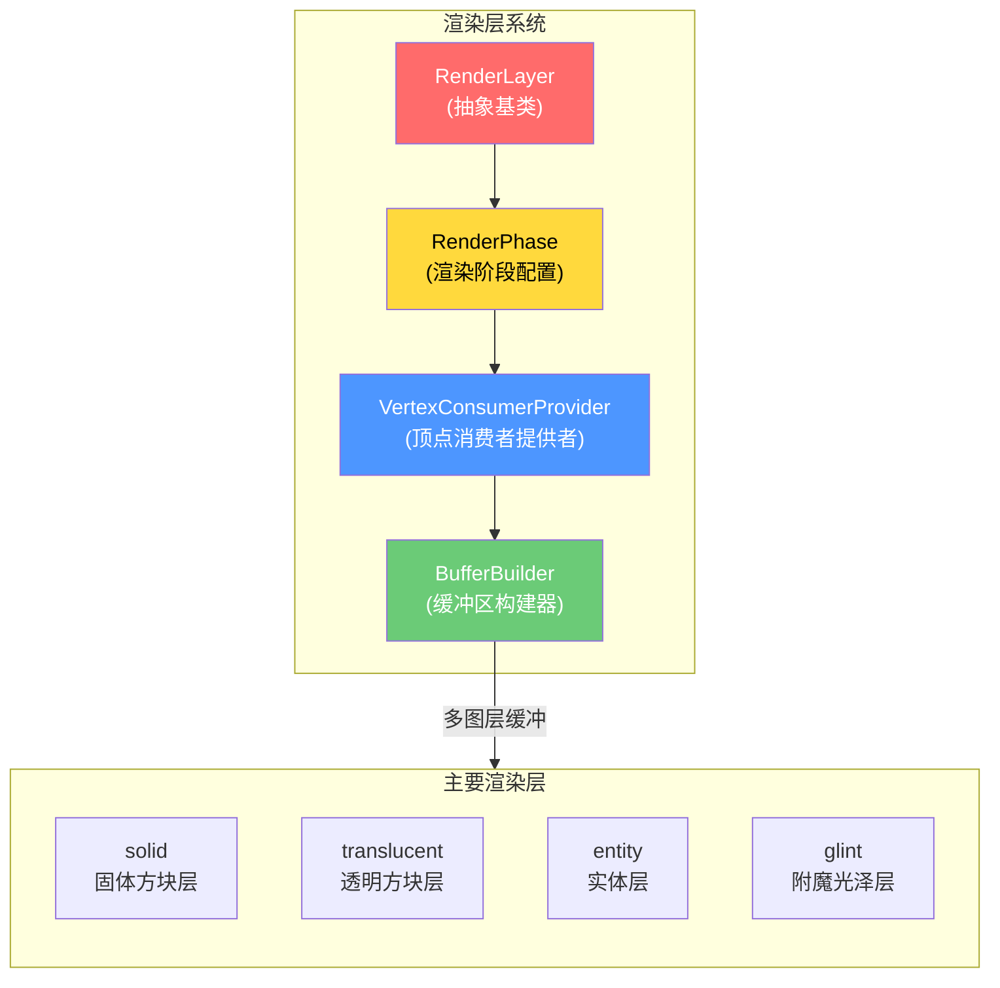
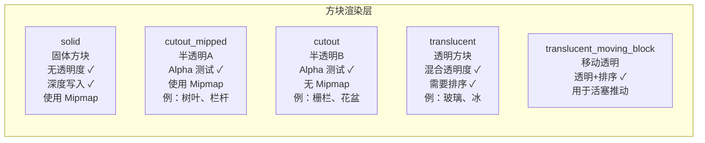
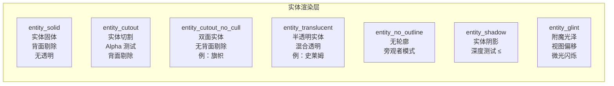
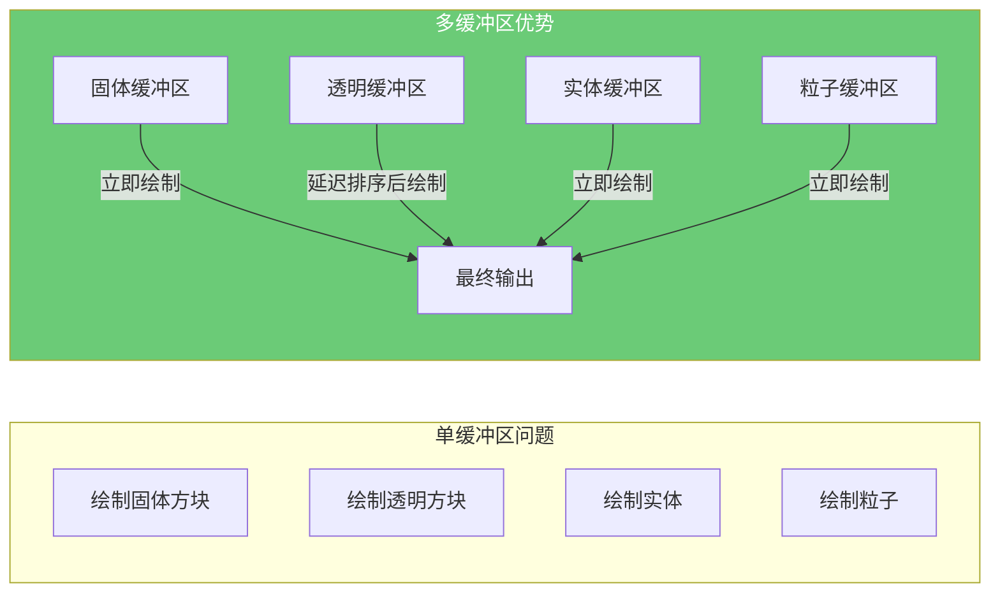
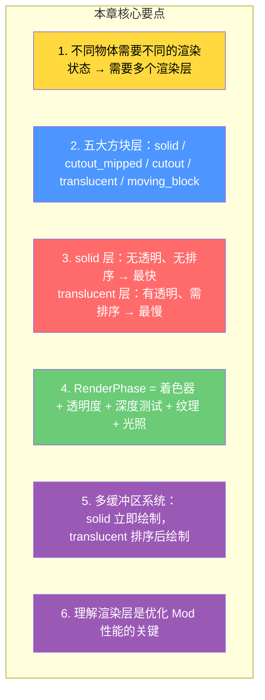

# 第 55 章：渲染层系统（Render Layers）

> **理解这章，你就明白了 Minecraft 是如何画出半透明玻璃、实体阴影、附魔光泽的——渲染管线中的「分层着色」原理！**

> ⚠️ **注意**：以下源码示例来源于 CFR 反编译代码，变量名和方法名可能与原始源码有所差异。部分代码经过简化以便于理解。

---

## 目标

学完本章后，你将理解：

1. **为什么需要 RenderLayer**：不同物体需要不同的渲染状态
2. **RenderLayer 的类型**：固体、透明、实体、各种特效层
3. **RenderPhase 的组成**：着色器、透明度、深度测试、纹理
4. **多缓冲系统**：为什么要分多个缓冲区绘制
5. **自定义渲染层**：如何为 Mod 添加自定义渲染效果

---

## 前置知识

- 了解渲染系统的基本概念（第 51 章）
- 知道 Minecraft 使用 OpenGL/Vulkan
- 了解着色器（Shader）的基本概念

---

## 核心概念：为什么需要渲染层？

### 问题：世界上的物体渲染需求不同

```
Minecraft 世界包含各种不同类型的物体：

┌──────────────────────────────────────────────────────────┐
│ 物体类型            │ 渲染需求                            │
├──────────────────────────────────────────────────────────┤
│ 石头、草方块          │ 不透明，启用深度写入，启用深度测试    │
│ 玻璃、冰              │ 半透明，需要排序，延迟渲染           │
│ 树叶                │ Alpha 测试，不需要完整排序          │
│ 实体（僵尸、玩家）     │ 特殊光照，需要轮廓渲染              │
│ 粒子（爆炸、烟）       │ 加法混合，不同排序规则            │
│ 附魔光泽            │ 视图偏移，微光闪烁                  │
│ 水下效果            │ 视锥裁剪，雾气混合                  │
└──────────────────────────────────────────────────────────┘

❌ 如果用同一层渲染：玻璃可能遮住后面的实体！
✅ 用多个渲染层：每层按正确顺序绘制，结果正确！
```

### 核心思想：分而治之

> 想象一个画家画一幅油画，他会分层画：

```
画家画油的顺序：                        Minecraft 渲染顺序：
─────────────────                    ──────────────────
1. 画天空背景                         1. 渲染天空
2. 画远山                            2. 渲染远景固体方块
3. 画近处的树                        3. 渲染透明方块（从后往前排序）
4. 画草                              4. 渲染实体
5. 画玩家角色                        5. 渲染粒子
6. 画 UI（不透明界面）               6. 渲染 GUI
7. 画附魔光泽（最后叠加）             7. 渲染附魔光泽
```

---

## 渲染层系统架构

### 整体架构图



---

## 方块渲染层类型

### 五大方块渲染层



### 渲染层定义源码

```java
// RenderLayer.java 中的层定义

// 1. solid - 固体方块层
private static final RenderLayer SOLID = RenderLayer.of("solid",
    VertexFormats.POSITION_COLOR_TEXTURE_LIGHT_NORMAL,    // 顶点格式
    VertexFormat.DrawMode.QUADS,                         // 四边形绘制
    0x400000,                                            // 缓冲区大小
    true,                                                 // 需要排序
    false,                                                // 不使用雾
    MultiPhaseParameters.builder()
        .lightmap(ENABLE_LIGHTMAP)                        // 启用光照图
        .program(SOLID_PROGRAM)                          // 固体着色器
        .texture(MIPMAP_BLOCK_ATLAS_TEXTURE)               // Mipmap 纹理
        .build(true)
);

// 2. translucent - 透明方块层
private static final RenderLayer TRANSLUCENT = RenderLayer.of("translucent",
    VertexFormats.POSITION_COLOR_TEXTURE_LIGHT_NORMAL,
    VertexFormat.DrawMode.QUADS,
    786432,                                              // 更大的缓冲区
    true,                                                 // 需要排序！
    true,                                                 // 使用雾
    RenderLayer.of(TRANSLUCENT_PROGRAM)
);

// 3. cutout_mipped - 半透明层（树叶等）
private static final RenderLayer CUTOUT_MIPPED = RenderLayer.of("cutout_mipped",
    VertexFormats.POSITION_COLOR_TEXTURE_LIGHT_NORMAL,
    VertexFormat.DrawMode.QUADS,
    262144,
    true,
    false,
    MultiPhaseParameters.builder()
        .program(CUTOUT_MIPPED_PROGRAM)
        .texture(MIPMAP_BLOCK_ATLAS_TEXTURE)
        .build(true)
);
```

### 透明度类型对照表

| 透明度特性 | solid | cutout_mipped | cutout | translucent |
|-----------|-------|----------------|--------|------------|
| Alpha 测试 | ❌ | ✅ | ✅ | ✅ |
| Alpha 混合 | ❌ | ❌ | ❌ | ✅ |
| 深度写入 | ✅ | ✅ | ✅ | ❌ |
| 需要排序 | ❌ | ❌ | ❌ | ✅ |
| 使用 Mipmap | ✅ | ✅ | ❌ | ✅ |

---

## 实体渲染层类型

### 实体渲染层一览



---

## RenderPhase：渲染阶段配置

### RenderPhase 的组成

```
RenderPhase = 着色器 + 透明度 + 深度测试 + 纹理 + 裁剪 + 光照

┌──────────────────────────────────────────────────────────┐
│ RenderPhase 组成                                         │
├──────────────────────────────────────────────────────────┤
│ 1. Program（着色器程序）                                │
│    SOLID_PROGRAM | TRANSLUCENT_PROGRAM | GLINT_PROGRAM │
│                                                          │
│ 2. Transparency（透明度模式）                            │
│    NO_TRANSPARENCY | TRANSLUCENT_TRANSPARENCY           │
│    GLINT_TRANSPARENCY | LIGHTNING_TRANSPARENCY           │
│                                                          │
│ 3. Depth Test（深度测试）                               │
│    ALWAYS | LESS | LEQUAL | GREATER                     │
│                                                          │
│ 4. Cull（背面剔除）                                     │
│    BACK_CULL | FRONT_CULL | NO_CULL                     │
│                                                          │
│ 5. Lightmap（光照图）                                  │
│    ENABLE_LIGHTMAP | DISABLE_LIGHTMAP                   │
│                                                          │
│ 6. Overlay（叠加颜色）                                  │
│    ENABLE_OVERLAY_COLOR | DISABLE_OVERLAY_COLOR         │
│                                                          │
│ 7. Layering（层级偏移）                                 │
│    VIEW_OFFSET_Z_LAYERING | POSITION_Z_LAYERING        │
└──────────────────────────────────────────────────────────┘
```

---

## 多缓冲区渲染系统

### 为什么需要多个缓冲区？



### 渲染顺序

```
Minecraft 客户端渲染帧的完整顺序：

1. 清空所有缓冲区
2. 天空渲染（无缓冲）
3. solid 缓冲区绘制（立即输出）
4. cutout_mipped 缓冲区绘制（立即输出）
5. cutout 缓冲区绘制（立即输出）
6. entity 缓冲区绘制（立即输出）
7. 阴影缓冲区绘制（立即输出）
8. translucent 缓冲区绘制（从后往前排序后输出）
9. translucent_moving_block 缓冲区绘制
10. particles 缓冲区绘制
11. weather 缓冲区绘制
12. hand 缓冲区绘制（手和物品）
13. glint 缓冲区绘制（附魔光泽）
14. entity_glint 缓冲区绘制
15.GUI 缓冲区绘制
```

---

## 实战：找到渲染层使用

### 练习：搜索源码

在源码中找到以下内容：

1. `RenderLayer.java` - 找到所有渲染层的定义
2. `BlockRenderLayer.java` - 找到方块使用的渲染层
3. `BuiltChunkRenderer.java` - 找到多缓冲区构建

### 观察模式

理解 `BufferBuilder` 如何工作：

```java
// 使用特定渲染层绘制方块
public void renderBlock(BlockState state, BlockPos pos, RenderLayer layer) {
    // 1. 获取该层的缓冲区构建器
    BufferBuilder builder = bufferBuilders.get(layer);

    // 2. 开始一个批次
    builder.begin(VertexFormat.DrawMode.QUADS, VertexFormats.POSITION_COLOR_TEXTURE_LIGHT_NORMAL);

    // 3. 添加顶点数据
    for (Quad quad : state.getQuads(Direction.ALL)) {
        builder.vertex(quad.x1, quad.y1, quad.z1)
               .color(255, 255, 255, 255)
               .texture(quad.u, quad.v)
               .light(15, 15)
               .next();
    }

    // 4. 结束批次（在 translucent 情况下触发排序）
    builder.end();
}
```

---

## 小结



---

## 练习

### 练习 1：识别渲染层

以下物体应该使用哪个渲染层？

- 石头方块 → ?
- 玻璃方块 → ?
- 树叶方块 → ?
- 冰块 → ?

### 练习 2：理解透明度

为什么透明方块需要排序？排序是按什么进行的？

### 练习 3：渲染顺序

描述从「玩家按 F3 看到画面」到「GPU 输出像素」的完整流程。

---

## 相关链接

| 文件 | 路径 | 作用 |
|------|------|------|
| `RenderLayer.java` | `net/minecraft/client/render/RenderLayer.java` | 渲染层定义 |
| `RenderPhase.java` | `net/minecraft/client/render/RenderPhase.java` | 渲染阶段配置 |
| `BufferBuilder.java` | `net/minecraft/client/render/BufferBuilder.java` | 缓冲区构建器 |
| `WorldRenderer.java` | `net/minecraft/client/render/WorldRenderer.java` | 世界渲染器 |

---

> 💡 **提示**：理解渲染层系统对于开发高性能 Mod 非常重要。如果你的 Mod 方块不需要透明度，使用 `solid` 层比 `translucent` 层快很多。

---

*文档版本：Minecraft 1.21, Protocol 767, World Version 3953*
*最后更新：2026-03-25*
