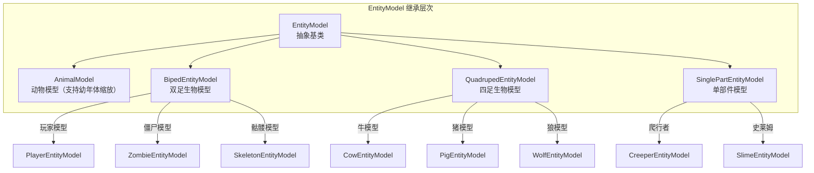
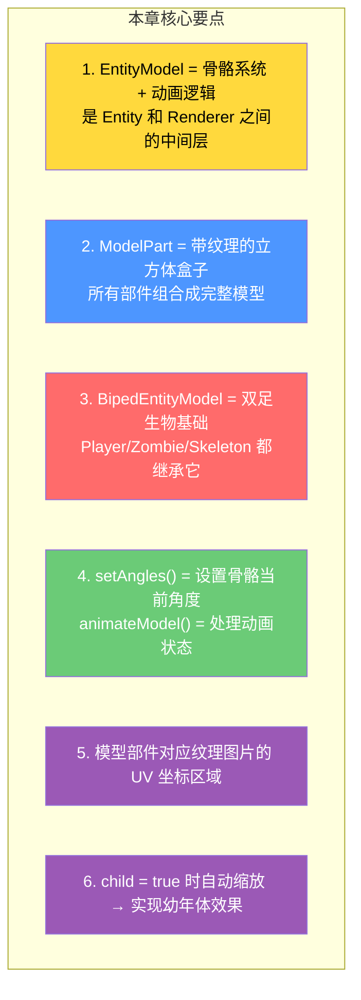

# 第 56 章：实体模型系统（Entity Models）

> **理解这章，你就明白了苦力怕的模型是怎么「拼出来」的——从 ModelPart 盒子到完整的 3D 生物！**

> ⚠️ **注意**：以下源码示例来源于 CFR 反编译代码，变量名和方法名可能与原始源码有所差异。部分代码经过简化以便于理解。

---

## 目标

学完本章后，你将理解：

1. **EntityModel 的定位**：它处于 Entity 和 Renderer 之间的中间层
2. **ModelPart 骨骼系统**：如何用「盒子」拼出生物模型
3. **BipedEntityModel**：玩家、僵尸、骷髅的模型基础
4. **动画系统**：如何让生物「动起来」（行走、攻击、休息）
5. **纹理映射**：模型如何对应到材质图片

---

## 前置知识

- 了解渲染层系统（第 54 章）
- 了解实体的基本概念（第 21 章）
- 知道 Minecraft 使用 UV 纹理映射

---

## 核心概念：模型的三层架构

### 模型 → 渲染的完整链路

```
Entity（实体数据）
    │
    │ getModelData()
    ▼
EntityModel<T>（模型定义）
    │
    │ setAngles() + animateModel()
    ▼
TexturedModelData（纹理化模型）
    │
    │ render()
    ▼
EntityRenderer（实体渲染器）
    │
    ▼
屏幕上的生物图像
```

### 类比：拼乐高

```
乐高积木                    Minecraft 实体模型
────────────               ─────────────────────
零件（Piece）              ModelPart（盒子/cuboid）
组装图纸（Instruction）    EntityModel（模型定义）
组装好的模型                TexturedModelData
拍照                      EntityRenderer.render()
```

---

## EntityModel 基类

### 类结构

```java
// net/minecraft/client/render/entity/model/EntityModel.java
@Environment(value=EnvType.CLIENT)
public abstract class EntityModel<T extends Entity>
extends Model {

    // 动画状态
    public float handSwingProgress;   // 手摆动进度
    public boolean riding;            // 是否在骑乘
    public boolean child = true;      // 是否是幼年体

    protected EntityModel() {
        this(RenderLayer::getEntityCutoutNoCull);
    }

    protected EntityModel(Function<Identifier, RenderLayer> function) {
        super(function);
    }

    // 设置骨骼角度（每帧调用）
    public abstract void setAngles(
        T var1,           // 实体
        float var2,       // 四肢摆动角度 (limbAngle)
        float var3,       // 四肢摆动距离 (limbDistance)
        float var4,       // 动画进度
        float var5,       // 头部偏航角
        float var6        // 头部俯仰角
    );

    // 动画模型
    public void animateModel(...) { }

    // 渲染模型
    public abstract void render(...) { }
}
```

---

## ModelPart：骨骼系统

### ModelPart 是什么？

**ModelPart** 是组成模型的「部件」，本质上是绑定了纹理坐标的立方体（Box）：

```
┌─────────────────────────────────────────────────────┐
│ ModelPart 的结构                                    │
├─────────────────────────────────────────────────────┤
│                                                     │
│   一个 ModelPart = 一个立方体盒子                    │
│                                                     │
│   ┌─────────┐                                      │
│   │  TOP    │ ← 顶面                               │
│   ├─────────┤                                      │
│   │F │   │B│ ← 前后左右四面                        │
│   │  L     │                                      │
│   ├─────────┤                                      │
│   │ BOTTOM  │ ← 底面                               │
│   └─────────┘                                      │
│                                                     │
│   每个面都有 UV 坐标 → 映射到纹理图片的对应区域       │
│                                                     │
└─────────────────────────────────────────────────────┘
```

### 创建 ModelPart

```java
// 创建一个手臂部件
ModelPartData armData = modelData.getChild("right_arm");

// 实际创建（使用 texturedDye）
ModelPart arm = builder.add(
    TexturedModelData.createModelData(
        ModelTransform.pivot(0.0f, 24.0f, 0.0f),  // 旋转中心
        new Dilation(0.0f),                          // 扩张（用于护甲）
        new ModelMaterial(TextureIds.SKIN)           // 纹理 ID
    ).addCuboid("right_arm",
        -3.0f,   // x 偏移
        -2.0f,   // y 偏移
        -2.0f,   // z 偏移
        4.0f,    // x 大小（宽度）
        12.0f,   // y 大小（高度）
        4.0f,    // z 大小（深度）
        new Dilation(0.0f),  // 扩张
        40,       // UV x
        16        // UV y
    ).build()
);
```

---

## 实体模型类型

### 继承层次



### BipedEntityModel：双足生物模型

这是最重要的模型基类，玩家、僵尸、骷髅、村民都基于它：

```java
// BipedEntityModel.java
public class BipedEntityModel<T extends LivingEntity> extends EntityModel<T> {

    // 所有部件
    public final ModelPart leftLeg;   // 左腿
    public final ModelPart rightLeg;   // 右腿
    public final ModelPart leftArm;    // 左臂
    public final ModelPart rightArm;   // 右臂
    public final ModelPart head;       // 头部
    public final ModelPart body;       // 身体
    public final ModelPart hat;        // 帽子（叠加在头上）

    // 护甲部件（用于盔甲渲染）
    public final ModelPart helmet;      // 头盔
    public final ModelPart chestplate; // 胸甲
    public final ModelPart leftLegArmor;
    public final ModelPart rightLegArmor;

    // 披风（玩家专用）
    public final ModelPart cloak;

    // 设置骨骼角度
    @Override
    public void setAngles(T entity,
                         float limbAngle, float limbDistance,
                         float animationProgress,
                         float headYaw, float headPitch) {

        // 头部：看向目标方向
        this.head.yaw = headYaw * 0.017453292f;
        this.head.pitch = headPitch * 0.017453292f;

        // 身体：四肢摆动
        this.body.pitch = 0.0f;
        this.body.yaw = 0.0f;

        // 手臂：摆动 + 攻击动画
        this.rightArm.pitch = MathHelper.abs(MathHelper.cos(limbAngle * 0.6662f) * 1.4f * limbDistance);
        this.leftArm.pitch = this.rightArm.pitch;

        // 腿：摆动
        this.rightLeg.pitch = MathHelper.cos(limbAngle * 0.6662f) * 1.4f * limbDistance;
        this.leftLeg.pitch = -this.rightLeg.pitch;
    }
}
```

---

## 动画系统

### animateModel：动画控制

```java
@Override
public void animateModel(T entity,
                         float limbAngle, float limbDistance,
                         float tickDelta) {

    // 1. 手摆动动画
    this.handSwingProgress = entity.getHandSwingProgress(tickDelta);

    // 2. 攻击动画
    if (entity.isAttacking()) {
        // 手臂挥动
        this.rightArm.pitch = -1.8f;
    }

    // 3. 骑乘动画
    this.riding = entity.hasVehicle();

    // 4. 幼年体缩放
    this.child = entity.isBaby();
    if (this.child) {
        // 缩小头部比例
        float scale = entity.getScale();
        this.head.scale(scale, scale, scale);
    }
}
```

### 动画示例：僵尸行走

```java
// ZombieEntityModel.java 中的行走动画
public void setAngles(ZombieEntity entity, ...) {
    // 调用父类的基本角度设置
    super.setAngles(entity, limbAngle, limbDistance, ...);

    // 僵尸特有的手臂角度（僵尸手臂前伸）
    this.rightArm.pitch += -0.15f;   // 手臂稍微向前
    this.leftArm.pitch += -0.15f;
    this.rightArm.roll = 0.1f;       // 轻微外展
    this.leftArm.roll = -0.1f;
}
```

---

## 纹理映射

### 模型到纹理的映射

```
Player 模型部件 → 皮肤纹理图片的对应区域

┌─────────────────────────────────────────────────────┐
│ Steve 皮肤 (64x64)                                 │
├─────────────────────────────────────────────────────┤
│                                                     │
│  [0,0]  ──────── 64 ────────► x                   │
│    │  ┌──────┐                                      │
│    │  │ Head │ 16x16   → 头顶                       │
│    8 ├──┬─────┬┤                                    │
│    │  │ │     │ │ ← 头部侧面 8x8                    │
│ 16 ├──┤ │     │ ├┤                                 │
│    │  └─┴─────┘─┘                                    │
│    │  ├───┴─── 躯干 ─── 8x16 ────────►            │
│ 32 │  │                                              │
│    │  ├──左臂  │  右臂→                              │
│ 48 │  4x12    4x12                                  │
│    │  │                                              │
│    │  ├───腿部 ── 4x12 ──                          │
│    └──────────┴─────────────────────────────────►  y│
│                                                     │
└─────────────────────────────────────────────────────┘
```

---

## 实战：创建自定义生物模型

### 示例：创建简单的箱子生物

```java
// 创建箱子生物的模型
public class BoxCreatureModel extends EntityModel<BoxCreatureEntity> {

    private final ModelPart body;  // 身体（一个箱子）
    private final ModelPart lid;  // 盖子（可以打开）

    public BoxCreatureModel() {
        // 从 ModelLayer 创建部件
        ModelLayerLayer layer = createBodyLayer();

        // 获取部件
        this.body = layer.getChild("body");  // 身体
        this.lid = layer.getChild("lid");    // 盖子
    }

    @Override
    public void setAngles(BoxCreatureEntity entity, ...) {
        // 走路时轻微摇晃
        this.body.yaw = MathHelper.cos(limbAngle * 0.6662f) * 0.5f;

        // 盖子可以打开（根据实体数据）
        float openAngle = entity.getLidAngle();
        this.lid.pitch = openAngle * 1.5f;  // 最多旋转约 90 度
    }

    @Override
    public void render(MatrixStack matrices, VertexConsumer vertices,
                       int light, int overlay, float red, float green,
                       float blue, float alpha) {
        // 渲染身体
        body.render(matrices, vertices, light, overlay, red, green, blue, alpha);
        // 渲染盖子
        lid.render(matrices, vertices, light, overlay, red, green, blue, alpha);
    }
}
```

---

## 小结



---

## 练习

### 练习 1：模型层次

以下生物应该继承哪个模型基类？

- 牛 → ?
- 爬行者 → ?
- 村民 → ?
- 史莱姆 → ?

### 练习 2：UV 坐标

在 `Steve` 皮肤文件中，头部区域的 UV 坐标是多少？

### 练习 3：动画状态

当玩家骑猪时，`riding` 字段是 `true` 还是 `false`？这会如何影响模型渲染？

---

## 相关链接

| 文件 | 路径 | 作用 |
|------|------|------|
| `EntityModel.java` | `net/minecraft/client/render/entity/model/EntityModel.java` | 模型基类 |
| `BipedEntityModel.java` | `net/minecraft/client/render/entity/model/BipedEntityModel.java` | 双足模型 |
| `ModelPart.java` | `net/minecraft/client/render/model/ModelPart.java` | 部件定义 |
| `EntityModelLayers.java` | `net/minecraft/client/render/entity/model/EntityModelLayers.java` | 模型层注册 |

---

> 💡 **提示**：创建自定义生物模型需要美术功底，但理解模型系统对于调试渲染问题非常有帮助。很多 Mod 的渲染 bug 都与模型/纹理的坐标计算有关。

---

*文档版本：Minecraft 1.21, Protocol 767, World Version 3953*
*最后更新：2026-03-25*
