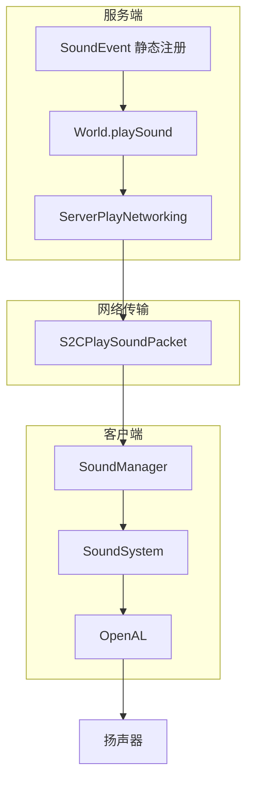
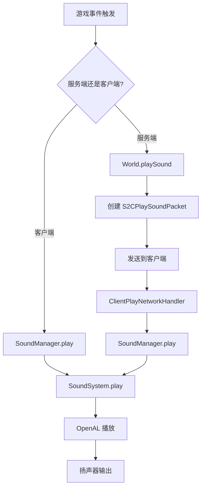

# 第 70 章：声音系统（Sound System）

## 章节目标

- 理解声音系统的整体架构
- 掌握 SoundEvent、SoundCategory 的概念
- 了解 SoundManager 的工作原理
- 学会播放自定义声音

## 前置知识

- Minecraft 客户端基础
- JSON 数据格式
- 资源包基础

## 核心概念

### 什么是声音系统？

**声音系统** 负责 Minecraft 中所有音频的播放，从方块挖掘声到背景音乐，从生物叫声到天气音效。你可以把它想象成**游戏的音响工程师**——根据游戏事件播放合适的音频，为玩家创造沉浸式的听觉体验。

### 声音类型总览

```
┌─────────────────────────────────────────────────────────────┐
│                    Minecraft 声音类型                         │
├─────────────────────────────────────────────────────────────┤
│                                                             │
│   🔨 方块声音                                               │
│   ├── block.stone.break - 石头破坏                          │
│   ├── block.wood.hit - 木头敲击                             │
│   └── block.door.close - 门关闭                             │
│                                                             │
│   🐄 生物声音                                               │
│   ├── entity.zombie.ambient - 僵尸叫声                      │
│   ├── entity.cow.milk - 挤牛奶                              │
│   └── entity.bat.idle - 蝙蝠叫声                            │
│                                                             │
│   🎵 音乐                                                   │
│   ├── music.game.nether - 下界背景音乐                      │
│   ├── music.game.end - 末地背景音乐                          │
│   └── music_disc.pigstep - Pigstep 唱片                     │
│                                                             │
│   🌧️ 天气声音                                               │
│   ├── weather.rain - 雨声                                   │
│   └── weather.rain.above - 上方雨声                         │
│                                                             │
│   🎮 UI 声音                                                │
│   ├── ui.button.click - 按钮点击                           │
│   └── ui.toast.advancement - 成就弹出                        │
│                                                             │
└─────────────────────────────────────────────────────────────┘
```

## 声音系统架构



## SoundEvent - 声音事件

### 声音事件定义

```java
net/minecraft/sound/SoundEvent.java
public class SoundEvent {
    private final Identifier id;           // 声音 ID
    private final float distanceToTravel; // 传播距离
    private final boolean staticDistance; // 是否固定距离

    // 创建一个默认声音事件（传播距离 16 格）
    public static SoundEvent of(Identifier id) {
        return new SoundEvent(id, 16.0f, false);
    }

    // 创建一个自定义传播距离的声音事件
    public static SoundEvent of(Identifier id, float distanceToTravel) {
        return new SoundEvent(id, distanceToTravel, true);
    }

    // 根据音量计算实际传播距离
    public float getDistanceToTravel(float volume) {
        if (this.staticDistance) {
            return this.distanceToTravel;
        }
        return volume > 1.0f ? 16.0f * volume : 16.0f;
    }
}
```

### 声音事件注册

```java
net/minecraft/sound/SoundEvents.java
public class SoundEvents {
    // 方块声音
    public static final SoundEvent BLOCK_BREAK = register("block.stone.break", 1.0f);
    public static final SoundEvent BLOCK_PLACE = register("block.stone.hit", 1.0f);
    
    // 生物声音
    public static final SoundEvent ENTITY_ZOMBIE_AMBIENT = register("entity.zombie.ambient");
    public static final SoundEvent ENTITY_ZOMBIE_HURT = register("entity.zombie.hurt");
    public static final SoundEvent ENTITY_ZOMBIE_DEATH = register("entity.zombie.death");
    
    // 音乐唱片
    public static final SoundEvent MUSIC_DISC_13 = register("music_disc.13");
    public static final SoundEvent MUSIC_DISC_PIGSTEP = register("music_disc.pigstep");
    
    // UI 声音
    public static final SoundEvent UI_BUTTON_CLICK = register("ui.button.click");
    public static final SoundEvent UI_TOAST_ADVANCEMENT = register("ui.toast.advancement");
}
```

## SoundCategory - 音量通道

### 音量通道枚举

```java
net/minecraft/sound/SoundCategory.java
public enum SoundCategory {
    MASTER("master"),      // 总音量
    MUSIC("music"),        // 背景音乐
    RECORDS("record"),     // 唱片机音乐
    WEATHER("weather"),    // 天气声音
    BLOCKS("block"),       // 方块声音
    HOSTILE("hostile"),    // 敌对生物
    NEUTRAL("neutral"),    // 中立生物
    PLAYERS("player"),     // 玩家声音
    AMBIENT("ambient"),    // 环境声音
    VOICE("voice");        // 语音

    private final String name;
}
```

每个类别对应游戏设置中的独立音量滑块。

## SoundInstance - 声音实例

### 声音实例接口

```java
net/minecraft/sound/SoundInstance.java
public interface SoundInstance extends Identifiable {
    Identifier getId();              // 声音资源标识符
    SoundCategory getCategory();    // 音量通道
    
    float getVolume();              // 音量 (0.0 - ∞)
    float getPitch();               // 音调 (0.5 - 2.0)
    
    double getX();                  // 3D 位置 X
    double getY();                  // 3D 位置 Y
    double getZ();                  // 3D 位置 Z
    
    AttenuationType getAttenuationType();  // 衰减类型
    float getReferenceDistance();    // 参考距离
    float getSemiDecayDistance();   // 半衰减距离
}
```

### 衰减类型

```java
public enum AttenuationType {
    NONE,     // 无衰减（全局声音）
    LINEAR    // 线性衰减（3D 声音）
}
```

## SoundManager - 声音管理器

### 客户端声音管理

```java
52:53:source/net/minecraft/client/sound/SoundManager.java
@Environment(value=EnvType.CLIENT)
public class SoundManager extends SinglePreparationResourceReloader<SoundList> {
```

### 核心方法

```java
152:167:source/net/minecraft/client/sound/SoundManager.java
// 播放声音
public void play(SoundInstance sound) {
    this.soundSystem.play(sound);
}

// 下一 tick 播放（用于 tick 内触发的声音）
public void playNextTick(TickableSoundInstance sound) {
    this.soundSystem.playNextTick(sound);
}

// 更新监听器位置（相机位置）
public void updateListenerPosition(Camera camera) {
    this.soundSystem.updateListenerPosition(camera);
}

// 暂停所有声音
public void pauseAll() {
    this.soundSystem.pauseAll();
}

// 停止所有声音
public void stopAll() {
    this.soundSystem.stopAll();
}
```

## 声音播放流程



## 播放声音的方法

### 服务端播放

```java
// 在指定位置播放声音
world.playSound(player, x, y, z, 
    SoundEvents.BLOCK_STONE_BREAK,  // 声音事件
    SoundCategory.BLOCKS,            // 音量通道
    1.0f,                           // 音量
    1.0f);                          // 音调

// 播放给指定玩家
world.playSoundToPlayer(player, 
    SoundEvents.UI_BUTTON_CLICK,
    SoundCategory.MASTER,
    x, y, z,
    1.0f, 1.0f);

// 无声播放（仅触发服务端逻辑）
world.playNeutralSound(player, sound, 1.0f, 1.0f);
```

### 客户端播放

```java
// 直接播放
MinecraftClient client = MinecraftClient.getInstance();
client.getSoundManager().play(new MovingSoundInstance(...) {
    // 实现 SoundInstance 接口
});
```

## 声音资源格式

### JSON 定义格式

```json
{
  "sound_event_id": {
    "sounds": [
      {
        "name": "path/to/sound",
        "pitch": 1.0,
        "volume": 1.0,
        "weight": 1
      },
      {
        "name": "path/to/alternate_sound",
        "pitch": 0.8,
        "volume": 0.5
      }
    ],
    "subtitle": "translation.key"
  }
}
```

### 资源包结构

```
assets/minecraft/sounds/
├── music/
│   ├── game/
│   │   ├── nether/
│   │   │   └── nether1.ogg
│   │   └── end/
│   │       └── end1.ogg
│   └── disc/
│       └── pigstep.ogg
├── mob/
│   ├── zombie/
│   │   ├── ambient.ogg
│   │   ├── hurt1.ogg
│   │   ├── death1.ogg
│   │   └── say1.ogg
│   └── enderman/
│       └── scream1.ogg
├── note/
│   ├── harp.ogg
│   ├── bass.ogg
│   └── drum.ogg
└── random/
    ├── click.ogg
    └── pop.ogg
```

## 唱片机音乐系统

### JukeboxManager

```java
net/minecraft/block/entity/JukeboxBlockEntity.java
public class JukeboxBlockEntity extends BlockEntity implements Tickable {
    private ItemStack record = ItemStack.EMPTY;
    private int songPosition = 0;
    private boolean isPlaying = false;

    // 播放唱片
    public void playRecord(ItemStack record) {
        this.record = record;
        this.isPlaying = true;
        SoundEvent sound = getMusicDiscSound(record);
        this.world.playSound(null, this.getPos(), sound,
            SoundCategory.RECORDS, 1.0f, 1.0f);
    }

    @Override
    public void tick() {
        if (this.isPlaying) {
            this.songPosition++;
            if (this.songPosition >= getSongDuration(this.record)) {
                if (this.getComparatorOutput() > 0) {
                    this.songPosition = 0; // 循环
                } else {
                    this.stopRecord();
                }
            }
        }
    }
}
```

### 唱片声音映射

```java
private static final Map<Item, SoundEvent> DISC_SOUNDS = Map.of(
    Items.MUSIC_DISC_13, SoundEvents.MUSIC_DISC_13,
    Items.MUSIC_DISC_CAT, SoundEvents.MUSIC_DISC_CAT,
    Items.MUSIC_DISC_BLOCKS, SoundEvents.MUSIC_DISC_BLOCKS,
    Items.MUSIC_DISC_PIGSTEP, SoundEvents.MUSIC_DISC_PIGSTEP
    // ... 更多唱片
);
```

## 环境声音系统

### AmbientSoundLoops

客户端世界中的环境音播放器：

```java
net/minecraft/client/world/ClientWorld.java
// 在 ClientWorld 初始化时创建
this.tickables.add(new AmbientSoundLoops(this, client.getSoundManager()));
this.tickables.add(new BubbleColumnSoundPlayer(this));
this.tickables.add(new BiomeEffectSoundPlayer(this, client.getSoundManager()));
```

### TickableSoundInstance

需要持续更新的声音：

```java
net/minecraft/sound/TickableSoundInstance.java
public interface TickableSoundInstance extends SoundInstance {
    void tick();    // 每 tick 更新
    boolean isDone();  // 是否播放完成
}
```

## 常见声音速查表

| 类别 | 声音 ID | 用途 |
|------|---------|------|
| 方块 | `block.stone.break` | 挖掘石头 |
| 方块 | `block.bell.hit` | 钟被敲击 |
| 天气 | `weather.rain` | 下雨声 |
| 生物 | `entity.zombie.ambient` | 僵尸叫声 |
| 唱片 | `music_disc.13` | 唱片 #13 |
| UI | `ui.button.click` | 按钮点击 |
| 音乐 | `music.game.nether` | 下界音乐 |
| 环境 | `ambient.cave` | 洞穴环境音 |

## 实战：播放自定义声音

### 1. 注册声音事件

```json
// data/mymod/sounds.json
{
    "custom_sound": {
        "sounds": [
            "mymod:custom/ding",
            "mymod:custom/ding_alt"
        ],
        "subtitle": "sound.mymod.custom"
    }
}
```

### 2. 在资源包中放置声音文件

```
assets/mymod/sounds/custom/
├── ding.ogg
└── ding_alt.ogg
```

### 3. 播放声音

```java
// 服务端播放
world.playSound(null, x, y, z,
    SoundEvents.of(new Identifier("mymod", "custom_sound")),
    SoundCategory.PLAYERS,
    1.0f,  // 音量
    1.0f   // 音调
);

// 播放带随机偏移
world.playSound(null, x, y, z,
    SoundEvents.MYMOD_CUSTOM_SOUND,
    SoundCategory.PLAYERS,
    1.0f,
    random.nextFloat() * 0.5f + 0.75f  // 随机音调
);
```

## 声音优化

### 距离衰减计算

```java
// 线性衰减公式
public float getGainAtDistance(float distance) {
    float referenceDistance = this.getReferenceDistance();  // 通常 16 格
    float halfDecayDistance = this.getSemiDecayDistance();

    if (distance <= referenceDistance) {
        return 1.0f;
    }
    return Math.max(0.0f, 1.0f - (distance - referenceDistance) / halfDecayDistance);
}
```

### 声音优先级

- 玩家附近的声音优先级高
- 重要声音（如成就、死亡）不会被截断
- 环境音可以被截断

## 课后自查

- [ ] 理解 SoundEvent 和 SoundCategory 的概念
- [ ] 掌握声音事件的注册方式
- [ ] 理解 SoundManager 的作用
- [ ] 能够播放自定义声音
- [ ] 了解唱片机音乐系统
- [ ] 理解距离衰减的工作原理

## 下一步

- **粒子系统**：学习视觉效果
- **后处理效果**：学习着色器特效
- **模组开发**：使用 Fabric API 扩展声音系统

---

*声音系统是 Minecraft 沉浸感的重要组成部分，精心的声音设计可以让游戏体验更加真实！*
