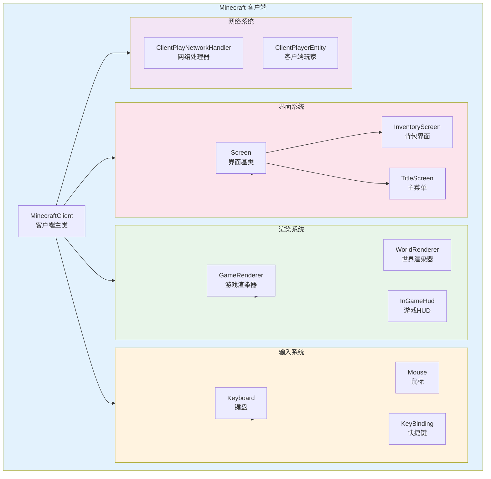

# Part-9 Minecraft 客户端开发

## 概述

本部分将带你深入了解 Minecraft 客户端的内部工作原理。客户端是玩家与游戏世界交互的窗口，负责渲染画面、处理输入、管理网络连接等核心功能。

## 章节导航

### [第45章 Minecraft 客户端核心](./45-minecraft-client.md)

了解 `MinecraftClient` 这个"游戏大脑"：
- 什么是 MinecraftClient
- 游戏主循环（Game Loop）
- 线程模型
- 客户端 vs 服务端

### [第46章 渲染系统](./46-render-system.md)

探索"画画"的艺术：
- GameRenderer vs WorldRenderer
- 渲染管线（Rendering Pipeline）
- 着色器（Shader）基础
- 渲染层级

### [第47章 GUI系统](./47-gui-system.md)

玩转游戏界面：
- Screen 基类设计
- HUD 渲染原理
- 粒子效果系统
- 界面层级架构

### [第48章 输入处理](./48-input-handling.md)

掌控玩家的每一个动作：
- Keyboard 和 Mouse 类
- KeyBinding 快捷键系统
- 客户端预测（Client Prediction）
- 输入事件流程

## 核心组件关系图

## 知识点速查表

| 主题 | 关键类 | 核心概念 |
|------|--------|----------|
| 客户端核心 | `MinecraftClient` | 游戏主循环、Tick、线程模型 |
| 渲染系统 | `GameRenderer`, `WorldRenderer` | 渲染管线、着色器、视锥裁剪 |
| GUI系统 | `Screen`, `InGameHud` | 界面层级、HUD、粒子 |
| 输入系统 | `Keyboard`, `Mouse`, `KeyBinding` | 事件监听、快捷键绑定、客户端预测 |

## 前后关联

### 前置知识
- Part-6 网络基础 - 了解客户端与服务器的通信
- Part-4 实体系统 - 理解玩家实体

### 后续学习
- Mod 开发 - 基于客户端扩展功能
- 渲染优化 - 提升游戏性能
- 界面设计 - 创建自定义菜单

## 源码位置

| 模块 | 路径 |
|------|------|
| 客户端核心 | `net/minecraft/client/MinecraftClient.java` |
| 渲染系统 | `net/minecraft/client/render/` |
| GUI系统 | `net/minecraft/client/gui/` |
| 输入系统 | `net/minecraft/client/input/` |
| 快捷键 | `net/minecraft/client/option/KeyBinding.java` |

## 常见问题

**Q: 客户端和服务端的区别是什么？**
A: 客户端负责显示画面和处理输入，服务端负责游戏逻辑和世界管理。客户端会"预测"玩家操作来减少延迟感。

**Q: 为什么 Minecraft 能流畅地渲染3D世界？**
A: 使用了视锥裁剪、遮挡剔除、LOD等优化技术，只渲染玩家能看到的内容。

**Q: 快捷键系统如何工作？**
A: 每个快捷键是一个 `KeyBinding` 对象，包含按键码和状态。游戏每tick检查一次按键状态。

---

*下一章：[第45章 Minecraft 客户端核心](./45-minecraft-client.md)*
