# Minecraft 1.21 源码教程总入口

> 深入理解 Minecraft 核心架构，从源码开始
>
> 面向人群：想学习 Minecraft 源码、想做 Mod 开发的开发者
>
> 学习目标：理解 MC 架构，能读懂源码，会做 Mod

---

## 课程介绍

本教程带你深入学习 Minecraft 1.21 源码，通过**图表化**、**游戏化**的方式，让你轻松理解复杂的游戏系统。

### 你将学到什么

```
✅ Minecraft 的整体架构
✅ 注册表系统（Registry）—— MC 最核心的概念
✅ 客户端-服务端分离原理
✅ 世界、方块、物品、实体的实现
✅ AI 大脑系统（Brain）
✅ 网络协议与数据包
✅ 命令系统
✅ 资源系统
✅ 渲染引擎
```

---

## 学习路线图

```mermaid
flowchart TB
    subgraph Part0["Part-0 前置准备"]
        P0-1["Java 基础速查"]
        P0-2["开发环境搭建"]
        P0-3["项目结构介绍"]
        P0-4["课程概述"]
    end

    subgraph Part1["Part-1 核心基础 ⭐"]
        P1-1["注册表系统 ⭐<br/>MC 最核心"]
        P1-2["客户端-服务端架构"]
        P1-3["常量与版本"]
        P1-4["启动引导流程"]
        P1-5["Tick 系统"]
    end

    subgraph Part2["Part-2 世界系统"]
        P2-1["World 核心"]
        P2-2["Chunk 区块"]
        P2-3["Biome 生物群系"]
        P2-4["地形生成"]
        P2-5["光照系统"]
        P2-6["Heightmap 高度图"]
    end

    subgraph Part3["Part-3 方块物品"]
        P3-1["Block 方块"]
        P3-2["BlockState 状态"]
        P3-3["BlockEntity 实体"]
        P3-4["Item 物品"]
        P3-5["ItemStack 堆叠"]
        P3-6["Component 组件"]
    end

    subgraph Part4["Part-4 实体系统"]
        P4-1["Entity 入门"]
        P4-2["生命周期"]
        P4-3["LivingEntity"]
        P4-4["MobEntity"]
        P4-5["属性系统"]
        P4-6["伤害系统"]
        P4-7["生成系统"]
    end

    subgraph Part5["Part-5 AI系统 ⭐"]
        P5-1["AI Brain ⭐<br/>最有趣"]
        P5-2["Memory 记忆"]
        P5-3["Sensor 传感器"]
        P5-4["Task 任务"]
        P5-5["Activity 日程"]
        P5-6["Pathfinding 路径"]
        P5-7["AI 控制"]
    end

    subgraph Part6["Part-6 网络系统"]
        P6-1["网络入门"]
        P6-2["数据包"]
        P6-3["协议状态"]
        P6-4["同步机制"]
        P6-5["登录流程"]
        P6-6["Play 数据包"]
        P6-7["聊天协议"]
    end

    subgraph Part7["Part-7 命令系统"]
        P7-1["命令入门"]
        P7-2["Brigadier"]
        P7-3["自定义命令"]
    end

    subgraph Part8["Part-8 资源系统"]
        P8-1["资源包"]
        P8-2["数据包"]
        P8-3["战利品表"]
        P8-4["进度系统"]
        P8-5["配方系统"]
    end

    subgraph Part9["Part-9 客户端"]
        P9-1["MinecraftClient"]
        P9-2["渲染系统"]
        P9-3["GUI 系统"]
        P9-4["输入处理"]
        P9-5["渲染层级"]
        P9-6["实体模型"]
        P9-7["声音系统"]
    end

    subgraph Part10["Part-10 服务端"]
        P10-1["服务端入门"]
        P10-2["玩家管理"]
        P10-3["Tick 与主循环"]
        P10-4["存档系统"]
        P10-5["独立 vs 整合"]
    end

    subgraph Part11["Part-11 进阶主题"]
        P11-1["DataFixer"]
        P11-2["流体系统"]
        P11-3["村庄系统"]
        P11-4["袭击系统"]
        P11-5["结构系统"]
        P11-6["Profiler"]
        P11-7["爆炸"]
        P11-8["载具"]
        P11-9["RCON 与语言"]
    end

    subgraph Part12["Part-12 实战项目 💪"]
        P12-1["项目1:方块"]
        P12-2["项目2:物品"]
        P12-3["项目3:生物"]
        P12-4["项目4:数据包"]
    end

    P0-1 --> P0-2 --> P0-3 --> P0-4
    P0-4 --> P1-1 --> P1-2 --> P1-3 --> P1-4 --> P1-5
    P1-5 --> P2-1 --> P2-2 --> P2-3 --> P2-4 --> P2-5 --> P2-6
    P2-6 --> P3-1 --> P3-2 --> P3-3 --> P3-4 --> P3-5 --> P3-6
    P3-6 --> P4-1 --> P4-2 --> P4-3 --> P4-4 --> P4-5 --> P4-6 --> P4-7
    P4-7 --> P5-1 --> P5-2 --> P5-3 --> P5-4 --> P5-5 --> P5-6 --> P5-7
    P5-7 --> P6-1 --> P6-2 --> P6-3 --> P6-4 --> P6-5 --> P6-6 --> P6-7
    P6-7 --> P7-1 --> P7-2 --> P7-3
    P7-3 --> P8-1 --> P8-2 --> P8-3 --> P8-4 --> P8-5
    P8-5 --> P9-1 --> P9-2 --> P9-3 --> P9-4 --> P9-5 --> P9-6 --> P9-7
    P9-7 --> P10-1 --> P10-2 --> P10-3 --> P10-4 --> P10-5
    P10-5 --> P11-1 --> P11-2 --> P11-3 --> P11-4 --> P11-5 --> P11-6 --> P11-7 --> P11-8 --> P11-9
    P11-9 --> P12-1 --> P12-2 --> P12-3 --> P12-4

    style P1-1 fill:#ff6b6b,color:#fff
    style P5-1 fill:#ff6b6b,color:#fff
    style P12-1 fill:#6bcb77,color:#fff
    style P12-2 fill:#6bcb77,color:#fff
    style P12-3 fill:#6bcb77,color:#fff
    style P12-4 fill:#6bcb77,color:#fff
```



---

## 每个 Part 简介

| Part | 名称 | 核心内容 | 重要性 |
|------|------|----------|--------|
| **Part-0** | 前置准备 | Java 基础、环境搭建、项目结构 | 必读 |
| **Part-1** | 核心基础 | 注册表系统、客户端-服务端架构 | ⭐ 核心 |
| **Part-2** | 世界系统 | World、Chunk、Biome、地形生成、光照 | 重要 |
| **Part-3** | 方块物品 | Block、BlockEntity、Item、ItemStack | 重要 |
| **Part-4** | 实体系统 | Entity、LivingEntity、MobEntity、属性、伤害 | 重要 |
| **Part-5** | AI系统 | Brain、Memory、Sensor、Task、Pathfinding | ⭐ 核心 |
| **Part-6** | 网络系统 | Packet、Protocol、Sync | 重要 |
| **Part-7** | 命令系统 | Command、Brigadier、自定义命令 | 实用 |
| **Part-8** | 资源系统 | ResourcePack、Datapack、战利品、配方 | 实用 |
| **Part-9** | 客户端 | MinecraftClient、Render、GUI、Input | 进阶 |
| **Part-10** | 服务端 | Server、PlayerManager、Save | 进阶 |
| **Part-11** | 进阶主题 | DataFixer、Fluid、Village、Raid | 深入 |
| **Part-12** | 实战项目 | 4 个动手项目 | 实践 |

---

## 系统依赖关系图

```mermaid
flowchart TD
    subgraph Core["核心层"]
        Registry["注册表 Registry<br/>⭐ 最核心"]
        Constants["常量 SharedConstants"]
        Bootstrap["启动 Bootstrap"]
        Tick["Tick 循环"]
    end

    subgraph Content["内容层"]
        Block["方块 Block"]
        Item["物品 Item"]
        Entity["实体 Entity"]
        Biome["生物群系 Biome"]
        Fluid["流体 Fluid"]
    end

    subgraph WorldLayer["世界层"]
        World["World 世界"]
        Chunk["Chunk 区块"]
        Gen["地形生成"]
        Light["光照系统"]
        Heightmap["高度图"]
        Border["世界边界"]
    end

    subgraph EntityLayer["实体层"]
        Living["LivingEntity"]
        Mob["MobEntity"]
        Player["PlayerEntity"]
    end

    subgraph AILayer["AI层 ⭐"]
        Brain["AI 大脑 Brain"]
        Memory["记忆 Memory"]
        Sensor["传感器"]
        Task["任务 Task"]
        Path["路径导航"]
    end

    subgraph Network["网络层"]
        Packet["数据包 Packet"]
        Protocol["协议状态"]
        Sync["同步 Sync"]
    end

    subgraph Gameplay["游戏机制"]
        Damage["伤害系统"]
        Spawn["生成系统"]
        Command["命令系统"]
        Recipe["配方系统"]
        Loot["战利品表"]
        Adv["进度系统"]
    end

    subgraph Client["客户端"]
        MCClient["MinecraftClient"]
        Render["渲染引擎"]
        GUI["GUI 系统"]
        Input["输入处理"]
    end

    subgraph Server["服务端"]
        Server["MinecraftServer"]
        PlayerMgr["玩家管理"]
        Save["存档系统"]
    end

    Registry --> Block
    Registry --> Item
    Registry --> Entity
    Registry --> Biome
    Registry --> Fluid

    Block --> World
    Item --> World
    Entity --> World
    Biome --> World

    World --> Chunk
    World --> Gen
    World --> Light
    World --> Heightmap
    World --> Border

    Entity --> Living
    Living --> Mob
    Living --> Player
    Mob --> Brain

    Brain --> Memory
    Brain --> Sensor
    Brain --> Task
    Brain --> Path

    World --> Packet
    Packet --> Sync

    Tick --> Server
    Server --> PlayerMgr
    Server --> Save

    MCClient --> Render
    MCClient --> GUI
    MCClient --> Input

    Network <-->|数据包| Client
    Network <-->|数据包| Server

    style Registry fill:#ffd93d,color:#000
    style Brain fill:#ff6b6b,color:#fff
    style World fill:#6bcb77,color:#fff
```

---

## 萌新必懂三大核心

### 1. 注册表系统（Registry）⭐

> 想象注册表是**图书馆的索引卡片**

```
图书馆                    Minecraft
─────────                ─────────
书架上的书    ←──对应──→  方块、物品、实体
索引卡片    ←──对应──→  注册表 Registry
书的编号    ←──对应──→  Identifier (如 minecraft:stone)

查找 "石头"：
1. 用 "minecraft:stone" 查注册表
2. → 找到石头方块的代码
```

### 2. 客户端-服务端分离

> 想象你和朋友**视频通话**

```
你（客户端）              朋友（服务端）
─────────────            ─────────────
看到画面渲染              负责游戏逻辑
发送操作                  验证操作
本地预测                  权威数据源

MC 多人游戏：
- 客户端渲染看到的世界
- 服务端运行真实的世界
- 两者通过网络包同步
```

### 3. AI 大脑系统（Brain）⭐

> AI 大脑 = 记忆 + 感知 + 行动

```
┌─────────────────────────────────────┐
│           AI 大脑 Brain              │
├─────────────────────────────────────┤
│  Memory 记忆 ←── 传感器感知世界        │
│      ↓                               │
│  Brain 决策 ←── 根据记忆做决定        │
│      ↓                               │
│  Task 行动 ←── 执行任务               │
└─────────────────────────────────────┘
```

---

## 学习建议

### 学习顺序

```
1️⃣  从 Part-0 开始，按顺序学习
2️⃣  每章先看 Mermaid 图，再看文字
3️⃣  在 IDEA 中搜索对应的源码
4️⃣  完成每章的练习
```

### 时间规划

| 阶段 | 内容 | 建议时间 | 累计 |
|------|------|----------|------|
| Part-0 | 前置知识 | 2-3 天 | 2-3 天 |
| Part-1 | 核心基础 | 3-5 天 | 5-8 天 |
| Part-2-4 | 世界方块实体 | 15-21 天 | 20-29 天 |
| **Part-5** | **AI系统** | **5-7 天** | **25-36 天** |
| Part-6-8 | 网络命令资源 | 8-13 天 | 33-49 天 |
| Part-9-11 | 客户端进阶 | 8-13 天 | 41-62 天 |
| Part-12 | 实战项目 | 7-14 天 | 48-76 天 |

> ⏰ **总计**：大约 48-76 天可以学完核心内容

---

## 如何开始

### 第一步：准备环境

1. 安装 JDK 17+
2. 安装 IntelliJ IDEA
3. 配置反编译工具

👉 [Part-0 前置准备](./Part-0-Prerequisites/)

### 第二步：理解核心

从最重要的**注册表系统**开始：

👉 [Part-1 核心基础](./Part-1-Foundation/)

### 第三步：动手实践

学完基础后，尝试创建自己的内容：

👉 [Part-12 实战项目](./Part-12-Practice/)

---

## 学习检查清单

完成本教程后，你应该能够：

- [ ] ✅ 理解注册表三层结构（Identifier → RegistryKey → RegistryEntry）
- [ ] ✅ 能找到石头方块的源码代码
- [ ] ✅ 理解客户端-服务端分离原理
- [ ] ✅ 理解 World 和 Chunk 的关系
- [ ] ✅ 理解 Entity 是什么
- [ ] ✅ 理解 AI 大脑的三层结构（Memory → Brain → Task）
- [ ] ✅ 理解网络数据包流程
- [ ] ✅ 能创建自定义命令
- [ ] ✅ 能创建数据包
- [ ] ✅ 能添加新方块/物品/生物

---

## 快速导航

### 核心章节

| 章节 | 文件 | 描述 |
|------|------|------|
| 注册表系统 | [04-registry-system.md](./Part-1-Foundation/04-registry-system.md) | ⭐ 最重要 |
| AI大脑 | [28-ai-brain-intro.md](./Part-5-AI/28-ai-brain-intro.md) | ⭐ 最有趣 |
| Tick系统 | [08-tick-system.md](./Part-1-Foundation/08-tick-system.md) | 游戏心跳 |
| 启动流程 | [09-bootstrap-flow.md](./Part-1-Foundation/09-bootstrap-flow.md) | 启动顺序 |

### 相关资源

| 资源 | 链接 |
|------|------|
| 📊 详细学习路线图 | [01-LEARNING-ROADMAP.md](./01-LEARNING-ROADMAP.md) |
| 📝 学习总结 | [SUMMARY.md](./SUMMARY.md) |
| 🔧 源码分析 | [../-analysis/](../-analysis/) |

---

## 相关链接

- [Minecraft Wiki](https://minecraft.fandom.com/wiki/Minecraft_Wiki)
- [Fabric Wiki](https://fabricmc.net/wiki/)
- [Minecraft Forge Wiki](https://minecraftforge.net/)
- [Brigadier 命令库](https://github.com/Mojang/brigadier)

---

> **下一章预告**：[Part-0 前置准备](./Part-0-Prerequisites/) - Java 基础速查和开发环境搭建

---

*教程版本：Minecraft 1.21*
*最后更新：2026-03-26*
