# Minecraft 1.21 源码萌新教程

> 面向零基础开发者的 Minecraft 源码完全指南

---

## 教程概览

本教程旨在帮助完全不懂 Minecraft 源码的人，通过这套课程：
1. **理解** Minecraft 的架构设计
2. **掌握** 核心系统的实现原理
3. **能够** 进行 Mod 开发

## 学习路线图

```mermaid
flowchart TB
    subgraph Phase0["第0部分：前置知识"]
        P0-1["Java基础"] --> P0-2["开发环境"]
        P0-2 --> P0-3["项目结构"]
    end

    subgraph Phase1["第1部分：核心基础 ⭐"]
        P0-3 --> P1-1["注册表系统"]
        P1-1 --> P1-2["客户端-服务端"]
        P1-2 --> P1-3["启动流程"]
    end

    subgraph Phase2["第2部分：世界系统"]
        P1-3 --> P2-1["World类"]
        P2-1 --> P2-2["Chunk"]
        P2-2 --> P2-3["地形生成"]
    end

    subgraph Phase3["第3部分：方块物品"]
        P2-3 --> P3-1["方块基础"]
        P3-1 --> P3-2["方块状态"]
        P3-2 --> P3-3["物品系统"]
    end

    subgraph Phase4["第4部分：实体系统"]
        P3-3 --> P4-1["实体入门"]
        P4-1 --> P4-2["生命周期"]
        P4-2 --> P4-3["属性伤害"]
    end

    subgraph Phase5["第5部分：AI系统 ⭐"]
        P4-3 --> P5-1["AI大脑"]
        P5-1 --> P5-2["记忆传感器"]
        P5-2 --> P5-3["任务活动"]
    end

    subgraph Phase6["第6-8部分：系统"]
        P5-3 --> P6-1["网络协议"]
        P6-1 --> P6-2["命令系统"]
        P6-2 --> P6-3["资源系统"]
    end

    subgraph Phase7["第9-10部分"]
        P6-3 --> P7-1["客户端"]
        P7-1 --> P7-2["服务端"]
    end

    subgraph Phase8["第11-12部分"]
        P7-2 --> P8-1["进阶主题"]
        P8-1 --> P8-2["实战项目 💪"]
    end

    style P1-1 fill:#ff6b6b,color:#fff
    style P5-1 fill:#ff6b6b,color:#fff
    style P8-2 fill:#ffd93d,color:#000
```



---

## 教程目录

### Part-0：前置知识 (5章)
| 章节 | 文件 | 内容 |
|------|------|------|
| 课程概述 | `Part-0-Prerequisites/00-course-overview.md` | 学习路线图、课程目标 |
| Java基础 | `Part-0-Prerequisites/01-java-basics.md` | 面向源码阅读的Java速查 |
| 开发环境 | `Part-0-Prerequisites/02-development-env.md` | IDEA配置、调试方法 |
| 项目结构 | `Part-0-Prerequisites/03-project-intro.md` | 5364个文件分类 |
| 源码查找指南 | `Part-0-Prerequisites/04-sourcecode-guide.md` | ⭐ 新增！快速定位源码 |

### Part-1：核心基础 (4章)
| 章节 | 文件 | 内容 |
|------|------|------|
| 注册表系统 ⭐ | `Part-1-Foundation/04-registry-system.md` | **最重要**！三层结构 |
| 客户端-服务端 | `Part-1-Foundation/05-client-server-arch.md` | 分离架构 |
| 全局常量 | `Part-1-Foundation/06-shared-constants.md` | 版本信息 |
| 启动引导 | `Part-1-Foundation/07-bootstrap-flow.md` | 初始化流程 |

### Part-2：世界系统 (6章)
| 章节 | 文件 | 内容 |
|------|------|------|
| World核心 | `Part-2-World/08-world-core.md` | 世界基类 |
| Chunk系统 | `Part-2-World/09-chunk-system.md` | 区块管理 |
| 生物群系 | `Part-2-World/10-biome-system.md` | Biome |
| 地形生成 | `Part-2-World/11-terrain-gen.md` | ChunkGenerator |
| 光照系统 | `Part-2-World/12-lighting-system.md` | 光照传播 |
| 高度图 | `Part-2-World/13-heightmap.md` | 四种高度图 |

### Part-3：方块物品 (6章)
| 章节 | 文件 | 内容 |
|------|------|------|
| Block基础 | `Part-3-Block-Item/14-block-basics.md` | 方块类 |
| BlockState | `Part-3-Block-Item/15-block-state.md` | 方块状态 |
| BlockEntity | `Part-3-Block-Item/16-block-entity.md` | 方块实体 |
| Item基础 | `Part-3-Block-Item/17-item-basics.md` | 物品类 |
| ItemStack | `Part-3-Block-Item/18-item-stack.md` | 物品堆叠 |
| Component | `Part-3-Block-Item/19-item-component.md` | 1.21新组件 |

### Part-4：实体系统 (7章)
| 章节 | 文件 | 内容 |
|------|------|------|
| Entity入门 | `Part-4-Entity/20-entity-intro.md` | 实体基类 |
| 生命周期 | `Part-4-Entity/21-entity-lifecycle.md` | 创建到销毁 |
| LivingEntity | `Part-4-Entity/22-living-entity.md` | 有生命实体 |
| MobEntity | `Part-4-Entity/23-mob-entity.md` | 生物实体 |
| 属性系统 | `Part-4-Entity/24-entity-attributes.md` | Attribute |
| 伤害系统 | `Part-4-Entity/25-damage-system.md` | 伤害计算 |
| 生成系统 | `Part-4-Entity/26-spawn-system.md` | 实体生成 |

### Part-5：AI系统 (6章)
| 章节 | 文件 | 内容 |
|------|------|------|
| AI大脑 ⭐ | `Part-5-AI/27-ai-brain-intro.md` | **最重要**！三层架构 |
| 记忆系统 | `Part-5-AI/28-memory-system.md` | 记忆存储 |
| 传感器 | `Part-5-AI/29-sensor-system.md` | 感知环境 |
| 任务系统 | `Part-5-AI/30-task-system.md` | 行为动作 |
| 活动日程 | `Part-5-AI/31-activity-schedule.md` | 作息表 |
| 路径导航 | `Part-5-AI/32-pathfinding.md` | GPS导航 |

### Part-6：网络系统 (4章)
| 章节 | 文件 | 内容 |
|------|------|------|
| 网络入门 | `Part-6-Network/33-network-intro.md` | 网络基础 |
| 数据包 | `Part-6-Network/34-packet-system.md` | Packet |
| 协议状态 | `Part-6-Network/35-protocol-states.md` | 状态机 |
| 同步机制 | `Part-6-Network/36-sync-mechanism.md` | 位置同步 |

### Part-7：命令系统 (3章)
| 章节 | 文件 | 内容 |
|------|------|------|
| 命令入门 | `Part-7-Command/37-command-intro.md` | 命令解析 |
| Brigadier | `Part-7-Command/38-brigadier-basics.md` | 解析库 |
| 自定义命令 | `Part-7-Command/39-custom-command.md` | 创建命令 |

### Part-8：资源系统 (5章)
| 章节 | 文件 | 内容 |
|------|------|------|
| 资源包 | `Part-8-Resource/40-resource-pack.md` | 材质加载 |
| 数据包 | `Part-8-Resource/41-datapack-intro.md` | 数据包结构 |
| 战利品表 | `Part-8-Resource/42-loot-table.md` | 掉落物 |
| 进度系统 | `Part-8-Resource/43-advancement.md` | 成就 |
| 配方系统 | `Part-8-Resource/44-recipe-system.md` | 合成配方 |

### Part-9：客户端 (4章)
| 章节 | 文件 | 内容 |
|------|------|------|
| MinecraftClient | `Part-9-Client/45-minecraft-client.md` | 客户端核心 |
| 渲染系统 | `Part-9-Client/46-render-system.md` | 渲染管线 |
| GUI系统 | `Part-9-Client/47-gui-system.md` | 界面 |
| 输入处理 | `Part-9-Client/48-input-handling.md` | 键盘鼠标 |

### Part-10：服务端 (4章)
| 章节 | 文件 | 内容 |
|------|------|------|
| 服务端入门 | `Part-10-Server/49-server-intro.md` | 服务器核心 |
| 玩家管理 | `Part-10-Server/50-player-manager.md` | PlayerManager |
| 存档系统 | `Part-10-Server/51-save-system.md` | 自动保存 |
| 服务器对比 | `Part-10-Server/52-dedicated-vs-integrated.md` | 独立vs整合 |

### Part-11：进阶主题 (5章)
| 章节 | 文件 | 内容 |
|------|------|------|
| 数据修复 | `Part-11-Advanced/53-datafixer.md` | 版本迁移 |
| 流体系统 | `Part-11-Advanced/54-fluids.md` | 水/岩浆 |
| 村民系统 | `Part-11-Advanced/55-village-system.md` | 交易 |
| 袭击系统 | `Part-11-Advanced/56-raid-system.md` | 围城 |
| 结构系统 | `Part-11-Advanced/57-structure-system.md` | 生成 |

### Part-12：实战项目 (4个项目)
| 项目 | 文件 | 内容 |
|------|------|------|
| 新方块 | `Part-12-Practice/98-project1-block.md` | 魔法水晶 |
| 新物品 | `Part-12-Practice/99-project2-item.md` | 魔法魔杖 |
| 新生物 | `Part-12-Practice/100-project3-entity.md` | 火焰精灵 |
| 数据包 | `Part-12-Practice/101-project4-datapack.md` | 自定义数据包 |

---

## 学习建议

### 萌新学习路径

```
第1天:   Part-0 全部
第2-5天: Part-1 全部 (⭐注册表是核心)
第6-10天: Part-2 全部
第11-15天: Part-3 全部
第16-20天: Part-4 全部
第21-25天: Part-5 全部 (⭐AI大脑是核心)
第26-30天: Part-6 全部
第31-33天: Part-7 全部
第34-37天: Part-8 全部
第38-42天: Part-9 全部
第43-45天: Part-10 全部
第46-50天: Part-11 全部
第51+:    Part-12 实战
```

### 每章节学习方法

1. **先看图** - Mermaid 图是理解概念的最佳方式
2. **再看文字** - 带着图的理解去读文字
3. **然后看代码** - 代码是概念的具体实现
4. **最后做练习** - 巩固所学知识

---

## 关键系统索引

| 系统 | 核心类 | 教程章节 | 难度 |
|------|--------|---------|------|
| 注册表 | `Registries` | Part-1 | ⭐ |
| 客户端-服务端 | `World` | Part-1 | ⭐⭐ |
| World | `World` | Part-2 | ⭐⭐ |
| Chunk | `WorldChunk` | Part-2 | ⭐⭐ |
| 方块 | `Block` | Part-3 | ⭐⭐ |
| 物品 | `Item` | Part-3 | ⭐⭐ |
| 实体 | `Entity` | Part-4 | ⭐⭐⭐ |
| AI大脑 | `Brain` | Part-5 | ⭐⭐⭐ |
| 网络 | `Packet` | Part-6 | ⭐⭐⭐ |
| 命令 | `CommandDispatcher` | Part-7 | ⭐⭐ |

---

---

## 最终系统覆盖情况

### ✅ 已覆盖的系统（共 35+ 个子系统）

| 系统 | 包名 | 教程章节 |
|------|------|---------|
| 注册表系统 | `registry` | Part-1 |
| 客户端-服务端 | - | Part-1 |
| 启动引导 | `Bootstrap` | Part-1 |
| 世界系统 | `world` | Part-2 (6章) |
| 方块系统 | `block` | Part-3 |
| 方块状态 | `state` | Part-3 |
| 物品系统 | `item` | Part-3 (3章) |
| 组件系统 | `component` | Part-3 |
| 实体系统 | `entity` | Part-4 (7章) |
| AI系统 | `entity/ai` | Part-5 (6章) |
| 网络协议 | `network` | Part-6 (4章) |
| 命令系统 | `command` | Part-7 (4章) |
| 资源包 | `resource` | Part-8 |
| 数据包 | - | Part-8 |
| 战利品表 | `loot` | Part-8 |
| 进度系统 | `advancement` | Part-8 |
| 配方系统 | `recipe` | Part-8 |
| 客户端 | `client` | Part-9 (4章) |
| 服务端 | `server` | Part-10 (4章) |
| 数据修复 | `datafixer` | Part-11 |
| 流体系统 | `fluid` | Part-11 |
| 村民系统 | `village` | Part-11 |
| 袭击系统 | `raid` | Part-11 |
| 结构系统 | `structure` | Part-11 |
| **附魔系统** | `enchantment` | Part-13 |
| **物品栏容器** | `inventory` | Part-13 |
| **NBT数据** | `nbt` | Part-13 |
| **声音系统** | `sound` | Part-13 |
| **粒子系统** | `particle` | Part-13 |
| **药水效果** | `effect` | Part-13 |
| **记分板** | `scoreboard` | Part-13 |
| **统计系统** | `stat` | Part-13 |
| **文本系统** | `text` | Part-13 |

### Part-13：补充系统 (9个教程)
| 章节 | 文件 | 内容 |
|------|------|------|
| 附魔系统 | `Part-13-Additional/enchantment-system.md` | Enchantment、EnchantmentHelper |
| 物品栏容器 | `Part-13-Additional/inventory-system.md` | Inventory、ScreenHandler、Hopper |
| NBT数据 | `Part-13-Additional/nbt-data-system.md` | NbtCompound、NbtList |
| 声音系统 | `Part-13-Additional/sound-system.md` | SoundEvent、SoundManager |
| 粒子系统 | `Part-13-Additional/particle-system.md` | Particle、ParticleEffect |
| 药水效果 | `Part-13-Additional/potion-effect-system.md` | StatusEffect、MobEffect |
| 记分板 | `Part-13-Additional/scoreboard-system.md` | Scoreboard、Team |
| 统计系统 | `Part-13-Additional/stats-system.md` | Stat、StatType |
| 文本系统 | `Part-13-Additional/text-system.md` | Text、Style、ClickEvent |

---

## 相关资源

- [官方 Minecraft Wiki](https://minecraft.fandom.com/)
- [Minecraft 源码分析](../analysis/) - 详细源码分析
- [学习路线图](01-LEARNING-ROADMAP.md) - 可视化学习路径

---

## 参与贡献

如果你发现错误或有改进建议，欢迎提交 Issue 或 Pull Request。

---

*教程版本: Minecraft 1.21*
*最后更新: 2026-03-19*
