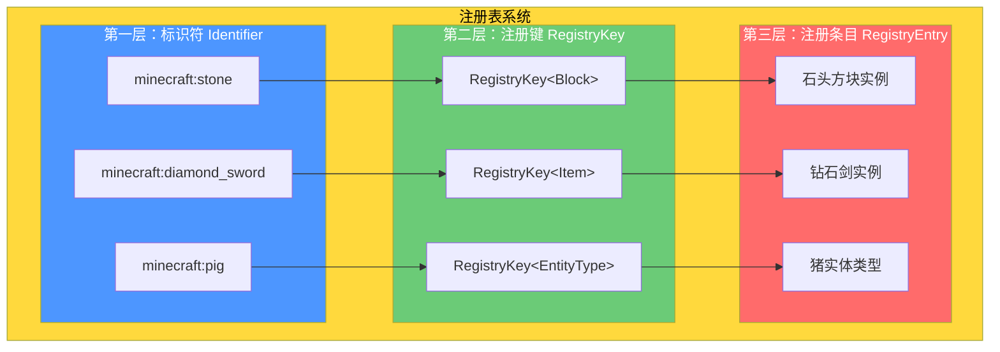
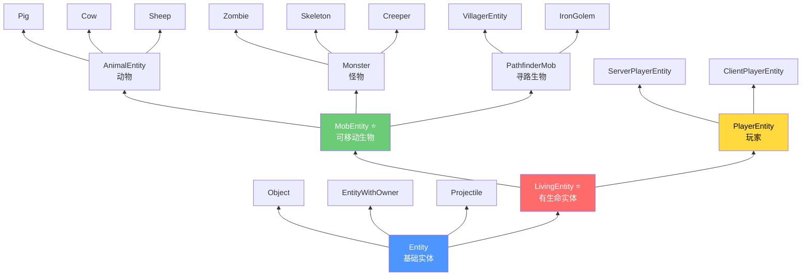
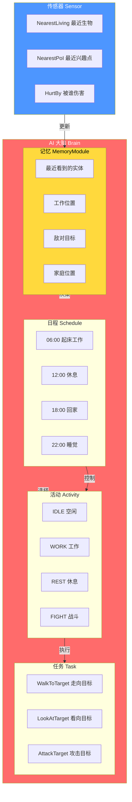
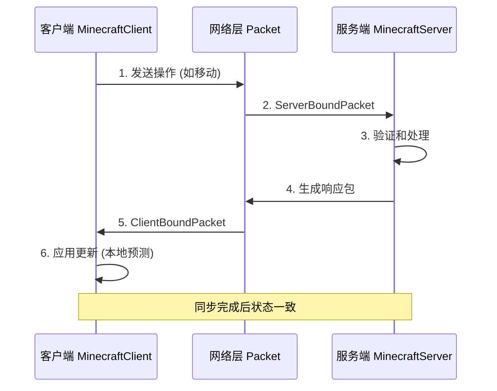
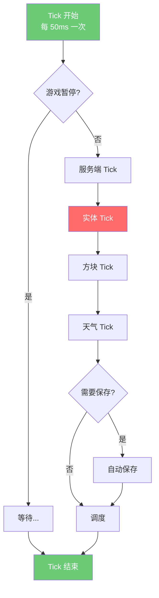
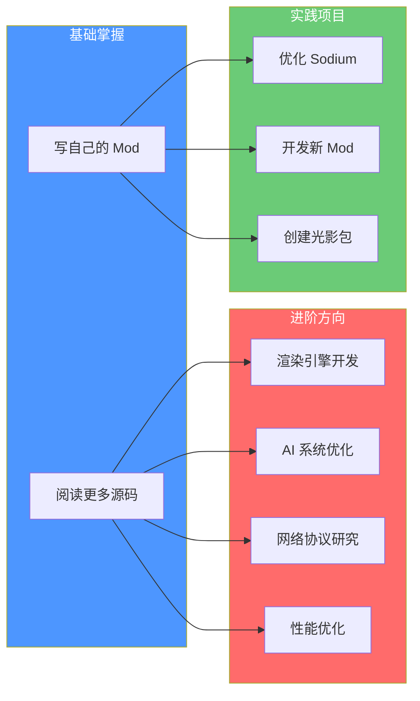

# Minecraft 1.21 源码教程 - 学习总结

> 核心要点速览，知识点汇总

---

## 1. 课程总览

| 属性 | 值 |
|------|-----|
| 教程版本 | Minecraft 1.21 |
| 章节数量 | 12 个 Part |
| 预计学习时间 | 48-76 天 |
| 核心系统 | 注册表、AI大脑、Tick循环 |

---

## 2. 知识点汇总表格

### 核心基础 (Part-1)

| 概念 | 核心类 | 关键点 |
|------|--------|--------|
| 注册表系统 ⭐ | `Registries`, `Identifier`, `RegistryKey` | MC 最核心概念，万物皆注册 |
| 标识符 | `Identifier` | 格式 `namespace:path`，如 `minecraft:stone` |
| 客户端-服务端 | `MinecraftClient`, `MinecraftServer` | 分离架构，各司其职 |
| Tick 循环 | `TickScheduler` | 20次/秒，游戏心跳 |
| 启动流程 | `Bootstrap` | 初始化顺序很重要 |

### 世界系统 (Part-2)

| 概念 | 核心类 | 关键点 |
|------|--------|--------|
| World | `World`, `ServerWorld`, `ClientWorld` | 世界基类，分服务端/客户端 |
| Chunk | `Chunk`, `WorldChunk` | 16x256x16 区块，延迟加载 |
| Biome | `Biome`, `BiomeSource` | 生物群系，噪声生成 |
| 地形生成 | `ChunkGenerator` | 高度图 + 噪声函数 |
| 光照系统 | `LightCalculator` | 方块光 + 天空光 |

### 方块物品 (Part-3)

| 概念 | 核心类 | 关键点 |
|------|--------|--------|
| Block | `Block` | 方块状态机 |
| BlockState | `BlockState` | 同一方块的不同状态 |
| BlockEntity | `BlockEntity` | 有状态的方块（箱子、熔炉等） |
| Item | `Item` | 物品行为 |
| ItemStack | `ItemStack` | 物品堆叠，NBT 数据 |

### 实体系统 (Part-4)

| 概念 | 核心类 | 关键点 |
|------|--------|--------|
| Entity | `Entity` | 所有游戏对象的基类 |
| LivingEntity | `LivingEntity` | 有生命值的实体 |
| MobEntity | `MobEntity` | 有 AI 的生物 |
| PlayerEntity | `PlayerEntity` | 玩家实体 |
| 属性系统 | `Attribute` | 生命、速度、攻击等 |
| 伤害系统 | `DamageSource` | 伤害来源和抗性 |

### AI系统 (Part-5) ⭐

| 概念 | 核心类 | 关键点 |
|------|--------|--------|
| Brain ⭐ | `Brain` | AI 决策核心 |
| Memory | `MemoryModule` | 记忆存储 |
| Sensor | `Sensor` | 感知世界 |
| Task | `Activity` | 行为任务 |
| Schedule | `Schedule` | 日程安排 |
| Pathfinding | `PathNavigator` | 路径导航 |

### 网络系统 (Part-6)

| 概念 | 核心类 | 关键点 |
|------|--------|--------|
| Packet | `Packet` | 数据包 |
| ClientPlayHandler | `ClientPlayPacketListener` | 客户端处理 |
| ServerPlayHandler | `ServerPlayPacketListener` | 服务端处理 |
| Protocol | `Protocol` | 协议状态机 |

### 命令系统 (Part-7)

| 概念 | 核心类 | 关键点 |
|------|--------|--------|
| Command | `Command` | 命令基类 |
| Brigadier | `CommandDispatcher` | Mojang 命令解析库 |
| CommandSource | `CommandSource` | 命令来源 |
| CommandContext | `CommandContext` | 命令上下文 |

### 资源系统 (Part-8)

| 概念 | 核心类 | 关键点 |
|------|--------|--------|
| ResourcePack | `ResourcePack` | 资源包 |
| Datapack | `Datapack` | 数据包 |
| LootTable | `LootTable` | 战利品表 |
| Advancement | `Advancement` | 进度/成就 |
| Recipe | `Recipe` | 合成配方 |

### 客户端 (Part-9)

| 概念 | 核心类 | 关键点 |
|------|--------|--------|
| MinecraftClient | `MinecraftClient` | 客户端主类 |
| GameRenderer | `GameRenderer` | 渲染器 |
| Screen | `Screen` | GUI 界面 |
| Window | `Window` | 窗口管理 |

### 服务端 (Part-10)

| 概念 | 核心类 | 关键点 |
|------|--------|--------|
| MinecraftServer | `MinecraftServer` | 服务端主类 |
| ServerWorld | `ServerWorld` | 服务端世界 |
| PlayerManager | `PlayerManager` | 玩家管理 |
| SaveHandler | `SaveHandler` | 存档处理 |

---

## 3. 核心概念图

### 3.1 注册表三层结构

### 3.2 实体继承关系

### 3.3 AI大脑架构

### 3.4 网络数据包流程

### 3.5 Tick 游戏循环

---

## 4. 学习检查清单

### Part-0 ~ Part-1: 入门

- [ ] 理解什么是注册表系统
- [ ] 能说出 Identifier 的格式
- [ ] 理解客户端和服务端的区别
- [ ] 理解 Tick 是什么

### Part-2: 世界系统

- [ ] 能描述 World 和 Chunk 的关系
- [ ] 理解区块的加载/卸载机制
- [ ] 了解生物群系是如何生成的
- [ ] 理解光照的计算方式

### Part-3: 方块物品

- [ ] 能区分 Block 和 BlockState
- [ ] 理解为什么需要 BlockEntity
- [ ] 理解 Item 和 ItemStack 的区别
- [ ] 知道如何使用 NBT 存储数据

### Part-4: 实体系统

- [ ] 能画出 Entity 继承关系图
- [ ] 理解 LivingEntity 的核心功能
- [ ] 知道实体是如何生成的
- [ ] 理解属性系统是如何工作的

### Part-5: AI系统

- [ ] 理解 Brain 的三大组件（Memory, Sensor, Task）
- [ ] 能解释村民 AI 的工作原理
- [ ] 理解 Schedule 和 Activity 的关系
- [ ] 知道路径导航是如何实现的

### Part-6: 网络系统

- [ ] 理解数据包的作用
- [ ] 能描述客户端和服务端的通信流程
- [ ] 知道什么是状态同步
- [ ] 理解网络压缩和加密

### Part-7 ~ Part-8: 命令和资源

- [ ] 能使用 Brigadier 创建自定义命令
- [ ] 理解资源包和数据包的区别
- [ ] 能创建战利品表
- [ ] 能创建配方

### Part-9 ~ Part-10: 客户端和服务端

- [ ] 理解渲染管线的基本流程
- [ ] 知道服务端如何管理玩家
- [ ] 理解存档是如何保存的
- [ ] 能区分独立服务器和整合客户端

---

## 5. 进阶学习路径

完成本教程后，你可以继续深入：

### 推荐进阶资源

| 方向 | 资源 | 说明 |
|------|------|------|
| 渲染 | [Sodium 分析](../sodium/1.21/fabric/0.8.6/analysis/) | 高性能渲染优化 |
| 光影 | [Iris 分析](../iris/1.21/fabric/1.7.3/analysis/) | 着色器系统 |
| 传送门 | [ImmersivePortals 分析](../ImmersivePortalsMod/1.21.1/fabric/6.0.6/analysis/) | Mixin 高级用法 |
| Mod开发 | [Fabric Wiki](https://fabricmc.net/wiki/) | 官方开发文档 |
| 命令 | [Brigadier GitHub](https://github.com/Mojang/brigadier) | 命令解析库源码 |

---

## 6. 相关资源链接

### 内部资源

| 资源 | 路径 | 说明 |
|------|------|------|
| 学习路线图 | [01-LEARNING-ROADMAP.md](./01-LEARNING-ROADMAP.md) | 完整学习路径 |
| 课程总览 | [README.md](./README.md) | 教程入口 |
| 源码分析 | [../-analysis/](../-analysis/) | 详细系统分析 |
| 源码文件映射 | [../-analysis/SOURCE-FILES.json](../-analysis/SOURCE-FILES.json) | 源码文件索引 |

### 外部资源

| 资源 | 链接 |
|------|------|
| Minecraft Wiki | https://minecraft.fandom.com/wiki/Minecraft_Wiki |
| Fabric Wiki | https://fabricmc.net/wiki/ |
| Minecraft Forge | https://minecraftforge.net/ |
| Brigadier | https://github.com/Mojang/brigadier |
| Mojang YARN 反编译 | https://github.com/FabricMC/yarn |

---

## 7. 关键术语表

| 术语 | 中文 | 解释 |
|------|------|------|
| Registry | 注册表 | 存储游戏所有元素（方块、物品、实体等）的系统 |
| Identifier | 标识符 | 资源的唯一名称，格式 `namespace:path` |
| Tick | 游戏刻 | 游戏的最小时间单位，20次/秒 |
| Entity | 实体 | 存在于世界中的对象（生物、物品、子弹等） |
| Chunk | 区块 | 16x16x256 的方块区域 |
| Biome | 生物群系 | 具有特定环境特征的区域 |
| Packet | 数据包 | 网络通信的基本单位 |
| NBT | Named Binary Tag | Minecraft 的二进制数据格式 |
| Mixin | 混合注入 | 修改代码的技术 |
| Datapack | 数据包 | 自定义游戏内容的 JSON 文件 |

---

## 8. 常见问题速查

### Q: 注册表为什么重要？
A: MC 中几乎所有内容（方块、物品、实体、附魔等）都需要注册才能使用。

### Q: 客户端和服务端的区别是什么？
A: 客户端负责渲染和输入，服务端负责游戏逻辑和数据权威。

### Q: Tick 和帧率有什么关系？
A: Tick 是服务端的逻辑更新（固定20次/秒），帧率是客户端的渲染速度（可变）。

### Q: 为什么要学习源码？
A: 理解源码才能做高级 Mod，才能优化性能，才能创造新的游戏内容。

---

> **学习建议**：不要试图一次记住所有内容，理解核心概念后，多阅读源码。

---

*教程版本：Minecraft 1.21*
*总结更新时间：2026-03-26*
