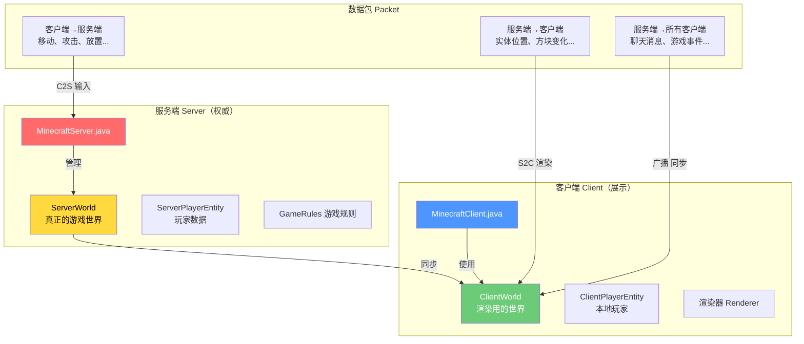
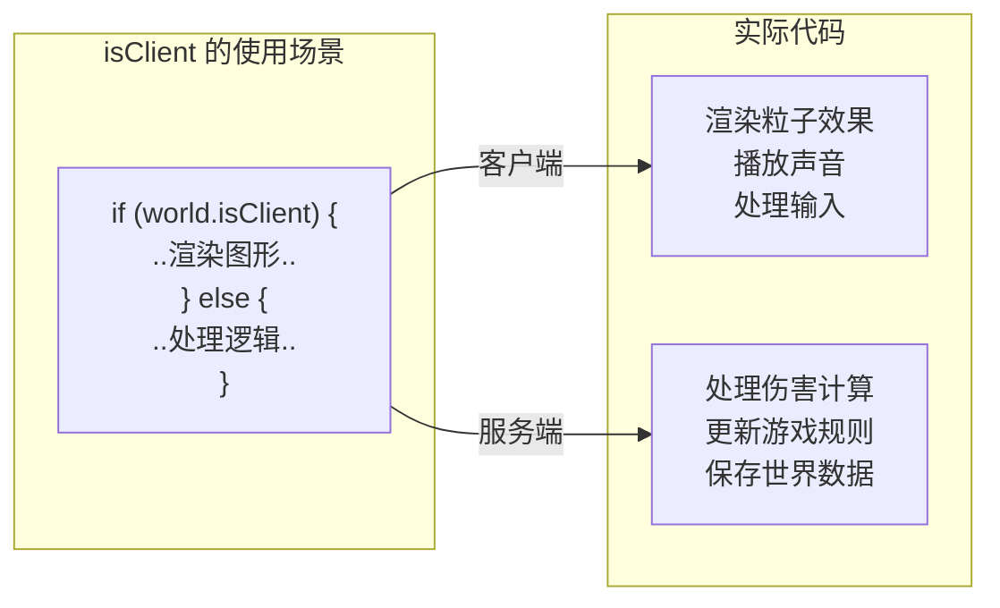
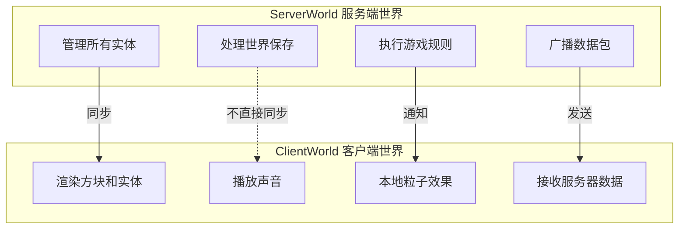
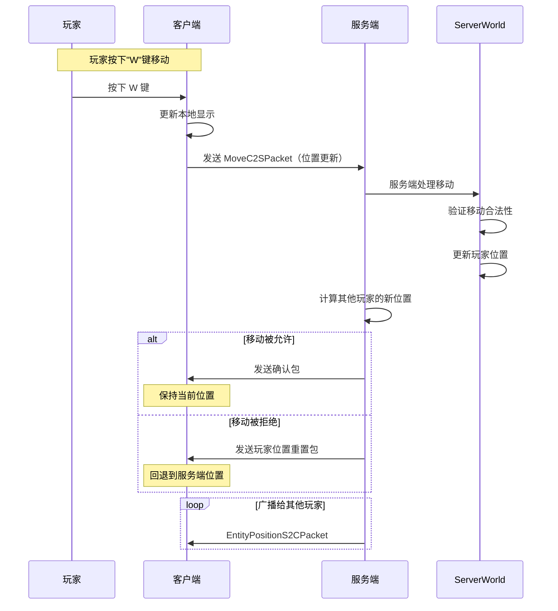
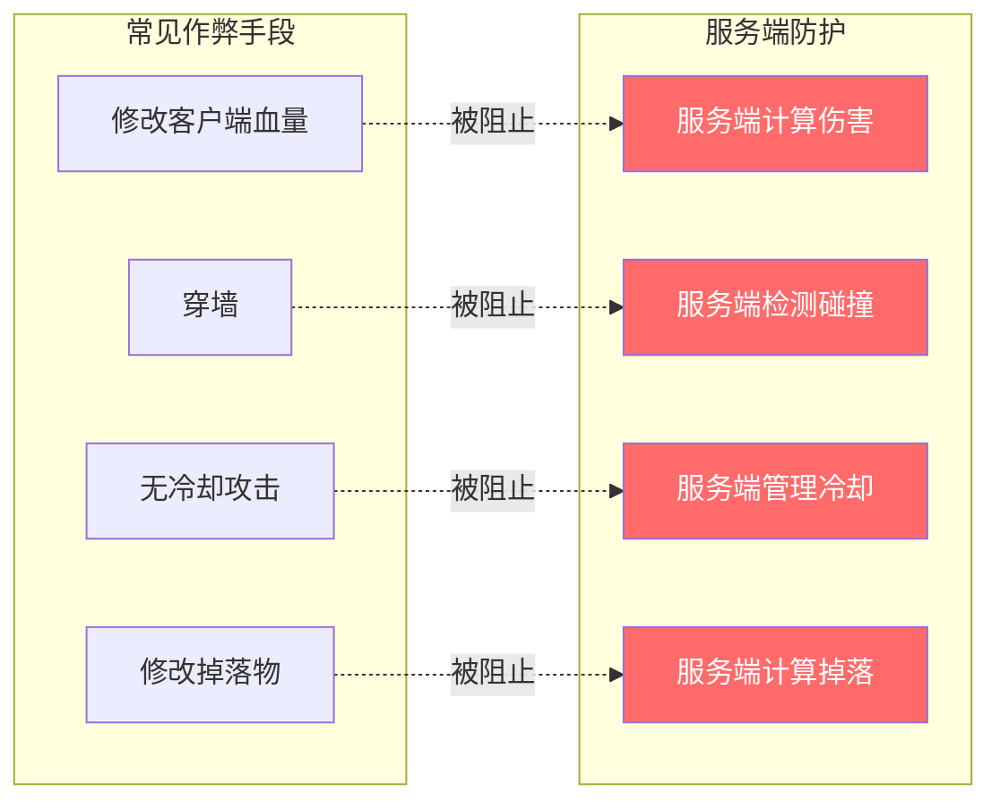
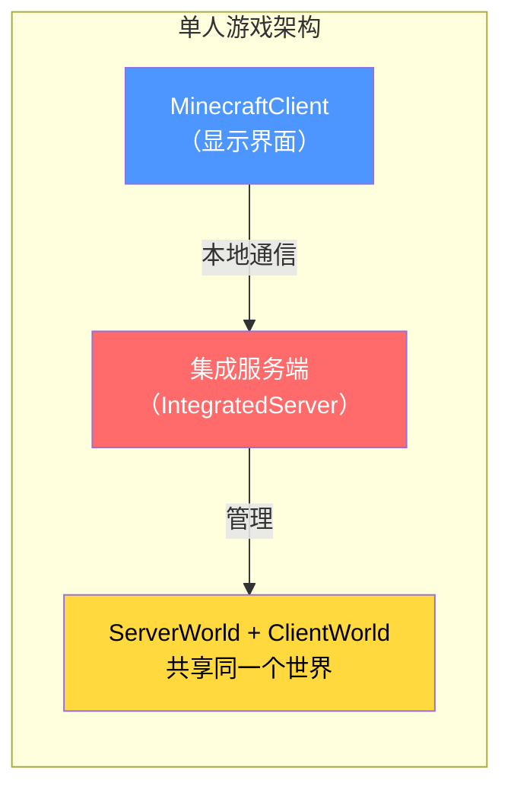
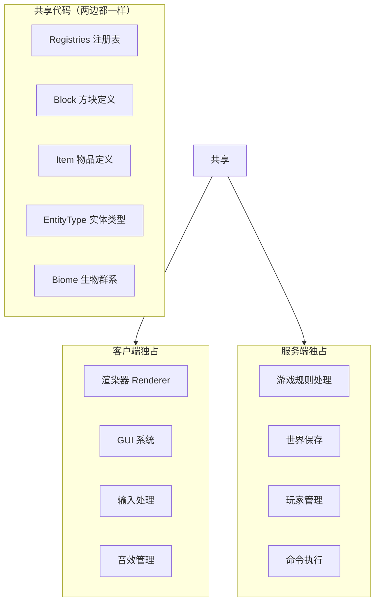

# 第五章：客户端-服务端架构（Client-Server Architecture）

> ⭐ **理解这章，你就能明白 Minecraft 如何实现多人联机！**

> ⚠️ **注意**：以下源码示例来源于 CFR 反编译代码，变量名和方法名可能与原始源码有所差异。部分代码经过简化以便于理解。

---

## 目标

学完本章后，你将理解：

1. **为什么需要客户端和服务端分离**
2. **isClient 字段的作用**
3. **ServerWorld 和 ClientWorld 的区别**
4. **数据包如何在不同端之间传递**
5. **为什么服务端是"权威"**

---

## 前置知识

- 了解 Minecraft 的注册表系统（第四章）
- 知道什么是 `World`（世界）
- 了解多人游戏的基本概念

---

## 核心概念：用比喻理解客户端-服务端架构

### 比喻：餐厅和外卖

想象 Minecraft 的多人游戏就像一个**餐厅系统**：

| 现实场景 | Minecraft 对应 |
|---------|---------------|
| 餐厅厨房 | **服务端（Server）** - 真正做菜的地方 |
| 顾客看到的菜单 | **客户端（Client）** - 只负责展示 |
| 服务员 | **数据包（Packet）** - 传递信息的人 |
| 顾客说"我要牛排" | 客户端发送请求 |
| 厨房做好的牛排 | 服务端返回结果 |

### 为什么不能客户端自己做？

```
❌ 如果客户端自己做：
   - 玩家可以修改代码，让自己无限血量
   - 玩家可以穿墙、飞行、瞬移
   - 每个人看到的游戏世界可能不一样

✅ 服务端作为"权威"：
   - 所有规则由服务端制定
   - 客户端只是"听话的展示窗口"
   - 保证公平性和一致性
```

---

## 图解：客户端-服务端分离架构



---

## isClient 字段：区分两端的钥匙

### 源码解析

```123:137:net/minecraft/world/World.java
public abstract class World {
    // 这个字段告诉我们现在运行在客户端还是服务端
    public final boolean isClient;
    
    protected World(..., boolean isClient, ...) {
        this.isClient = isClient;  // 客户端=true，服务端=false
    }
}
```

### 如何使用 isClient



### 实际代码示例

```java
// Entity.java 中的使用
public class Entity {
    public void tick() {
        if (this.world.isClient) {
            // 客户端：播放动画、粒子效果
            this.clientTick();
        } else {
            // 服务端：更新位置、处理物理
            this.serverTick();
        }
    }
}
```

---

## ServerWorld vs ClientWorld

### 两者对比

| 特性 | ServerWorld | ClientWorld |
|-----|------------|-------------|
| 位置 | `net.minecraft.server.world` | `net.minecraft.client` |
| 用途 | 游戏逻辑权威 | 渲染和本地模拟 |
| 数据 | 完整、可保存 | 客户端需要的部分 |
| 控制 | 服务端线程 | 客户端线程 |



---

## 数据包（Packet）：信息传递的桥梁

### 什么是数据包？

数据包就像**餐厅的服务员**，负责在客户端和服务端之间传递信息。



### 常见的数据包类型

```
C2S（客户端→服务端）：
├── MoveC2SPacket        - 玩家移动
├── ChatMessageC2SPacket - 发送聊天
├── PlayerInteractBlockC2SPacket - 右键方块
├── ClickSlotC2SPacket  - 点击物品栏
└── ClickButtonC2SPacket - 点击按钮

S2C（服务端→客户端）：
├── EntityPositionS2CPacket   - 实体位置更新
├── BlockUpdateS2CPacket      - 方块更新
├── WorldEventS2CPacket       - 世界事件（爆炸、雷击等）
├── ParticleS2CPacket         - 粒子效果
└── GameStateChangeS2CPacket  - 游戏状态变化
```

---

## 服务端为什么是"权威"？

### 生活中的例子

就像**银行系统**：

| 银行场景 | Minecraft 对应 |
|---------|---------------|
| 银行余额在银行服务器 | 服务端是真实数据 |
| 你手机显示的余额 | 客户端只是"显示" |
| 你不能自己改余额 | 客户端不能作弊 |

### 服务端权威的体现



### 服务端校验流程

```java
// 服务端验证玩家攻击
public class ServerPlayerInteractionManager {
    public void attack(PlayerEntity player, Entity target) {
        // 1. 检查攻击冷却
        if (!isCoolDownComplete(player)) {
            return;  // 拒绝
        }
        
        // 2. 检查距离
        if (!isInReachRange(player, target)) {
            return;  // 拒绝
        }
        
        // 3. 检查是否有武器
        ItemStack weapon = player.getActiveItem();
        
        // 4. 服务端计算伤害
        float damage = calculateDamage(player, target, weapon);
        target.damage(serverWorld, DamageSource.playerAttack(player), damage);
        
        // 5. 通知所有客户端
        broadcastAttack(player, target, damage);
    }
}
```

---

## 单人游戏也是"客户端-服务端"？

### 是的！

Minecraft 的单人游戏实际上**也在内部启动了服务端**：



### 为什么单人游戏也要分开？

```
原因：
1. 代码复用 - 单人和多人用同一套代码
2. 方便测试 - 可以轻松切换单人/多人
3. 未来兼容性 - 为未来功能做准备
```

---

## 共享代码 vs 独占代码

### 共享代码（两端都有）



---

## 实战：找到 isClient 的使用

### 练习：搜索源码

在源码中找到以下 `isClient` 的使用例子：

1. `LivingEntity.java` - 实体.tick() 方法
2. `Block.java` - 方块的 `onSteppedOn()` 方法
3. `PlayerEntity.java` - 玩家交互方法

### 观察模式

尝试理解以下代码的作用：

```java
// 当实体受到伤害时
public boolean damage(ServerWorld world, DamageSource source, float amount) {
    if (this.isClient) {
        // 客户端：播放受伤动画、红色闪烁效果
        this.hurtTime = 10;
        this.maxHurtTime = 10;
        this.hurtDuration = 10;
        this.maxHurtDuration = 10;
    }
    
    // 两端都执行：扣除生命值
    this.setHealth(this.getHealth() - amount);
    
    if (!this.isClient) {
        // 仅服务端：检查死亡、触发事件、广播
        this.onDeath(source);
    }
}
```

---

## 小结

```mermaid
flowchart TB
    subgraph 核心要点["本章核心要点"]
        E1["1. isClient = true 表示客户端<br/>isClient = false 表示服务端"]
        E2["2. ServerWorld 管理游戏逻辑<br/>ClientWorld 只负责渲染"]
        E3["3. 服务端是"权威"<br/>所有重要计算都在服务端"]
        E4["4. 数据包（Packet）是<br/>客户端和服务端通信的桥梁"]
        E5["5. 单人游戏也有内置服务端<br/>称为 IntegratedServer"]
    end
    
    style E1 fill:#ffd93d,color:#000
    style E2 fill:#4d96ff,color:#fff
    style E3 fill:#ff6b6b,color:#fff
    style E4 fill:#6bcb77,color:#fff
    style E5 fill:#9b59b6,color:#fff
```

---

## 练习

### 练习1：识别客户端/服务端代码

以下代码会运行在客户端还是服务端？

```java
// 情况1
if (world.isClient) {
    playSound(SoundEvents.BLOCK_WOOD_BREAK);
}

// 情况2
if (!world.isClient) {
    saveToFile();
}

// 情况3（无 isClient 判断）
this.setHealth(this.getHealth() - damage);
```

### 练习2：理解数据包流程

描述当你放置一个方块时，客户端和服务端之间的通信流程。

### 练习3：查找源码

在源码中找到 `ClientWorld` 类，阅读它的注释，了解它负责什么。

---

## 相关链接

### 源码文件

| 文件 | 路径 | 作用 |
|------|------|------|
| `World.java` | `net/minecraft/world/World.java` | 世界的基类，包含 isClient |
| `ServerWorld.java` | `net/minecraft/server/world/ServerWorld.java` | 服务端世界实现 |
| `MinecraftServer.java` | `net/minecraft/server/MinecraftServer.java` | 服务端主类 |
| `Registries.java` | `net/minecraft/registry/Registries.java` | 共享的注册表 |

### 进阶阅读

> 注意：以下链接指向的文档可能尚未完成或位置可能变化
- 下一章：[第六章：共享常量](../Part-1-Foundation/06-shared-constants.md) - 了解游戏的基本数值设定
- 数据包系统：深入了解数据包的工作原理

---

> 💡 **提示**：理解客户端-服务端架构对于理解 Minecraft 的多人游戏机制至关重要。记住：**服务端是权威，客户端是展示**。

---

*文档版本：Minecraft 1.21, Protocol 767, World Version 3953*
*最后更新：2026-03-19*
