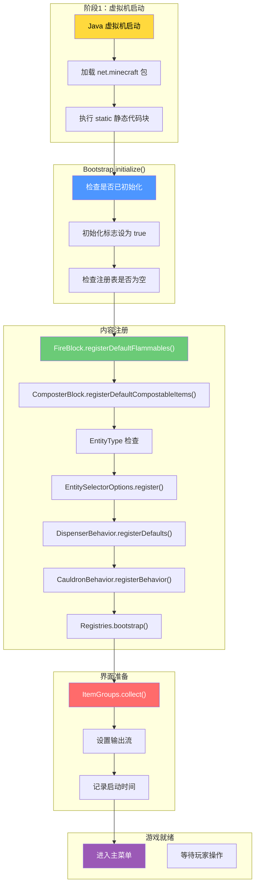
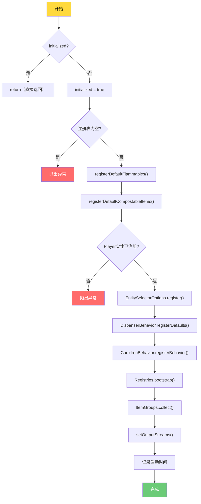
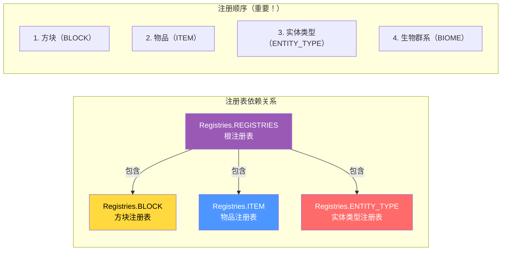
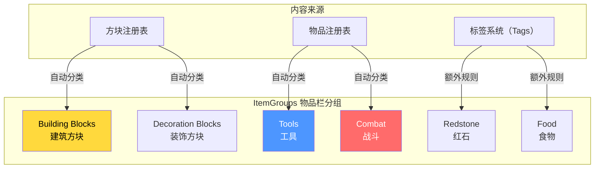
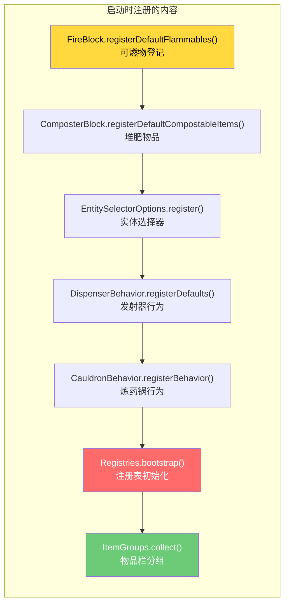
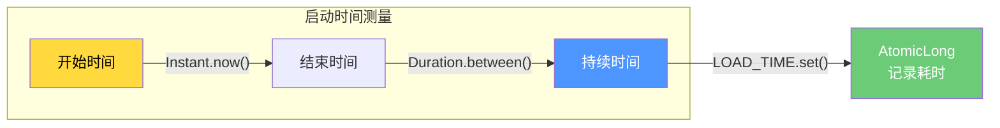
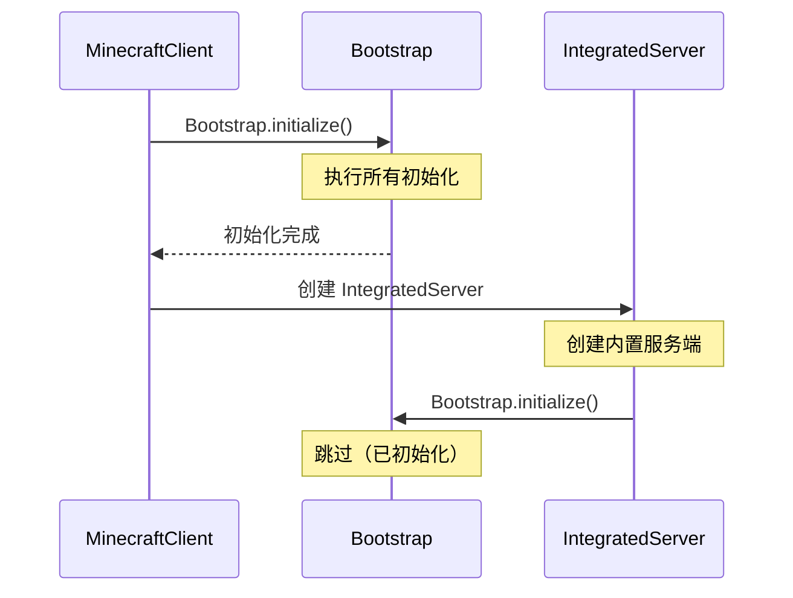
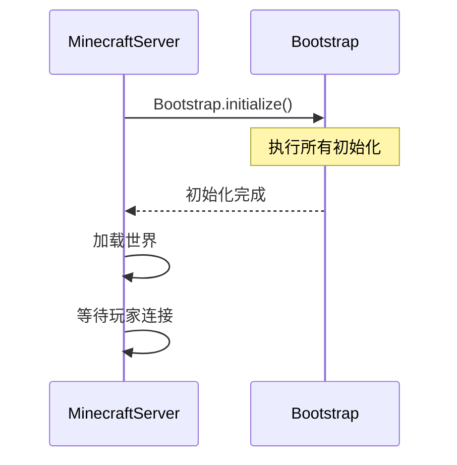
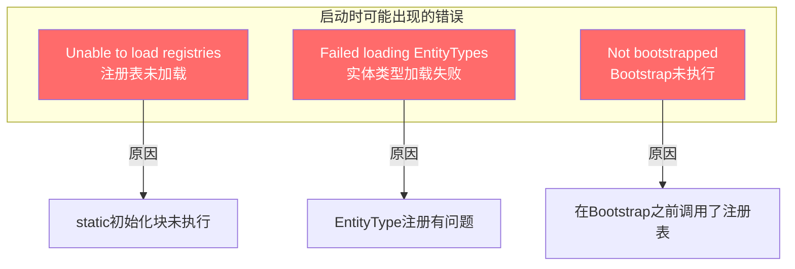
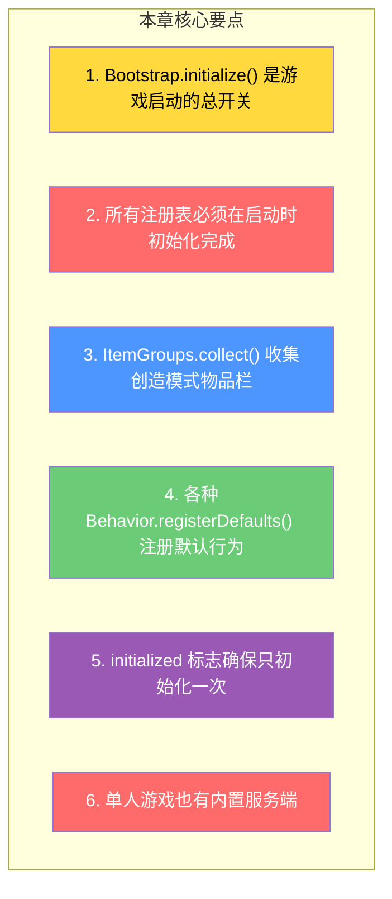

# 第七章：启动流程（Bootstrap Flow）

> ⭐ **理解这章，你就能知道 Minecraft 启动时幕后发生了什么！**

> ⚠️ **注意**：以下源码示例来源于 CFR 反编译代码，变量名和方法名可能与原始源码有所差异。部分代码经过简化以便于理解。

---

## 目标

学完本章后，你将理解：

1. **游戏启动时发生了什么**
2. **Bootstrap.initialize() 做了什么**
3. **注册表初始化的顺序**
4. **创造模式物品栏怎么来的**
5. **为什么有些内容必须在启动时注册**

---

## 前置知识

- 了解注册表系统（第四章）
- 了解共享常量（第六章）
- 知道什么是 `static` 初始化块

---

## 核心概念：用比喻理解启动流程

### 比喻：餐厅开门前的准备

想象 Minecraft 是一家**餐厅**，启动流程就是**餐厅开门前的准备工作**：

| 餐厅场景 | Minecraft 对应 |
|---------|---------------|
| 厨房准备食材 | **注册表初始化** - 准备所有游戏内容 |
| 打印菜单 | **ItemGroups.collect()** - 创造模式物品栏 |
| 摆好餐具 | **FireBlock.registerDefaultFlammables()** - 可燃物登记 |
| 厨师就位 | **实体属性注册** - 生物能力值设定 |
| 开门迎客 | **游戏主循环开始** |

### 为什么需要启动准备？

```
❌ 如果没有启动准备：
   - 你打开游戏：什么方块都没有！
   - 你打开物品栏：空空如也！
   - 你放置一个火把：不知道什么可以燃烧

✅ 有了启动准备：
   - 所有方块、物品、实体都"就位"
   - 游戏运行时只需要"使用"而不需要"创建"
   - 保证所有玩家的游戏内容一致
```

---

## 图解：完整启动流程



---

## Bootstrap.initialize() 详解

### 源码解析

```42:63:net/minecraft/Bootstrap.java
public class Bootstrap {
    // 初始化标志 - 确保只执行一次
    private static volatile boolean initialized;
    
    public static void initialize() {
        // 1. 如果已经初始化，直接返回（防止重复）
        if (initialized) {
            return;
        }
        initialized = true;  // 设置为已初始化
        
        // 2. 记录开始时间
        Instant instant = Instant.now();
        
        // 3. 检查注册表是否加载
        if (Registries.REGISTRIES.getIds().isEmpty()) {
            throw new IllegalStateException("Unable to load registries");
        }
        
        // 4. 注册各种游戏内容
        FireBlock.registerDefaultFlammables();
        ComposterBlock.registerDefaultCompostableItems();
        
        // 5. 检查实体类型
        if (EntityType.getId(EntityType.PLAYER) == null) {
            throw new IllegalStateException("Failed loading EntityTypes");
        }
        
        // 6. 注册其他系统
        EntitySelectorOptions.register();
        DispenserBehavior.registerDefaults();
        CauldronBehavior.registerBehavior();
        Registries.bootstrap();
        
        // 7. 收集创造模式物品栏
        ItemGroups.collect();
        
        // 8. 设置输出流
        setOutputStreams();
        
        // 9. 记录启动耗时
        LOAD_TIME.set(Duration.between(instant, Instant.now()).toMillis());
    }
}
```

### 流程图：initialize() 内部



---

## 注册表初始化的秘密

### 为什么注册表要先初始化？

```
问题：谁先谁后？

A依赖B？B依赖A？
如果搞错顺序，游戏会崩溃！

解决方案：Mojang使用巧妙的技巧：
1. 在 static 代码块中"部分"初始化
2. 在 Bootstrap.initialize() 中完成"剩余"部分
```

### 注册表依赖关系



### bootstrap() 做了什么？

```java
// Registries.bootstrap() 的作用：
// 1. 确保所有内置注册表都被访问过（触发static初始化）
// 2. 设置默认值
// 3. 冻结注册表（防止运行时修改）

public static void bootstrap() {
    // 强制访问所有注册表
    BLOCK.getIds();
    ITEM.getIds();
    ENTITY_TYPE.getIds();
    // ... 其他注册表
    
    // 注册表冻结后，不能再添加新内容
    // 这是故意的！因为游戏内容必须在启动时确定
}
```

---

## 创造模式物品栏的来源

### ItemGroups.collect() 详解

```
问题：创造模式的物品栏是怎么来的？

答案：在 Bootstrap.initialize() 中调用 ItemGroups.collect()

这个方法会：
1. 扫描所有已注册的方块和物品
2. 按照规则分类到不同的物品栏分组
3. 设置快捷键
```

### 物品栏分组规则



### 源码示例

```60:60:net/minecraft/Bootstrap.java
// 在 Bootstrap.initialize() 中调用
ItemGroups.collect();
```

---

## 其他启动时注册的系统

### 1. 火焰可燃物登记

```java
// FireBlock.registerDefaultFlammables()
// 功能：登记哪些方块可以被火烧掉

// 例如：
// 木头方块 → 火焰蔓延燃烧
// 羊毛 → 火焰蔓延燃烧
// 石头方块 → 不能燃烧
```

### 2. 堆肥物品登记

```java
// ComposterBlock.registerDefaultCompostableItems()
// 功能：登记哪些物品可以丢进堆肥桶

// 例如：
// 种子 → 可以堆肥（67%成功率）
// 小麦 → 可以堆肥（85%成功率）
// 骨头 → 不能堆肥
```

### 3. 发射器行为登记

```java
// DispenserBehavior.registerDefaults()
// 功能：登记发射器可以放置什么方块/使用什么物品

// 例如：
// 火把 → 发射器可以放置火把
// 酿造台 → 发射器可以使用酿造台
```

### 4. 炼药锅行为登记

```java
// CauldronBehavior.registerBehavior()
// 功能：登记炼药锅里可以放什么、产生什么效果

// 例如：
// 水 + 箭 → 药水箭
// 岩浆块附近 → 变成炼狱炼药锅
```

### 完整注册清单



---

## 启动时间测量

### LOAD_TIME 的作用



### 源码解析

```42:62:net/minecraft/Bootstrap.java
// 记录启动开始时间
Instant instant = Instant.now();

// ... 执行各种初始化 ...

// 记录启动耗时
LOAD_TIME.set(Duration.between(instant, Instant.now()).toMillis());
```

### 为什么测量启动时间？

```
用途：
1. 性能监控 - 启动太快/太慢都要关注
2. 调试 - 知道游戏加载需要多久
3. 优化参考 - 找出启动瓶颈
```

---

## 单人游戏 vs 多人游戏的启动

### 单人游戏启动



### 多人游戏启动



---

## 启动检查和错误处理

### ensureBootstrapped()

```java
// 强制检查初始化状态
public static void ensureBootstrapped(Supplier<String> callerGetter) {
    if (!initialized) {
        throw createNotBootstrappedException(callerGetter);
    }
}

// 使用场景：
// 在访问注册表之前调用，确保已经初始化
// 否则抛出清晰的错误信息
```

### 常见启动错误



---

## 小结



### 启动流程总结

```
1. 虚拟机启动 → 加载类
2. 执行 static 代码块 → 部分初始化
3. Bootstrap.initialize() → 完整初始化
4. 注册各种内容 → 方块、物品、实体、行为
5. ItemGroups.collect() → 收集物品栏
6. 游戏就绪 → 进入主菜单
```

---

## 练习

### 练习1：追踪启动流程

在源码中找到 `Bootstrap.initialize()` 的调用位置，理解它在哪里被触发。

### 练习2：添加新内容

假设你想添加一个新的"可燃物"方块，说明：
1. 在哪里注册？
2. 调用什么方法？

### 练习3：调试启动时间

找到 `LOAD_TIME` 的使用位置，理解它如何帮助性能分析。

### 练习4：探索 ItemGroups

在源码中找到 `ItemGroups.java`，理解物品栏分组是如何实现的。

---

## 相关链接

### 源码文件

| 文件 | 路径 | 作用 |
|------|------|------|
| `Bootstrap.java` | `net/minecraft/Bootstrap.java` | 启动初始化核心 |
| `Registries.java` | `net/minecraft/registry/Registries.java` | 注册表定义 |
| `ItemGroups.java` | `net/minecraft/item/ItemGroups.java` | 物品栏分组 |
| `FireBlock.java` | `net/minecraft/block/FireBlock.java` | 火焰系统 |
| `ComposterBlock.java` | `net/minecraft/block/ComposterBlock.java` | 堆肥系统 |

### 进阶阅读

> 注意：以下链接指向的文档可能尚未完成或位置可能变化
- 深入了解：物品系统 - 了解物品如何定义
- 深入了解：实体系统 - 了解实体如何注册
- 深入了解：区块系统 - 了解世界生成

---

> 💡 **提示**：理解启动流程对于理解 Minecraft 的整体架构非常重要。所有的游戏内容都必须在启动时"就位"，这确保了游戏的一致性和可预测性。

---

*文档版本：Minecraft 1.21, Protocol 767, World Version 3953*
*最后更新：2026-03-19*
