# 项目3：添加新生物

> 创建一个会攻击�家��焰精�"�
---

## 项目目标

学完这个项目�，你将���- 如何注册一个自定义�体类�
- 如何创建�体�- 如何添加�性（生命值�攻击力等）
- 如何添加 AI 行为
- 如何添加��物（战利�表�- 如何添加�质
- 如何测试

---

## 项目概览

```mermaid
flowchart TD
    A[开始项目] --> B[注册�体类�]
    B --> C[创建�体类]
    C --> D[设置�体�性]
    D --> E[添加AI行为]
    E --> F[创建战利�表]
    F --> G[添加�质]
    G --> H[测试游�]
    
    style A fill:#90EE90
    style H fill:#87CEEB
```



---

## 所需知识

- 注册表基础（Part-1 �章）
- �体生命周期（Part-4 �1章）
- LivingEntity（Part-4 �2章）
- MobEntity（Part-4 �3章）
- AI系统（Part-5�- 战利�表（Part-8 �2章）

---

## 步骤详解

### 步骤 1：什么是�体�
#### �体的层次结�
```
Entity（�体）
    �    ├── �需�tick 的��    �  ├── 物����(ItemEntity)
    �  ├── �验�(ExperienceOrbEntity)
    �  └── 展示�体 (DisplayEntity)
    �    └── 需�tick 的��        �        └── LivingEntity（活�的�体）
                �                ├── �家 (PlayerEntity)
                �                └── MobEntity（会�考的生物�                        �                        ├── 被动生物（猪�牛�羊...�                        ├── 中立生物（狼�蜜�..�                        └── 敌对生物（僵尸�骷�..�```

#### 生活中的比喻

```
�体就�游�中的"角色"�
┌─────────────────────────────────────────�� �体类�        � ��类比            �├─────────────────┼─────────────────────  �� 物����    � 地上�的钱包        �� �验�        � 收集的能��         �� 被动生物       � �羊�牛等家�     �� 敌对生物       � �狼�狮�等�食� �└─────────────────────────────────────────�```

---

### 步骤 2：注册�体类�
#### 核心概念

注册�体类�就�给生�登记户�"�
```
┌─────────────────────────────────────────��          Minecraft 注册�              ��                                      �� namespace:path = 唯一�身份��"     ��                                      �� "minecraft:pig"        ��          �� "minecraft:zombie"     �僵尸         �� "mymod:flame_spirit"   �你的�焰精� ��                                      �└─────────────────────────────────────────�```

#### 代���

�Mod 主类中添加：

```java
public class MyMod implements ModInitializer {
    
    // 定义�焰精��体类�
    public static final EntityType<FlameSpiritEntity> FLAME_SPIRIT = 
        EntityType.Builder.create(FlameSpiritEntity::new, SpawnGroup.MONSTER)
            .dimensions(0.6f, 1.8f)           // �.6，高1.8（类似僵尸）
            .eyeHeight(1.62f)                  // 眼�高度
            .maxTrackingRange(8)               // 最大追踪��            .trackingTickInterval(2)           // 追踪更新间隔
            .build("flame_spirit");           // 注册 ID
}
```

#### EntityType.Builder �数说�

| �数 | 说� | 僵尸�考�|
|------|------|-----------|
| dimensions | 碰�箱尺�| 0.6f, 1.8f |
| eyeHeight | 眼�高度 | 1.62f |
| maxTrackingRange | 最大追踪范�| 8 |
| trackingTickInterval | 追踪更新间隔 | 2 |

---

### 步骤 3：创建�体类

#### 为什么需�自定义�体类？

普通�体�能设置�性，但如�你想：
- 自定义生命值和攻击�- 添加特殊 AI 行为
- 自定义死亡��
就需�创建自定义�体类�
#### 代���

```java
// src/main/java/com/mymod/entity/FlameSpiritEntity.java

public class FlameSpiritEntity extends MobEntity {
    
    // �造函�    public FlameSpiritEntity(EntityType<? extends FlameSpiritEntity> entityType, World world) {
        super(entityType, world);
    }
    
    // �始化目标选择器（攻击�）
    @Override
    protected void initGoals() {
        super.initGoals();
        
        // 攻击�家
        this.goalSelector.addGoal(1, new MeleeAttackGoal(this, 1.2, false));
        
        // 巡�        this.goalSelector.addGoal(3, new WanderAroundGoal(this, 0.8));
        
        // 看��        this.goalSelector.addGoal(4, new LookAtPlayerGoal(this, PlayerEntity.class, 8.0f));
        
        // �机�顾
        this.goalSelector.addGoal(5, new RandomLookAroundGoal(this));
        
        // 目标：��        this.targetSelector.addGoal(1, new ActiveTargetGoal<>(this, PlayerEntity.class, true));
    }
    
    // �体死亡时��    @Override
    protected void dropLoot(DamageSource source, boolean causedByPlayer) {
        super.dropLoot(source, causedByPlayer);
        
        // �外��：�焰精�        if (causedByPlayer) {
            this.dropStack(new ItemStack(Items.BLAZE_POWDER, this.random.nextInt(2) + 1));
        }
    }
}
```

---

### 步骤 4：设置�体��
#### 常��性一�
```java
// 在�体类中覆�initializeData 方法
@Override
public void initializeData() {
    // 设置最大生命�    this.getAttributeInstance(EntityAttributes.GENERIC_MAX_HEALTH).setBaseValue(20.0);
    
    // 设置移动速度
    this.getAttributeInstance(EntityAttributes.GENERIC_MOVEMENT_SPEED).setBaseValue(0.3);
    
    // 设置攻击伤害
    this.getAttributeInstance(EntityAttributes.GENERIC_ATTACK_DAMAGE).setBaseValue(5.0);
    
    // 设置护甲
    this.getAttributeInstance(EntityAttributes.GENERIC_ARMOR).setBaseValue(2.0);
    
    // 设置击退抗�    this.getAttributeInstance(EntityAttributes.GENERIC_KNOCKBACK_RESISTANCE).setBaseValue(0.5);
}
```

#### �性对应表

| ��| 说� | 僵尸��| �家��|
|------|------|---------|---------|
| GENERIC_MAX_HEALTH | 最大生�| 20 | 20 |
| GENERIC_MOVEMENT_SPEED | 移动速度 | 0.23 | 0.1 |
| GENERIC_ATTACK_DAMAGE | 攻击伤害 | 3.0 | 1.0 |
| GENERIC_ARMOR | 护甲�| 2.0 | 0.0 |
| ZOMBIE_SPAWN_REINFORCEMENT | �唤�军 | 0.1 | - |

---

### 步骤 5：添�AI 行为

#### 核心概念

```
┌─────────────────────────────────────────��          MobEntity �AI 系统           ��                                      �� GoalSelector（行为目标）                ��   └── 决定"�什�                    ��       ├── 巡�(WanderAroundGoal)      ��       ├── 攻击 (MeleeAttackGoal)       ��       └── 看��家 (LookAtPlayerGoal) ��                                      �� TargetSelector（目标选择�             ��   └── 决定"打�"                      ��       └── ActiveTargetGoal            ��                                      �└─────────────────────────────────────────�```

#### 常用 Goal �
```java
// 1. 巡逻目�this.goalSelector.addGoal(3, new WanderAroundGoal(this, speed));

// 2. 近战攻击目标
this.goalSelector.addGoal(1, new MeleeAttackGoal(this, speed, followWhenNotAgressive));

// 3. 看��家
this.goalSelector.addGoal(4, new LookAtPlayerGoal(this, PlayerEntity.class, maxDistance));

// 4. �机�顾
this.goalSelector.addGoal(5, new RandomLookAroundGoal(this));

// 5. 游泳
this.goalSelector.addGoal(1, new SwimAroundGoal(this, speed, chance));

// 6. 逃跑（�血�时�this.goalSelector.addGoal(1, new EscapeDangerGoal(this, speed));
```

#### 常用 Target �
```java
// 1. 攻击最近的�视�家
this.targetSelector.addGoal(1, new ActiveTargetGoal<>(
    this, 
    PlayerEntity.class, 
    true  // checkVisibility
));

// 2. 攻击最近的�类
this.targetSelector.addGoal(1, new NearestAttackableTargetGoal<>(
    this,
    FlameSpiritEntity.class,
    true
));
```

#### 完整示例：�焰精�AI

```java
@Override
protected void initGoals() {
    super.initGoals();
    
    // 优先�0：逃跑（当生命值�时）
    this.goalSelector.addGoal(0, new EscapeDangerGoal(this, 1.5));
    
    // 优先�1：近战攻�    this.goalSelector.addGoal(1, new MeleeAttackGoal(this, 1.2, false));
    
    // 优先�2：�焰冲刺（自定义目标）
    this.goalSelector.addGoal(2, new FlameChargeGoal(this, 2.0));
    
    // 优先�3：巡�    this.goalSelector.addGoal(4, new WanderAroundGoal(this, 0.8));
    
    // 优先�5：看���    this.goalSelector.addGoal(5, new LookAtPlayerGoal(this, PlayerEntity.class, 8.0f));
    
    // 优先�6：�机��    this.goalSelector.addGoal(6, new RandomLookAroundGoal(this));
    
    // 目标：攻击��    this.targetSelector.addGoal(0, new ActiveTargetGoal<>(
        this, PlayerEntity.class, 0, true, false, Predicate.not(Entity::isInvisible)));
    
    // 目标：攻击最近的�焰精�
    this.targetSelector.addGoal(1, new NearestAttackableTargetGoal<>(
        this, FlameSpiritEntity.class, true
    ));
}
```

#### 自定�Goal 示例

```java
// �焰冲刺目标
public class FlameChargeGoal extends Goal {
    
    private final FlameSpiritEntity entity;
    private final double speed;
    private int cooldown = 0;
    
    public FlameChargeGoal(FlameSpiritEntity entity, double speed) {
        this.entity = entity;
        this.speed = speed;
        this.setControls(EnumSet.of(Goal.Control.MOVE, Goal.Control.LOOK));
    }
    
    @Override
    public boolean canStart() {
        // 查找附近的��        LivingEntity target = entity.getTarget();
        return target != null 
            && entity.squaredDistanceTo(target) < 100 // 10格以�            && cooldown <= 0;
    }
    
    @Override
    public void start() {
        LivingEntity target = entity.getTarget();
        if (target != null) {
            // 快速冲�目�            entity.getNavigation().startMovingTo(target, speed);
            cooldown = 200; // 10秒冷�        }
    }
    
    @Override
    public void tick() {
        if (cooldown > 0) cooldown--;
    }
}
```

---

### 步骤 6：添加��物（战利�表）

#### 战利�表文件结�

```
data/
└── mymod/
    └── loot_tables/
        └── entities/
            └── flame_spirit.json
```

#### 战利�表 JSON

```json
{
    "pools": [
        {
            "rolls": 1,
            "entries": [
                {
                    "type": "item",
                    "name": "minecraft:blaze_rod",
                    "weight": 1,
                    "functions": [
                        {
                            "function": "minecraft:set_count",
                            "count": {
                                "type": "minecraft:uniform",
                                "min": 1,
                                "max": 2
                            }
                        }
                    ]
                }
            ]
        },
        {
            "rolls": 1,
            "entries": [
                {
                    "type": "item",
                    "name": "mymod:flame_essence",
                    "weight": 5,
                    "conditions": [
                        {
                            "condition": "minecraft:random_chance",
                            "chance": 0.1
                        }
                    ]
                }
            ]
        }
    ]
}
```

#### 相关�件说�

| �件 | 说� | 用法 |
|------|------|------|
| killed_by_player | 被�家击� | �有�家击����|
| random_chance | �机概� | chance: 0.1 表示10%概� |
| entity_properties | �体��| 检查�体是���等 |
| enchantment_check | 附魔检�| 检查抢夺附魔等�|

---

### 步骤 7：添加��
#### �质文件结�

```
resources/
└── assets/
    └── mymod/
        └── textures/
            └── entity/
                └── flame_spirit/
                    ├── flame_spirit.png         # �体主��                    └── flame_spirit_layer_1.png # �加层（如有�```

#### �体渲染模�（需�资�包�
```
resources/
└── assets/
    └── mymod/
        └── models/
            └── entity/
                └── flame_spirit.json
```

---

## 完整代�

### Mod 主类

```java
package com.mymod;

import net.minecraft.entity.EntityType;
import net.minecraft.entity.SpawnGroup;
import net.minecraft.registry.Registries;
import net.minecraft.registry.Registry;
import net.minecraft.util.Identifier;
import net.fabricmc.api.ModInitializer;
import com.mymod.entity.FlameSpiritEntity;

public class MyMod implements ModInitializer {
    
    // 注册�焰精��体类�
    public static final EntityType<FlameSpiritEntity> FLAME_SPIRIT = 
        Registry.register(
            Registries.ENTITY_TYPE,
            Identifier.of("mymod", "flame_spirit"),
            EntityType.Builder.create(FlameSpiritEntity::new, SpawnGroup.MONSTER)
                .dimensions(0.6f, 1.8f)
                .eyeHeight(1.62f)
                .maxTrackingRange(8)
                .build()
        );
    
    @Override
    public void onInitialize() {
        System.out.println("�焰精� Mod 已加载�");
    }
}
```

### 自定义�体类

```java
package com.mymod.entity;

import net.minecraft.entity.EntityType;
import net.minecraft.entity.ai.goal.ActiveTargetGoal;
import net.minecraft.entity.ai.goal.EscapeDangerGoal;
import net.minecraft.entity.ai.goal.MeleeAttackGoal;
import net.minecraft.entity.ai.goal.WanderAroundGoal;
import net.minecraft.entity.ai.goal.LookAtPlayerGoal;
import net.minecraft.entity.ai.goal.RandomLookAroundGoal;
import net.minecraft.entity.attribute.EntityAttributes;
import net.minecraft.entity.damage.DamageSource;
import net.minecraft.entity.mob.MobEntity;
import net.minecraft.entity.player.PlayerEntity;
import net.minecraft.item.ItemStack;
import net.minecraft.item.Items;
import net.minecraft.world.World;

public class FlameSpiritEntity extends MobEntity {
    
    public FlameSpiritEntity(EntityType<? extends FlameSpiritEntity> entityType, World world) {
        super(entityType, world);
    }
    
    @Override
    public void initializeData() {
        super.initializeData();
        // 设置�焰精�的��        this.getAttributeInstance(EntityAttributes.GENERIC_MAX_HEALTH).setBaseValue(30.0);
        this.getAttributeInstance(EntityAttributes.GENERIC_ATTACK_DAMAGE).setBaseValue(6.0);
    }
    
    @Override
    protected void initGoals() {
        super.initGoals();
        
        // 逃跑目标（�血�时�        this.goalSelector.addGoal(0, new EscapeDangerGoal(this, 1.5));
        
        // 攻击目标
        this.goalSelector.addGoal(1, new MeleeAttackGoal(this, 1.2, false));
        
        // 巡�        this.goalSelector.addGoal(3, new WanderAroundGoal(this, 0.8));
        
        // 看��家
        this.goalSelector.addGoal(4, new LookAtPlayerGoal(this, PlayerEntity.class, 8.0f));
        
        // �机�顾
        this.goalSelector.addGoal(5, new RandomLookAroundGoal(this));
        
        // 目标选择：��        this.targetSelector.addGoal(0, new ActiveTargetGoal<>(
            this, PlayerEntity.class, true
        ));
    }
    
    @Override
    protected void dropLoot(DamageSource source, boolean causedByPlayer) {
        super.dropLoot(source, causedByPlayer);
        
        // �外��
        if (causedByPlayer) {
            // 必定��烈焰�            this.dropStack(new ItemStack(Items.BLAZE_ROD, this.random.nextInt(2) + 1));
        }
    }
}
```

---

## 测试步骤

1. **�动游�**
   ```
   �行你的 Mod 开���   ```

2. **生��体**
   ```
   /summon mymod:flame_spirit
   ```

3. **测试功能**
   - 观察�焰精�是�生�
   - �试攻击它，观察是��击
   - 击��检查��物�
---

## 常�问题�查

| 问题 | �因 | 解决方法 |
|------|------|----------|
| �体�生�| �质�AI �置错误 | 检查日�|
| AI �工�| 未正确�始化目标 | �initGoals 中添加目�|
| ��物��对 | 战利�表路径错误 | 检�JSON �置 |
| �体穿墙 | 未设置碰�检�| 检�dimensions |

---

## �到问题�么�？

### 调试技�
1. **查看日志**
   ```
   游�崩溃时查看终端输�   ```

2. **�步测试**
   ```
   先创建一个最简�的�体
   �添加一�AI 目标
   ��添加一�   ```

3. **使用命令测试**
   ```
   /summon mymod:flame_spirit ~ ~ ~ {Attributes:[{Name:generic.maxHealth,Base:50}]}
   ```

### 常�错误

| 错误信� | �因 | 解决方法 |
|----------|------|----------|
| `Entity Type not found` | �体类�未注�| 确��onInitialize 中注�|
| `NullPointerException` | AI 目标引用空对�| 检查目标是�存�|
| `ConcurrentModificationException` | AI 列表并�修改 | 在�务端�线程中�作 |

---

## 扩展挑战

完�了基础项目？试试这些挑战：

### 挑战 1：创建�行生�
```java
public class FlameBatEntity extends MobEntity implements FlyingEntity {
    
    @Override
    protected void initGoals() {
        super.initGoals();
        
        // �行相关�AI
        this.goalSelector.addGoal(0, new FlyGoal(this, 1.0));
        this.goalSelector.addGoal(1, new MeleeAttackGoal(this, 1.2, true));
    }
}
```

### 挑战 2：创建骑乘生�
```java
public class FlameHorseEntity extends HorseEntity {
    
    @Override
    protected void initGoals() {
        super.initGoals();
        // 添加骑乘相关 AI
    }
    
    @Override
    public boolean canBeSaddled() {
        return true;
    }
}
```

### 挑战 3：创建自定义��物�

```java
@Override
protected void dropLoot(DamageSource source, boolean causedByPlayer) {
    super.dropLoot(source, causedByPlayer);
    
    // 检查击�者是�有特定附魔
    if (causedByPlayer && source.getAttacker() instanceof PlayerEntity player) {
        ItemStack weapon = player.getMainStack();
        int lootingLevel = EnchantmentHelper.getLevel(Enchantments.LOOTING, weapon);
        
        // 根�抢夺等级�加��
        this.dropStack(new ItemStack(ModItems.FLAME_ESSENCE, 1 + lootingLevel));
    }
}
```

---

## �考资�
### 相关章节

- [注册表基础](/mc/1.21/tutorials/Part-1-Foundation/04-registry-system/)
- [�体生命周期](/mc/1.21/tutorials/Part-4-Entity/21-entity-lifecycle/)
- [MobEntity](/mc/1.21/tutorials/Part-4-Entity/23-mob-entity/)
- [AI系统](/mc/1.21/tutorials/Part-5-AI/27-ai-brain-intro/)
- [战利�表](/mc/1.21/tutorials/Part-8-Resource/42-loot-table/)

### ����
```
source/net/minecraft/entity/EntityType.java     - �体类�定义
source/net/minecraft/entity/mob/MobEntity.java  - MobEntity 主类
source/net/minecraft/entity/mob/ZombieEntity.java - 僵尸�体��source/net/minecraft/entity/ai/goal/*.java     - AI 目标�```

---

## 下一�
学会了创建生物？�下�我们学习创建数�包�
> [项目4：创建数�包](./101-project4-datapack.md)

---

*本教程基�Minecraft 1.21 ��编写*
