# 项目1：添加新方�

> 带你创建一个会�光�魔法水晶方�"�
---

## 项目目标

学完这个项目�，你将���- 如何注册一个自定义方�
- 如何创建方�类并设置��- 如何给方�添加特殊效�- 如何添加�质贴图
- 如何测试方�

---

## 项目概览

```mermaid
flowchart TD
    A[开始项目] --> B[注册方�]
    B --> C[创建方�类]
    C --> D[设置方��性]
    D --> E[添加�质]
    E --> F[创建资�包]
    F --> G[测试游�]
    
    style A fill:#90EE90
    style G fill:#87CEEB
```



---

## 所需知识

- 注册表基础（Part-1 �章）
- 方�基础（Part-3 �4章）
- 资�包结�（Part-8 �0章）

---

## 步骤详解

### 步骤 1：什么是项目驱动学习�
想象你�学�饭：

```
传统学习�                       项目驱动学习�┌──────────────�                ┌──────────────�� 1. 切��论  �                � 1. 目标：�   �� 2. �候�� �                �   一��     �� 3. 调味�论  �                �             �� 4. ...      �                � 2. 边�边学  �� �          �                �   切�       �� 终��饭�  �                �   ��      �└──────────────�                �   调味       �                                 └──────────────�```

**项目驱动学习的好�*�1. 学完马上能用
2. 目标�确�迷�3. �就感强

---

### 步骤 2：注册方�
#### 核心概念

注册方�就�给方�上户��
```
┌─────────────────────────────────────────��          Minecraft 注册�              ��                                        �� namespace:path = 唯一�身份��"       ��                                        �� "minecraft:stone"     �石头             �� "minecraft:diamond"  �钻石             �� "mymod:magic_crystal" �你的魔法水晶    ��                                        �└─────────────────────────────────────────�```

#### 代���

�Mod 主类中添加：

```java
public class MyMod implements ModInitializer {
    
    // 定义一个魔法水晶方�    public static final Block MAGIC_CRYSTAL = Registry.register(
        Registries.BLOCK,                          // 1. 注册到方�注册表
        Identifier.of("mymod", "magic_crystal"),  // 2. ID = "mymod:magic_crystal"
        new Block(AbstractBlock.Settings.create()  // 3. 创建方��例
            .strength(3.0f, 6.0f)                 // 硬度3.0, 爆炸抗�.0
            .luminance(state -> 15)               // �光亮度15（最亮）
            .sounds(BlockSoundGroup.AMETHYST)     // 紫水晶音�        )
    );
    
    @Override
    public void onInitialize() {
        // 方�注册完��    }
}
```

**三�素�诀**�```
Registry.register(注册� Identifier, new 方�)
         �          �         �       放哪柜�     起什么�    什么样�```

---

### 步骤 3：创建方�类（添加特殊行为）

#### 为什么需�自定义方�类？

普通方��能设置�性，但如�你想：
- �键点击时有�应
- 定时改�状�- 和其他方�交�
就需�创建自定义方�类�
#### 代���

```java
// src/main/java/com/mymod/block/MagicCrystalBlock.java

public class MagicCrystalBlock extends Block {
    
    public MagicCrystalBlock(Settings settings) {
        super(settings);
    }
    
    // 当�家�键点击方�时触�
    @Override
    public ActionResult onUse(BlockState state, World world, 
                              BlockPos pos, PlayerEntity player, 
                              BlockHitResult hit) {
        if (!world.isClient) {
            // 在�务端执行
            // 给�家��消�            player.sendMessage(Text.literal("你点击了魔法水晶�));
            
            // 产生粒�效�
            world.createAndSpawnFilledParticles(
                pos.toCenterPos(), 
                0.5, 0.5, 0.5,  // RGB颜色
                10              // 粒�数�
            );
            
            return ActionResult.SUCCESS;
        }
        
        return ActionResult.CONSUME;
    }
    
    // �机刻更新（类似�方��泥土�    @Override
    protected void randomTick(BlockState state, ServerWorld world, 
                              BlockPos pos, Random random) {
        // �tick �5% 概�改�状�        if (random.nextFloat() < 0.05f) {
            // 闪�效�：切�亮�            int currentLuminance = state.get(LuminousBlock.LUMINANCE);
            int newLuminance = currentLuminance == 15 ? 5 : 15;
            world.setBlockState(pos, state.with(LUMINANCE, newLuminance));
        }
    }
    
    // 方��性设�    @Override
    protected void appendProperties(StateManager.Builder<Block, BlockState> builder) {
        // 添加自定义��        builder.add(LUMINANCE);  // 亮度��    }
}
```

---

### 步骤 4：设置方���
#### 常��性一�
```java
new Block(AbstractBlock.Settings.create()
    // 基础��    .strength(1.5f, 6.0f)              // 硬度, 爆炸抗�    .breakByTool(ParadigmValidators.NORMAL)  // 需�特定工�    .sounds(BlockSoundGroup.STONE)     // 音效
    
    // 特殊��    .luminance(state -> 15)            // �光�-15�    .ticksRandomly()                  // 需��机刻
    .solidBlock((state, world, pos) -> false)  // 是�固体
    .suffocates((state, world, pos) -> false)  // 是�窒�
    
    // 碰���    .noCollision()                    // 无碰�箱（�穿过�    .nonOpaque()                      // ��
    .air()                            // 空气��    
    // �燃��    .burnable()                       // �燃
    .offset(Blocks::getDefaultState)   // �机�移放置
)
```

#### �性对应关�
| ��| 钻石 | 石头 | 泥土 | �璃 |
|------|------|------|------|------|
| 硬度 | 5.0 | 1.5 | 0.5 | 0.3 |
| 抗�| 6.0 | 6.0 | 0.5 | 0.3 |
| 音效 | METAL | STONE | GRASS | GLASS |
| 碰� | �| �| �| �|

---

### 步骤 5：添加�质贴�
#### �质文件结�

```
resources/
└── assets/
    └── mymod/
        ├── textures/
        �  └── block/
        �      └── magic_crystal.png    # 方��质�6x16�        └── models/
            └── block/
                └── magic_crystal.json   # 方�模�
```

#### 方�模� JSON

```json
{
    "parent": "minecraft:block/cube_all",
    "textures": {
        "all": "mymod:block/magic_crystal"
    }
}
```

#### 方�状�JSON（如�需�）

```json
{
    "variants": {
        "": { "model": "mymod:block/magic_crystal" }
    }
}
```

#### 物�模� JSON

```json
{
    "parent": "mymod:block/magic_crystal"
}
```

---

### 步骤 6：测�
#### 测试步骤

1. **�动游�**
   ```
   �行你的 Mod 开���   ```

2. **进入世界**
   ```
   创建一个新世界或进入已有世�   ```

3. **��方�**
   ```
   /give @s mymod:magic_crystal
   ```

4. **测试功能**
   - 放置方�，观察是���   - �键点击，观察粒�效�   - 等待一会儿，观察亮度��
#### 常�问题�查

| 问题 | �因 | 解决方法 |
|------|------|----------|
| 方��显�| �质路径错误 | 检�textures 目录 |
| 亮度���| 没开�机�| 添加 `.ticksRandomly()` |
| �键无��| 客户��务端分�| 确�逻辑�`!world.isClient` �|

---

## 完整代�

### Mod 主类

```java
package com.mymod;

import net.minecraft.block.Block;
import net.minecraft.block.AbstractBlock;
import net.minecraft.block.BlockSoundGroup;
import net.minecraft.registry.Registries;
import net.minecraft.registry.Registry;
import net.minecraft.util.Identifier;
import net.fabricmc.api.ModInitializer;

public class MyMod implements ModInitializer {
    
    // 注册魔法水晶方�
    public static final Block MAGIC_CRYSTAL = Registry.register(
        Registries.BLOCK,
        Identifier.of("mymod", "magic_crystal"),
        new MagicCrystalBlock(AbstractBlock.Settings.create()
            .strength(3.0f, 6.0f)
            .luminance(state -> 15)
            .sounds(BlockSoundGroup.AMETHYST)
            .ticksRandomly()
        )
    );
    
    @Override
    public void onInitialize() {
        System.out.println("魔法水晶 Mod 已加载�");
    }
}
```

### 自定义方�类

```java
package com.mymod.block;

import net.minecraft.block.Block;
import net.minecraft.block.BlockState;
import net.minecraft.block.Blocks;
import net.minecraft.util.ActionResult;
import net.minecraft.util.math.BlockPos;
import net.minecraft.world.World;
import net.minecraft.entity.player.PlayerEntity;
import net.minecraft.util.hit.BlockHitResult;
import net.minecraft.server.world.ServerWorld;
import net.minecraft.state.property.IntProperty;
import net.minecraft.state.StateManager;
import net.minecraft.particle.ParticleTypes;
import java.util.Random;

public class MagicCrystalBlock extends Block {
    
    // 自定义�性：亮度等级
    public static final IntProperty LUMINANCE = IntProperty.of("luminance", 1, 15);
    
    public MagicCrystalBlock(Settings settings) {
        super(settings);
        this.setDefaultState(this.getDefaultState().with(LUMINANCE, 15));
    }
    
    @Override
    protected void appendProperties(StateManager.Builder<Block, BlockState> builder) {
        builder.add(LUMINANCE);
    }
    
    @Override
    public ActionResult onUse(BlockState state, World world, BlockPos pos, 
                               PlayerEntity player, BlockHitResult hit) {
        if (!world.isClient) {
            player.sendMessage(Text.literal("你点击了魔法水晶�));
            
            // 生�粒�效�
            ((ServerWorld) world).spawnParticles(
                ParticleTypes.END_ROD,
                pos.getX() + 0.5, pos.getY() + 0.5, pos.getZ() + 0.5,
                10, 0.2, 0.2, 0.2, 0.01
            );
            
            // 切�亮度
            int newLuminance = state.get(LUMINANCE) == 15 ? 5 : 15;
            world.setBlockState(pos, state.with(LUMINANCE, newLuminance));
            
            return ActionResult.SUCCESS;
        }
        return ActionResult.CONSUME;
    }
    
    @Override
    protected void randomTick(BlockState state, ServerWorld world, 
                             BlockPos pos, Random random) {
        // 5% 概�改�亮度
        if (random.nextFloat() < 0.05f) {
            int newLuminance = state.get(LUMINANCE) == 15 ? 5 : 15;
            world.setBlockState(pos, state.with(LUMINANCE, newLuminance));
        }
    }
}
```

---

## �到问题�么�？

### 调试技�
1. **查看日志**
   ```
   游�崩溃时查看终端输�   ```

2. **�步测试**
   ```
   先创建最简�的方�
   �添加一个功�   ��添加一个功�   ```

3. **使用命令测试**
   ```
   /give @s mymod:magic_crystal 1 0 {"BlockEntityTag":{"luminance":15}}
   ```

### 常�错误

| 错误信� | �因 | 解决方法 |
|----------|------|----------|
| `Registry is frozen` | 注册时机错误 | 确��`onInitialize` 中注�|
| `Missing texture` | �质文件�存�| 检查路径是�正�|
| `NullPointerException` | 空引�| 检�world 是��null |

---

## 扩展挑战

完�了基础项目？试试这些挑战：

### 挑战 1：创建��颜色的水晶

```java
// 添加颜色��public static final EnumProperty<CrystalColor> COLOR = 
    EnumProperty.of("color", CrystalColor.class);

// 创建多�颜色的水�public enum CrystalColor {
    RED, BLUE, GREEN, PURPLE
}
```

### 挑战 2：创建�交互的电路方�
```java
// 当被充能时�出红石信�@Override
public int getWeakRedstonePower(BlockState state) {
    return state.get(POWERED) ? 15 : 0;
}
```

### 挑战 3：创建记忆方�
```java
// 记�最�点击它的��@Override
public ActionResult onUse(BlockState state, World world, BlockPos pos, 
                           PlayerEntity player, BlockHitResult hit) {
    BlockEntity be = world.getBlockEntity(pos);
    if (be instanceof MemoryCrystalBlockEntity memory) {
        memory.setLastClicker(player.getName().getString());
    }
    return super.onUse(state, world, pos, player, hit);
}
```

---

## �考资�
### 相关章节

- [注册表基础](/mc/1.21/tutorials/Part-1-Foundation/04-registry-system/)
- [Block 基础](/mc/1.21/tutorials/Part-3-Block-Item/14-block-basics/)
- [BlockState](/mc/1.21/tutorials/Part-3-Block-Item/15-block-state/)
- [BlockEntity](/mc/1.21/tutorials/Part-3-Block-Item/16-block-entity/)
- [资�包](/mc/1.21/tutorials/Part-8-Resource/40-resource-pack/)

### ����
```
source/net/minecraft/block/Blocks.java      - 方�定义示例
source/net/minecraft/block/Block.java       - 方�基类
source/net/minecraft/block/AmethystBlock.java - 紫水晶方���```

---

## 下一�
学会了创建方�？�下�我们学习创建物��

> [项目2：添加新物�](./99-project2-item.md)

---

*本教程基�Minecraft 1.21 ��编写*
