# Part-12：�战项�
> 纸上得�终觉浅，�知此事�躬行�> 
> 学习了这么多��知识，是时候动手�项目了�

---

## 项目概览

本部分包�4 个�战项目，�简�到��，带领你完��学知���东�的转�：

```mermaid
flowchart TD
    A[Part-12 �战项目] --> B[项目1]
    A --> C[项目2]
    A --> D[项目3]
    A --> E[项目4]
    
    B --> B1[添加新方�]
    C --> C1[添加新物�]
    D --> D1[添加新生物]
    E --> E1[创建数�包]
    
    B1 --> F[完�基础 Mod 开�技能]
    C1 --> F
    D1 --> F
    E1 --> F
    
    style F fill:#90EE90,color:#000
```



---

## 项目列表

| 项目 | 章节 | 内容 | 难度 |
|------|------|------|------|
| 项目 1 | [98-project1-block.md](./98-project1-block.md) | 添加新方�：魔法水晶 | �|
| 项目 2 | [99-project2-item.md](./99-project2-item.md) | 添加新物�：魔法魔� | �� |
| 项目 3 | [100-project3-entity.md](./100-project3-entity.md) | 添加新生物：�焰精� | ���|
| 项目 4 | [101-project4-datapack.md](./101-project4-datapack.md) | 创建数��| �� |

---

## 学习路线�
```
┌─────────────────────────────────────────────────────────────────��                       Minecraft ��学习                          �├─────────────────────────────────────────────────────────────────��                                                                �� 基础阶段                                                       �� ├── Part-1: 注册表系�                                        �� ├── Part-2: 世界生�                                           �� └── Part-3: 方�物�                                           ��                                                                �� 进阶阶段                                                       �� ├── Part-4: �体系统                                           �� ├── Part-5: AI 系统                                            �� ├── Part-6: 网络�步                                            �� ├── Part-7: 命令系统                                           �� └── Part-8: 资�系统                                           ��                                                                �� ─────────────────────────────  �你在这里�                     ��                                                                �� �战阶段 �当�                                                 �� └── Part-12: 四个�战项目                                      ��                                                                �└─────────────────────────────────────────────────────────────────�```

---

## �个项目包�的内�
### 项目 1：添加新方�

- 注册方�
- 创建方��- 设置方���- 添加�质
- 测试

### 项目 2：添加新物�

- 注册物�
- 创建物��- 添加使用效�
- 创建���方
- 添加�质
- 测试

### 项目 3：添加新生物

- 注册�体类�
- 创建�体�- 添加��- 添加 AI 行为
- 添加���- 添加�质
- 测试

### 项目 4：创建数�包

- 数�包结�- 创建函数
- 添加进度
- 创建战利�表
- 添加�方
- 测试

---

## 学习方法建议

### 1. 按顺�完�
建议按照项目 1 �2 �3 �4 的顺�完�，因为��的项目会用到��学到的知识�
### 2. 边学边�

�个项目都�供了完整的代�示例，建议你：
1. 先阅读项目文�2. �解代�逻辑
3. 动手�践
4. �试修改代�看看会�生什�
### 3. 完�扩展挑战

�个项目都包�扩展挑战"部分，这是给你的�外练习题。完�它们�以加深�解�
---

## �置知识

开始之�，请确�你已���了以下内容：

- [x] Java 基础语法
- [x] 注册表系�- [x] 方�基础
- [x] 物�基础
- [x] �体基础

---

## 下一�
完�所有四个项目�，你已����Minecraft Mod 开�的核心技能�

�下�你�以�
1. **组�项目**：把四个项目的知识组�起�，创建更��的内容
2. **深入学习**：继续学习其他高级主�3. **�布作�**：把你的作�分享给其他人

---

## 相关链�

### ����
- [注册表系统](/mc/1.21/tutorials/Part-1-Foundation/04-registry-system/)
- [方�基础](/mc/1.21/tutorials/Part-3-Block-Item/14-block-basics/)
- [物�基础](/mc/1.21/tutorials/Part-3-Block-Item/17-item-basics/)
- [�体基础](/mc/1.21/tutorials/Part-4-Entity/21-entity-lifecycle/)
- [MobEntity](/mc/1.21/tutorials/Part-4-Entity/23-mob-entity/)
- [数�包](/mc/1.21/tutorials/Part-8-Resource/41-datapack-intro/)
- [战利�表](/mc/1.21/tutorials/Part-8-Resource/42-loot-table/)
- [进度系统](/mc/1.21/tutorials/Part-8-Resource/43-advancement/)
- [�方系统](/mc/1.21/tutorials/Part-8-Resource/44-recipe-system/)

### 在线资�

- [Minecraft Wiki](https://minecraft.fandom.com/wiki/Minecraft_Wiki)
- [Fabric Wiki](https://fabricmc.net/wiki/)
- [Minecraft Forge Wiki](https://.minecraftforge.net/)

---

## 贡献�
本教程由 Minecraft ��研究团队编写�
---

*本教程基�Minecraft 1.21 ��编写*
