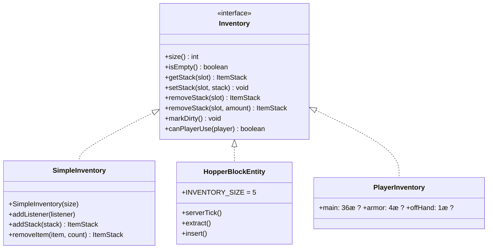

# 物��容器系�
## 目标

学完本教程�，你将能够：
- �解 Minecraft 物��（Inventory）系统的核心概念
- �� `Inventory` ��的用�- 了解��类�的物����（�家�箱���斗�熔炉）
- �解客户��务端的物���步机�- 学会使用 `ScreenHandler` 容器��

---

## �置知识

- Java 基础（���抽象类�继承）
- 了解 Minecraft 方��体（BlockEntity）概�- 知�什么是 ItemStack（物�堆�
---

## 核心概念

### 1. 什么是物��？

想象一下，**物��就�你的背�*。它是一个有固定格�数的容器，�个格��以放一组物��
就���中的储物柜：
- �个柜�（格�）�以放东�- 柜�有编�，�0 开�- 有的柜��以放任�物�，有的�能放特定物�
```mermaid
graph LR
    A["背包/物��br/>Inventory"] --> B["格� 0: �]
    A --> C["格� 1: 3个钻�]
    A --> D["格� 2: 1把��]
    A --> E["格� N: ..."]
    
    style A fill:#e1f5fe
    style B fill:#c8e6c9
    style C fill:#c8e6c9
    style D fill:#c8e6c9
    style E fill:#c8e6c9
```

### 2. Inventory ��

`Inventory` �Minecraft 中所有物���标准规范"。任何��这个��的类，都�以：
- 存放和�出物�- 被�家打开（如�是一个方��体）
- ��斗等红石机械交互



### 3. 物��的"槽�"概念

**槽�（Slot�* = 物��中的格�，编��0 开�
```mermaid
graph TB
    subgraph "�家物��
        subgraph "热bar (9�"
            H0["0: 钻石�]
            H1["1: ç©?]
            H2["2: �包 x64"]
            H3["3: ç©?]
            H4["4: ç©?]
            H5["5: ç©?]
            H6["6: ç©?]
            H7["7: ç©?]
            H8["8: 弓箭"]
        end
        
        subgraph "主背�(27�"
            M0["9: ç©?]
            M1["10: �矿�]
            M2["11: 煤炭"]
            M3["..."]
            M26["35: ç©?]
        end
    end
```

> **�贴�*：槽�编�是�续的�
> - 热bar: 0-8
> - 主背� 9-35
> - 装备� (特殊槽�)
> - 副手: 40

---

## 图解：物��系统结�

### 整体��

```mermaid
flowchart TB
    subgraph "�务�
        SH["ScreenHandler<br/>容器处��]
        BE["BlockEntity<br/>方��体"]
        PE["PlayerEntity<br/>�家�体"]
        
        BE --> INV_BE["�有 Inventory"]
        PE --> INV_P["PlayerInventory"]
        SH --> "背书" INV_BE
        SH --> "背书" INV_P
    end
    
    subgraph "客户�
        CSH["Client ScreenHandler<br/>客户端容器处�器"]
        GUI["GUI 界�<br/>HandledScreen"]
        
        CSH --> GUI
    end
    
    subgraph "�步"
        SYNC["�务��客户�br/>Packet �步"]
    end
    
    SH <--> SYNC
    CSH <--> SYNC
    
    style SH fill:#81c784
    style CSH fill:#90caf9
    style SYNC fill:#fff59d
```

### �斗的工作��
�斗是一个很好的例�，展示了物��系统如何工作：

```mermaid
flowchart LR
    subgraph "�斗 Tick �程"
        T1["1. 检查冷�时�]
        T2["2. �试�下方输出物�]
        T3["3. �试�上��体��物�"]
        T4["4. 标记为�（�存）"]
    end
    
    T1 --> T2 --> T3 --> T4
    
    subgraph "��逻辑"
        E1["找上方方��体"]
        E2["找�斗�用的槽�"]
        E3["转移1个物�]
    end
    
    T3 --> E1 --> E2 --> E3
```

---

## 核心代�

### 1. Inventory ��的方�
```java
// net.minecraft.inventory.Inventory
public interface Inventory extends Clearable {
    
    // 返�物��的格�数�
    int size();
    
    // 检查是�所有格�都为空
    boolean isEmpty();
    
    // ��指定格�的物�    ItemStack getStack(int slot);
    
    // 设置指定格�的物�    void setStack(int slot, ItemStack stack);
    
    // 移除指定格�的物�（全部�    ItemStack removeStack(int slot);
    
    // 移除指定格�的一部分物�
    ItemStack removeStack(int slot, int amount);
    
    // 标记物��已修改（����次修改�都�调用）
    void markDirty();
    
    // 检查�家是��以使用这个物��
    boolean canPlayerUse(PlayerEntity player);
}
```

### 2. SimpleInventory 简���
`SimpleInventory` 是一个通用的物����，适�临时存储�
```java
// 创建一个有 9 个格�的物��SimpleInventory inventory = new SimpleInventory(9);

// 放物�进�inventory.setStack(0, new ItemStack(Items.DIAMOND, 5));

// �物�出�ItemStack stack = inventory.getStack(0);

// 添加物�（自动找空�或堆�）
inventory.addStack(new ItemStack(Items.DIAMOND, 3));

// 监�物����inventory.addListener(inventory -> {
    System.out.println("物��被修改了�");
});
```

### 3. �斗的����
�斗（`HopperBlockEntity`）展示了完整的物��系统�
```java
public class HopperBlockEntity extends LootableContainerBlockEntity implements Hopper {
    
    // �斗�5 个格�    public static final int INVENTORY_SIZE = 5;
    private DefaultedList<ItemStack> inventory = DefaultedList.ofSize(5, ItemStack.EMPTY);
    
    @Override
    public int size() {
        return this.inventory.size();
    }
    
    // �务�tick 时调�    public static void serverTick(World world, BlockPos pos, 
                                   BlockState state, HopperBlockEntity blockEntity) {
        
        // 冷�检�        if (blockEntity.needsCooldown()) {
            return;
        }
        
        // �试�入物�到下方容�        if (!blockEntity.isFull()) {
            HopperBlockEntity.insert(world, pos, blockEntity);
        }
        
        // �试�上方��物�        if (!blockEntity.isEmpty()) {
            HopperBlockEntity.extract(world, blockEntity);
        }
    }
    
    // 物�转移核心逻辑
    public static ItemStack transfer(Inventory from, Inventory to, 
                                      ItemStack stack, Direction side) {
        // ��目标物��的所有槽�        for (int i = 0; i < to.size(); i++) {
            ItemStack existing = to.getStack(i);
            
            if (existing.isEmpty()) {
                // 槽�为空，直�放�                to.setStack(i, stack);
                return ItemStack.EMPTY;
            } 
            else if (canMergeItems(existing, stack)) {
                // 槽�有�类物�，�试堆�
                int space = stack.getMaxCount() - existing.getCount();
                if (space > 0) {
                    existing.increment(space);
                    stack.decrement(space);
                }
            }
        }
        return stack; // 返�未放入的物�
    }
}
```

### 4. 客户��务端��

```mermaid
sequenceDiagram
    participant P as �家
    participant S as �务�    participant C as 客户�    
    Note over P,S: 打开容器（如�斗�    P->>S: 点击方�
    S->>S: 创建 ScreenHandler
    S->>C: ���步数�    
    Note over P,C: 显示容器界�
    
    Note over P,S: �作物�
    P->>S: ��SlotClick 数��    S->>S: 更新 Inventory
    S->>S: 调用 markDirty()
    S->>C: ��更新数�包
    
    Note over P,S: 关闭容器
    P->>S: 关闭请求
    S->>S: 调用 onClose()
    S->>C: 确认关闭
```


---

## �战演示：创建一个带物��的方�

### 步骤 1：创建方���
```java
// MyInventoryBlockEntity.java
public class MyInventoryBlockEntity extends LootableContainerBlockEntity {
    
    private final DefaultedList<ItemStack> inventory = 
        DefaultedList.ofSize(9, ItemStack.EMPTY);
    
    public MyInventoryBlockEntity(BlockPos pos, BlockState state) {
        super(BlockEntityType.MY_BLOCK, pos, state);
    }
    
    @Override
    public int size() {
        return this.inventory.size();
    }
    
    @Override
    protected Text getContainerName() {
        return Text.translatable("block.my_mod.my_inventory_block");
    }
    
    @Override
    protected ScreenHandler createScreenHandler(int syncId, PlayerInventory playerInventory) {
        return new MyScreenHandler(syncId, playerInventory, this);
    }
}
```

### 步骤 2：创�ScreenHandler

```java
// MyScreenHandler.java
public class MyScreenHandler extends ScreenHandler {
    
    private final Inventory inventory;
    
    public MyScreenHandler(int syncId, PlayerInventory playerInventory, 
                          Inventory inventory) {
        super(Registry.SCREEN_HANDLER_TYPE, syncId);
        this.inventory = inventory;
        
        // 添加方�物��的格�
        for (int row = 0; row < 3; row++) {
            for (int col = 0; col < 9; col++) {
                this.addSlot(new Slot(inventory, col + row * 9, 8 + col * 18, 18 + row * 18));
            }
        }
        
        // 添加�家物��的格�
        for (int row = 0; row < 3; row++) {
            for (int col = 0; col < 9; col++) {
                this.addSlot(new Slot(playerInventory, 9 + col + row * 9, 
                    8 + col * 18, 84 + row * 18));
            }
        }
        
        // 添加热bar
        for (int i = 0; i < 9; i++) {
            this.addSlot(new Slot(playerInventory, i, 8 + i * 18, 142));
        }
    }
    
    @Override
    public boolean canUse(PlayerEntity player) {
        return this.inventory.canPlayerUse(player);
    }
    
    @Override
    public ItemStack quickMove(PlayerEntity player, int slotIndex) {
        ItemStack stack = ItemStack.EMPTY;
        Slot slot = this.getSlot(slotIndex);
        
        if (slot.hasStack()) {
            ItemStack slotStack = slot.getStack();
            stack = slotStack.copy();
            
            // �容器移动到�家背包
            if (slotIndex < 27) {
                if (!this.insertItem(slotStack, 27, 36, false)) {
                    return ItemStack.EMPTY;
                }
            } 
            // ��家背包移动到容器
            else if (!this.insertItem(slotStack, 0, 27, false)) {
                return ItemStack.EMPTY;
            }
            
            if (slotStack.isEmpty()) {
                slot.setStack(ItemStack.EMPTY);
            } else {
                slot.markDirty();
            }
        }
        
        return stack;
    }
}
```

---

## �结

```mermaid
mindmap
  root((物��系�)
    Inventory ��
      size() - 格�数�
      getStack() - ��物�
      setStack() - 放置物�
      markDirty() - 标记修改
    SimpleInventory
      临时物��      �添加监�器
      适�客户端��    方��体物��      继承 LootableContainerBlockEntity
      �� createScreenHandler
      NBT �存/读�
    ScreenHandler
      �� Inventory �GUI
      处�客户端��      管� Slot
    �斗系统
      ��逻辑
      �入逻辑
      冷�机制
```

### 关键�点

| 概念 | 说� |
|------|------|
| `Inventory` | 物��的标准��，任何存放物�的地方都应该��它 |
| `markDirty()` | �次修改物���必须调用，用��步和�存 |
| `ScreenHandler` | �务端的容器逻辑，处��家交互和�步 |
| `Slot` | 物��中的�个格�，�� Inventory �GUI |
| 槽�编� | �0 开始，�续编�，记�这个顺�很�� |

---

## 练习

1. **基础练习**：创建一个有 3x3 物��的自定义方�
2. **进阶练习**：让�斗�能��特定类�的物�（使用 `canTransferTo` 方法�
3. **挑战练习**：创建一�过滤器��，上��以放�斗，下�的物��会按过滤器分类存储物�

---

## 相关链�

### 内部链�

- [Part-3: 物�基础](/mc/1.21/tutorials/Part-3-Block-Item/17-item-basics/) - 物�基础知识
- [Part-3: 方��体](/mc/1.21/tutorials/Part-3-Block-Item/16-block-entity/) - 方��体教程
- [Part-13: NBT 数�系统](./nbt-data-system.md) - 数�存储

### ��文件

- `net.minecraft.inventory.Inventory` - 物����- `net.minecraft.inventory.SimpleInventory` - 简���- `net.minecraft.block.entity.HopperBlockEntity` - �斗
- `net.minecraft.screen.ScreenHandler` - 容器处��
---

### 继续学习

- [Part-13: 粒�系统](./particle-system.md) - 视觉效�
- [Part-13: 声音系统](./sound-system.md) - 音效
