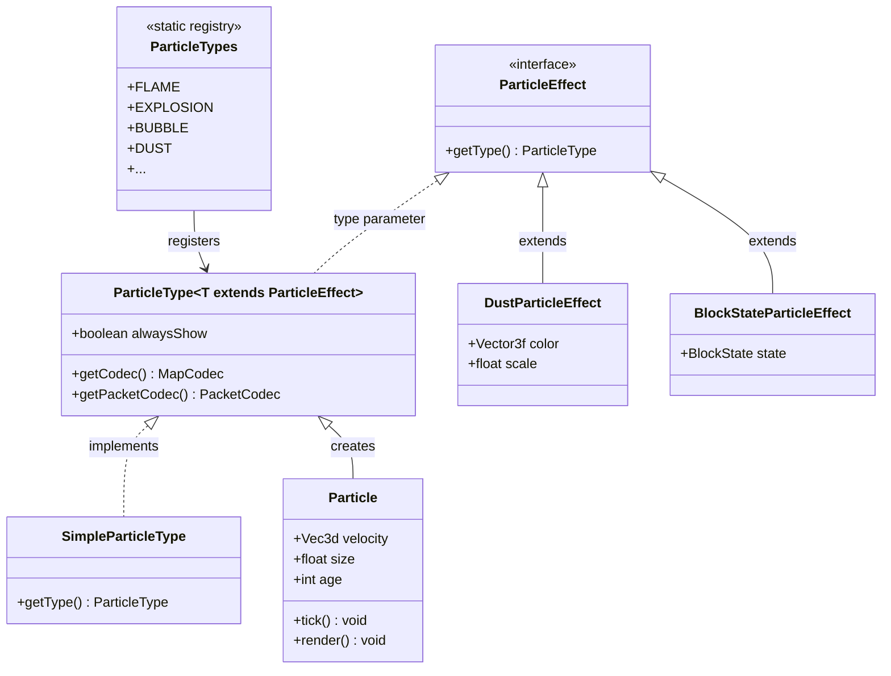

# Minecraft 粒�系统详解

## 目标

学完本教程�，你将能够：
- �解 Minecraft 粒�系统的核心概�- �� Particle�ParticleEffect�ParticleType 的关�- 学会�mod 中创建和生�自定义粒�- 了解如何创建带有�数的��粒�效�
## �置知识

- Java 基础（类����抽象类�- [声音系统](./sound-system.md) - 粒�常�声音��使用
- [�体系统](/mc/1.21/tutorials/Part-4-Entity/20-entity-intro/) - �体是粒�的主�生产�- [�性系统](/mc/1.21/tutorials/Part-4-Entity/24-entity-attributes/) - 了解�性修饰符

## 核心概念

### 什么是粒�系统�
想象你在放烟花：
- **烟花�* = 粒�效�（ParticleEffect�- **爆炸的��* = �际显示的粒�（Particle�- **�射�* = 粒�管�器（ParticleManager�
Minecraft 的粒�系统负责显示那�*��的�短暂的视觉效�**。当你：
- 挖�方�时�溅的�屑
- �下�水时飘起的彩色粒�
- �焰燃烧时跳动的�苗
- 凋��射的�色魔法弹

这些都是粒��
### 生活比喻：粒�= 电影院里的�尘颗�
想象阳光�过窗户照进电影院：
- 光线中漂浮的微��尘 = 游�中的粒�
- �尘有��大��颜色�飘动方�= ��的粒�类�- ��过时�尘飘动的轨�= 粒�的�动方�- 但这些�尘�是游�的主角，它们��*点缀和��*

### 粒�系统的组�
```
┌─────────────────────────────────────────────────────────��                    粒�系统组�                          �├─────────────────────────────────────────────────────────��                                                        ��  ParticleType (类�定义)                                ��     ���                                              ��  ParticleEffect (效��数)                              ��     �生�                                              ��  Particle (�际显示的粒�                               ��                                                        ��  �ParticleManager (管�� 统一调度                    ��                                                        �└─────────────────────────────────────────────────────────�```

## 图解（Mermaid�
### 粒�生��程�

```mermaid
flowchart TD
    A[事件触�<br/>� 挖�方�] --> B[创建 ParticleEffect]
    B --> C[调用 World#addParticle]
    C --> D[ParticleManager �收请求]
    D --> E{粒�类�检查}
    E -->|简�粒�| F[直�创建 Particle]
    E -->|��粒�| G[解��外�数]
    G --> F
    F --> H[分�到客户端渲染]
    H --> I[渲染粒�精�图]
    I --> J[显示在�幕上]
    
    style A fill:#fff3e0
    style J fill:#e8f5e8
```


### 粒�系统类关系图



### 粒�生命周期时��
```mermaid
sequenceDiagram
    participant Server as �务�    participant PM as ParticleManager
    participant Renderer as 粒�渲染�    participant Client as 客户端显�    
    Server->>PM: addParticle(effect, x, y, z, vx, vy, vz)
    PM->>PM: 选择或创建粒���    PM->>Renderer: ��粒�数�    Renderer->>Renderer: 更新粒�状�    Renderer->>Renderer: 计算�动和衰�    Renderer->>Client: 渲染当��    
    loop �tick
        Renderer->>Renderer: tick() - 更新�置和生命周�        Renderer->>Renderer: 检查是�消�    end
    
    Note over PM,Client: 粒��在客户端显�```

## 核心代�

### 1. ParticleEffect - 粒�效���

`ParticleEffect` 是一个��，定义了粒�的基本�数�
```java
// ���置: net.minecraft.particle.ParticleEffect
public interface ParticleEffect {
    ParticleType<?> getType();
}
```

**�新�解**：ParticleEffect 就�一�粒�处方"，告诉游�我�生�什么样的粒��
### 2. ParticleType - 粒�类�

`ParticleType` 是粒�的类�定义，类似�注册表中的键�
```java
// ���置: net.minecraft.particle.ParticleType
public abstract class ParticleType<T extends ParticleEffect> {
    private final boolean alwaysShow;
    
    protected ParticleType(boolean alwaysShow) {
        this.alwaysShow = alwaysShow;
    }
    
    // �些粒�总是显示（如爆炸），���离影�
    public boolean shouldAlwaysSpawn() {
        return this.alwaysShow;
    }
    
    public abstract MapCodec<T> getCodec();
    public abstract PacketCodec<? super RegistryByteBuf, T> getPacketCodec();
}
```

### 3. SimpleParticleType - 简�粒�类�
�需��外�数的粒�类��
```java
// ���置: net.minecraft.particle.SimpleParticleType
public class SimpleParticleType extends ParticleType<SimpleParticleType> 
                                implements ParticleEffect {
    
    protected SimpleParticleType(boolean alwaysShow) {
        super(alwaysShow);
    }
    
    // 简�粒�直�返�自�    public SimpleParticleType getType() {
        return this;
    }
}
```

### 4. 常�粒�类�

```java
// ���置: net.minecraft.particle.ParticleTypes
public class ParticleTypes {
    // 无�数粒�    public static final SimpleParticleType FLAME = register("flame", false);
    public static final SimpleParticleType SMOKE = register("smoke", false);
    public static final SimpleParticleType BUBBLE = register("bubble", false);
    public static final SimpleParticleType EXPLOSION = register("explosion", true);
    public static final SimpleParticleType HEART = register("heart", false);
    public static final SimpleParticleType CRIT = register("crit", false);
    public static final SimpleParticleType ENCHANT = register("enchant", false);
    
    // 带方�状�的粒�
    public static final ParticleType<BlockStateParticleEffect> BLOCK = 
        register("block", false, BlockStateParticleEffect::createCodec, ...);
    
    // 带颜色的粒�（用��水效�）
    public static final ParticleType<EntityEffectParticleEffect> ENTITY_EFFECT = 
        register("entity_effect", false, ...);
    
    // �尘粒�（红石粉等）
    public static final ParticleType<DustParticleEffect> DUST = 
        register("dust", false, DustParticleEffect::CODEC, ...);
    
    // 物�粒�
    public static final ParticleType<ItemStackParticleEffect> ITEM = 
        register("item", false, ...);
}
```

### 5. 带�数的粒�效�

#### DustParticleEffect - 彩色�尘粒�

```java
// ���置: net.minecraft.particle.DustParticleEffect
public class DustParticleEffect extends AbstractDustParticleEffect {
    public static final Vector3f RED = Vec3d.unpackRgb(0xFF0000).toVector3f();
    public static final DustParticleEffect DEFAULT = new DustParticleEffect(RED, 1.0f);
    
    private final Vector3f color;
    
    public DustParticleEffect(Vector3f color, float scale) {
        super(scale);
        this.color = color;
    }
    
    public ParticleType<DustParticleEffect> getType() {
        return ParticleTypes.DUST;
    }
    
    public Vector3f getColor() {
        return this.color;
    }
}
```

#### BlockStateParticleEffect - 方�状�粒�
```java
// 用�显示被挖�方�的�质
public class BlockStateParticleEffect implements ParticleEffect {
    private final ParticleType<BlockStateParticleEffect> type;
    private final BlockState state;
    
    public BlockStateParticleEffect(ParticleType<BlockStateParticleEffect> type, 
                                    BlockState state) {
        this.type = type;
        this.state = state;
    }
    
    public ParticleType<BlockStateParticleEffect> getType() {
        return type;
    }
}
```

## �战演示

### 场景 1：基础粒�生�

最简�的粒�生�，�需��外�数�
```java
// 在�务端或客户端生�粒�
// 方法1：带速度�数
world.addParticle(
    ParticleTypes.FLAME,           // �焰粒�
    x, y, z,                     // �置
    velocityX, velocityY, velocityZ  // 速度
);

// 方法2：�带速度（粒��止）
world.addParticle(
    ParticleTypes.HEART,
    player.getX(), 
    player.getY() + 1.5,        // 在�家头部高�    player.getZ(),
    0, 0, 0                      // 零速度
);

// 方法3：�务端广播给附近��world.syncGlobalEvent(eventId, pos, data);
// 例如：挖�方�效�world.syncGlobalEvent(2001, blockPos, Block.getRawIdFromState(blockState));
```

### 场景 2：彩色�尘粒�
```java
// 创建一个红色�尘效�public void spawnRedDust(World world, Vec3d pos) {
    DustParticleEffect redDust = new DustParticleEffect(
        new Vector3f(1.0f, 0.0f, 0.0f),  // 红色
        1.0f                               // 正常大�
    );
    
    world.addParticle(redDust,
        pos.x, pos.y, pos.z,
        0, 0.1, 0  // �上飘动的速度
    );
}

// 创建一个��色的�尘效�public void spawnRainbowDust(World world, Vec3d pos, float hue) {
    float r = (MathHelper.sin(hue) + 1) / 2;
    float g = (MathHelper.sin(hue + 2.1f) + 1) / 2;
    float b = (MathHelper.sin(hue + 4.2f) + 1) / 2;
    
    DustParticleEffect rainbow = new DustParticleEffect(
        new Vector3f(r, g, b),
        0.8f
    );
    
    world.addParticle(rainbow, pos.x, pos.y, pos.z, 0, 0.05, 0);
}
```

### 场景 3：方��质粒�
显示方�被破�时的�质效��
```java
// 在方�被破�时生�public void onBlockDestroy(World world, BlockPos pos, BlockState state) {
    // 生�方��质的破�粒�    BlockStateParticleEffect particle = new BlockStateParticleEffect(
        ParticleTypes.BLOCK,
        state
    );
    
    // 在方��置生�多个粒�    for (int i = 0; i < 8; i++) {
        world.addParticle(particle,
            pos.getX() + 0.5 + (random.nextDouble() - 0.5),
            pos.getY() + 0.5 + (random.nextDouble() - 0.5),
            pos.getZ() + 0.5 + (random.nextDouble() - 0.5),
            (random.nextDouble() - 0.5) * 0.5,
            random.nextDouble() * 0.5,
            (random.nextDouble() - 0.5) * 0.5
        );
    }
}
```

### 场景 4：粒�群生�

生�大�粒��造视觉效��
```java
// 爆炸效� - 生�一圈粒�public void createExplosionEffect(World world, Vec3d center) {
    // 爆炸核心粒�
    world.addParticle(ParticleTypes.EXPLOSION,
        center.x, center.y, center.z,
        0, 0, 0
    );
    
    // 烟雾�    for (int i = 0; i < 20; i++) {
        double angle = i * (Math.PI * 2 / 20);
        double radius = 0.5;
        
        world.addParticle(ParticleTypes.LARGE_SMOKE,
            center.x + Math.cos(angle) * radius,
            center.y,
            center.z + Math.sin(angle) * radius,
            Math.cos(angle) * 0.1,
            0.2,
            Math.sin(angle) * 0.1
        );
    }
    
    // �花�溅
    for (int i = 0; i < 30; i++) {
        double speed = random.nextDouble() * 0.3;
        double theta = random.nextDouble() * Math.PI * 2;
        double phi = random.nextDouble() * Math.PI;
        
        world.addParticle(ParticleTypes.FLAME,
            center.x, center.y, center.z,
            Math.sin(phi) * Math.cos(theta) * speed,
            Math.cos(phi) * speed,
            Math.sin(phi) * Math.sin(theta) * speed
        );
    }
}
```

### 场景 5：创建自定义粒�效��
```java
// 第一步：定义粒�效��public class MagicOrbParticleEffect implements ParticleEffect {
    private final ParticleType<MagicOrbParticleEffect> type;
    private final float rotationSpeed;
    private final int color;
    
    public MagicOrbParticleEffect(ParticleType<MagicOrbParticleEffect> type,
                                   float rotationSpeed, int color) {
        this.type = type;
        this.rotationSpeed = rotationSpeed;
        this.color = color;
    }
    
    @Override
    public ParticleType<MagicOrbParticleEffect> getType() {
        return type;
    }
    
    public float getRotationSpeed() { return rotationSpeed; }
    public int getColor() { return color; }
}

// 第二步：注册粒�类�
public static final ParticleType<MagicOrbParticleEffect> MAGIC_ORB = 
    ParticleTypes.register("magic_orb", false,
        type -> MagicOrbParticleEffect.CODEC,
        type -> MagicOrbParticleEffect.PACKET_CODEC
    );

// 第三步：生�粒�
public void spawnMagicOrb(World world, Vec3d pos) {
    MagicOrbParticleEffect effect = new MagicOrbParticleEffect(
        ModParticles.MAGIC_ORB,
        2.0f,
        0x8800FF  // 紫色
    );
    
    world.addParticle(effect,
        pos.x, pos.y, pos.z,
        0, 0.05, 0
    );
}
```

## 常�粒�类�速查�
| 粒��称 | 说� | 常用场景 |
|---------|------|---------|
| `FLAME` | �焰 | 熔炉��把�岩�|
| `SMOKE` | 烟雾 | 爆炸�烟雾弹 |
| `BUBBLE` | 气泡 | 水下�喷�|
| `HEART` | 爱心 | �殖�治�|
| `CRIT` | 暴击 | 暴击伤害 |
| `ENCHANT` | 附魔 | 附魔��书�|
| `EXPLOSION` | 爆炸 | TNT��魂��|
| `DUST` | �尘 | 红石�魔�|
| `BLOCK` | 方��片 | 挖��摔�|
| `ITEM` | 物�图标 | 消耗物�|
| `NOTE` | 音符 | 音符�|
| `SLIME` | ���| ��姆� |
| `SPIT` | �� | 羊驼 |
| `SQUID_INK` | 墨� | 鱿鱼 |

## �结

| 概念 | 作用 | 生活比喻 |
|------|------|----------|
| `ParticleType` | 粒�的类�定�| 粒�"�类标签" |
| `ParticleEffect` | 粒�的�数��| 粒�"�方� |
| `SimpleParticleType` | 无�数的简�粒�| 直�拿�的��|
| `DustParticleEffect` | 带颜色的�尘粒� | 彩色粉末 |
| `World#addParticle` | 生�粒�的方�| 按下"生�"按钮 |

**核心�点�*
1. 粒��在客户端显�2. 粒�通过 `World#addParticle()` �`syncGlobalEvent()` 生�
3. 简�粒�用 `SimpleParticleType`，��粒�用专门�Effect �4. 声音和粒��常一起使用�强效�
## 练习

### 练习 1：基础粒�生�
创建一个方�，�家�键点击时在方�上方生��焰粒��
### 练习 2：彩色粒�特�使用 `DustParticleEffect` 创建一个彩虹色的粒�喷泉效��
### 练习 3：爆炸效�模拟 TNT 爆炸效�，包�爆炸核心�烟雾�和�溅�花�
### 练习 4：自定义粒�类�
创建一个带有旋转动画的自定义魔法�粒�效��
## 相关链�

### 内部链�
- [声音系统](./sound-system.md) - 声音�粒���- [�体系统](/mc/1.21/tutorials/Part-4-Entity/20-entity-intro/) - �体产生粒�
- [物�系统](/mc/1.21/tutorials/Part-3-Block-Item/17-item-basics/) - 物�消耗产生粒�- [方��体](/mc/1.21/tutorials/Part-3-Block-Item/16-block-entity/) - 创建能�射粒�的方�

### 外部资�
- [Minecraft Wiki: Particles](https://minecraft.fandom.com/wiki/Particle)
- [粒�ID列表](https://minecraft.fandom.com/wiki/Particle#List_of_particles)
- [JOML�Vector3f文档](https://joml-ci.github.io/JOML/apidocs/org/joml/Vector3f.html)
