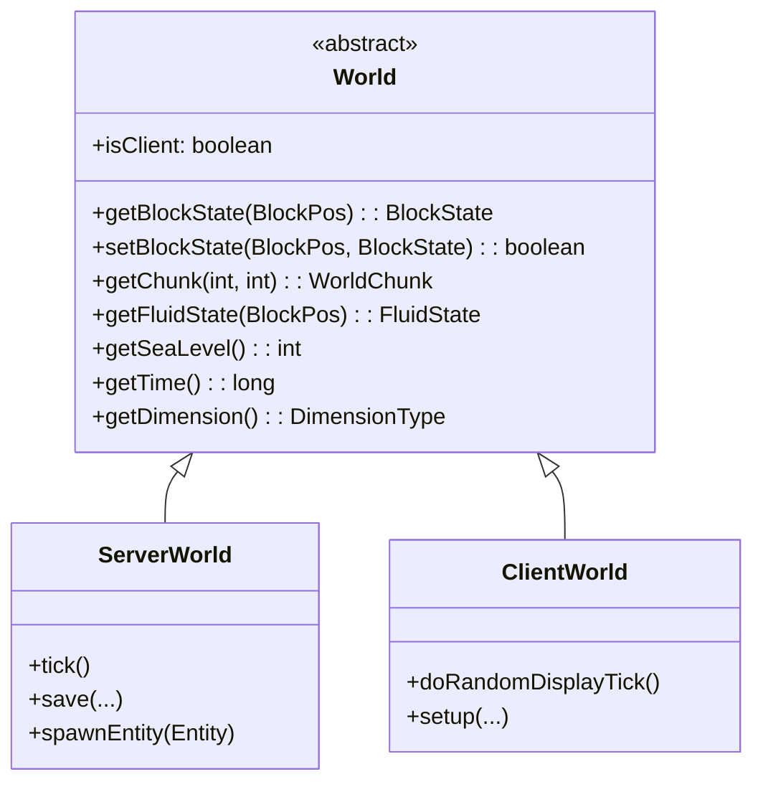

# 08 - 世界核心：World �
## 目标

学完本章�，你将�解�- World 类是什么，它在 Minecraft 中扮演什么角�- ServerWorld �ClientWorld 的区�- �标系统（BlockPos �ChunkPos�- 如何在世界中查询和设置方�
## �置知识

- [04-注册表系�md](/mc/1.21/tutorials/Part-1-Foundation/04-registry-system/) - �解 Minecraft 的核心��- [05-客户端�务端��.md](/mc/1.21/tutorials/Part-1-Foundation/05-client-server-arch/) - 了解 isClient 字段的��
## 核心概念

### World 类是什么？

想象一�Minecraft 的世界是一�*巨大的图书馆**�- **图书�* = World（存放所有的"书�"——方���体�生物群系）
- **World �* = 图书馆管�员（负责管�图书馆里的一切）

World 类是 Minecraft �*最核心的类之一**，它管���- 所有的方�（Block�- 所有的�体（Entity�- 天气系统（下雨�下雪�雷暴）
- 时间系统（白天�黑夜）
- 光照计算
- 生物群系信�



### ServerWorld vs ClientWorld

```
                    ┌─────────────────────────────────────────────�                    �                 World (抽象�                �                    � ─────────────────────────────────────────  �                    � �isClient: boolean  �关键字段�           �                    � �getBlockState()                          �                    � �setBlockState()                           �                    � �getChunk()                               �                    └─────────────────────────────────────────────�                              �                   �                              �                   �              ┌───────────────┴──────�   ┌───────┴───────────────�              �    ServerWorld      �   �     ClientWorld       �              � (�务��务�      �   �  (客户�你的电脑)     �              ├─────────────────────�   ├────────────────────────�              �����"           �   ���是"显示"           �              ��管�所有数�       �   ���收�务端数�        �              ��处�游�逻辑        �   ��播放声音和粒�       �              ���存到硬�         �   ��预测性移�          �              └─────────────────────�   └────────────────────────�```

**生活比喻**�- ServerWorld = �师（��，负责批改作业�- ClientWorld = 学生作业本（�是显示，最�还是�师说了算）

### �标系统

Minecraft 中有两���的�标：

| �标类� | 用�| 示例 |
|---------|------|------|
| **BlockPos** | 精确的方���| `(100, 64, 200)` 表示 x=100, y=64(高度), z=200 |
| **ChunkPos** | 区�的��| `(6, -12)` 表示�个区�在X方�，第-12个区�在Z方� |

```mermaid
flowchart LR
    subgraph World["世界�标"]
        direction TB
        X["X�(东西)"]
        Y["Y�(高度)"]
        Z["Z�(�北)"]
    end

    X -->|"�北移动+|Z�加|
    X -->|"��移动-|Z�少|
    X -->|"�东移动+|X�加|
    X -->|"�西移动-|X�少|
    Y -->|"�上+|Y�加|
    Y -->|"�下-|Y�少|
```

**BlockPos �ChunkPos 的转�*�```
BlockPos (100, 64, 200)
    � BlockPos  ÷ 16 �整
ChunkPos (6, 12)         �区��置
    �该区�内�个方�的局部��= (4, 64, 8)
                       � 100÷16=6�
```

## 核心代�

> ⚠� **注�**：以下代�基�CFR �编译，�际���能略有差异。建议结�Minecraft ��仓库交�验��
### World 类的定义

��路径：`net/minecraft/world/World.java`

```java
90:public abstract class World
91:implements WorldAccess,
92:AutoCloseable {
    // 关键字段：区分客户端和�务端
    123:    public final boolean isClient;
```

### 三个维度（主世界�下界�末地）

```java
94:    public static final RegistryKey<World> OVERWORLD =
95:        RegistryKey.of(RegistryKeys.WORLD, Identifier.ofVanilla("overworld"));
96:    public static final RegistryKey<World> NETHER =
97:        RegistryKey.of(RegistryKeys.WORLD, Identifier.ofVanilla("the_nether"));
98:    public static final RegistryKey<World> END =
99:        RegistryKey.of(RegistryKeys.WORLD, Identifier.ofVanilla("the_end"));
```

### ��方�状�（最常用的方法）

```java
374:    @Override
375:    public BlockState getBlockState(BlockPos pos) {
376:        if (this.isOutOfHeightLimit(pos)) {
377:            return Blocks.VOID_AIR.getDefaultState();
378:        }
379:        // 通过 Chunk ���方�380:        WorldChunk worldChunk = this.getChunk(
381:            ChunkSectionPos.getSectionCoord(pos.getX()),
382:            ChunkSectionPos.getSectionCoord(pos.getZ())
383:        );
384:        return worldChunk.getBlockState(pos);
385:    }
```

### 设置方�状�
```java
237:    @Override
238:    public boolean setBlockState(BlockPos pos, BlockState state, int flags) {
239:        // 检查是�超出高度��240:        if (this.isOutOfHeightLimit(pos)) {
241:            return false;
242:        }
243:        // ��许在调试世界中修改方�244:        if (!this.isClient && this.isDebugWorld()) {
245:            return false;
246:        }

247:        WorldChunk worldChunk = this.getWorldChunk(pos);
248:        BlockState blockState = worldChunk.setBlockState(pos, state, ...);
249:        // ... 更多逻辑（更新邻居方��触�事件等�250:        return true;
251:    }
```

### 世界边界�制

```java
183:    public boolean isInBuildLimit(BlockPos pos) {
184:        return !this.isOutOfHeightLimit(pos) && World.isValidHorizontally(pos);
185:    }

195:    public static boolean isValid(BlockPos pos) {
196:        return !World.isInvalidVertically(pos.getY()) && World.isValidHorizontally(pos);
197:    }
198:
199:    private static boolean isValidHorizontally(BlockPos pos) {
200:        // X �Z 必须�-30000000 �30000000 之间
201:        return pos.getX() >= -30000000 && pos.getZ() >= -30000000
202:            && pos.getX() < 30000000 && pos.getZ() < 30000000;
203:    }
```

**世界大��制**�- 水平方�：X, Z �[-30000000, 30000000)
- �直方�：Y �[-20000000, 20000000)
- �建造高度：通常 -64 �320

### �� Chunk

```java
217:    public WorldChunk getWorldChunk(BlockPos pos) {
218:        // �BlockPos �� Chunk
219:        return this.getChunk(
220:            ChunkSectionPos.getSectionCoord(pos.getX()),
221:            ChunkSectionPos.getSectionCoord(pos.getZ())
222:        );
223:    }
```

## �战演示

### 练习：在��中找到以下内�
1. **找到 ServerWorld 的定�*
   - 路径：`..../source/net/minecraft/server/world/ServerWorld.java`
   - 它继承自哪个类？
   - 它�写了哪些 World 类的方法�
2. **找到 ClientWorld 的定�*
   - 路径：`..../source/net/minecraft/client/world/ClientWorld.java`
   - 它的 `isClient` 字段是什么值？

3. **�解 getBlockState 的调用链**
   ```
   World.getBlockState(pos)
       �   WorldChunk.getBlockState(pos)
       �   ChunkSection.getBlockState(x, y, z)
   ```

## �结

| 概念 | 说� |
|------|------|
| World | 抽象类，管�游�世界的所有内�|
| ServerWorld | �务端的 World ��，是"��" |
| ClientWorld | 客户端的 World ��，�负责显示 |
| isClient | 区分客户端和�务端的关键字段 |
| BlockPos | 精确的方���(x, y, z) |
| ChunkPos | 区��标 |
| getBlockState() | ���个�置的方�状�|
| setBlockState() | 设置�个�置的方�状�|

**关键�解**�- **ServerWorld 是��*：�务端说什么就是什�- **ClientWorld �是�收�*：它�能决定游�状�- **所有对世界的�作都通过 World �*：�管是��还是设置方�

## 练习

### �考题

### �考题

1. 如� `isClient = true`，哪些�作�应该执行�2. 为什�`setBlockState` 在�务端和客户端的行为��？
3. 如�你�在�家放置方�时执行一些逻辑，应该在 ServerWorld 还是 ClientWorld 中写�
### 动手�
在��中找到以下代�，并截图或记录下�：

1. `World.java` �`isClient` 字段的定�2. `World.java` 中三个维度常�的定义
3. `World.java` �`getSeaLevel()` 方法
4. 验�世界边界：找�`isValidHorizontally` 方法，确�X �Z 的有效范�
## ��文件�置

| 文件 | ��路径 | 说� |
|------|----------|------|
| World.java | `net/minecraft/world/World.java` | 世界基类 |
| ServerWorld.java | `net/minecraft/server/world/ServerWorld.java` | �务端世�|
| ClientWorld.java | `net/minecraft/client/world/ClientWorld.java` | 客户端世�|
| WorldBorder.java | `net/minecraft/world/border/WorldBorder.java` | 世界边界 |

## 相关链�

- [09-区�系统.md](./09-chunk-system.md) - World 是如何通过 Chunk �存储方�的
- [12-光照系统.md](./12-lighting-system.md) - World 中的光照计算
- Minecraft Wiki: [World](https://minecraft.wiki/w/World)
