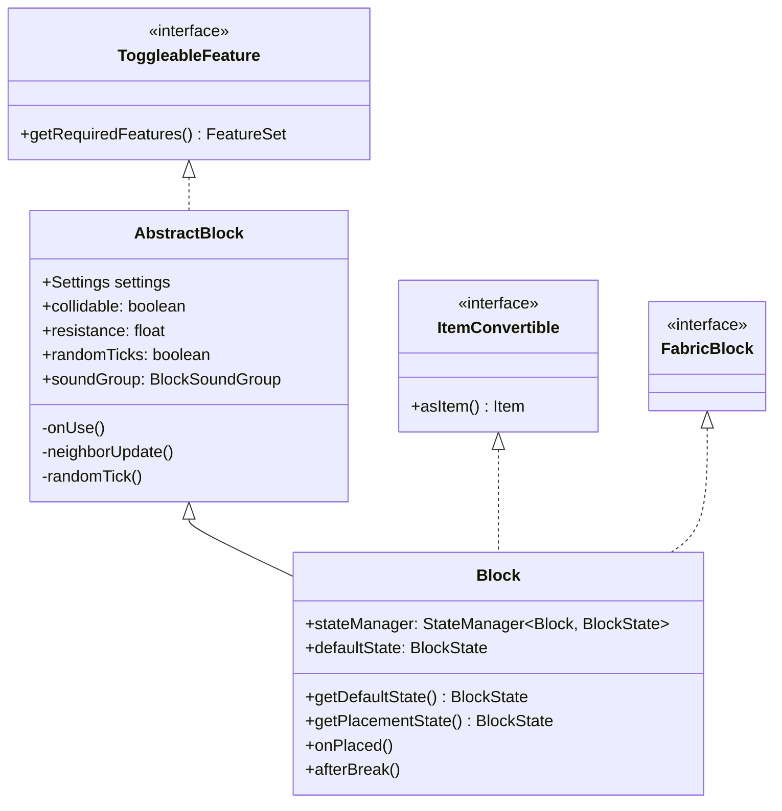

# 14 - Block 类：方�的基础

## 目标

学完本章节�，你将�解：
- Block 类是什么，它在 Minecraft 中扮演什么角�- Block �AbstractBlock 的关�- 方�的物��性（硬度�爆炸抗性等�- 如何创建一个自定义方�

## �置知识

- [04-注册表系�md](/mc/1.21/tutorials/Part-1-Foundation/04-registry-system/) - �解 Minecraft 的注册表机制
- [08-世界核心.md](/mc/1.21/tutorials/Part-2-World/08-world-core/) - 了解方�在世界中的��
## 核心概念

### Block 类是什么？

想象 Minecraft 世界是一堆积木。�个积木�就是 **Block（方�）**�
- 一�Block �= 一�积木模�- 比如"石头"模��有一个，但世界上有无数�石头
- 所有石头共享相�的�性（颜色�硬度�形状）

### Block vs AbstractBlock

```
AbstractBlock（抽象方�）
    �    ├── 定义方�的通用�性和逻辑
    �  ├── 硬度�爆炸抗�    �  ├── 碰�箱����    �  ├── 放置/破�行为
    �  └── �其他方�的交互
    �    └── Block（具体方�）
            �            ├── 继承 AbstractBlock
            ├── ��具体方�（如石头�木头）
            └── 定义自己的特�```

**简���*�- `AbstractBlock` = 积木�设计图模�
- `Block` = 具体用设计图�出的积�
### 方��性（方�的基本特性）

| ��| 说� | 比喻 |
|------|------|------|
| **hardness** | 硬度，破�所需时间 | 积木��固程度" |
| **resistance** | 爆炸抗�| 积木能承�多少锤�敲�|
| **soundGroup** | 音效�| 积木碰�的声�|
| **collidable** | 是�有碰�箱 | 积木能�被穿�|
| **randomTicks** | 是��机刻更�| 积木是�会自己��|

## 图解（Mermaid�
### Block 继承关系�


### 方�生命周期�

```mermaid
flowchart TD
    A[�家放置方�] --> B[Block.getPlacementState]
    B --> C{检查能�放置}
    C -->|�以| D[onBlockAdded]
    C -->|��以| E[放置失败]
    D --> F[neighborUpdate相邻方�更新]
    F --> G[方�正常�行]
    G --> H[�家破�方�]
    H --> I[onBreak]
    I --> J[afterBreak��物�]
    J --> K[方�消失]
```


## 核心代�

> ⚠� **注�**：以下代�基�CFR �编译，�际���能略有差异。建议结�Minecraft ��仓库交�验��
### 创建最简�的方�

```java
// 在你�mod 主类�public class MyMod implements ModInitializer {

    // 定义方�
    public static final Block MY_BLOCK = Registry.register(
        Registries.BLOCK,
        Identifier.of("mymod", "my_block"),
        new Block(AbstractBlock.Settings.create()
            .strength(1.5f, 6.0f)  // 硬度1.5, 爆炸抗�.0
            .sounds(BlockSoundGroup.STONE)  // 石头音效
        )
    );

    @Override
    public void onInitialize() {
        // 方�已被注册
    }
}
```

### 常�的方��性设�
```java
// 1. 石头类方�new Block(AbstractBlock.Settings.create()
    .strength(1.5f, 6.0f)
    .sounds(BlockSoundGroup.STONE)
);

// 2. 泥土类方�new Block(AbstractBlock.Settings.create()
    .strength(0.5f)
    .sounds(BlockSoundGroup.GRASS)
    .ticksRandomly()  // 需��机刻
);

// 3. ��方�（如空气�树�）
new Block(AbstractBlock.Settings.create()
    .noCollision()     // 无碰�箱
    .nonOpaque()       // �阻挡光�);

// 4. 需�特定工具的方�
new Block(AbstractBlock.Settings.create()
    .strength(3.0f, 3.0f)
    .requiresTool()    // 需���);

// 5. �燃方�（如木头�new Block(AbstractBlock.Settings.create()
    .strength(2.0f)
    .burnable()        // �以被�烧�
);

// 6. 液体方�
new Block(AbstractBlock.Settings.create()
    .liquid()
    .noCollision()
);
```

### 方�音效组（BlockSoundGroup�
```java
// 常用音效�BlockSoundGroup.WOOD      // 木头
BlockSoundGroup.STONE      // 石头
BlockSoundGroup.GRASS      // �BlockSoundGroup.SAND       // 沙�
BlockSoundGroup.METAL      // 金�
BlockSoundGroup.GLASS      // �璃
BlockSoundGroup.WOOL       // 羊毛
BlockSoundGroup.BAMBOO     // 竹�
BlockSoundGroup.SNOW       // �BlockSoundGroup.LAVA       // 岩浆
```

## �战演示

### 案例：创建一个会�光的方�
```java
public static final Block GLOWING_BLOCK = Registry.register(
    Registries.BLOCK,
    Identifier.of("mymod", "glowing_block"),
    new Block(AbstractBlock.Settings.create()
        .strength(1.0f)
        .luminance(state -> 15)  // 亮度等级15（最亮）
        .sounds(BlockSoundGroup.METAL)
    )
);
```

### 案例：创建一��机tick"的�方�

```java
// �会在附近没有�时��泥�public static final Block GRASS = Registry.register(
    Registries.BLOCK,
    Identifier.of("mymod", "my_grass"),
    new Block(AbstractBlock.Settings.create()
        .strength(0.6f)
        .sounds(BlockSoundGroup.GRASS)
        .ticksRandomly()  // 开��机刻
    )
);

// 然�在方�类中��randomTick 方法
public class MyGrassBlock extends Block {
    public MyGrassBlock(Settings settings) {
        super(settings);
    }

    @Override
    protected void randomTick(BlockState state, ServerWorld world,
                              BlockPos pos, Random random) {
        // 检查上方是�有其他方�
        if (!world.isSkyVisible(pos)) {
            // ��泥土
            world.setBlockState(pos, Blocks.DIRT.getDefaultState());
        }
    }
}
```

## �结

1. **Block �*�Minecraft 世界的基本�建��2. **AbstractBlock** 定义方�的通用�性和方法
3. 方��*��*通过 `Settings` �置�   - `strength()` - 硬度和爆炸抗�   - `sounds()` - 音效
   - `ticksRandomly()` - �机刻更�   - `luminance()` - �光强度
4. 所有方�都需�*注册**�`Registries.BLOCK`
5. 方�在世界中�**BlockState** 的形�存�
## 练习

### �考题

1. �考：为什么凋�Boss 的基座��命令方�"而�用普通石头？
2. 为什么有的方�需�`ticksRandomly()`，有的�需�？

### 动手�
1. 创建一个自定义方�，设置��的硬度和音�2. �试创建一个会�光的方�3. 进阶：创建一个� 10 秒自动消失的方�

### ��文件�置

| 文件 | ��路径 | 说� |
|------|----------|------|
| Block.java | `net/minecraft/block/Block.java` | 方�基类 |
| AbstractBlock.java | `net/minecraft/block/AbstractBlock.java` | 抽象方��� |
| Blocks.java | `net/minecraft/block/Blocks.java` | 所有�版方�定�|
| BlockSettings.java | `net/minecraft/block/BlockSettings.java` | 方�设置 |

## 相关链�

- [04-注册表系�md](/mc/1.21/tutorials/Part-1-Foundation/04-registry-system/) - �解注册表机�- [08-世界核心.md](/mc/1.21/tutorials/Part-2-World/08-world-core/) - 了解方�在世界中的��- [15-BlockState.md](./15-block-state.md) - 了解方�状�- Minecraft Wiki: [方�](https://minecraft.fandom.com/wiki/Block)
