# �0�Entity（�体）——游�世界里�活物"

> **注�**：以下代�示例基�CFR �编译结�，�际 Minecraft ���能有所差异。在使用时请以游���为准�
## 目标

- �解 Entity 是什�- 了解 Entity �Block（方�）的区�- ���体类�分类
- 学会看�体继承关系图

## �置知识

- 了解 Java ��对象编程的基础（类�继承）
- 了解 Minecraft 基本概念（�家�生物�物�等�
## 核心概念

### 什么是 Entity�
**Entity（�体）** �Minecraft 中最核心的概念之一——它代表世界上所�会动的东��
想象你家的动物园�- **Entity** 就�是动物园里所有会动的动物
- **Block（方�）** 就�是动物园里的石头围���物——它们�会自己动

### �体 vs 方�

| 特�| Entity（�体） | Block（方�） |
|------|----------------|---------------|
| �置 | 漂浮在世界中（有点�标） | 固定在格�中（有方��标�|
| 移动 | �以自己移动 | �能移动 |
| 碰��| 任�大� | 固定 1x1x1 |
| �存方� | NBT 数� | BlockState |
| 示例 | 猪�僵尸��家�箭�| 石头�泥土��方� |

### �体家�图谱

```
                                    ┌─────────────────�                                    �   Entity       � �万物之父，所有�体的祖宗
                                    �  (�体基类)     �                                    └────────┬────────�                                             �           ┌─────────────────────────────────┼─────────────────────────────────�           �                                �                                �           �                                �                                �┌─────────────────────�         ┌─────────────────────�         ┌─────────────────────��  LivingEntity      �         �  ProjectileEntity  �         �  AreaEffectCloudEntity �� (有生命的�体)      �         �   (抛射物��      �         �  (区域效��        ��                    �         �                    �         �                     ��有生命值�会�伤      �         �箭矢������等   �         ��水云��验��      �└─────────┬───────────�         └─────────────────────�         └─────────────────────�          �          �          �┌─────────────────────��   MobEntity        ��  (生物�体)         ��                    ���移动�有AI�能攻击  �└─────────┬───────────�          �    ┌─────┴─────┬──────────────�    �          �             �┌───────� ┌────────�  ┌──────────��僵尸  � �蜘蛛   �  �骷髅射手  �│Zombie � │Spider  �  │Skeleton  �└───────� └────────�  └──────────�```

### Minecraft 中的�体分类

```
Entity �体大家��├── � LivingEntity（活�的）
�  ├── 👤 PlayerEntity（�家）
�  ├── � MobEntity（会动的生物��  �  ├── 🟢 HostileEntity（敌对生物）
�  �  �  ├── 🧟 Zombie（僵尸）
�  �  �  ├── 💀 Skeleton（骷髅）
�  �  �  ├── 🕷�Spider（蜘蛛）
�  �  �  └── 🔮 Creeper（苦力怕）
�  �  └── 🟡 PassiveEntity（被动生物）
�  �      ├── � Cow（牛��  �      ├── � Sheep（羊��  �      └── � Pig（猪��  └── � WaterMobEntity（水生生物）
�├── � ProjectileEntity（抛射物��  ├── � Arrow（箭��  ├── 🔥 Fireball（��）
�  └── � EnderPearl（末影��）
�├── 📦 ItemEntity（物��体）
�  └── 💼 地上��的物��├── 🧱 FallingBlockEntity（��中的方�）
�  └── 🪨 沙��沙��└── 🚃 VehicleEntity（载具）
    ├── 🚂 Minecart（矿车）
    └── 🚤 Boat（船�```

## 图解

### Entity 继承关系图（详细版）

```mermaid
classDiagram
    class Entity {
        <<abstract>>
        +Vec3d pos �置
        +Vec3d velocity 速度
        +float yaw 水平旋转
        +float pitch �直旋转
        +World world 世界
        +tick() �刻更新
        +damage() �到伤害
        +remove() 移除�体
    }

    class LivingEntity {
        <<abstract>>
        +float health 生命�        +AttributeContainer attributes �性容�        +Map~StatusEffect, StatusEffectInstance~ effects �水效�
        +tickStatusEffects() 更新�水
        +heal() 治疗
        +die() 死亡
    }

    class MobEntity {
        <<abstract>>
        +GoalSelector goalSelector 目标选择�        +GoalSelector targetSelector 目标选择�        +Navigation navigation 导航系统
        +MoveControl moveControl 移动�制
        +LookControl lookControl 视角�制
        +initGoals() �始化AI
        +tryAttack() �试攻击
    }

    class PlayerEntity {
        +PlayerInventory inventory 背包
        +GameMode gameMode 游�模�
        +PlayerInventory.getMainHandStack() 主手物�
    }

    class ZombieEntity {
        +boolean isDrowning 正在溺水
        +convertTo() 转化僵尸
    }

    class SkeletonEntity {
        +BowItem bow 弓箭
        +aimBow() �准
    }

    Entity <|-- LivingEntity : 继承
    Entity <|-- ProjectileEntity : 继承
    Entity <|-- ItemEntity : 继承
    LivingEntity <|-- MobEntity : 继承
    LivingEntity <|-- PlayerEntity : 继承
    MobEntity <|-- HostileEntity : 继承
    MobEntity <|-- AnimalEntity : 继承
    HostileEntity <|-- ZombieEntity : 继承
    HostileEntity <|-- SkeletonEntity : 继承
    HostileEntity <|-- SpiderEntity : 继承
```



### 生活中的比喻

```
Entity 就��演员"�- 方�（Block）是��上的布景——固定��- �体（Entity）是��上的演员——�以走�走�
LivingEntity = 有血�的演员（能被打�MobEntity = 会自己动的演员（有AI�PlayerEntity = �家�制的角�```

## 核心代�

> **注�**：以下代�基�CFR �编译结�，�能��际��略有差异�
### Entity 基类的核心字�
```java
// Entity.java - �置和旋�public abstract class Entity {
    // �置
    private Vec3d pos;                    // 当��标 (x, y, z)
    private BlockPos blockPos;            // 所在方���
    // 速度
    private Vec3d velocity;               // 当�速度��

    // 旋转角度
    private float yaw;                    // 水平旋转（左�看�    private float pitch;                  // �直旋转（上下看�
    // 碰��    private Box boundingBox;              // �体�用的空�
    // 世界引用
    protected World world;                 // 这个�体所在的世界
}
```

### �体类�定义示例

```java
// EntityType.java - �体类�的定�public static final EntityType<ZombieEntity> ZOMBIE =
    EntityType.register("zombie",
        Builder.create(ZombieEntity::new, SpawnGroup.MONSTER)
            .dimensions(0.6f, 1.95f)           // �.6格，�.95�            .eyeHeight(1.74f)                  // 眼�高度
            .vehicleAttachment(-0.7f)          // 骑乘�置
            .maxTrackingRange(8)               // 最大追踪�离（8个区�）
            .trackingTickInterval(3)            // 追踪更新间隔
    );
```

### 创建�体

```java
// 在世界中生�一个僵�EntityType<ZombieEntity> ZOMBIE = EntityType.ZOMBIE;

// 方�1：使�spawn 方法
ZOMBIE.spawn(serverWorld, new BlockPos(100, 64, 200), SpawnReason.NATURAL);

// 方�2：创建�手动放置
ZombieEntity zombie = ZOMBIE.create(world);
if (zombie != null) {
    zombie.setPosition(100, 64, 200);
    world.spawnEntity(zombie);
}
```

## �战演示

### 场景：��Entity 的�置和移动

```java
public class MyEntity extends MobEntity {

    @Override
    public void tick() {
        super.tick();

        // ��当��置
        Vec3d pos = this.getPos();
        double x = pos.x;
        double y = pos.y;
        double z = pos.z;

        // ��旋转角度
        float yaw = this.getYaw();    // 左�看（0-360度）
        float pitch = this.getPitch(); // 上下看（-90�0度）

        // ��速度
        Vec3d velocity = this.getVelocity();

        // 让�体��个方�移动
        // 例如：��移�        Vec3d forward = this.getRotationVector();
        this.setVelocity(forward.multiply(0.5)); // �次移动0.5�    }
}
```

### 场景：���体类�
```java
public class EntityHelper {

    // 判断�体是什么类�    public static String getEntityTypeName(Entity entity) {
        EntityType<?> type = entity.getType();
        return type.getName().getString();
    }

    // 检查是�是敌对生物
    public static boolean isHostile(Entity entity) {
        if (entity instanceof MobEntity mob) {
            return mob.getType().getSpawnGroup() == SpawnGroup.MONSTER;
        }
        return false;
    }

    // 检查是�是动物
    public static boolean isAnimal(Entity entity) {
        if (entity instanceof AnimalEntity) {
            return true;
        }
        return false;
    }
}
```

## �结

1. **Entity �Minecraft 中所�会动的东�的基�*
   - 包括�家�生物�抛射物���物�等

2. **Entity �Block 的核心区�*
   - Entity 有精确的�置�标，�以移�   - Block 固定在方�格�中

3. **�体继承层次**
   - `Entity` �`LivingEntity` �`MobEntity` ���具体生物
   - 越往下，功能越多，但也越��

4. **�个 EntityType 定义了一个��*
   - 包括大��碰�箱�生�群体等��
5. **创建�体需�使�EntityType**
   - �能直� new，��`entityType.create(world)`

## 练习

### 练习 1：找出所有敌对生�
```java
// �EntityType 中找到所�MONSTER 群体的��// �示：查�SpawnGroup �举
```

### 练习 2：创建自定义�体

```java
// 使用 EntityType.Builder 创建一个新的�体类�// 设置尺寸�1x1x1，看看在游�中长什么样
```

### 练习 3：追踪�家��
```java
// 编写代�，�秒输出�家当���// �示：使�tick() 方法�� age 字段
```

## 相关链�

### ��文件�置

| 文件 | ��路径 | 说� |
|------|----------|------|
| Entity.java | `net/minecraft/entity/Entity.java` | �体基类 |
| EntityType.java | `net/minecraft/entity/EntityType.java` | �体类� |
| EntityType.java | `net/minecraft/entity/EntityTypes.java` | 所有�版�体定�|

- **上一�*：[�9�ItemComponent组件系统](/mc/1.21/tutorials/Part-3-Block-Item/19-item-component/)
- **下一�*：[�1��体生命周期](./21-entity-lifecycle.md)
- **相关��**�  - `net/minecraft/entity/Entity.java` - �体基类
  - `net/minecraft/entity/EntityType.java` - �体类�注册
- **扩展阅读**�  - [Minecraft Wiki - Entity](https://minecraft.fandom.com/wiki/Entity)
