# �6�生�系统——生物是如何出�在世界上�
> **注�**：以下代�示例基�CFR �编译结�，�际 Minecraft ���能有所差异。在使用时请以游���为准�
## 目标

- �解�体是如何生�的
- �� SpawnRestriction（生��制）
- 了解 SpawnReason（生��因）
- 学会自定义生���
## �置知识

- 了解 MobEntity（第23章）
- 了解世界和区�的概念

## 核心概念

### 什么是生�系统�
**生�系统（Spawn System�* �Minecraft 决定"在哪里�什么时候�如何生���的机制。无论是自然生�的僵尸，还是�家用命令�唤的�体，都需��过这个系统的检查�
```
生��程�
1. �置检�   - 是�有有效的生��置�   - 地�是��以站立�
2. �境检�   - 光照等级是�足够�   - 是�在水�空气中？

3. �件检�   - 难度是��许�   - �家�离是��适？

4. 数�检�   - 当�区域�体数�是�过多�
5. 生�
   - 创建�体
   - �始化��   - 播放生�特效
```

### 生活中的比喻

```
生�系统就�开一家��：

1. �置检�= ��地�是�有效
2. �境检�= 周围�境是�适�开��
3. �件检�= �业执照是��全
4. 数�检�= �一�街已�有太多��了
5. 正�开�= ��开门��
�有所有检查都通过了，���能开业�
```

### 生��因（SpawnReason�
| SpawnReason | 中文�| 说� |
|------------|--------|------|
| NATURAL | 自然生� | 怪物自然刷出 |
| JOCKEY | 骑乘生� | 蜘蛛骑士�|
| SPAWNER | 生�器生�| 刷怪笼生� |
| EVENT | 事件生� | 生物群系事件 |
| REINFORCEMENT | ��生� | 僵尸呼��伴 |
| BREEDING | �殖生� | 动物�殖 |
| MOB_SUMMONED | 指令生� | /summon 命令 |
| CONVERSION | 转化生� | 僵尸���|
| CUSTOM | 自定义生�| 模组自定�|

### 生��置类�（SpawnLocation�
| 类� | 说� | 示例 |
|------|------|------|
| ON_GROUND | 地��| 僵尸�骷�|
| IN_WATER | 水中 | 鱼�鱿�|
| IN_LAVA | 岩浆�| 岩浆�|
| UNRESTRICTED | 无��| 唤魔�|

## 图解

### 生�检查��

```mermaid
flowchart TD
    A[�试生��体] --> B{�体类�有效?}
    B -->|�| Z[生�失败]
    B -->|是| C{生��置有效?}

    C -->|�| Z
    C -->|是| D{SpawnRestriction检查}

    D -->|失败| Z
    D -->|通过| E{数��制检查}

    E -->|过多| Z
    E -->|正常| F{�家�离检查}

    F -->|太近| Z
    F -->|�适| G{难度检查}

    G -->|��许| Z
    G -->|�许| H[创建�体]

    H --> I[�始化�性]
    I --> J[播放生�特效]
    J --> K[�功生�]
```


### 自然生��程

```mermaid
sequenceDiagram
    participant World as 世界
    participant Spawner as 区�生��    participant Mob as MobEntity
    participant Restriction as SpawnRestriction

    World->>Spawner: �刻检查生�
    Spawner->>Restriction: 检查生���    Restriction-->>Spawner: �置有效

    Spawner->>Spawner: 检查光照等�    Spawner->>Spawner: 检查�体数�
    alt 所有检查通过
        Spawner->>Mob: create()
        Note over Mob: 创建�例<br/>�添加到世界
        Mob->>Mob: initialize()
        Note over Mob: �始化��br/>设置装备
        Spawner->>Mob: spawnEntity()
        Note over Mob: 添加到世�br/>播放特效
    else 检查失�        Spawner-->>World: 跳过本次生�
    end
```



### 生物群系�生�群�
```
生�群体（SpawnGroup）：

CREATURE（动物）
├── 猪�牛�鸡�羊
├── 兔���狸�狼
└── 熊猫�猫�鹦�
AMBIENT（�境生物）
└── ��

MONSTER（怪物�├── 僵尸�骷髅�蜘�├── 苦力怕�女�└── 岩浆怪���姆

WATER_CREATURE（水生生物）
├── 海豚�鱿�└── 守��
WATER_AMBIENT（水�境生物�├── �└── 河豚

AXOLOTLS（�西��└── �西�
UNDERGROUND_WATER_CREATURE（地下水生生物）
└── �光鱿鱼
```

## 核心代�

> **注�**：以下代�基�CFR �编译结�，�能��际��略有差异�
### SpawnRestriction（生��制）

```java
// SpawnRestriction.java - 生��制系统
public class SpawnRestriction {

    // 存储所有�体的生��制
    private static final Map<EntityType<?>, Entry> RESTRICTIONS = Maps.newHashMap();

    // 注册生��制
    public static <T extends MobEntity> void register(
        EntityType<T> type,
        SpawnLocation location,           // 生��置类�
        Heightmap.Type heightmapType,    // 使用的高度图
        SpawnPredicate<T> predicate      // 自定义检查��    ) {
        Entry entry = RESTRICTIONS.put(type, new Entry(heightmapType, location, predicate));
    }

    // 检查生��置是�有�    public static boolean isSpawnPosAllowed(EntityType<?> type, WorldView world, BlockPos pos) {
        return SpawnRestriction.getLocation(type).isSpawnPositionOk(world, pos, type);
    }

    // 执行完整的生�检�    public static <T extends Entity> boolean canSpawn(
        EntityType<T> type,
        ServerWorldAccess world,
        SpawnReason spawnReason,
        BlockPos pos,
        Random random
    ) {
        Entry entry = RESTRICTIONS.get(type);
        // 调用自定义的检查��        return entry == null || entry.predicate.test(type, world, spawnReason, pos, random);
    }

    // ��高度图类�    public static Heightmap.Type getHeightmapType(@Nullable EntityType<?> type) {
        Entry entry = RESTRICTIONS.get(type);
        return entry == null ? Heightmap.Type.MOTION_BLOCKING_NO_LEAVES : entry.heightmapType;
    }
}
```

### 注册默认生��制

```java
// SpawnRestriction.java - 默认注册
static {
    // 动物 - 地�上生�，需�足够光�    SpawnRestriction.register(
        EntityType.COW,
        SpawnLocationTypes.ON_GROUND,
        Heightmap.Type.MOTION_BLOCKING_NO_LEAVES,
        AnimalEntity::isValidNaturalSpawn
    );

    // 僵尸 - 地�上生�，暗处
    SpawnRestriction.register(
        EntityType.ZOMBIE,
        SpawnLocationTypes.ON_GROUND,
        Heightmap.Type.MOTION_BLOCKING_NO_LEAVES,
        HostileEntity::canSpawnInDark
    );

    // �- 水中生�
    SpawnRestriction.register(
        EntityType.COD,
        SpawnLocationTypes.IN_WATER,
        Heightmap.Type.MOTION_BLOCKING_NO_LEAVES,
        WaterCreatureEntity::canSpawn
    );

    // 烈焰�- 地�上生�，忽略光照
    SpawnRestriction.register(
        EntityType.BLAZE,
        SpawnLocationTypes.ON_GROUND,
        Heightmap.Type.MOTION_BLOCKING_NO_LEAVES,
        HostileEntity::canSpawnIgnoreLightLevel
    );
}
```

### 自定义生�检查��
```java
// 动物的标准生���public class AnimalEntity extends PassiveEntity {

    // 动物�以自然生�的��    public static boolean isValidNaturalSpawn(
        EntityType<AnimalEntity> type,
        ServerWorldAccess world,
        SpawnReason reason,
        BlockPos pos,
        Random random
    ) {
        // 1. 检查生���        if (!SpawnRestriction.isSpawnPosAllowed(type, world, pos)) {
            return false;
        }

        // 2. 检查是�有足够的空�        if (!world.isSpaceEmpty(pos, type.getWidth(), type.getHeight())) {
            return false;
        }

        // 3. 检查地�是�是固体
        BlockState ground = world.getBlockState(pos.down());
        if (!ground.isSolid()) {
            return false;
        }

        // 4. 检查光照等级（动物需�足够的光照�        int lightLevel = world.getLightLevel(pos);
        if (lightLevel < 8) {
            return false;
        }

        return true;
    }
}
```

```java
// 敌对生物的生���public class HostileEntity {

    // 在黑暗中生�
    public static boolean canSpawnInDark(
        EntityType<? extends HostileEntity> type,
        ServerWorldAccess world,
        SpawnReason reason,
        BlockPos pos,
        Random random
    ) {
        // 1. 检查基础�件
        if (!MobEntity.canMobSpawn(type, world, reason, pos, random)) {
            return false;
        }

        // 2. 检查光照等级（敌对生物需�在暗处�        int lightLevel = world.getLightLevel(pos);
        if (lightLevel > 7) {
            return false;
        }

        return true;
    }

    // 忽略光照等级生�
    public static boolean canSpawnIgnoreLightLevel(
        EntityType<? extends HostileEntity> type,
        ServerWorldAccess world,
        SpawnReason reason,
        BlockPos pos,
        Random random
    ) {
        return MobEntity.canMobSpawn(type, world, reason, pos, random);
    }
}
```

```java
// 水生生物的生���public class WaterCreatureEntity extends MobEntity {

    public static boolean canSpawn(
        EntityType<WaterCreatureEntity> type,
        ServerWorldAccess world,
        SpawnReason reason,
        BlockPos pos,
        Random random
    ) {
        // 检查是�在水中
        if (!world.getBlockState(pos).isOf(Blocks.WATER)) {
            return false;
        }

        // 检查水�        int waterDepth = world.getWaterHeight(pos);
        if (waterDepth < 0) {
            return false;
        }

        return MobEntity.canMobSpawn(type, world, reason, pos, random);
    }
}
```

### 生��体

```java
// EntityType.java - 生��体
public class EntityType<T extends Entity> {

    // 创建并生���    public T spawn(ServerWorld world, BlockPos pos, SpawnReason reason) {
        return this.spawn(world, null, pos, reason, false, false);
    }

    // 完整的生�方�    public T spawn(ServerWorld world, @Nullable Consumer<T> afterConsumer,
                   BlockPos pos, SpawnReason reason,
                   boolean alignPosition, boolean invertY) {

        // 1. 创建�体
        T entity = this.create(world, afterConsumer, pos, reason, alignPosition, invertY);

        if (entity != null) {
            // 2. 添加到世�            world.spawnEntityAndPassengers((Entity)entity);
        }

        return entity;
    }

    // 创建�体的详细过�    public T create(ServerWorld world, @Nullable Consumer<T> afterConsumer,
                   BlockPos pos, SpawnReason reason,
                   boolean alignPosition, boolean invertY) {

        // 创建�例
        T entity = this.create(world);
        if (entity == null) {
            return null;
        }

        // 设置�置
        if (alignPosition) {
            ((Entity)entity).setPosition(pos.getX() + 0.5, pos.getY() + 1, pos.getZ() + 0.5);
            double originY = EntityType.getOriginY(world, pos, invertY, ((Entity)entity).getBoundingBox());
        } else {
            ((Entity)entity).refreshPositionAndAngles(
                pos.getX() + 0.5, pos.getY(), pos.getZ() + 0.5,
                world.random.nextFloat() * 360.0f, 0.0f
            );
        }

        // 如�是生物，�始�        if (entity instanceof MobEntity mobEntity) {
            mobEntity.headYaw = mobEntity.getYaw();
            mobEntity.bodyYaw = mobEntity.getYaw();
            mobEntity.initialize(world, world.getLocalDifficulty(mobEntity.getBlockPos()), reason, null);
            mobEntity.playAmbientSound();
        }

        return entity;
    }
}
```

### MobEntity 的生�检�
```java
// MobEntity.java - 生物生�基础检�public abstract class MobEntity extends LivingEntity {

    // 通用的生物生�检�    public static boolean canMobSpawn(
        EntityType<? extends MobEntity> type,
        WorldAccess world,
        SpawnReason spawnReason,
        BlockPos pos,
        Random random
    ) {
        // 1. 检查生���        // 刷怪笼生��以直�生�
        if (spawnReason == SpawnReason.SPAWNER) {
            return true;
        }

        // 2. 检查下方是�是固体方�
        BlockPos belowPos = pos.down();
        BlockState belowState = world.getBlockState(belowPos);
        return belowState.allowsSpawning(world, belowPos, type);
    }

    // �体级别的生�检�    public boolean canSpawn(WorldAccess world, SpawnReason spawnReason) {
        // 检查�置和碰�
        return !world.containsFluid(this.getBoundingBox()) &&
               world.doesNotIntersectEntities(this);
    }
}
```

## �战演示

### 场景：注册自定义生物的生���
```java
// �mod �始化时注册
public class MyMod implements Initializable {

    @Override
    public void onInitialize() {
        // 注册自定义僵尸的生��制
        SpawnRestriction.register(
            EntityType.ZOMBIE,  // 或者你自定义的�体类�
            SpawnLocationTypes.ON_GROUND,
            Heightmap.Type.MOTION_BLOCKING_NO_LEAVES,
            (type, world, reason, pos, random) -> {
                // 自定义生���
                // 1. 基础检�                if (!MobEntity.canMobSpawn(type, world, reason, pos, random)) {
                    return false;
                }

                // 2. �在夜晚生�
                if (world.getWorld().isDay()) {
                    return false;
                }

                // 3. �在森�生物群系生�
                if (!(world.getBiome(pos).value().getCategory() == Biome.Category.FOREST)) {
                    return false;
                }

                // 4. 50% 的概�跳�                if (random.nextFloat() < 0.5f) {
                    return false;
                }

                return true;
            }
        );
    }
}
```

### 场景：使用命令生���
```java
// 在命令中生��体
public class SpawnCommand {

    public static int execute(ServerCommandSource source, EntityType<?> entityType,
                             BlockPos pos, SpawnReason reason) {
        ServerWorld world = source.getWorld();

        // 创建并生���        Entity entity = entityType.spawn(
            world,
            pos,                    // 生��置
            reason                  // 生��因
        );

        if (entity != null) {
            // �以对�体进行�外设�            if (entity instanceof LivingEntity living) {
                // 设置生命�                living.setHealth(living.getMaxHealth());

                // 设置�称
                living.setCustomName(Text.literal("Custom Mob"));
                living.setCustomNameVisible(true);
            }

            source.sendFeedback(() -> Text.literal("已生�" + entityType.getName()), true);
        }

        return 1;
    }
}
```

### 场景：程�化生��体

```java
// 在世界中程�化生�一群��public class MobSpawner {

    // 生�一群猪
    public static void spawnPigGroup(ServerWorld world, BlockPos center, int count) {
        Random random = world.getRandom();

        for (int i = 0; i < count; i++) {
            // 围绕中心�机�移
            int offsetX = random.nextInt(10) - 5;
            int offsetZ = random.nextInt(10) - 5;
            BlockPos spawnPos = center.add(offsetX, 0, offsetZ);

            // ��高度图��            spawnPos = world.getTopPosition(
                Heightmap.Type.MOTION_BLOCKING_NO_LEAVES,
                spawnPos
            );

            // �试生�
            EntityType<PigEntity> pigType = EntityType.PIG;
            if (SpawnRestriction.isSpawnPosAllowed(pigType, world, spawnPos)) {
                pigType.spawn(world, spawnPos, SpawnReason.NATURAL);
            }
        }
    }

    // 生�一匹马
    public static void spawnHorse(ServerWorld world, BlockPos pos) {
        EntityType<HorseEntity> horseType = EntityType.HORSE;

        // 创建�        HorseEntity horse = horseType.create(world);
        if (horse != null) {
            // 设置�置
            horse.setPosition(pos.getX() + 0.5, pos.getY(), pos.getZ() + 0.5);

            // �始化��            horse.initialize(world, world.getLocalDifficulty(pos),
                           SpawnReason.NATURAL, null);

            // 设置颜色
            horse.setColor(HorseColor.CHESTNUT);
            horse.setStyle(HorseStyle.NONE);

            // 设置驯�状�            horse.setTamed(true);

            // 添加到世�            world.spawnEntity(horse);
        }
    }
}
```

### 场景：自定义刷怪笼

```java
// 创建自定义刷怪笼
public class CustomSpawnerBlock extends SpawnerBlock {

    @Override
    public void onScheduledTick(BlockState state, ServerWorld world, BlockPos pos, Random random) {
        // ��刷怪笼的��        Entity entity = world.getBlockEntity(pos);
        if (!(entity instanceof SpongeBlockEntity spawner)) {
            return;
        }

        // ���生�的�体类�
        EntityType<?> entityType = spawner.getEntityType();

        // 检查延�        if (spawner.getDelay() > 0) {
            spawner.setDelay(spawner.getDelay() - 1);
            return;
        }

        // 检查附近�体数�        int currentCount = world.getEntitiesByType(
            entityType,
            Box.from(pos.toCenterPos()).expand(16)
        ).size();

        if (currentCount >= spawner.getMaxCount()) {
            return;
        }

        // 在附近找一个有效的生��置
        BlockPos spawnPos = findValidSpawnPos(world, pos, entityType);
        if (spawnPos != null) {
            // 使用 SPAWNER �因生�
            entityType.spawn(world, spawnPos, SpawnReason.SPAWNER);
            spawner.setDelay(spawner.getMinDelay());
        }
    }

    private BlockPos findValidSpawnPos(ServerWorld world, BlockPos center, EntityType<?> type) {
        Random random = world.getRandom();

        // �试多次找��        for (int i = 0; i < 10; i++) {
            int x = center.getX() + random.nextInt(5) - 2;
            int y = center.getY() + random.nextInt(3) - 1;
            int z = center.getZ() + random.nextInt(5) - 2;

            BlockPos pos = new BlockPos(x, y, z);

            if (SpawnRestriction.isSpawnPosAllowed(type, world, pos)) {
                return pos;
            }
        }

        return null;
    }
}
```

## �结

1. **生�系统决定�体如何出�**
   - �置检���境检���件检��数�检�
2. **SpawnRestriction �制生��件**
   - `SpawnLocation` - 生��置类�（地�水中�   - `Heightmap.Type` - 使用的高度图
   - `SpawnPredicate` - 自定义检查��
3. **SpawnReason 说�生��因**
   - `NATURAL` - 自然刷�   - `SPAWNER` - 刷怪笼
   - `JOCKEY` - 骑乘生�
   - `MOB_SUMMONED` - /summon 命令

4. **生�检查��*
   - `SpawnRestriction.isSpawnPosAllowed()` - �置检�   - `MobEntity.canMobSpawn()` - 基础检�   - �体自身�`canSpawn()` - �外检�
5. **生��体**
   - `EntityType.spawn()` - 创建并添�   - `EntityType.create()` - 仅创�   - `initialize()` - �始化��
## 练习

### 练习 1：创建一个�在天黑时生�的生�
```java
// 注册一个生物，�在夜晚生�
// �示：检�world.getWorld().isDay()
```

### 练习 2：�制生物生�数�
```java
// 让一个生物最多生�5 �// �示：在 SpawnPredicate 中检查附近�体数�```

### 练习 3：创建一个自定义刷怪区

```java
// 创建一个方�，放置�会在周围生�特定生�// �示：使�onPlaced �scheduledTick
```

## 相关链�

### ��文件�置

| 文件 | ��路径 | 说� |
|------|----------|------|
| SpawnHelper.java | `net/minecraft/world/SpawnHelper.java` | 生�辅助 |
| SpawnRestriction.java | `net/minecraft/world/SpawnRestriction.java` | 生��制 |
| MobSpawner.java | `net/minecraft/world/MobSpawner.java` | 刷怪笼 |

- **上一�*：[�5�伤害系统](./25-damage-system.md)
- **下一�*：[�7�AI大脑介�](/mc/1.21/tutorials/Part-5-AI/27-ai-brain-intro/)
- **相关��**�  - `net/minecraft/entity/SpawnRestriction.java` - 生��制
  - `net/minecraft/entity/SpawnReason.java` - 生��因
  - `net/minecraft/entity/SpawnLocation.java` - 生��置
  - `net/minecraft/entity/EntityType.java` - �体创建和生�  - `net/minecraft/entity/mob/MobEntity.java` - 生物生�检�