# �7�命令系统入门 —��解 Minecraft 的指令世�
## 目标

- �解命令（Command）是什�- ��命令�（CommandSource）的概念
- 了解命令上下文（CommandContext�- �白命令�输入到执行的完整��
## �置知识

- 完� [�2�事件系统](/mc/1.21/tutorials/Part-5-Event/32-event-system/) 或有 Java 基础
- 了解 Minecraft 游�基本概念（�家��务器�- 了解 Minecraft 有命令系统（`/tp`�`/give` 等）

## 核心概念

### 什么是命令�
**命令（Command�* 是�家或系统�游���的指令�
想象你���点��- **�* = 命令��者（�下的命令）
- **�务�* = 命令系统（�收和处�命令�- **��** = 已知命令列表
- **�师** = 命令执行者（真正�事的人�
�Minecraft 中，当你输入 `/give @p diamond 64` 时：
```
/give @p diamond 64
�   �   �     ��   �   �     └─ 数��4��   �   └─ 物�：钻��   └─ 目标：最近的�家
└─ 命令�：give（给物��```

### 命令�（CommandSource�
**命令�* ��下的命�，它包�了执行命令所需的所有信��

```mermaid
classDiagram
    class CommandSource {
        <<interface>>
        +getPlayerNames() �家列表
        +getPosition() �置
        +getWorld() 世界
        +hasPermissionLevel(int) ��检�        +sendMessage(Text) ��消�    }
    
    class ServerCommandSource {
        +Vec3d position �标
        +ServerWorld world 世界
        +int level ��等级
        +String name �称
        +Text displayName 显示�        +Entity entity 执行�体
        +MinecraftServer server �务�    }
    
    CommandSource <|-- ServerCommandSource
```


### 命令上下文（CommandContext�
**命令上下�* 就�是你点���务员给你��票"——包�了这次命令的所有信��

```mermaid
classDiagram
    class CommandContext~S~ {
        +S source 命令�        +String input �始输入
        +Map~String, Argument~ arguments �数
        +getArgument(name) ���数
        +getSource() ��命令�    }
    
    class ServerCommandSource {
        +Vec3d position
        +ServerWorld world
        +MinecraftServer server
    }
    
    CommandContext "1" o-- "1" ServerCommandSource
```


### 命令解��程

当你输入一个命令，Minecraft 内部是这样处�的�
```mermaid
sequenceDiagram
    participant �家
    participant 命令系统
    participant Brigadier解��    participant 命令执行�    
    �家->>命令系统: 输入 "/give Steve diamond 64"
    命令系统->>Brigadier解�� ��命令字符串
    Brigadier解��>>Brigadier解�� 1. 解�命令结�
    Brigadier解��>>Brigadier解�� 2. 验��数类�
    Brigadier解��>>Brigadier解�� 3. 检查��    Brigadier解��->>命令执行� 返� CommandContext
    命令执行�>>命令执行� 4. 执行具体逻辑
    命令执行�->>�家: 5. 返�结�/消�
```

## 图解

### 命令系统���
```
┌─────────────────────────────────────────────────────────────────��                        �家输入                                 ��                   /give @p diamond 64                           �└─────────────────────────┬───────────────────────────────────────�                          �                          �┌─────────────────────────────────────────────────────────────────��                    CommandDispatcher                            ��                     (命令调度�                                �� ┌───────────────────────────────────────────────────────────� �� �                   命令�(Command Tree)                   � �� �                                                           � �� �                       give                                � �� �                      /    \                               � �� �                 targets   item                            � �� �                   �       |                              � �� �                 @p       count                            � �� �                           /                               � �� �                         64                                � �� └───────────────────────────────────────────────────────────� �└─────────────────────────┬───────────────────────────────────────�                          �                          �┌─────────────────────────────────────────────────────────────────��                  CommandContext                                 ��                  (命令上下�                                    �� ┌────────────────────────────────────────────────────────────� �� � source: ServerCommandSource (�执行的?)                    � �� � arguments: {                                             � �� �   targets: EntitySelector(@p)                           � �� �   item: ItemStack(diamond)                              � �� �   count: 64                                              � �� � }                                                        � �� └────────────────────────────────────────────────────────────� �└─────────────────────────┬───────────────────────────────────────�                          �                          �┌─────────────────────────────────────────────────────────────────��                  命令执行 (Execute)                             �� 1. ��目标�家 (Steve)                                          �� 2. 创建64个钻�                                                �� 3. 添加到�家背�                                               �� 4. ���功消�                                                 �└─────────────────────────────────────────────────────────────────�```

### 生活中的比喻：��点�系�
```
┌──────────────────────────────────────────────────────────────────��                       ��类比                                   �├──────────────────────────────────────────────────────────────────��                                                                 ��  Minecraft命令          �     ��系统                          ��  ─────────────────────────────────────────────────────────────  ��  命令输入               �     点��                          ��  /give Steve diamond    �     "我�一份牛�                    ��                                                                 ��  CommandDispatcher       �     �务�                          ��  (命令调度�            �     (�收并处�点�                  ��                                                                 ��  CommandContext          �     点��票                         ��  (命令上下�            �     (记录：桌�����数�          ��                                                                 ��  ServerCommandSource     �     顾客信�                         ��  (命令�                �     (�点的��味�求�VIP等级)        ��                                                                 ��  命令执行逻辑            �     �师��                          ��  /give �execute()     �     �牛��加调料                   ��                                                                 ��  �馈消�                �     上�+�还需�什么��            ��  "已给�64 个钻�       �     "您的牛�好了，请慢用"            ��                                                                 �└──────────────────────────────────────────────────────────────────�```

## 核心代�

### ServerCommandSource 的核心字�
```java
// ServerCommandSource.java - �务端命令�
public class ServerCommandSource implements CommandSource {
    
    // 命令输出目标（��消�用�    private final CommandOutput output;
    
    // �置（命令执行的地方�    private final Vec3d position;
    
    // 世界（命令在哪个世界执行�    private final ServerWorld world;
    
    // ��等级�=普通�� 4=管�员）
    private final int level;
    
    // 执行者的�字和显示�
    private final String name;
    private final Text displayName;
    
    // �务器引�    private final MinecraftServer server;
    
    // 如�是���体执行的，�存这个�体
    private final Entity entity;
    
    // 视角旋转
    private final Vec2f rotation;
}
```

### 命令调度的核心代�
```java
// CommandManager.java - 命令管��public class CommandManager {
    private final CommandDispatcher<ServerCommandSource> dispatcher = new CommandDispatcher();
    
    // 执行命令（带 / �缀�    public void executeWithPrefix(ServerCommandSource source, String command) {
        command = command.startsWith("/") ? command.substring(1) : command;
        this.execute(this.dispatcher.parse(command, source), command);
    }
    
    // 执行命令
    public void execute(ParseResults<ServerCommandSource> parseResults, String command) {
        ServerCommandSource source = parseResults.getContext().getSource();
        // 解�命令
        ContextChain<ServerCommandSource> contextChain = 
            CommandManager.checkCommand(parseResults, command, source);
        
        if (contextChain != null) {
            // 执行命令
            CommandExecutionContext.enqueueCommand(context, command, contextChain, source, ...);
        }
    }
}
```

### �上下文��数�

```java
// �CommandContext 中��数�public class CommandExample {
    
    public static int execute(ServerCommandSource source, CommandContext<?> context) {
        // ��命令�        ServerCommandSource src = context.getSource();
        
        // ���家（如�存在）
        if (src.getEntity() instanceof ServerPlayerEntity player) {
            player.sendMessage(Text.literal("你执行了命令�));
        }
        
        // ���标
        Vec3d pos = src.getPosition();
        
        // ��世界
        ServerWorld world = src.getWorld();
        
        // ����        source.sendFeedback(() -> Text.literal("命令执行�功�), broadcastToOps);
        
        return 1; // 返��功
    }
}
```

## �战演示

### 场景：�解命令执行的完整�程

```java
public class CommandFlowDemo {
    
    /**
     * 模拟�家输入 "/teleport Steve 100 64 200" 的完整��     */
    public static void demonstrateCommandFlow() {
        
        // 1. �家输入命令字符�        String commandInput = "/teleport Steve 100 64 200";
        
        // 2. �设这是命令�（执行命令的�家）
        ServerCommandSource source = new ServerCommandSource(
            output,           // 输出目标
            new Vec3d(0, 64, 0),  // 当��标
            new Vec2f(0, 0),   // 视角
            world,             // 当�世界
            4,                 // ��等级4（管�员�            "Steve",           // �字
            Text.literal("Steve"), // 显示�            server,            // �务�            entity             // �家�体
        );
        
        // 3. CommandDispatcher 解�命令
        // 分解：teleport �Steve �100 �64 �200
        // 验�：Steve 是有效的�家�        // 验��00, 64, 200 是有效的�标
        
        // 4. 创建 CommandContext
        // context.getArgument("targets") �"Steve"
        // context.getArgument("pos") �Vec3d(100, 64, 200)
        
        // 5. 执行传�逻辑
        // player.teleport(world, 100, 64, 200, 0, 0);
        
        // 6. ���功消�        // source.sendMessage("已传�Steve �(100, 64, 200)");
    }
}
```

## �结

1. **命令（Command�* 是�家�游���的指令，如 `/give`�`/tp`�`/time`

2. **命令�（CommandSource�* 代表"�下的命�，包�：
   - 执行者的�置�所在世�   - ��等级
   - �务器引�   - �以��消�给执行�
3. **命令上下文（CommandContext�* 包�一次命令执行的所有信�：
   - 命令�   - 解��的�数

4. **命令解��程**�   ```
   �家输入 �字符串解���数验� ���检��执行 ��馈
   ```

5. **Brigadier 是命令解�库**，它将命令字符串解��结�化�CommandContext

## 练习

### 练习 1：追踪命令�信�

```java
// 在命令执行时，输出以下信�：
// - 执行者的�字
// - 执行者的�标
// - 所在世界的�称
// - ��等级

public class DebugCommand {
    public static int execute(CommandContext<ServerCommandSource> context) {
        ServerCommandSource source = context.getSource();
        
        // TODO: 补全代�，输出上述信�        System.out.println("执行者：" + source.getName());
        
        return 1;
    }
}
```

### 练习 2：检查��等�
```java
// 创建一个检查��的命令
// 如��家�� >= 2，显�你有�使用此命令"
// �则显示"你没有��

public class PermissionCheckCommand {
    public static int execute(CommandContext<ServerCommandSource> context) {
        ServerCommandSource source = context.getSource();
        int level = /* ����等级 */;
        
        // TODO: ����检查逻辑
        
        return 1;
    }
}
```

## 相关链�

- **上一�*：[�6��步机制](/mc/1.21/tutorials/Part-6-Network/36-sync-mechanism/)
- **下一�*：[�8�Brigadier 基础](./38-brigadier-basics.md)
- **相关��**�  - `net/minecraft/command/CommandSource.java` - 命令���  - `net/minecraft/server/command/ServerCommandSource.java` - �务端命令���
  - `net/minecraft/server/command/CommandManager.java` - 命令管��- **扩展阅读**�  - [Brigadier 官方文档](https://github.com/Mojang/brigadier)
  - [Minecraft Wiki - Commands](https://minecraft.fandom.com/wiki/Commands)

### ��文件�置

| 文件 | ��路径 | 说� |
|------|----------|------|
| CommandDispatcher.java | `com/mojang/brigadier/CommandDispatcher.java` | 命令调度�|
| CommandSource.java | `net/minecraft/command/CommandSource.java` | 命令���|
| CommandContext.java | `com/mojang/brigadier/context/CommandContext.java` | 命令上下�|

> **注�**：本文中的部分��示例基�CFR �编译结�，�际���能略有差异�
---

**关键�*：命令系统�CommandSource�CommandContext�CommandDispatcher�Brigadier
