# �5�Minecraft 客户端核�
## 目标

- �解 `MinecraftClient` 是什�- 了解客户端的游�主循�- ��客户端的线程模�
- 区分客户端和�务端的���责

## �置知识

- 了解 Java 基础（线程�对象）
- 知�什么是游�循�（Game Loop�- 了解 Part-6 网络部分的基本概�
## 核心概念

### 什么是 MinecraftClient�
想象一下你家门�的**快递柜**�
```
┌─────────────────────────────────────────────────────��                   MinecraftClient                    ��                                                     ��  它是客户端的"大脑"，负责：                            ��  - 显示画�给�家看                                   ��  - �收�家的键盘鼠标��                             ��  - 播放声音效�                                       ��  - 管�网络��（和�务器通信�                        �└─────────────────────────────────────────────────────�```

`MinecraftClient` �Minecraft 客户端的主类，就��房里�*总�师长**�
- **�务端（MinecraftServer�*：负���"（游�逻辑�生�世界）
- **客户端（MinecraftClient�*：负�摆盘"（把游�画�展示给�家）

### 客户�vs �务�
| �责 | 客户�(Client) | �务�(Server) |
|------|----------------|-----------------|
| **显示画�** | �必须�| ��需�|
| **处�输入** | �必须�| ��需�|
| **生�世界** | ��负�| �必须 |
| **物�模拟** | 预测性模�| ��模拟 |
| **多人通信** | ���作，�收结� | �收�作，广播结�|

### 游�主循�
就�动画片的制作��——�秒播放多张图片，让你感觉画����
```
Minecraft 的主循� = 无�循� + 两大任务

┌──────────────────────────────────────────────────────────��                   游�主循�(run方法)                    ��                                                         ��  while (游�在�� {                                    ��      ┌─────────────────────────────────�               ��      �1. 处�输入                     �               ��      �   - 键盘有没有按�              �               ��      �   - 鼠标有没有动�              �               ��      └─────────────────────────────────�               ��                   �                                     ��      ┌─────────────────────────────────�               ��      �2. 更新游�逻辑（Tick�          �               ��      �   - 移动�家                    �               ��      �   - 更新�体                    �               ��      └─────────────────────────────────�               ��                   �                                     ��      ┌─────────────────────────────────�               ��      �3. 渲染画�（Render�           �               ��      �   - 画天�                     �               ��      �   - 画方�                     �               ��      �   - 画��                     �               ��      �   - 画HUD                       �               ��      └─────────────────────────────────�               ��  }                                                      �└──────────────────────────────────────────────────────────�```

### 线程模�

Minecraft 客户端�一�*���房**，有多个�师�时工作�
```
┌─────────────────────────────────────────────────────────────────��                     客户端线程模�                               ��                                                                 �� ┌──────────────────�                                            �� �  主线�         � ��行游�主循�(run方法)                    �� �  (Client Thread) � �处�输入�更新逻辑�渲�                   �� └────────┬─────────�                                            ��          �                                                       ��          ├──────────────────┬──────────────────�                 ��          �                 �                 �                 �� ┌─────────────�   ┌─────────────�   ┌─────────────�          �� � 渲染线程    �   � 资�加载线程 �   � 网络线程    �          �� � (Render)   �   � (Resource) �   � (Network) �          �� └─────────────�   └─────────────�   └─────────────�          ��      �                 �                 �                      ��      �                 �                 �                      �� 画到�幕�       加载�质/模�        �收/��数�包               �└─────────────────────────────────────────────────────────────────�```

## 图解（Mermaid�
### MinecraftClient 组件关系�
```mermaid
flowchart TB
    subgraph MC["MinecraftClient (客户端大�"]
        direction TB
        main["run() 主循�]
        tick["tick() 游�更新"]
        render["render() 画�渲染"]
    end

    subgraph Input["输入系统"]
        keyboard["Keyboard 键盘"]
        mouse["Mouse é¼ æ ‡"]
    end

    subgraph Render["渲染系统"]
        gameRenderer["GameRenderer 游�渲染�]
        worldRenderer["WorldRenderer 世界渲染�]
        inGameHud["InGameHud �幕HUD"]
    end

    subgraph Network["网络系统"]
        connection["ClientPlayNetworkHandler"]
        player["ClientPlayerEntity"]
    end

    subgraph World["世界"]
        clientWorld["ClientWorld 客户端世�]
    end

    main --> tick
    main --> render
    tick --> Input
    tick --> Network
    tick --> World
    render --> Render
    Input --> tick
    keyboard --> Mouse
    Network --> World
    World --> Render
    worldRenderer --> clientWorld
    gameRenderer --> inGameHud

    style MC fill:#e3f2fd
    style Input fill:#fff3e0
    style Render fill:#e8f5e9
    style Network fill:#f3e5f5
    style World fill:#fce4ec
```

### 客户端��务器通信�程

```mermaid
sequenceDiagram
    participant Player as �家
    participant Client as MinecraftClient
    participant Network as 网络�    participant Server as �务�    participant World as 游�世界

    Note over Player,Server: �人模� vs 多人模�

    rect rgb(200, 230, 200)
        Note over Player,World: �人模� (集��务�
        Player->>Client: �W 键移�        Client->>Client: 本地预测移动
        Client->>Client: 渲染画�
        Client->>World: 更新�家�置
    end

    rect rgb(200, 200, 230)
        Note over Player,Server: 多人模� (远程�务�
        Player->>Client: �W 键移�        Client->>Client: 本地预测移动
        Client->>Network: ��PlayerMoveC2SPacket
        Network->>Server: 网络传输
        Server->>Server: 验�并更新��        Server->>World: 广播�家移动
        World->>Network: 世界状�更�        Network->>Client: �步状�        Client->>Client: 渲染画�
    end
```



## 核心代�

### MinecraftClient 的关键组�
```java
// ���置: MinecraftClient.java

public class MinecraftClient {
    // ====== 输入设备 ======
    public final Mouse mouse;           // é¼ æ ‡
    public final Keyboard keyboard;     // 键盘

    // ====== 渲染系统 ======
    public final GameRenderer gameRenderer;   // 游�渲染�    public final WorldRenderer worldRenderer; // 世界渲染�    public final InGameHud inGameHud;        // �幕HUD

    // ====== 世界���======
    @Nullable public ClientWorld world;      // 客户端世�    @Nullable public ClientPlayerEntity player; // �家�体

    // ====== 网络 ======
    @Nullable public ClientPlayNetworkHandler networkHandler;
    @Nullable public IntegratedServer server; // 集��务��人)
}
```

### 游�主循�核心代�
```java
// ���置: MinecraftClient.java - run()方法

public void run() {
    // 主循�    while (this.running) {
        try {
            // 开始性能分�
            profiler.startTick();
            
            // 渲染一�            this.render(!bl);  // bl = 是�是崩溃���
            
            profiler.endTick();
        } catch (OutOfMemoryError e) {
            // 内存�足处�
            this.cleanUpAfterCrash();
            this.setScreen(new OutOfMemoryScreen());
        }
    }
}
```

### Tick（游�更新）

```java
// ���置: MinecraftClient.java - tick()方法

public void tick(boolean paused) {
    if (!paused) {
        // 更新输入（键盘�鼠标状�）
        this.mouse.tick();
        this.keyboard.tick();
        
        // 更新�家输入
        if (this.player != null) {
            this.player.input.tick(this.world.isRainingAt(this.player.getBlockPos()));
        }
        
        // 更新网络
        if (this.networkHandler != null) {
            this.networkHandler.tick();
        }
        
        // æ›´æ–°HUD
        this.inGameHud.tick(paused);
    }
}
```

## �战演示

### 场景：�家按下跳跃键

1. **�家�作**：按空格键跳�2. **输入检�*�   ```java
   // KeyboardInput.tick() 检测按�   this.jumping = this.settings.jumpKey.isPressed();
   ```
3. **本地预测**�   - 客户端先在本地模拟跳跃动�   - 让�家感觉�作是"�时�应"�4. **��数�包**�   ```java
   // ��跳跃数�包给�务器
   PlayerActionC2SPacket packet = new PlayerActionC2SPacket(...);
   connection.send(packet);
   ```
5. **�务器验�*�   - �务器验�跳跃是���   - 广播给其他��6. **状���*�   - 客户端�收�务器确认
   - 如�预测错误，进��滚"

## �结

1. **MinecraftClient** = 客户端的主�制类，�管渲染�输入�网�2. **游�主循�* = 处�输入 �更新逻辑 �渲染画�（无�循�）
3. **客户端线程模�* = 主线�+ 渲染线程 + 网络线程 + 资�加载线程
4. **客户端预�* = 在收到�务器确认�，本地模拟�作以�少延迟感
5. **客户���务�* = 客户端负责显示，�务端负责逻辑

## 练习

1. 在��中找到 `MinecraftClient.java`，阅�`run()` 方法
2. 找出 `tick()` 方法，了解��tick 都�什�3. �考：为什么客户端需�预测"�家移动�
## 相关链�

- 下一章：[�6�渲染系统](./46-render-system.md) - 深入了解渲染
- Part-6 网络：[网络基础](/mc/1.21/tutorials/Part-6-Network/33-network-intro/)
- �务端对比：[MinecraftServer 核心](/mc/1.21/tutorials/Part-6-Network/33-network-intro/)

---

### ��文件�置

| 文件 | ��路径 | 说� |
|------|----------|------|
| MinecraftClient.java | `net/minecraft/client/MinecraftClient.java` | 客户端主类，管�渲染�输入�网�|
| TickRecorder.java | `net/minecraft/util/TickRecorder.java` | Tick 录制�|
| Window.java | `net/minecraft/client/Window.java` | 窗�管��|

---

**关键�*：MinecraftClient�Game Loop�Tick�Thread�Render�Input�Client Prediction
