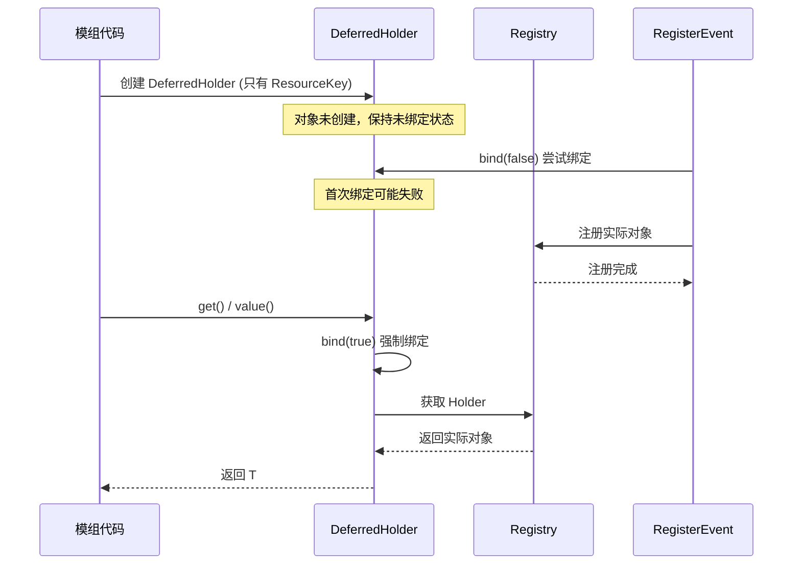
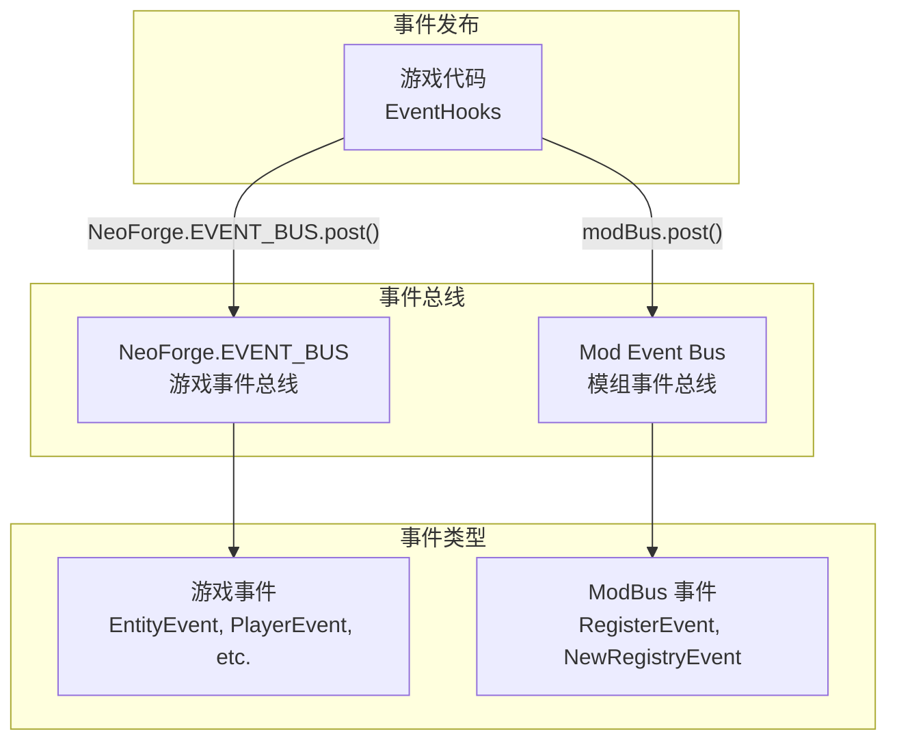
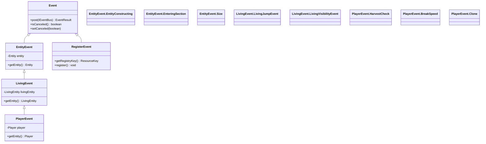
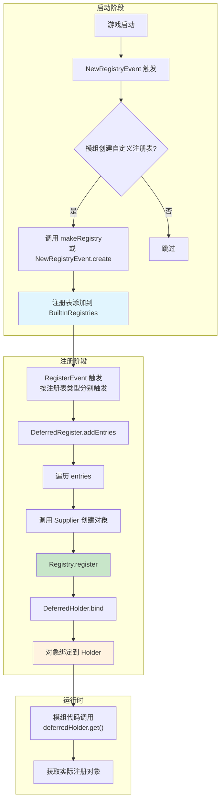
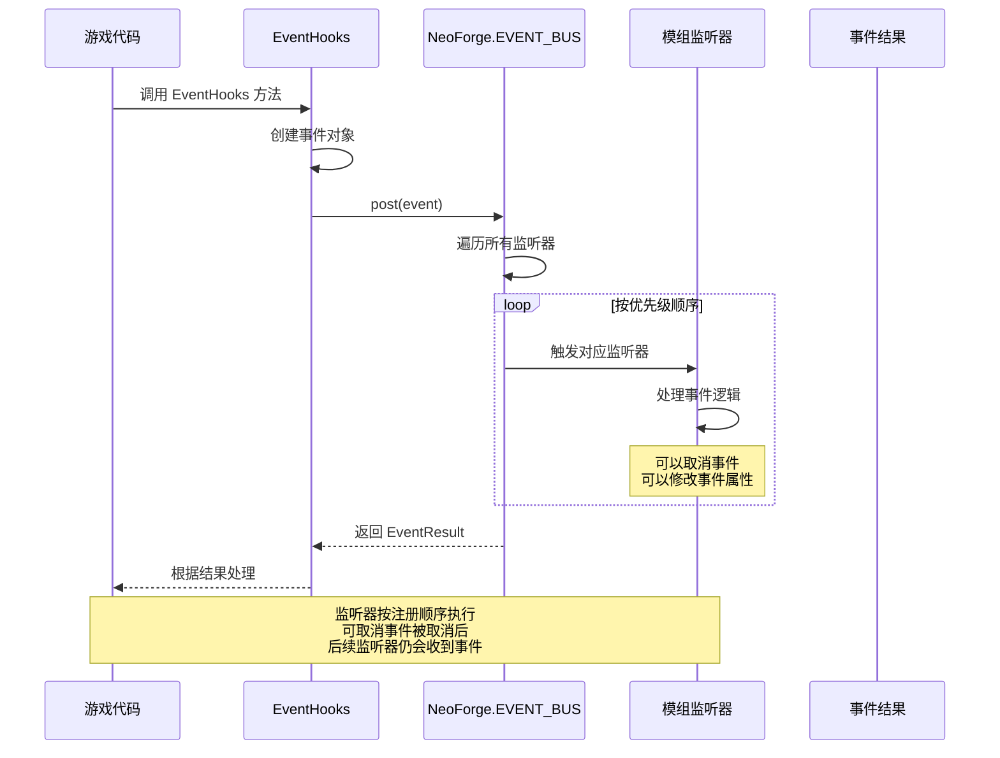

# 注册与事件系统

## 目录

- [1. 系统概述](#1-系统概述)
- [2. 注册系统](#2-注册系统)
  - [2.1 DeferredRegister 延迟注册器](#21-deferredregister-延迟注册器)
  - [2.2 DeferredHolder 延迟持有者](#22-deferredholder-延迟持有者)
  - [2.3 DeferredBlock 与 DeferredItem](#23-deferredblock-与-deferreditem)
  - [2.4 RegisterEvent 注册事件](#24-registerevent-注册事件)
  - [2.5 NewRegistryEvent 新建注册表事件](#25-newregistryevent-新建注册表事件)
  - [2.6 RegistryBuilder 注册表构建器](#26-registrybuilder-注册表构建器)
  - [2.7 NeoForgeRegistries NeoForge 注册表](#27-neoforgeregistries-neoforge-注册表)
- [3. 事件系统](#3-事件系统)
  - [3.1 EventBus 事件总线](#31-eventbus-事件总线)
  - [3.2 事件类型层次结构](#32-事件类型层次结构)
  - [3.3 EventHooks 事件钩子](#33-eventhooks-事件钩子)
- [4. 工作流程图](#4-工作流程图)
- [5. API 使用示例](#5-api-使用示例)
- [6. 与其他系统交互](#6-与其他系统交互)
- [7. 与 Forge/Fabric 对比](#7-与-forgefabric-对比)
- [8. 总结](#8-总结)

## 1. 系统概述

NeoForge 的注册与事件系统是模组开发的核心基础设施，负责协调游戏内容的注册和游戏逻辑的扩展。这套系统继承自 Minecraft Forge，但在 1.21.x 版本中进行了重大重构，与原版 Minecraft 的 Holder 引用系统深度整合。

**核心设计理念**：

| 理念 | 说明 |
|------|------|
| **延迟初始化** | 所有游戏内容（方块、物品、实体等）在静态字段声明时不会立即创建，而是通过 Supplier 延迟到注册阶段 |
| **类型安全** | 通过泛型 `DeferredHolder<R, T extends R>` 确保注册对象与注册表类型匹配 |
| **双事件总线** | `NeoForge.EVENT_BUS`（游戏事件总线）和 Mod Event Bus（模组特定事件总线）分离 |
| **原版兼容** | 与 Minecraft 原版的 `Registry<T>` 和 `Holder<T>` 系统无缝集成 |

**与 Minecraft 原版的区别**：

Minecraft 1.20+ 引入的 `Holder` 系统提供了对注册对象的延迟引用，NeoForge 在此基础上构建了 `DeferredHolder`，使得模组可以在注册完成前声明引用。Fabric 也有类似的 `RegistryEntry` 机制，但 NeoForge 的实现更接近原版设计。

---

## 2. 注册系统

### 2.1 DeferredRegister 延迟注册器

`DeferredRegister<T>` 是 NeoForge 注册系统的核心类，位于 `net.neoforged.neoforge.registries` 包中。

**类结构**：

```java
87:950:D:\Minecraft-Learning\assets\NeoForge-1.21.x\src\main\java\net\neoforged\neoforge\registries\DeferredRegister.java
public class DeferredRegister<T> {
    private final ResourceKey<? extends Registry<T>> registryKey;
    private final String namespace;
    private final Map<DeferredHolder<T, ? extends T>, Supplier<? extends T>> entries = new LinkedHashMap<>();
    // ...
}
```

**关键特性**：

1. **工厂方法创建**：不通过 `new` 直接创建，而是使用工厂方法：
   - `create(Registry<T>, String namespace)` - 通过已存在的注册表创建
   - `create(ResourceKey<Registry<T>>, String namespace)` - 通过注册表键创建
   - `create(Identifier registryName, String modid)` - 通过标识符创建
   - `createBlocks(String modid)` - 创建方块专用注册器
   - `createItems(String modid)` - 创建物品专用注册器

2. **内置子类**：
   - `DeferredRegister.Blocks` - 方块注册器，返回 `DeferredBlock<T>`
   - `DeferredRegister.Items` - 物品注册器，返回 `DeferredItem<T>`
   - `DeferredRegister.DataComponents` - 数据组件注册器
   - `DeferredRegister.Entities` - 实体类型注册器

3. **注册方法**：
   - `register(String name, Supplier<T> supplier)` - 基本注册方法
   - `register(String name, Function<Identifier, T> func)` - 支持 ID 回调的注册

4. **注册流程**：

```java
315:321:D:\Minecraft-Learning\assets\NeoForge-1.21.x\src\main\java\net\neoforged\neoforge\registries\DeferredRegister.java
public void register(IEventBus bus) {
    if (this.registeredEventBus)
        throw new IllegalStateException("Cannot register DeferredRegister to more than one event bus.");
    this.registeredEventBus = true;
    bus.addListener(this::addEntries);
    bus.addListener(this::addRegistry);
}
```

当调用 `register(IEventBus)` 时，会向事件总线注册两个监听器：
- `addEntries` - 处理实际对象注册
- `addRegistry` - 处理自定义注册表的创建

### 2.2 DeferredHolder 延迟持有者

`DeferredHolder<R, T extends R>` 实现了 `Holder<R>` 接口，是 NeoForge 引用系统的核心。

```java
32:305:D:\Minecraft-Learning\assets\NeoForge-1.21.x\src\main\java\net\neoforged\neoforge\registries\DeferredHolder.java
public class DeferredHolder<R, T extends R> implements Holder<R>, Supplier<T> {
    protected final ResourceKey<R> key;
    @Nullable
    private Holder<R> holder = null;
    
    public T value() {
        bind(true);
        if (this.holder == null) {
            throw new NullPointerException("Trying to access unbound value: " + this.key);
        }
        return (T) this.holder.value();
    }
    
    protected final void bind(boolean throwOnMissingRegistry) {
        if (this.holder != null) return;
        Registry<R> registry = getRegistry();
        if (registry != null) {
            this.holder = registry.get(this.key).orElse(null);
        } else if (throwOnMissingRegistry) {
            throw new IllegalStateException("Registry not present for " + this);
        }
    }
}
```

**核心机制**：

| 方法 | 作用 |
|------|------|
| `value()` / `get()` | 获取实际对象，会触发绑定 |
| `isBound()` | 检查对象是否已注册 |
| `getId()` | 获取资源标识符 |
| `getKey()` | 获取资源键 |
| `bind(boolean throwOnMissingRegistry)` | 绑定到实际 Holder |

**延迟绑定流程**：



### 2.3 DeferredBlock 与 DeferredItem

`DeferredBlock<T extends Block>` 和 `DeferredItem<T extends Item>` 是针对特定类型的特化持有者。

```java
21:69:D:\Minecraft-Learning\assets\NeoForge-1.21.x\src\main\java\net\neoforged\neoforge\registries\DeferredBlock.java
public class DeferredBlock<T extends Block> extends DeferredHolder<Block, T> implements ItemLike {
    public ItemStack toStack() {
        return toStack(1);
    }
    
    public ItemStack toStack(int count) {
        ItemStack stack = asItem().getDefaultInstance();
        if (stack.isEmpty()) throw new IllegalStateException("Block does not have a corresponding item: " + this.key);
        stack.setCount(count);
        return stack;
    }
    
    public static <T extends Block> DeferredBlock<T> createBlock(ResourceKey<Block> key) {
        return new DeferredBlock<>(key);
    }
}
```

```java
20:68:D:\Minecraft-Learning\assets\NeoForge-1.21.x\src\main\java\net\neoforged\neoforge\registries\DeferredItem.java
public class DeferredItem<T extends Item> extends DeferredHolder<Item, T> implements ItemLike {
    public ItemStack toStack() {
        return toStack(1);
    }
    
    public ItemStack toStack(int count) {
        ItemStack stack = asItem().getDefaultInstance();
        if (stack.isEmpty()) throw new IllegalStateException("Obtained empty item stack; incorrect getDefaultInstance() call?");
        stack.setCount(count);
        return stack;
    }
}
```

**便捷方法**：

两者都实现了 `ItemLike` 接口，提供 `asItem()` 方法。最重要的是提供了 `toStack()` 方法，可以直接从声明的持有者创建物品堆栈，无需先获取对象再调用 `getDefaultInstance()`。

### 2.4 RegisterEvent 注册事件

`RegisterEvent` 是 NeoForge 中最常用的注册事件，当游戏准备好注册特定类型的对象时触发。

```java
27:111:D:\Minecraft-Learning\assets\NeoForge-1.21.x\src\main\java\net\neoforged\neoforge\registries\RegisterEvent.java
public class RegisterEvent extends Event implements IModBusEvent {
    private final ResourceKey<? extends Registry<?>> registryKey;
    private final Registry<?> registry;

    public <T> void register(ResourceKey<? extends Registry<T>> registryKey, Identifier name, Supplier<T> valueSupplier) {
        if (this.registryKey.equals(registryKey)) {
            Registry.register((Registry) this.registry, name, valueSupplier.get());
        }
    }
    
    public <T> void register(ResourceKey<? extends Registry<T>> registryKey, Consumer<RegisterHelper<T>> consumer) {
        if (this.registryKey.equals(registryKey)) {
            consumer.accept((name, value) -> Registry.register((Registry) this.registry, name, value));
        }
    }
    
    @FunctionalInterface
    public interface RegisterHelper<T> {
        default void register(ResourceKey<T> key, T value) {
            register(key.identifier(), value);
        }
        void register(Identifier name, T value);
    }
}
```

**使用方式**：

```java
@SubscribeEvent
public static void onBlocksRegister(RegisterEvent event) {
    event.register(Registries.BLOCK, "my_block", () -> new Block(BlockBehaviour.Properties.of()));
}
```

### 2.5 NewRegistryEvent 新建注册表事件

`NewRegistryEvent` 用于创建自定义注册表，是模组扩展游戏注册表系统的入口。

```java
31:76:D:\Minecraft-Learning\assets\NeoForge-1.21.x\src\main\java\net\neoforged\neoforge\registries\NewRegistryEvent.java
public class NewRegistryEvent extends Event implements IModBusEvent {
    private final List<Registry<?>> registries = new ArrayList<>();

    public <T> Registry<T> create(RegistryBuilder<T> builder) {
        final Registry<T> registry = builder.create();
        register(registry);
        return registry;
    }
    
    public <T> void register(Registry<T> registry) {
        this.registries.add(registry);
    }
    
    void fill() {
        ((BaseMappedRegistry<?>) BuiltInRegistries.REGISTRY).unfreeze(true);
        for (final var registry : this.registries) {
            registerToRootRegistry(registry);
        }
        ((WritableRegistry<?>) BuiltInRegistries.REGISTRY).freeze();
    }
}
```

**生命周期**：

1. `NewRegistryEvent` 先于 `RegisterEvent` 触发
2. 模组可以创建新的注册表并注册
3. `fill()` 方法将新注册表添加到全局注册表
4. 然后触发各个类型的 `RegisterEvent`

### 2.6 RegistryBuilder 注册表构建器

`RegistryBuilder<T>` 提供了灵活的自定义注册表创建方式。

```java
23:130:D:\Minecraft-Learning\assets\NeoForge-1.21.x\src\main\java\net\neoforged\neoforge\registries\RegistryBuilder.java
public class RegistryBuilder<T> {
    private final ResourceKey<? extends Registry<T>> registryKey;
    private final List<RegistryCallback<T>> callbacks = new ArrayList<>();
    @Nullable
    private Identifier defaultKey;
    private boolean intrusiveHolders = false;
    private int maxId = -1;
    private boolean sync = false;
    private boolean registrationCheck = true;

    public RegistryBuilder<T> defaultKey(Identifier key) { /* ... */ }
    public RegistryBuilder<T> callback(RegistryCallback<T> callback) { /* ... */ }
    public RegistryBuilder<T> onAdd(AddCallback<T> callback) { /* ... */ }
    public RegistryBuilder<T> onBake(BakeCallback<T> callback) { /* ... */ }
    public RegistryBuilder<T> onClear(ClearCallback<T> callback) { /* ... */ }
    public RegistryBuilder<T> maxId(int maxId) { /* ... */ }
    public RegistryBuilder<T> sync(boolean sync) { /* ... */ }
    
    public Registry<T> create() {
        BaseMappedRegistry<T> registry = this.defaultKey != null
                ? new DefaultedMappedRegistry<>(this.defaultKey.toString(), this.registryKey, Lifecycle.stable(), intrusiveHolders)
                : new MappedRegistry<>(this.registryKey, Lifecycle.stable(), intrusiveHolders);
        this.callbacks.forEach(registry::addCallback);
        if (this.maxId != -1)
            registry.setMaxId(this.maxId);
        registry.setSync(this.sync);
        if (this.registrationCheck) {
            RegistryManager.trackModdedRegistry(registry.key().identifier());
        }
        return registry;
    }
}
```

**配置选项**：

| 方法 | 作用 |
|------|------|
| `defaultKey(Identifier)` | 设置默认键（用于 DefaultedMappedRegistry） |
| `callback(RegistryCallback<T>)` | 添加注册表回调 |
| `onAdd(AddCallback<T>)` | 注册对象添加时的回调 |
| `onBake(BakeCallback<T>)` | 数据烘焙阶段的回调 |
| `onClear(ClearCallback<T>)` | 注册表清空时的回调 |
| `maxId(int)` | 设置最大数字 ID |
| `sync(boolean)` | 是否同步到客户端 |

### 2.7 NeoForgeRegistries NeoForge 注册表

`NeoForgeRegistries` 集中定义了 NeoForge 模组自身的所有注册表。

```java
32:68:D:\Minecraft-Learning\assets\NeoForge-1.21.x\src\main\java\net\neoforged\neoforge\registries\NeoForgeRegistries.java
public class NeoForgeRegistries {
    // Custom NeoForge registries
    public static final Registry<EntityDataSerializer<?>> ENTITY_DATA_SERIALIZERS = 
        new RegistryBuilder<>(Keys.ENTITY_DATA_SERIALIZERS).sync(true).create();
    public static final Registry<MapCodec<? extends IGlobalLootModifier>> GLOBAL_LOOT_MODIFIER_SERIALIZERS = 
        new RegistryBuilder<>(Keys.GLOBAL_LOOT_MODIFIER_SERIALIZERS).create();
    public static final Registry<MapCodec<? extends BiomeModifier>> BIOME_MODIFIER_SERIALIZERS = 
        new RegistryBuilder<>(Keys.BIOME_MODIFIER_SERIALIZERS).create();
    public static final Registry<FluidType> FLUID_TYPES = 
        new RegistryBuilder<>(Keys.FLUID_TYPES).sync(true).create();
    // ... more registries

    public static final class Keys {
        public static final ResourceKey<Registry<EntityDataSerializer<?>>> ENTITY_DATA_SERIALIZERS = key("entity_data_serializers");
        public static final ResourceKey<Registry<MapCodec<? extends IGlobalLootModifier>>> GLOBAL_LOOT_MODIFIER_SERIALIZERS = key("global_loot_modifier_serializers");
        // ... more keys
        
        private static <T> ResourceKey<Registry<T>> key(String name) {
            return ResourceKey.createRegistryKey(Identifier.fromNamespaceAndPath(NeoForgeMod.MOD_ID, name));
        }
    }
}
```

**NeoForge 内置注册表**：

| 注册表 | 类型 | 说明 | 同步 |
|--------|------|------|------|
| `ENTITY_DATA_SERIALIZERS` | EntityDataSerializer | 实体数据序列化器 | 是 |
| `GLOBAL_LOOT_MODIFIER_SERIALIZERS` | MapCodec | 全局战利品修改器 | 否 |
| `BIOME_MODIFIER_SERIALIZERS` | MapCodec | 生物群系修改器 | 否 |
| `FLUID_TYPES` | FluidType | 流体类型 | 是 |
| `HOLDER_SET_TYPES` | HolderSetType | 持有者集合类型 | 是 |
| `INGREDIENT_TYPES` | IngredientType | 物品成分类型 | 是 |
| `ATTACHMENT_TYPES` | AttachmentType | 实体附件类型 | 否 |

---

## 3. 事件系统

### 3.1 EventBus 事件总线

NeoForge 使用 `NeoForge.EVENT_BUS` 作为主要的游戏事件总线。

```java
12:22:D:\Minecraft-Learning\assets\NeoForge-1.21.x\src\main\java\net\neoforged\neoforge\common\NeoForge.java
public class NeoForge {
    public static final IEventBus EVENT_BUS = BusBuilder.builder()
        .startShutdown()
        .classChecker(eventType -> {
            if (IModBusEvent.class.isAssignableFrom(eventType)) {
                throw new IllegalArgumentException("IModBusEvent events are not allowed on the common NeoForge bus! Use a mod bus instead.");
            }
        }).build();
}
```

**事件总线架构**：



**两种事件总线的区别**：

| 特性 | NeoForge.EVENT_BUS | Mod Event Bus |
|------|-------------------|---------------|
| 用途 | 游戏逻辑事件 | 注册/初始化事件 |
| 事件类型 | `Event` | `Event + IModBusEvent` |
| 示例 | `EntityJoinLevelEvent`, `PlayerTickEvent` | `RegisterEvent`, `NewRegistryEvent` |
| 跨侧 | 两端都可监听 | 仅初始化时使用 |

### 3.2 事件类型层次结构

NeoForge 的事件系统遵循清晰的继承层次：



**核心事件类**：

| 类 | 说明 | 位置 |
|----|------|------|
| `EntityEvent` | 实体相关事件基类 | `net.neoforged.neoforge.event.entity` |
| `LivingEvent` | 生物实体事件基类 | `net.neoforged.neoforge.event.entity.living` |
| `PlayerEvent` | 玩家相关事件基类 | `net.neoforged.neoforge.event.entity.player` |

**EntityEvent 子类**：

```java
23:158:D:\Minecraft-Learning\assets\NeoForge-1.21.x\src\main\java\net\neoforged\neoforge\event\entity\EntityEvent.java
public abstract class EntityEvent extends Event {
    public static class EntityConstructing extends EntityEvent {
        // 实体构造时触发
    }
    
    public static class EnteringSection extends EntityEvent {
        // 实体进入新区块时触发
    }
    
    public static class Size extends EntityEvent {
        // 实体姿态改变时触发
    }
}
```

**PlayerEvent 子类**：

```java
52:568:D:\Minecraft-Learning\assets\NeoForge-1.21.x\src\main\java\net\neoforged\neoforge\event\entity\player\PlayerEvent.java
public abstract class PlayerEvent extends LivingEvent {
    public static class HarvestCheck extends PlayerEvent { /* ... */ }
    public static class BreakSpeed extends PlayerEvent { /* ... */ }
    public static class NameFormat extends PlayerEvent { /* ... */ }
    public static class TabListNameFormat extends PlayerEvent { /* ... */ }
    public static class Clone extends PlayerEvent { /* ... */ }
    public static class StartTracking extends PlayerEvent { /* ... */ }
    public static class StopTracking extends PlayerEvent { /* ... */ }
    public static class LoadFromFile extends PlayerEvent { /* ... */ }
    public static class SaveToFile extends PlayerEvent { /* ... */ }
    public static class ItemCraftedEvent extends PlayerEvent { /* ... */ }
    public static class ItemSmeltedEvent extends PlayerEvent { /* ... */ }
    public static class PlayerLoggedInEvent extends PlayerEvent { /* ... */ }
    public static class PlayerLoggedOutEvent extends PlayerEvent { /* ... */ }
    public static class PlayerRespawnEvent extends PlayerEvent { /* ... */ }
    public static class PlayerChangedDimensionEvent extends PlayerEvent { /* ... */ }
}
```

### 3.3 EventHooks 事件钩子

`EventHooks` 类是游戏代码与事件系统之间的桥梁，提供静态方法来触发各种事件。

```java
188:1146:D:\Minecraft-Learning\assets\NeoForge-1.21.x\src\main\java\net\neoforged\neoforge\event\EventHooks.java
public class EventHooks {
    // 方块放置事件
    public static boolean onBlockPlace(@Nullable Entity entity, BlockSnapshot blockSnapshot, Direction direction) {
        BlockState placedAgainst = blockSnapshot.getLevel().getBlockState(blockSnapshot.getPos().relative(direction.getOpposite()));
        EntityPlaceEvent event = new BlockEvent.EntityPlaceEvent(blockSnapshot, placedAgainst, entity);
        return NeoForge.EVENT_BUS.post(event).isCanceled();
    }
    
    // 实体生成检查
    @Nullable
    public static SpawnGroupData finalizeMobSpawn(Mob mob, ServerLevelAccessor level, DifficultyInstance difficulty, 
            EntitySpawnReason spawnType, @Nullable SpawnGroupData spawnData) {
        var event = new FinalizeSpawnEvent(mob, level, mob.getX(), mob.getY(), mob.getZ(), difficulty, spawnType, spawnData, null);
        NeoForge.EVENT_BUS.post(event);
        if (!event.isCanceled()) {
            return mob.finalizeSpawn(level, event.getDifficulty(), event.getSpawnType(), event.getSpawnData());
        }
        return null;
    }
    
    // 玩家重生
    public static void firePlayerRespawnEvent(ServerPlayer player, boolean fromEndFight) {
        NeoForge.EVENT_BUS.post(new PlayerEvent.PlayerRespawnEvent(player, fromEndFight));
    }
    
    // 命令注册
    public static void onCommandRegister(CommandDispatcher<CommandSourceStack> dispatcher, 
            Commands.CommandSelection environment, CommandBuildContext context) {
        RegisterCommandsEvent event = new RegisterCommandsEvent(dispatcher, environment, context);
        NeoForge.EVENT_BUS.post(event);
    }
}
```

**事件触发模式**：

```java
// 可取消事件 - 返回 boolean 或使用 EventResult
public static boolean someEvent(params) {
    var event = new SomeEvent(params);
    NeoForge.EVENT_BUS.post(event);
    return event.isCanceled();  // 返回是否被取消
}

// 状态修改事件 - 返回修改后的值
public static int modifyValueEvent(params) {
    var event = new ModifyValueEvent(params);
    NeoForge.EVENT_BUS.post(event);
    return event.getNewValue();  // 返回修改后的值
}

// 通知事件 - 无返回值
public static void notificationEvent(params) {
    var event = new NotificationEvent(params);
    NeoForge.EVENT_BUS.post(event);
}
```

---

## 4. 工作流程图

### 注册系统完整流程



### 事件传播流程



---

## 5. API 使用示例

### 5.1 基本注册流程

```java
// modid constant
public static final String MODID = "mymod";

// 1. 创建 DeferredRegister
public static final DeferredRegister.Blocks BLOCKS = DeferredRegister.createBlocks(MODID);
public static final DeferredRegister.Items ITEMS = DeferredRegister.createItems(MODID);
public static final DeferredRegister<BlockEntityType<?>> BLOCK_ENTITIES = 
    DeferredRegister.create(BuiltInRegistries.BLOCK_ENTITY_TYPE, MODID);

// 2. 注册方块
public static final DeferredBlock<MyBlock> MY_BLOCK = BLOCKS.register("my_block", 
    () -> new MyBlock(BlockBehaviour.Properties.of().strength(1.5f)));

// 3. 注册物品
public static final DeferredItem<MyItem> MY_ITEM = ITEMS.register("my_item",
    () -> new MyItem(new Item.Properties().durability(100)));

// 4. 注册方块物品（自动使用方块名称）
public static final DeferredItem<BlockItem> MY_BLOCK_ITEM = 
    ITEMS.registerSimpleBlockItem(MY_BLOCK);

// 5. 注册方块实体
public static final Supplier<BlockEntityType<MyBlockEntity>> MY_BLOCK_ENTITY = 
    BLOCK_ENTITIES.register("my_block",
        () -> BlockEntityType.Builder.of(MyBlockEntity::new, MY_BLOCK.get())
            .build(null));

// 6. 在 mod 构造函数中注册到事件总线
public MyMod(IEventBus modBus) {
    BLOCKS.register(modBus);
    ITEMS.register(modBus);
    BLOCK_ENTITIES.register(modBus);
}
```

### 5.2 事件监听

```java
// 监听实体生成事件
@SubscribeEvent
public static void onEntityJoinLevel(EntityJoinLevelEvent event) {
    if (event.getEntity() instanceof Zombie zombie) {
        zombie.setSpeed(0.5f);  // 给僵尸加速
    }
}

// 监听玩家交互事件
@SubscribeEvent
public static void onPlayerInteract(PlayerInteractEvent.RightClickBlock event) {
    Player player = event.getEntity();
    Level level = event.getLevel();
    BlockPos pos = event.getPos();
    
    if (level.getBlockState(pos).is(Blocks.CRAFTING_TABLE)) {
        // 玩家右键工作台时的逻辑
        player.displayClientMessage(Component.literal("Hello from NeoForge!"), true);
    }
}

// 监听实体受伤事件
@SubscribeEvent
public static void onLivingHurt(LivingHurtEvent event) {
    if (event.getSource().is(DamageTypes.FALL)) {
        // 减少摔落伤害
        event.setAmount(event.getAmount() * 0.5f);
    }
}
```

### 5.3 创建自定义注册表

```java
// 在 mod 初始化时创建自定义注册表
@SubscribeEvent
public static void onNewRegistry(NewRegistryEvent event) {
    // 创建新的注册表
    Registry<MyData> MY_DATA_REGISTRY = event.create(
        RegistryBuilder.<MyData>create(Keys.MY_DATA)
            .defaultKey(new Identifier(MODID, "default"))
            .sync(true)  // 需要同步到客户端
            .onAdd((registry, key, value) -> {
                // 添加回调
                NeoForge.EVENT_BUS.post(new MyDataAddedEvent(key, value));
            })
    );
}

// 注册自定义注册表中的对象
public static final Supplier<Registry<MyData>> MY_DATA = DeferredRegister
    .create(Keys.MY_DATA, MODID)
    .makeRegistry(builder -> {})
    .register(...);

// 资源键定义
public static class Keys {
    public static final ResourceKey<Registry<MyData>> MY_DATA = 
        ResourceKey.createRegistryKey(new Identifier(MODID, "my_data"));
}
```

### 5.4 命令注册

```java
// 使用 RegisterCommandsEvent 注册命令
@SubscribeEvent
public static void onRegisterCommands(RegisterCommandsEvent event) {
    Dispatcher dispatcher = event.getDispatcher();
    CommandSelection selection = event.getCommandSelection();
    
    LiteralCommandNode<CommandSourceStack> myCommand = Commands.literal("mymod")
        .requires(source -> source.hasPermission(2))
        .then(Commands.literal("hello")
            .executes(context -> {
                context.getSource().sendSystemMessage(
                    Component.literal("Hello from NeoForge command!")
                );
                return 1;
            }))
        .then(Commands.literal("tp")
            .then(Commands.argument("x", DoubleArgumentType.doubleArg())
                .then(Commands.argument("y", DoubleArgumentType.doubleArg())
                    .then(Commands.argument("z", DoubleArgumentType.doubleArg())
                        .executes(context -> {
                            // 传送逻辑
                            return 1;
                        })))))
        .build();
    
    dispatcher.register(myCommand);
}
```

---

## 6. 与其他系统交互

### 6.1 与数据生成系统集成

NeoForge 的注册系统与数据生成（DataGen）紧密集成。`DeferredHolder` 可以在数据生成阶段提供正确的资源键。

```java
// 创建方块状态数据生成器
public static void gatherData(GatherDataEvent event) {
    DataGenerator generator = event.getGenerator();
    PackOutput output = generator.getPackOutput();
    
    // 添加方块状态提供器
    ExistingFileHelper existingFileHelper = event.getExistingFileHelper();
    
    generator.addProvider(true, new BlockStateProvider(output, MODID, existingFileHelper) {
        @Override
        protected void registerStatesAndModels() {
            // 使用 DeferredBlock 获取实际方块
            simpleBlockWithItem(MY_BLOCK.get(), cubeAll(MY_BLOCK.get()));
        }
    });
}
```

### 6.2 与网络系统集成

`DeferredHolder` 可以用于数据包和网络的引用：

```java
// 在网络消息中使用
public class MyPacket implements Packet<ClientGamePacketListener> {
    private final ResourceKey<Block> blockKey;
    
    public MyPacket(FriendlyByteBuf buf) {
        this.blockKey = ResourceKey.create(Registries.BLOCK, buf.readResourceLocation());
    }
    
    public void write(FriendlyByteBuf buf) {
        buf.writeResourceLocation(blockKey.location());
    }
    
    @Override
    public void handle(ClientGamePacketListener listener) {
        // 通过 ResourceKey 在客户端查找方块
        // 需要在客户端注册表同步后使用
    }
}
```

### 6.3 与配方系统集成

```java
// 注册配方类型
public static final DeferredRegister<RecipeType<?>> RECIPE_TYPES = 
    DeferredRegister.create(Registries.RECIPE_TYPE, MODID);

public static final DeferredHolder<RecipeType<CustomRecipe>, RecipeType<CustomRecipe>> CUSTOM_RECIPE_TYPE = 
    RECIPE_TYPES.register("custom", () -> new RecipeType<CustomRecipe>() {});

// 在注册事件中注册配方
@SubscribeEvent
public static void onRegisterRecipes(RegisterEvent event) {
    event.register(Registries.RECIPE_TYPE, ResourceKey.create(Registries.RECIPE_TYPE, 
        new Identifier(MODID, "custom")), () -> customRecipeType);
}
```

---

## 7. 与 Forge/Fabric 对比

| 特性 | NeoForge 1.21.x | Minecraft Forge | Fabric |
|------|-----------------|-----------------|--------|
| 延迟引用 | `DeferredHolder` | `ObjectHolder` (已废弃) | `RegistryEntry` |
| 注册方式 | `DeferredRegister` + `RegisterEvent` | 静态字段 `ObjectHolder` | `Registry#register` |
| 事件总线 | `IEventBus` (双总线) | `ForgeEventBus` | `EventBus` |
| Holder 集成 | 原生支持 | 部分支持 | 原生支持 |
| 回调机制 | `RegistryCallback` | `RegistryCallbacks` | `Callback` |

**NeoForge 的优势**：

1. **与原版深度整合** - 直接使用 Minecraft 的 `Holder` 系统
2. **类型安全** - 泛型确保注册类型正确
3. **灵活的回调机制** - 支持 `AddCallback`、`BakeCallback`、`ClearCallback`
4. **双事件总线** - 清晰分离注册事件和游戏事件

**从 Forge 迁移的注意点**：

- `ObjectHolder` 已被弃用，应使用 `DeferredHolder`
- 注册模式从静态字段声明改为 `DeferredRegister`
- 事件监听方式保持一致

---

## 8. 总结

NeoForge 1.21.x 的注册与事件系统是一套精心设计的模块化基础设施：

**核心价值**：

1. **延迟初始化** - 通过 Supplier 和 DeferredHolder 机制，所有游戏内容在声明时不立即创建，而是等到注册阶段才真正实例化
2. **类型安全** - 泛型系统确保注册表、持有者和事件操作的类型正确性
3. **清晰的关注点分离** - 注册事件（`RegisterEvent`）和游戏事件（`NeoForge.EVENT_BUS`）在不同的总线上处理
4. **灵活的可扩展性** - `RegistryBuilder` 允许模组创建自定义注册表

**关键设计模式**：

| 模式 | 应用 |
|------|------|
| **工厂方法** | `DeferredRegister.create()` 创建实例 |
| **延迟初始化** | `Supplier<T>` 延迟对象创建 |
| **观察者模式** | 事件总线 + 监听器订阅 |
| **构建器模式** | `RegistryBuilder` 配置注册表 |

**最佳实践**：

1. 始终使用 `DeferredRegister` 而非直接 `Registry.register()`
2. 静态字段声明注册对象，避免非静态引用
3. 在 mod 构造函数中注册到事件总线
4. 优先使用 `DeferredBlock`/`DeferredItem` 而非通用 `DeferredHolder`
5. 使用 `toStack()` 便捷方法创建物品堆栈

这套系统是 NeoForge 模组开发的基础，掌握它对于理解整个模组框架至关重要。
