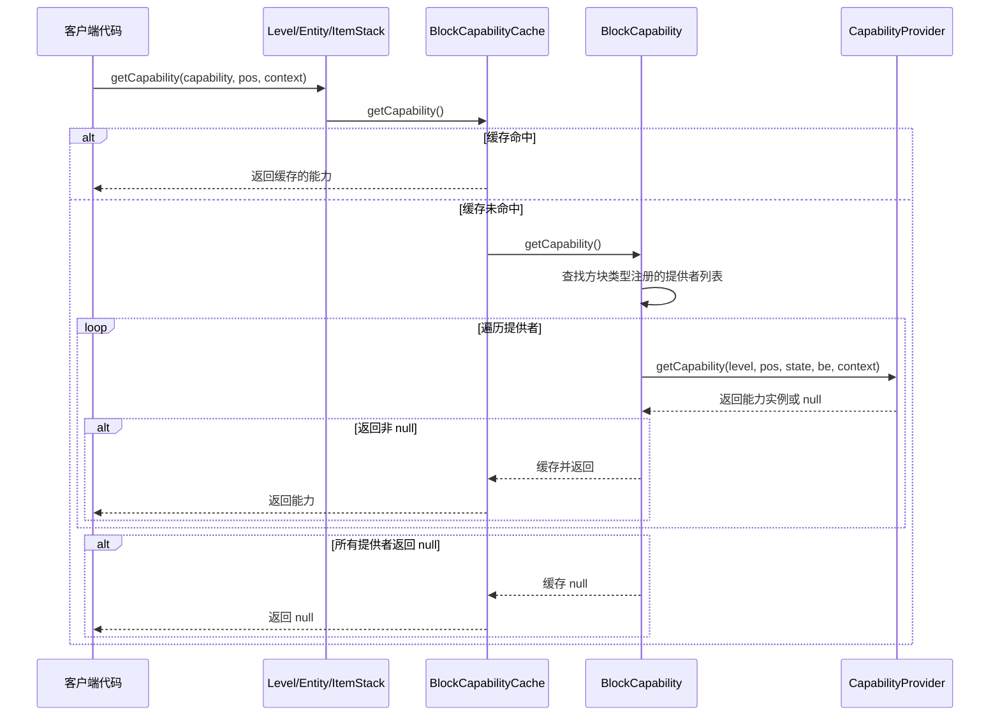
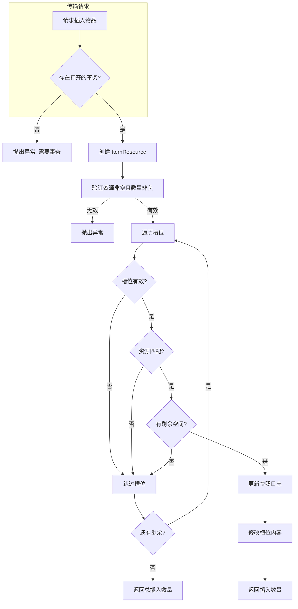
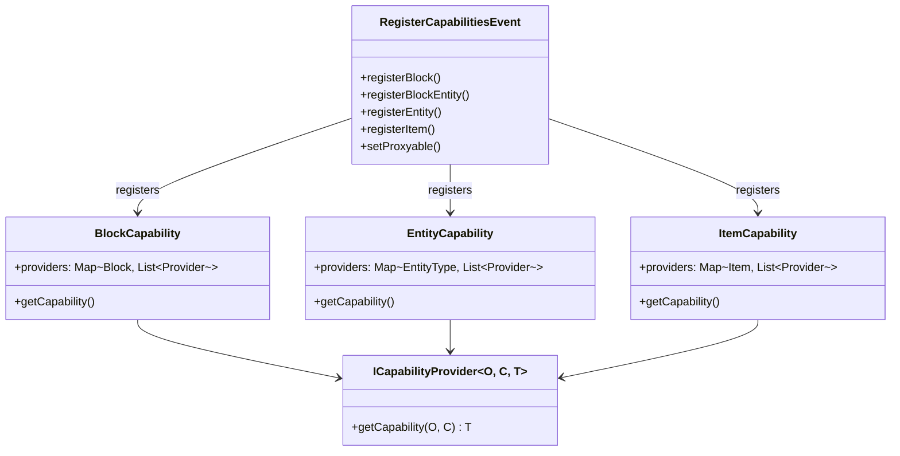

# 能力与传输系统

## 目录

- [1. 系统概述](#1-系统概述)
- [2. 能力系统](#2-能力系统)
  - [2.1 Capabilities 常量定义](#21-capabilities-常量定义)
  - [2.2 BlockCapability（方块能力）](#22-blockcapability方块能力)
  - [2.3 EntityCapability（实体能力）](#23-entitycapability实体能力)
  - [2.4 ItemCapability（物品能力）](#24-itemcapability物品能力)
  - [2.5 RegisterCapabilitiesEvent（能力注册）](#25-registercapabilitiesevent能力注册)
  - [2.6 ICapabilityProvider（提供者接口）](#26-icapabilityprovider提供者接口)
- [3. 传输系统](#3-传输系统)
  - [3.1 ResourceHandler（资源处理器）](#31-resourcehandler资源处理器)
  - [3.2 ItemResource 与 ItemStacksResourceHandler](#32-itemresource-与-itemstacksresourcehandler)
  - [3.3 FluidResource 与 FluidStacksResourceHandler](#33-fluidresource-与-fluidstacksresourcehandler)
  - [3.4 EnergyHandler（能量处理器）](#34-energyhandler能量处理器)
  - [3.5 Transaction（事务系统）](#35-transaction事务系统)
  - [3.6 SnapshotJournal（快照日志）](#36-snapshotjournal快照日志)
- [4. 工作流程图](#4-工作流程图)
- [5. API 使用示例](#5-api-使用示例)
- [6. 与其他系统交互](#6-与其他系统交互)
- [7. 总结](#7-总结)

---

## 1. 系统概述

NeoForge 1.21.x 引入了一套全新的**能力系统（Capability System）**和**传输系统（Transfer System）**，这是一套模块化、可扩展的资源交互框架。

### 1.1 能力系统 vs 传输系统

| 维度 | 能力系统 | 传输系统 |
|------|----------|----------|
| **定位** | 通用组件附加架构 | 能力系统的具体实现 |
| **目的** | 让任意对象（方块/实体/物品）提供可查询的功能接口 | 处理物品、流体、能量等资源的存储与传输 |
| **核心接口** | `ICapabilityProvider` | `ResourceHandler<T>` |
| **注册机制** | `RegisterCapabilitiesEvent` | 复用能力注册系统 |

### 1.2 设计理念

```
┌─────────────────────────────────────────────────────────────┐
│                      Capability System                       │
│  ┌─────────────┐  ┌─────────────┐  ┌─────────────┐         │
│  │BlockCapability│ │EntityCapability│ │ItemCapability│        │
│  └─────────────┘  └─────────────┘  └─────────────┘         │
└─────────────────────────────────────────────────────────────┘
                              │
                              ▼
┌─────────────────────────────────────────────────────────────┐
│                       Transfer System                        │
│  ┌─────────────┐  ┌─────────────┐  ┌─────────────┐         │
│  │EnergyHandler│  │FluidHandler │  │ ItemHandler │         │
│  └─────────────┘  └─────────────┘  └─────────────┘         │
└─────────────────────────────────────────────────────────────┘
```

### 1.3 关键概念

- **Capability（能力）**：定义对象可以提供什么功能
- **Provider（提供者）**：实际返回能力实例的对象
- **Resource（资源）**：表示物品、流体、能量等的抽象
- **Transaction（事务）**：保证资源传输的原子性

---

## 2. 能力系统

能力系统是 NeoForge 资源交互框架的基础层。它采用**提供者模式（Provider Pattern）**，允许在不修改原有类的情况下，为方块、实体或物品动态附加额外功能。

### 2.1 Capabilities 常量定义

`Capabilities.java` 定义了 NeoForge 内置的三类能力常量：

```java
public final class Capabilities {
    // 能量能力 - 适用于方块、实体、物品
    public static final class Energy {
        public static final BlockCapability<EnergyHandler, @Nullable Direction> BLOCK = ...;
        public static final EntityCapability<EnergyHandler, @Nullable Direction> ENTITY = ...;
        public static final ItemCapability<EnergyHandler, ItemAccess> ITEM = ...;
    }

    // 流体能力
    public static final class Fluid {
        public static final BlockCapability<...> BLOCK = ...;
        public static final EntityCapability<...> ENTITY = ...;
        public static final ItemCapability<...> ITEM = ...;
    }

    // 物品能力 - 注意有两个实体能力变体
    public static final class Item {
        public static final EntityCapability<..., @Nullable Void> ENTITY = ...;
        public static final EntityCapability<..., @Nullable Direction> ENTITY_AUTOMATION = ...;
    }
}
```

**关键特性**：

| 能力类型 | Context 类型 | 说明 |
|----------|--------------|------|
| `BLOCK` | `Direction` | 有方向的方块（如箱子6面可独立访问） |
| `ENTITY` | `Void` | 无需方向的实体能力 |
| `ENTITY_AUTOMATION` | `Direction` | 自动化友好的实体能力 |
| `ITEM` | `ItemAccess` | 物品能力，携带物品访问上下文 |

### 2.2 BlockCapability（方块能力）

方块能力用于查询世界中特定位置方块提供的功能。

```java
public final class BlockCapability<T, C> extends BaseCapability<T, C> {
    // 核心查询方法
    public T getCapability(Level level, BlockPos pos, 
                           @Nullable BlockState state, 
                           @Nullable BlockEntity blockEntity, 
                           C context);
}
```

**查询流程**：

1. 获取方块状态和方块实体（如果未提供）
2. 根据方块类型查找已注册的提供者列表
3. 遍历提供者，返回第一个非空结果

```java
// 内部实现逻辑
public T getCapability(Level level, BlockPos pos, ...) {
    // 转换为不可变位置
    pos = pos.immutable();
    
    // 获取方块类型和方块实体
    BlockState state = level.getBlockState(pos);
    BlockEntity blockEntity = level.getBlockEntity(pos);
    
    // 遍历该方块类型注册的所有提供者
    for (var provider : providers.getOrDefault(state.getBlock(), List.of())) {
        T result = provider.getCapability(level, pos, state, blockEntity, context);
        if (result != null) return result;
    }
    return null;
}
```

**性能优化**：对于频繁查询，应使用 `BlockCapabilityCache` 缓存能力实例。

### 2.3 EntityCapability（实体能力）

实体能力用于从实体获取附加功能。

```java
public final class EntityCapability<T, C> extends BaseCapability<T, C> {
    public T getCapability(Entity entity, C context);
}
```

**与方块能力的区别**：

| 方面 | BlockCapability | EntityCapability |
|------|-----------------|------------------|
| 存储键 | `Block` | `EntityType<?>` |
| 查询参数 | `Level`, `BlockPos`, `Direction` | `Entity`, context |
| 典型用途 | 机器方块、容器方块 | 背包实体、骑乘生物 |

### 2.4 ItemCapability（物品能力）

物品能力用于从物品栈获取功能。

```java
public final class ItemCapability<T, C> extends BaseCapability<T, C> {
    public T getCapability(ItemStack stack, C context);
}
```

**特殊处理**：空物品栈不会返回任何能力，这避免了注册 `Items.AIR` 提供者的问题。

### 2.5 RegisterCapabilitiesEvent（能力注册）

`RegisterCapabilitiesEvent` 是注册能力提供者的唯一入口，发生在 Mod 总线事件阶段。

```java
public class RegisterCapabilitiesEvent extends Event {
    // 方块注册
    <T, C> void registerBlock(BlockCapability<T, C> cap, 
                              IBlockCapabilityProvider<T, C> provider, 
                              Block... blocks);
    
    // 方块实体注册
    <T, C, BE extends BlockEntity> void registerBlockEntity(...);
    
    // 实体注册
    <T, C, E extends Entity> void registerEntity(...);
    
    // 物品注册
    <T, C> void registerItem(ItemCapability<T, C> cap, 
                             ICapabilityProvider<ItemStack, C, T> provider, 
                             ItemLike... items);
    
    // 可代理性设置
    void setProxyable(BlockCapability<?, ?> capability);
    void setNonProxyable(BlockCapability<?, ?> capability);
}
```

**注册示例**：

```java
modBus.addListener(RegisterCapabilitiesEvent.class, event -> {
    // 为方块实体注册物品处理器
    event.registerBlockEntity(
        Capabilities.Item.BLOCK,
        MY_BLOCK_ENTITY_TYPE,
        (be, side) -> be.getItemHandler(side)
    );
    
    // 为物品注册能量处理器
    event.registerItem(
        Capabilities.Energy.ITEM,
        (stack, access) -> stack.getOrCreateTag().contains("energy") 
            ? new MyEnergyHandler(stack) : null,
        MY_CHARGEABLE_ITEM
    );
});
```

### 2.6 ICapabilityProvider（提供者接口）

```java
@FunctionalInterface
public interface ICapabilityProvider<O, C, T> {
    @Nullable
    T getCapability(O object, C context);
}
```

这是一个**函数式接口**，可以使用 Lambda 表达式简化注册：

```java
// Lambda 形式
event.registerBlockEntity(
    Capabilities.Fluid.BLOCK,
    MY_TANK_TYPE,
    (tank, side) -> tank.getFluidHandler(side)
);
```

---

## 3. 传输系统

传输系统是能力系统的具体实现，专门处理物品、流体、能量的存储与传输。它包含：

1. **ResourceHandler<T>** - 资源处理核心接口
2. **ItemResource / ItemStacksResourceHandler** - 物品传输实现
3. **FluidResource / FluidStacksResourceHandler** - 流体传输实现
4. **EnergyHandler** - 能量传输接口
5. **Transaction** - 事务管理
6. **SnapshotJournal** - 快照回滚机制

### 3.1 ResourceHandler（资源处理器）

`ResourceHandler<T extends Resource>` 是所有资源处理器的通用接口。

```java
public interface ResourceHandler<T extends Resource> {
    // 查询方法
    int size();
    T getResource(int index);
    long getAmountAsLong(int index);
    long getCapacityAsLong(int index, T resource);
    boolean isValid(int index, T resource);
    
    // 传输方法（必须支持事务）
    int insert(int index, T resource, int amount, TransactionContext transaction);
    int insert(T resource, int amount, TransactionContext transaction); // 批量
    int extract(int index, T resource, int amount, TransactionContext transaction);
    int extract(T resource, int amount, TransactionContext transaction); // 批量
}
```

**索引系统（Indices）**：

- 资源处理器按**索引**组织，类似槽位（slots）、槽罐（tanks）、缓冲区（buffers）
- 索引范围：`[0, size())`
- 索引访问应具有容错性，因为处理器大小可能动态变化

**默认批量方法实现**：

```java
default int insert(T resource, int amount, TransactionContext transaction) {
    TransferPreconditions.checkNonEmptyNonNegative(resource, amount);
    
    int inserted = 0;
    for (int index = 0; index < size(); index++) {
        inserted += insert(index, resource, amount - inserted, transaction);
        if (inserted == amount) break;
    }
    return inserted;
}
```

### 3.2 ItemResource 与 ItemStacksResourceHandler

**ItemResource** - 不可变的物品资源表示：

```java
public final class ItemResource implements DataComponentHolderResource<Item> {
    public static final ItemResource EMPTY = new ItemResource(ItemStack.EMPTY);
    
    // 创建方式
    public static ItemResource of(ItemStack stack);
    public static ItemResource of(ItemLike item);
    public static ItemResource of(ItemLike item, DataComponentPatch patch);
    
    // 转换回 ItemStack
    public ItemStack toStack(int count);
    public ItemStack toStack(); // 默认数量为1
    
    // 数据组件操作
    public <D> ItemResource with(DataComponentType<D> type, D data);
    public ItemResource without(DataComponentType<?> type);
}
```

**ItemStacksResourceHandler** - 基于物品栈列表的处理器：

```java
public class ItemStacksResourceHandler extends StacksResourceHandler<ItemStack, ItemResource> {
    public ItemStacksResourceHandler(int size);
    public ItemStacksResourceHandler(NonNullList<ItemStack> stacks);
    
    @Override
    protected int getCapacity(int index, ItemResource resource) {
        return resource.isEmpty() 
            ? Item.ABSOLUTE_MAX_STACK_SIZE 
            : Math.min(resource.getMaxStackSize(), Item.ABSOLUTE_MAX_STACK_SIZE);
    }
}
```

### 3.3 FluidResource 与 FluidStacksResourceHandler

**FluidResource** - 不可变的流体资源表示：

```java
public final class FluidResource implements DataComponentHolderResource<Fluid> {
    public static final FluidResource EMPTY = new FluidResource(FluidStack.EMPTY);
    
    public static FluidResource of(FluidStack stack);
    public static FluidResource of(Fluid fluid);
    public static FluidResource of(Fluid fluid, DataComponentPatch patch);
    
    public FluidStack toStack(int amount);
    public FluidType getFluidType();
}
```

**FluidStacksResourceHandler** - 基于流体栈列表的处理器：

```java
public class FluidStacksResourceHandler extends StacksResourceHandler<FluidStack, FluidResource> {
    protected int capacity; // 统一的容量设置
    
    public FluidStacksResourceHandler(int size, int capacity);
}
```

### 3.4 EnergyHandler（能量处理器）

能量处理器是一个专门的单索引资源处理器（与物品/流体多槽不同）：

```java
public interface EnergyHandler {
    long getAmountAsLong();
    long getCapacityAsLong();
    
    int insert(int amount, TransactionContext transaction);
    int extract(int amount, TransactionContext transaction);
}
```

### 3.5 Transaction（事务系统）

`Transaction` 系统保证了资源传输的原子性（Atomicity）和一致性（Consistency）。

**核心概念**：

```
事务生命周期
    │
    ▼
┌─────────────────────────────────────────┐
│  开启事务 (openRoot / open)              │
│                                         │
│  ┌───────────────────────────────────┐  │
│  │  执行操作 (insert/extract)         │  │
│  │                                   │  │
│  │  可嵌套子事务                       │  │
│  │  └─ 子事务提交后仍可被父事务回滚    │  │
│  └───────────────────────────────────┘  │
│                                         │
│  提交或回滚:                             │
│  - commit() → 应用所有变更               │
│  - close/abort → 回滚到事务开始时        │
└─────────────────────────────────────────┘
```

**嵌套事务示例**：

```java
try (Transaction root = Transaction.openRoot()) {
    // 操作 A
    
    try (Transaction inner = Transaction.open(root)) {
        // 操作 B
        inner.commit(); // B 已验证，但依赖根事务提交
    }
    
    // 操作 C
    
    root.commit(); // A、B、C 全部应用
}
// 如果根事务未提交，所有变更回滚
```

**生命周期状态**：

```java
public enum Lifecycle {
    NONE,       // 无事务
    OPEN,       // 事务打开中
    CLOSING,    // 事务正在关闭
    ROOT_CLOSING // 根事务关闭中，onRootCommit 回调执行中
}
```

### 3.6 SnapshotJournal（快照日志）

`SnapshotJournal<T>` 是实现事务回滚的核心机制。

**使用模式**：

```java
public class MyResourceHandler extends SnapshotJournal<MySnapshot> {
    
    @Override
    protected MySnapshot createSnapshot() {
        return new MySnapshot(/* 保存当前状态 */);
    }
    
    @Override
    protected void revertToSnapshot(MySnapshot snapshot) {
        // 恢复到快照状态
    }
    
    @Override
    protected void onRootCommit(T originalState) {
        // 事务成功提交后执行
        // 通常触发 setChanged() 或邻居更新
    }
    
    // 在修改状态前调用
    public void modifySomething() {
        updateSnapshots(getCurrentTransaction());
        // 执行修改...
    }
}
```

**内部机制**：

1. `updateSnapshots()` 记录当前状态
2. 事务提交 → 调用 `onRootCommit()`
3. 事务回滚 → 调用 `revertToSnapshot()`

---

## 4. 工作流程图

### 4.1 能力查询流程



### 4.2 物品传输流程



### 4.3 能力注册架构



---

## 5. API 使用示例

### 5.1 注册自定义能力

```java
// 定义自定义能力
public static final BlockCapability<MyEnergyHandler, @Nullable Direction> 
    MY_ENERGY = BlockCapability.createSided(
        new Identifier("mymod", "energy_storage"), 
        MyEnergyHandler.class
    );

// 注册能力提供者
@Mod.EventBusSubscriber(modid = "mymod", bus = Mod.EventBusSubscriber.Bus.MOD)
public static class CapabilityRegistrar {
    @SubscribeEvent
    public static void register(RegisterCapabilitiesEvent event) {
        event.registerBlockEntity(
            MY_ENERGY,
            MY_ENERGY_STORAGE_TYPE,
            (blockEntity, side) -> blockEntity.getEnergyHandler(side)
        );
    }
}
```

### 5.2 查询并使用能力

```java
public void useEnergyBlock(Level level, BlockPos pos, Direction side) {
    // 查询能量处理器
    var handler = level.getCapability(
        Capabilities.Energy.BLOCK, 
        pos, 
        side
    );
    
    if (handler != null) {
        // 使用事务进行能量传输
        try (Transaction tx = Transaction.openRoot()) {
            int inserted = handler.insert(100, tx);
            System.out.println("充入能量: " + inserted);
            
            int extracted = handler.extract(50, tx);
            System.out.println("取出能量: " + extracted);
            
            tx.commit();
        }
    }
}
```

### 5.3 实现自定义资源处理器

```java
public class CustomInventoryHandler extends ItemStacksResourceHandler {
    private final MyBlockEntity owner;
    
    public CustomInventoryHandler(MyBlockEntity owner, int size) {
        super(size);
        this.owner = owner;
    }
    
    @Override
    public boolean isValid(int index, ItemResource resource) {
        // 只接受特定物品
        return resource.is(ExampleMod.MAGIC_INGOT);
    }
    
    @Override
    protected void onContentsChanged(int index, ItemStack previousContents) {
        // 通知方块实体内容已变更
        owner.setChanged();
        owner.sync();
    }
}
```

### 5.4 物品与物品能力交互

```java
public void processItems(ItemStack input) {
    // 获取物品的物品处理器能力
    var handler = input.getCapability(Capabilities.Item.ITEM);
    
    if (handler != null) {
        try (Transaction tx = Transaction.openRoot()) {
            ItemResource resource = ItemResource.of(ExampleMod.MAGIC_INGOT);
            
            // 从物品内插入/提取
            int inserted = handler.insert(resource, 5, tx);
            
            tx.commit();
        }
    }
}
```

---

## 6. 与其他系统交互

### 6.1 与方块实体系统集成

方块实体通过实现 `BlockEntity.getCapability()` 支持能力查询：

```java
public class MyMachineBlockEntity extends BlockEntity {
    private final CustomInventoryHandler inventory;
    
    public MyMachineBlockEntity(BlockEntityType<?> type, BlockPos pos, BlockState state) {
        super(type, pos, state);
        this.inventory = new CustomInventoryHandler(this, 9);
    }
    
    public CustomInventoryHandler getItemHandler(@Nullable Direction side) {
        return inventory;
    }
}
```

**缓存失效**：当能力状态变化时必须调用 `level.invalidateCapabilities(pos)`：

```java
@Override
public void onLoad() {
    super.onLoad();
    level.invalidateCapabilities(worldPosition);
}

@Override
public void setRemoved() {
    super.setRemoved();
    if (level != null) {
        level.invalidateCapabilities(worldPosition);
    }
}
```

### 6.2 与数据包系统集成

`StacksResourceHandler` 实现了 `ValueIOSerializable`，支持数据包保存/加载：

```java
public class MyBlockEntity extends BlockEntity {
    private final ItemStacksResourceHandler inventory;
    
    // 自动保存到 NBT
    @Override
    protected void saveAdditional(CompoundTag tag) {
        inventory.serialize(/* ... */);
    }
    
    // 自动从 NBT 加载
    @Override
    public void load(CompoundTag tag) {
        inventory.deserialize(/* ... */);
    }
}
```

### 6.3 与流体系统集成

`FluidResource` 与 NeoForge 的 `FluidStack` 紧密集成：

```java
public class MyTankBlockEntity extends BlockEntity {
    private final FluidStacksResourceHandler tanks;
    
    public MyTankBlockEntity() {
        super(TANK_TYPE);
        // 单槽，每个槽容量 16000 mb (FluidType.BUCKET_VOLUME = 810)
        this.tanks = new FluidStacksResourceHandler(1, FluidType.BUCKET_VOLUME * 2);
    }
    
    public FluidStacksResourceHandler getFluidHandler() {
        return tanks;
    }
}
```

---

## 7. 总结

### 7.1 架构优势

| 特性 | 优势 |
|------|------|
| **模块化设计** | 能力系统与传输系统分离，可独立扩展 |
| **提供者模式** | 无需继承，动态附加功能到任意对象 |
| **事务支持** | 原子性操作保证数据一致性 |
| **快照回滚** | 优雅的错误恢复机制 |
| **泛型设计** | `ResourceHandler<T>` 支持无限资源类型扩展 |

### 7.2 核心接口层次

```
ICapabilityProvider<O, C, T>
    │
    ├── BlockCapability<T, C>
    │       └── getCapability(Level, BlockPos, BlockState, BlockEntity, C)
    │
    ├── EntityCapability<T, C>
    │       └── getCapability(Entity, C)
    │
    └── ItemCapability<T, C>
            └── getCapability(ItemStack, C)

ResourceHandler<T extends Resource>
    │
    ├── EnergyHandler
    │       └── (单槽，无索引)
    │
    └── StacksResourceHandler<S, T>
            ├── ItemStacksResourceHandler
            └── FluidStacksResourceHandler
```

### 7.3 迁移提示

如果从 Forge 旧版迁移：

1. ** CapabilityProvider → ICapabilityProvider**：`ICapabilityProvider` 现在是函数式接口
2. **IItemHandler → ResourceHandler\<ItemResource\>**：使用新的传输 API
3. **IFluidHandler → ResourceHandler\<FluidResource\>**：同样迁移到新系统
4. **能量系统**：使用 `EnergyHandler` 替代旧的 `IEnergyStorage`

### 7.4 最佳实践

- ✅ 始终使用 `Transaction` 进行任何资源传输操作
- ✅ 在方块实体状态变化后调用 `invalidateCapabilities()`
- ✅ 使用 `BlockCapabilityCache` 缓存频繁查询的能力
- ✅ 覆盖 `onContentsChanged()` 触发必要的同步和通知
- ✅ 使用不可变的 `ItemResource` / `FluidResource` 作为方法参数

---

**文档信息**

- **来源**: NeoForge 1.21.x 源码分析
- **路径**: `assets/NeoForge-1.21.x/src/main/java/net/neoforged/neoforge/`
- **核心包**: `net.neoforged.neoforge.capabilities`, `net.neoforged.neoforge.transfer`
