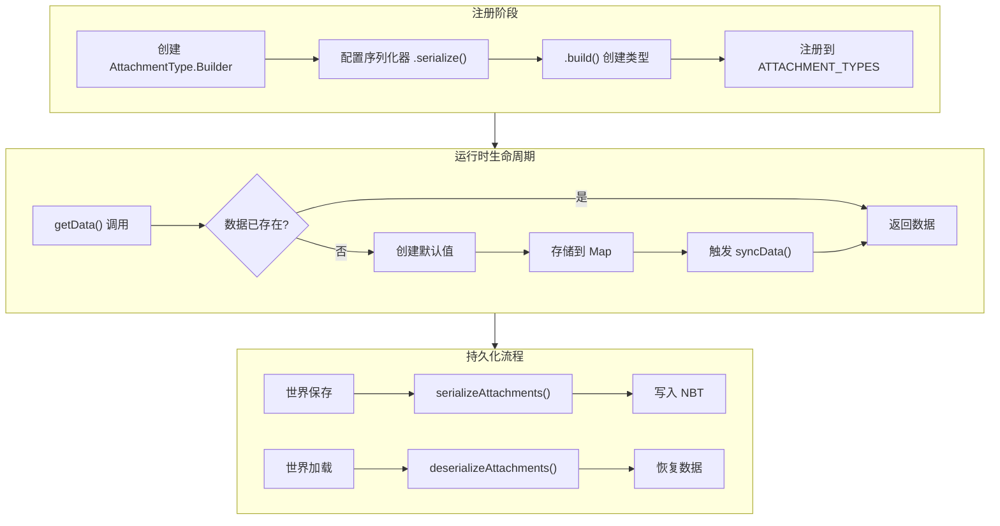
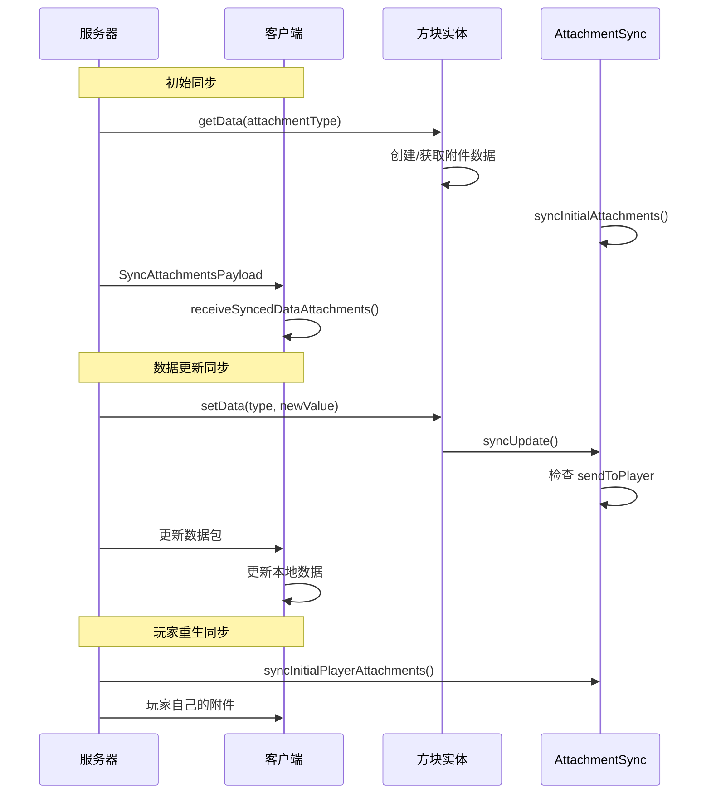

# 附件系统

## 目录

- [1. 系统概述](#1-系统概述)
- [2. 核心组件](#2-核心组件)
  - [2.1 AttachmentType - 附件类型定义](#21-attachmenttype---附件类型定义)
  - [2.2 IAttachmentHolder - 附件持有者接口](#22-iattachmentholder---附件持有者接口)
  - [2.3 AttachmentHolder - 附件持有者实现](#23-attachmentholder---附件持有者实现)
  - [2.4 IAttachmentSerializer - 序列化器接口](#24-iattachmentserializer---序列化器接口)
  - [2.5 IAttachmentCopyHandler - 复制处理器接口](#25-iattachmentcopyhandler---复制处理器接口)
  - [2.6 AttachmentSyncHandler - 同步处理器接口](#26-attachmentsynchandler---同步处理器接口)
  - [2.7 AttachmentSync - 同步管理器](#27-attachmentsync---同步管理器)
  - [2.8 LevelAttachmentsSavedData - 维度附件持久化](#28-levelattachmentssaveddata---维度附件持久化)
  - [2.9 AttachmentInternals - 内部事件处理](#29-attachmentinternals---内部事件处理)
- [3. 工作流程图](#3-工作流程图)
  - [3.1 附件生命周期流程](#31-附件生命周期流程)
  - [3.2 网络同步流程](#32-网络同步流程)
- [4. API 使用示例](#4-api-使用示例)
  - [4.1 定义简单附件类型](#41-定义简单附件类型)
  - [4.2 定义可序列化附件类型](#42-定义可序列化附件类型)
  - [4.3 定义可同步附件类型](#43-定义可同步附件类型)
  - [4.4 使用附件数据](#44-使用附件数据)
- [5. 序列化机制](#5-序列化机制)
- [6. 网络同步](#6-网络同步)
- [7. 与其他系统的交互](#7-与其他系统的交互)
- [8. 总结](#8-总结)

---

## 1. 系统概述

**附件系统（Attachment System）** 是 NeoForge 1.21.x 提供的一种通用数据存储机制，允许开发者为游戏中的各种对象（如实体、方块实体、区块、维度等）附加自定义数据。

### 设计理念

NeoForge 的附件系统借鉴了 Minecraft 1.20.5 中引入的 Fabric Data Attachment API，并进行了多项改进：

| 特性 | 说明 |
|------|------|
| **类型安全** | 使用 `AttachmentType<T>` 泛型确保数据类型安全 |
| **延迟初始化** | 附件数据在首次访问时才创建（惰性加载） |
| **统一接口** | 通过 `IAttachmentHolder` 接口为不同对象提供统一的数据访问方式 |
| **灵活序列化** | 支持 NBT 持久化和网络同步 |
| **自动复制** | 实体死亡/转换时自动处理附件复制 |

### 支持的持有者类型

附件可以附加到以下对象：

- **Entity**（实体）- 玩家、生物、物品等
- **BlockEntity**（方块实体）- 箱子、熔炉等
- **ChunkAccess**（区块访问）- 包括 ProtoChunk 和 LevelChunk
- **Level**（维度）- 世界维度级别

### 核心概念

1. **AttachmentType**：定义附件的类型、默认值、序列化器和同步处理器
2. **IAttachmentHolder**：附件持有者的统一接口
3. **IAttachmentSerializer**：处理附件的序列化/反序列化
4. **AttachmentSyncHandler**：管理网络同步逻辑

---

## 2. 核心组件

### 2.1 AttachmentType - 附件类型定义

`AttachmentType<T>` 是附件系统的核心类，用于定义一种附件的类型。

```10:20:src/main/java/net/neoforged/neoforge/attachment/AttachmentType.java
public final class AttachmentType<T> {
    final Function<IAttachmentHolder, T> defaultValueSupplier;
    @Nullable
    final IAttachmentSerializer<T> serializer;
    final boolean copyOnDeath;
    final IAttachmentCopyHandler<T> copyHandler;
    @Nullable
    AttachmentSyncHandler<T> syncHandler;
```

#### 关键字段

| 字段 | 类型 | 说明 |
|------|------|------|
| `defaultValueSupplier` | `Function<IAttachmentHolder, T>` | 默认值供应器 |
| `serializer` | `IAttachmentSerializer<T>` | 序列化器（可选） |
| `copyOnDeath` | `boolean` | 实体死亡时是否复制 |
| `copyHandler` | `IAttachmentCopyHandler<T>` | 复制处理器 |
| `syncHandler` | `AttachmentSyncHandler<T>` | 同步处理器（可选） |

#### Builder 模式

`AttachmentType` 使用 Builder 模式创建实例：

```java
// 方式1：简单默认值
public static <T> Builder<T> builder(Supplier<T> defaultValueSupplier)

// 方式2：可访问持有者的默认值
public static <T> Builder<T> builder(Function<IAttachmentHolder, T> defaultValueConstructor)

// 方式3：使用 ValueIOSerializable 的序列化
public static <T extends ValueIOSerializable> Builder<T> serializable(Supplier<T> defaultValueSupplier)
```

#### Builder 常用方法

```java
// 添加序列化器（持久化到磁盘）
.serialize(IAttachmentSerializer<T> serializer)
.serialize(MapCodec<T> codec)  // 使用 Codec

// 配置死亡复制
.copyOnDeath()  // 实体死亡时复制附件
.copyHandler(IAttachmentCopyHandler<T>)  // 自定义复制逻辑

// 配置网络同步
.sync(AttachmentSyncHandler<T>)  // 完全自定义同步
.sync(StreamCodec)  // 使用 StreamCodec 同步给所有客户端
.sync(BiPredicate, StreamCodec)  // 选择性同步给特定玩家
```

### 2.2 IAttachmentHolder - 附件持有者接口

`IAttachmentHolder` 是附件持有者的统一接口，定义了访问附件数据的基本操作。

```15:37:src/main/java/net/neoforged/neoforge/attachment/IAttachmentHolder.java
public interface IAttachmentHolder {
    /**
     * {@return the data attachment of the given type}
     *
     * <p>If there is no data attachment of the given type, 
     * <b>the default value is stored in this holder and returned.</b>
     */
    <T> T getData(AttachmentType<T> type);

    /**
     * @return an existing data attachment value of the given type, 
     * or null if there is no data attachment of the given type
     */
    @Nullable
    <T> T getExistingDataOrNull(AttachmentType<T> type);

    /**
     * Sets the data attachment of the given type.
     */
    <T> @Nullable T setData(AttachmentType<T> type, T data);

    /**
     * Removes the data attachment of the given type.
     */
    <T> @Nullable T removeData(AttachmentType<T> type);

    /**
     * Syncs a data attachment of the given type with all relevant clients.
     */
    default void syncData(AttachmentType<?> type) {
        // Do nothing by default, implementers should override this method if needed.
    }
}
```

#### 关键方法

| 方法 | 说明 |
|------|------|
| `getData(type)` | 获取附件数据，若不存在则创建默认值 |
| `getExistingDataOrNull(type)` | 获取附件数据，若不存在返回 null |
| `hasData(type)` | 检查是否存在该类型的附件 |
| `setData(type, data)` | 设置附件数据 |
| `removeData(type)` | 移除附件数据 |
| `syncData(type)` | 同步附件数据到客户端 |

### 2.3 AttachmentHolder - 附件持有者实现

`AttachmentHolder` 是 `IAttachmentHolder` 的抽象实现类，使用 `IdentityHashMap` 存储附件数据。

```26:51:src/main/java/net/neoforged/neoforge/attachment/AttachmentHolder.java
public abstract class AttachmentHolder implements IAttachmentHolder {
    public static final String ATTACHMENTS_NBT_KEY = "neoforge:attachments";
    
    @Nullable
    Map<AttachmentType<?>, Object> attachments = null;

    final Map<AttachmentType<?>, Object> getAttachmentMap() {
        if (attachments == null) {
            attachments = new IdentityHashMap<>(4);
        }
        return attachments;
    }

    @Override
    public final <T> T getData(AttachmentType<T> type) {
        validateAttachmentType(type);
        T ret = (T) getAttachmentMap().get(type);
        if (ret == null) {
            ret = type.defaultValueSupplier.apply(getExposedHolder());
            attachments.put(type, ret);
            syncData(type);  // 自动同步
        }
        return ret;
    }
}
```

#### AsField 内部类

当无法继承 `AttachmentHolder` 时（例如类已有其他父类），可以使用 `AsField` 内部类：

```172:192:src/main/java/net/neoforged/neoforge/attachment/AttachmentHolder.java
public static class AsField extends AttachmentHolder {
    private final IAttachmentHolder exposedHolder;

    public AsField(IAttachmentHolder exposedHolder) {
        this.exposedHolder = exposedHolder;
    }

    @Override
    IAttachmentHolder getExposedHolder() {
        return exposedHolder;
    }

    public void deserializeInternal(HolderLookup.Provider provider, ValueInput tag) {
        deserializeAttachments(tag);
    }

    @Override
    public void syncData(AttachmentType<?> type) {
        exposedHolder.syncData(type);
    }
}
```

### 2.4 IAttachmentSerializer - 序列化器接口

`IAttachmentSerializer<T>` 定义了附件数据的序列化/反序列化逻辑。

```16:31:src/main/java/net/neoforged/neoforge/attachment/IAttachmentSerializer.java
public interface IAttachmentSerializer<T> {
    /**
     * Reads the attachment from NBT.
     *
     * @param holder the holder for the attachment, can be cast if the subtype is known
     * @param input  the input to read from
     */
    T read(IAttachmentHolder holder, ValueInput input);

    /**
     * Writes the attachment to the value output, or returns {@code false} 
     * if it is should not be serialized.
     *
     * <p>If {@code false} is returned, any data written to the value output 
     * by this method will be discarded.
     */
    boolean write(T attachment, ValueOutput output);
}
```

### 2.5 IAttachmentCopyHandler - 复制处理器接口

`IAttachmentCopyHandler<T>` 定义了附件数据的复制逻辑，用于实体死亡/转换时的数据迁移。

```15:25:src/main/java/net/neoforged/neoforge/attachment/IAttachmentCopyHandler.java
public interface IAttachmentCopyHandler<T> {
    /**
     * creates a copy of the attachment. 
     * The copy should be equal to serializing and deserializing the attachment.
     *
     * @param attachment the attachment to copy
     * @param holder     the holder the attachment will be part of after copying
     * @return the copy or null if it shouldn't be copied.
     */
    @Nullable
    T copy(T attachment, IAttachmentHolder holder, HolderLookup.Provider provider);
}
```

### 2.6 AttachmentSyncHandler - 同步处理器接口

`AttachmentSyncHandler<T>` 定义了附件数据如何从服务器同步到客户端。

```26:68:src/main/java/net/neoforged/neoforge/attachment/AttachmentSyncHandler.java
public interface AttachmentSyncHandler<T> {
    /**
     * Decides whether data should be sent to some player 
     * that can see the holder.
     *
     * @param holder the holder for the attachment
     * @param to     the player that might receive the data
     * @return {@code true} to send data to the player, {@code false} otherwise
     */
    default boolean sendToPlayer(IAttachmentHolder holder, ServerPlayer to) {
        return true;
    }

    /**
     * Writes attachment data to a buffer.
     *
     * @param initialSync if true, write full data; if false, write delta only
     */
    void write(RegistryFriendlyByteBuf buf, T attachment, boolean initialSync);

    /**
     * Reads attachment data on the client side.
     *
     * @param previousValue the previous value, or null if there was no previous value
     * @return the new value of the attachment, or null if should be removed
     */
    @Nullable
    T read(IAttachmentHolder holder, RegistryFriendlyByteBuf buf, @Nullable T previousValue);
}
```

### 2.7 AttachmentSync - 同步管理器

`AttachmentSync` 是附件同步的核心管理器，负责处理服务器到客户端的数据同步。

```42:82:src/main/java/net/neoforged/neoforge/attachment/AttachmentSync.java
public final class AttachmentSync {
    /**
     * 同步附件类型的专用注册表
     */
    public static final Registry<AttachmentType<?>> SYNCED_ATTACHMENT_TYPES = new RegistryBuilder<>(
            ResourceKey.<AttachmentType<?>>createRegistryKey(
                    Identifier.fromNamespaceAndPath(NeoForgeMod.MOD_ID, "synced_attachment_types")))
                            .sync(true)  // 自动同步到客户端
                            .callback(ATTACHMENT_TYPE_ADD_CALLBACK)
                            .create();

    private static SyncAttachmentsPayload.Target syncTarget(AttachmentHolder holder) {
        return switch (holder) {
            case BlockEntity blockEntity -> new SyncAttachmentsPayload.BlockEntityTarget(blockEntity.getBlockPos());
            case AttachmentHolder.AsField asField when asField.getExposedHolder() instanceof LevelChunk chunk 
                -> new SyncAttachmentsPayload.ChunkTarget(chunk.getPos());
            case Entity entity -> new SyncAttachmentsPayload.EntityTarget(entity.getId());
            case Level ignored -> new SyncAttachmentsPayload.LevelTarget();
            default -> throw new UnsupportedOperationException("...");
        };
    }
}
```

#### 同步目标类型

```84:91:src/main/java/net/neoforged/neoforge/network/payload/SyncAttachmentsPayload.java
public sealed interface Target {
    // ...
}

public record BlockEntityTarget(BlockPos pos) implements Target {}
public record ChunkTarget(ChunkPos pos) implements Target {}
public record EntityTarget(int entity) implements Target {}
public record LevelTarget() implements Target {}
```

### 2.8 LevelAttachmentsSavedData - 维度附件持久化

`LevelAttachmentsSavedData` 负责将维度级别的附件数据持久化到磁盘。

```22:64:src/main/java/net/neoforged/neoforge/attachment/LevelAttachmentsSavedData.java
public class LevelAttachmentsSavedData extends SavedData {
    public static final SavedDataType<LevelAttachmentsSavedData> TYPE = new SavedDataType<>(
            "neoforge_data_attachments",
            LevelAttachmentsSavedData::new,
            LevelAttachmentsSavedData::makeCodec);

    public static void init(ServerLevel level) {
        // 初始化并确保世界保存时自动持久化
        level.getDataStorage().computeIfAbsent(TYPE);
    }

    @Override
    public boolean isDirty() {
        // 始终标记为脏，确保每次都保存
        return true;
    }
}
```

### 2.9 AttachmentInternals - 内部事件处理

`AttachmentInternals` 处理附件系统的内部事件，如实体死亡复制、玩家重生等。

```21:67:src/main/java/net/neoforged/neoforge/attachment/AttachmentInternals.java
public final class AttachmentInternals {
    
    @SubscribeEvent
    public static void onPlayerClone(PlayerEvent.Clone event) {
        // 玩家重生时复制附件
        event.getEntity().copyAttachmentsFrom(event.getOriginal(), event.isWasDeath());
    }

    @SubscribeEvent
    public static void onLivingConvert(LivingConversionEvent.Post event) {
        // 生物转换时复制附件（如僵尸->村民）
        event.getOutcome().copyAttachmentsFrom(event.getEntity(), true);
    }
}
```

---

## 3. 工作流程图

### 3.1 附件生命周期流程



### 3.2 网络同步流程



---

## 4. API 使用示例

### 4.1 定义简单附件类型

```java
// 定义一个简单的计数器附件（不持久化）
public static final AttachmentType<Integer> VISIT_COUNT = AttachmentType.<Integer>builder()
    .supplier(() -> 0)  // 默认值为 0
    .build();

// 注册（必需）
@SubscribeEvent
public static void register(RegisterEvent event) {
    event.register(NeoForgeRegistries.Keys.ATTACHMENT_TYPES, 
        helper -> helper.register(new Identifier("mymod", "visit_count"), VISIT_COUNT));
}
```

### 4.2 定义可序列化附件类型

使用 Codec 进行序列化：

```java
// 定义 NBT 可序列化的数据类
public class CustomData implements ValueIOSerializable {
    private int value;
    private String name;

    public CustomData() {
        this.value = 0;
        this.name = "default";
    }

    @Override
    public void serialize(ValueOutput output) {
        output.store(CODEC, this);
    }

    @Override
    public void deserialize(ValueInput input) {
        // 使用 Codec 反序列化
    }

    // 定义 Codec
    public static final MapCodec<CustomData> CODEC = RecordCodecBuilder.mapCodec(
        instance -> instance.group(
            Codec.INT.fieldOf("value").forGetter(CustomData::getValue),
            Codec.STRING.fieldOf("name").forGetter(CustomData::getName)
        ).apply(instance, CustomData::new)
    );
}

// 创建可序列化的附件类型
public static final AttachmentType<CustomData> MY_DATA = AttachmentType.<CustomData>builder()
    .serializable(CustomData::new)  // 自动使用 ValueIOSerializable
    .build();
```

使用自定义序列化器：

```java
public static final AttachmentType<CustomData> MY_DATA = AttachmentType.<CustomData>builder()
    .serialize(new IAttachmentSerializer<>() {
        @Override
        public CustomData read(IAttachmentHolder holder, ValueInput input) {
            CustomData data = new CustomData();
            data.setValue(input.readInt("value"));
            data.setName(input.readString("name"));
            return data;
        }

        @Override
        public boolean write(CustomData attachment, ValueOutput output) {
            output.storeInt("value", attachment.getValue());
            output.storeString("name", attachment.getName());
            return true;  // 返回 false 可跳过序列化
        }
    })
    .build();
```

### 4.3 定义可同步附件类型

```java
// 简单同步 - 同步给所有可见玩家
public static final AttachmentType<Integer> SYNCED_COUNTER = AttachmentType.<Integer>builder()
    .supplier(() -> 0)
    .serialize(IntCodecs.VARINT)  // 需要序列化才能同步
    .sync(StreamCodec.of(
        (buf, value) -> buf.writeVarInt(value),
        buf -> buf.readVarInt()
    ))
    .build();

// 条件同步 - 只同步给特定玩家
public static final AttachmentType<PlayerSpecificData> PLAYER_DATA = 
    AttachmentType.<PlayerSpecificData>builder()
        .serializable(PlayerSpecificData::new)
        .sync((holder, player) -> {
            // 只同步给所有者
            return holder instanceof Entity entity && 
                   entity.getUUID().equals(player.getUUID());
        }, StreamCodec.of(
            PlayerSpecificData.STREAM_CODEC::encode,
            PlayerSpecificData.STREAM_CODEC::decode
        ))
        .build();
```

### 4.4 使用附件数据

```java
public class MyBlockEntity extends BlockEntity {
    public static final AttachmentType<BlockState> STORED_STATE = 
        AttachmentType.<BlockState>builder()
            .supplier(() -> Blocks.AIR.defaultBlockState())
            .serialize(BlockState.CODEC)
            .build();

    public void onPlayerInteract(Player player) {
        // 获取或创建附件数据
        BlockState state = getHolder().getData(STORED_STATE);
        
        // 修改数据
        BlockState newState = Blocks.DIAMOND_BLOCK.defaultBlockState();
        getHolder().setData(STORED_STATE, newState);
        
        // 标记方块已改变（触发保存）
        setChanged();
    }
}

public class MyEntity extends Entity {
    public static final AttachmentType<IntTag> DAMAGE_COUNTER = 
        AttachmentType.<IntTag>builder()
            .supplier(() -> IntTag.of(0))
            .serialize(IntTag.CODEC)
            .copyOnDeath()  // 死亡时复制
            .build();

    public void takeDamage(DamageSource source, float amount) {
        IntTag counter = getHolder().getData(DAMAGE_COUNTER);
        counter.putInt("value", counter.getAsInt() + 1);
        getHolder().setData(DAMAGE_COUNTER, counter);
    }
}
```

---

## 5. 序列化机制

附件系统的序列化通过 `IAttachmentSerializer` 接口实现：

```java
public interface IAttachmentSerializer<T> {
    T read(IAttachmentHolder holder, ValueInput input);
    boolean write(T attachment, ValueOutput output);
}
```

### 序列化流程

1. **写入**：当世界保存时，`AttachmentHolder.serializeAttachments()` 遍历所有附件
2. **按类型查找**：使用注册表键查找对应的 `AttachmentType`
3. **调用序列化器**：调用 `serializer.write()` 将数据写入 NBT
4. **跳过逻辑**：如果 `write()` 返回 `false`，数据不会被写入

### 反序列化流程

1. **读取**：当世界加载时，`AttachmentHolder.deserializeAttachments()` 读取 NBT
2. **验证类型**：通过键查找 `AttachmentType`，验证是否可序列化
3. **调用反序列化器**：调用 `serializer.read()` 恢复数据
4. **错误处理**：如果反序列化失败，记录错误日志并跳过

### 持久化层级

| 持有者类型 | 持久化方式 |
|-----------|-----------|
| Level | `LevelAttachmentsSavedData` |
| LevelChunk | 随区块数据保存 |
| BlockEntity | 随方块实体保存 |
| Entity | 随实体数据保存 |

---

## 6. 网络同步

网络同步通过 `SyncAttachmentsPayload` 数据包实现：

```java
public record SyncAttachmentsPayload(
    Target target,                    // 同步目标
    List<AttachmentType<?>> types,    // 附件类型列表
    byte[] syncPayload                // 编码后的数据
) implements CustomPacketPayload
```

### 同步时机

1. **初始同步**：
   - 玩家加入游戏
   - 玩家传送到新区块
   - 玩家重生

2. **增量同步**：
   - 调用 `setData()` 时
   - 调用 `removeData()` 时
   - 调用 `syncData()` 时（用于可变数据）

### 同步目标

| 目标类型 | 说明 |
|---------|------|
| `BlockEntityTarget` | 同步到注视特定方块的玩家 |
| `ChunkTarget` | 同步到区块内所有玩家 |
| `EntityTarget` | 同步到实体追踪范围内的玩家 |
| `LevelTarget` | 同步到维度内所有玩家 |

### 过滤逻辑

通过 `AttachmentSyncHandler.sendToPlayer()` 可以过滤接收者：

```java
.sync((holder, player) -> {
    // 只发送给管理员
    return player.hasPermissions(4);
}, streamCodec)
```

---

## 7. 与其他系统的交互

### 7.1 实体系统

- **死亡复制**：通过 `PlayerEvent.Clone` 事件处理
- **转换复制**：通过 `LivingConversionEvent.Post` 事件处理
- **复制过滤器**：`copyOnDeath` 标志控制是否在死亡时复制

### 7.2 区块系统

- **ProtoChunk → LevelChunk**：通过 `AttachmentInternals.copyChunkAttachmentsOnPromotion()` 复制
- **标记脏**：修改后需调用 `ChunkAccess.markUnsaved()`

### 7.3 方块实体系统

- **保存触发**：修改附件后需调用 `BlockEntity.setChanged()`

### 7.4 网络系统

- 使用 `CustomPacketPayload` 发送同步数据
- 支持 NeoForge 专有连接类型

---

## 8. 总结

NeoForge 的附件系统是一个设计优雅、功能强大的数据存储框架：

### 核心优势

| 优势 | 说明 |
|------|------|
| **统一接口** | 通过 `IAttachmentHolder` 为不同对象提供一致的数据访问 |
| **延迟加载** | 首次访问时才创建数据，优化内存使用 |
| **类型安全** | 泛型系统确保编译期类型检查 |
| **灵活配置** | Builder 模式支持多种配置组合 |
| **自动处理** | 内置事件处理器自动处理实体死亡、转换等场景 |

### 使用场景

- 存储实体的状态数据（如战斗记录、背包数据）
- 方块实体的持久化数据（如自定义方块的时间戳）
- 区块级别的数据（如地形修改标记）
- 维度级别的数据（如世界事件状态）

### 最佳实践

1. **始终注册**：`AttachmentType` 必须注册到 `ATTACHMENT_TYPES` 注册表
2. **合理设计默认值**：默认值应该轻量且易于创建
3. **适时同步**：修改后调用 `syncData()` 同步客户端
4. **注意性能**：频繁修改的附件考虑使用增量同步
5. **处理边界**：实体死亡转换时考虑附件是否需要保留

---

## 参考文件

- `AttachmentType.java` - 附件类型定义
- `AttachmentHolder.java` - 附件持有者实现
- `IAttachmentHolder.java` - 附件持有者接口
- `IAttachmentSerializer.java` - 序列化器接口
- `IAttachmentCopyHandler.java` - 复制处理器接口
- `AttachmentSyncHandler.java` - 同步处理器接口
- `AttachmentSync.java` - 同步管理器
- `LevelAttachmentsSavedData.java` - 维度持久化
- `AttachmentInternals.java` - 内部事件处理
